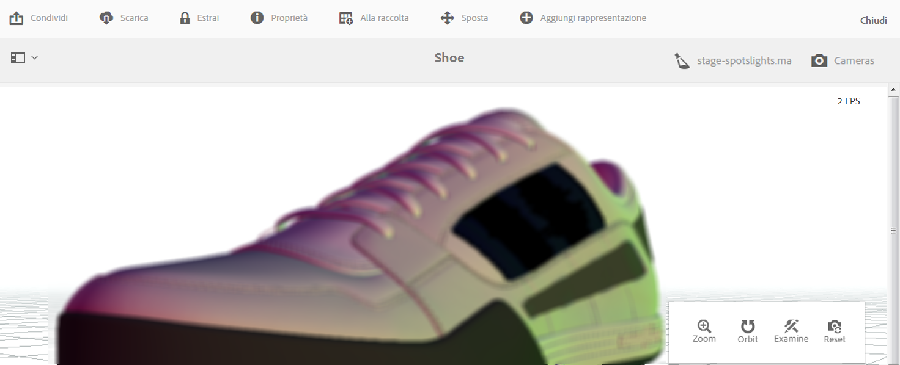

# Visualizzazione di risorse 3D {#viewing-d-assets}

Questo documento descrive sia come visualizzare le risorse 3D nei dettagli delle risorse, sia come visualizzare le risorse che si trovano nel componente 3D nei siti.

## Visualizzazione delle risorse 3D nella pagina Dettagli risorsa {#viewing-d-assets-in-the-asset-details-page}

Il visualizzatore 3D interattivo è disponibile dalla pagina dei dettagli delle risorse in AEM. Il visualizzatore include, tra le altre, una raccolta di controlli interattivi della videocamera che consentono di eseguire zoom, rotazione e scorrimento della risorsa 3D.

Oltre a usare le aree di visualizzazione 3D predefinite in AEM, puoi anche utilizzare i livelli creati in un’applicazione di terze parti e caricati in AEM.

Vedi [Utilizzo delle aree di visualizzazione in AEM 3D](about-the-use-of-stages-in-aem-3d.md).

>[!NOTE]
>
>Per visualizzare una risorsa 3D, il browser desktop o del dispositivo deve essere abilitato per WebGL. Inoltre, l&#39;hardware grafico sottostante deve disporre di capacità e memoria sufficienti per eseguire il rendering dei modelli delle dimensioni e della complessità desiderate. Alcune funzioni di anteprima, come l’ombra proiettata, non sono disponibili su tutti i browser.

### Considerazioni sulle prestazioni per la visualizzazione di risorse 3D {#performance-considerations-when-you-view-d-assets}

Il tempo necessario per aprire una risorsa 3D nella pagina Dettagli risorsa dipende da vari fattori, quali:

* Larghezza di banda e latenze al server.
* Dimensione del modello (numero di facce).
* Quantità e dimensione delle mappe.
* Complessità delle aree di visualizzazione. Ad esempio, la dimensione dell’immagine IBL.

Inoltre, le funzionalità del computer client, come una workstation, un notebook o un dispositivo mobile touch, sono importanti anche quando si modifica la telecamera in modo interattivo. Un sistema ragionevolmente potente con buone capacità grafiche può rendere l’esperienza di visualizzazione 3D interattiva più fluida e favorevole.

**Per visualizzare le risorse 3D**:

1. Assicurati di aver caricato le risorse 3D in AEM.

   Vedi [Caricamento ed elaborazione di risorse 3D in AEM](upload-processing-3d-assets.md).

1. From AEM, on the **[!UICONTROL Navigation]** page, tap **[!UICONTROL Assets]**.
1. Near the upper-right corner of the page, from the **[!UICONTROL View]** drop-down list, tap **[!UICONTROL Card View]**.
1. Accedi alla risorsa 3D da visualizzare.
1. Tocca la scheda della risorsa 3D per aprirla nella pagina dei dettagli della risorsa.
1. Effettua una delle operazioni seguenti:

   * Nell’angolo in basso a destra della pagina dei dettagli delle risorse, utilizza la barra dei comandi della fotocamera per cambiare le varie viste delle risorse.

      Se utilizzi un dispositivo di input non touch senza rotella di scorrimento, ad esempio un classico mouse Apple con un solo pulsante, puoi comunque cambiare lo zoom o la prospettiva di una risorsa 3D in ciascuna modalità. You accomplish the action by pressing and holding down the `SHIFT`key while depressing the mouse button and dragging up or down.

      Quando utilizzi il touchpad di un computer portatile, è spesso difficile controllare lo zoom o la prospettiva mediante il gesto con due dita. In such cases, you can press and hold down `SHIFT`during the action. Questo riduce la velocità del gesto di avvicinamento delle dita e rende più semplice ottenere lo zoom o la prospettiva desiderati. Alternately, you can use a one finger drag up or down while the `SHIFT`key is pressed to affect zoom or perspective behaviors.
   <table> 
    <tbody> 
      <tr> 
      <td><strong>Nome controllo telecamera</strong>  </td> 
      <td><strong>Descrizione</strong></td> 
      </tr> 
      <tr> 
      <td>
Zoom
 
o
 
Persp
 </td> 
      <td>
Toccate o fate clic per alternare tra le modalità Zoom e Prospettiva.
 
Oppure, tenete premuto il <code>ALT/OPTION</code> tasto durante l’azione per passare temporaneamente alla modalità Prospettiva  . Rilascia il tasto per tornare alla modalità Zoom.
 
      <ul> 
      <li><strong>Comportamento Zoom</strong>-Dolly in e out che avvicina o allontana la telecamera dalla risorsa  che stai visualizzando. Lo zoom è il comportamento predefinito per la rotellina di scorrimento del mouse (se disponibile), per i movimenti di allontanamento o avvicinamento con due dita sui dispositivi mobili, o quando tieni premuto il tasto Maiusc mentre muovi il mouse su o giù premendo il pulsante sinistro.</li> 
      <li><strong>Prospettiva</strong>: modifica la lunghezza focale (o campo visivo) della fotocamera, mantenendo le dimensioni relative della risorsa nella vista. La prospettiva è il comportamento alternativo per la rotellina (se disponibile), per i movimenti di allontanamento o avvicinamento con due dita sui dispositivi mobili, o quando tieni premuto il tasto Maiusc mentre muovi il mouse su o giù premendo il pulsante sinistro.</li> 
      </ul> </td> 
      </tr> 
      <tr> 
      <td>
Orbita
 
o
 
Pan
 </td> 
      <td>
Toccate o fate clic per alternare tra le modalità Orbit e Panning.
 
Oppure, tenete premuto il <code>ALT/OPTION</code> tasto durante l’azione per passare temporaneamente alla modalità scorrimento. Rilascia il tasto per tornare alla modalità Rotazione.
 
      <ul> 
      <li><strong>Orbita</strong>- Per impostazione predefinita, sposta la telecamera di visualizzazione su una sfera centrata su un punto di destinazione vicino al centro della risorsa 3D. La rotazione è il funzionamento predefinito per il trascinamento con il pulsante sinistro o con un singolo tocco sui dispositivi mobili.</li> 
      <li><strong>Pan</strong>-Sposta la telecamera nel piano di visualizzazione. L’obiettivo viene spostato di conseguenza, quindi le successive azioni di rotazione sposteranno la videocamera intorno a un nuovo obiettivo. Il panning è il funzionamento predefinito per il trascinamento con il pulsante sinistro o con un singolo tocco.</li> 
      </ul> </td> 
      </tr> 
      <tr> 
      <td>
Esaminare
 
o
 
Destinazione
 </td> 
      <td>
Toccate o fate clic per alternare tra le modalità Examine e Target.
 
      <ul> 
      <li><strong>Toccate o fate</strong>clic per passare alla modalità Target.</li> 
      <li><strong>Toccate</strong>o fate clic su un punto qualsiasi della risorsa 3D per centrare la visualizzazione sulla parte della risorsa.  Le azioni Rotazione utilizzano il nuovo obiettivo.</li> 
      </ul> </td> 
      </tr> 
      <tr> 
      <td>Ripristina</td> 
      <td>Toccate o fate clic per ripristinare il punto di destinazione della vista al centro del modello. Reset also moves the camera  closer or further away to show the asset in its entirety and at a reasonable viewing size.</td> 
      </tr> 
    </tbody> 
    </table>

   * Near the upper-right corner of the asset details page, tap the **[!UICONTROL Stage Selector]** icon. Seleziona il nome di un’area di visualizzazione con lo sfondo e l’illuminazione che desideri applicare alla risorsa 3D.

   

   Le fasi forniscono l&#39;ambiente-sfondo, il piano terra e l&#39;illuminazione in cui viene visualizzato il modello 3D.

   Vedi [Utilizzo delle aree di visualizzazione in AEM 3D](about-the-use-of-stages-in-aem-3d.md).

   * Near the upper-right corner of the asset details page, tap the **[!UICONTROL Camera Selector]** icon, then select a camera view that you want to apply to the 3D asset.

   

   Le aree di visualizzazione spesso forniscono videocamere predefinite. Puoi selezionare di nuovo la videocamera corrente per tornare alle impostazioni predefinite.

   Vedi [Utilizzo delle aree di visualizzazione in AEM 3D](about-the-use-of-stages-in-aem-3d.md).

1. Nell’angolo in alto a destro della pagina, tocca **[!UICONTROL Salva]**.
1. Effettua una delle operazioni seguenti:

   * Esegui il rendering della risorsa 3D.

      Vedi [Rendering delle risorse 3D](rendering-3d-assets.md).

   * Nell’angolo in alto a destra della pagina, tocca **[!UICONTROL Chiudi]** per tornare alla schermata Risorse.

## Visualizzazione di risorse 3D nel componente Siti 3D {#viewing-d-assets-in-the-sites-d-component}

>[!NOTE]
>
>Questa sezione è valida solo per il visualizzatore WebGL classico utilizzato per tipi di risorse 3D diversi da  Adobe Dimension.

A seconda del tipo di dispositivo, è possibile accedere alle funzioni dei componenti 3D in diversi modi.

Per ulteriori informazioni, consulta gli argomenti di seguito:

* [Dispositivi touch screen](#touchscreen-devices)
* [Dispositivi touch](#touchpad-devices)
* [Dispositivi per mouse e trackball](#mouse-and-trackball-devices)

Consultate anche [Anteprima di una pagina Web con un componente](using-the-3d-sites-component.md#previewing-a-web-page-that-has-a-d-component)3D.

### Dispositivi touch screen {#touchscreen-devices}

Per lavorare con componenti 3D con dispositivi touch screen:

1. Per spostare (&quot;orbita&quot;) il punto di vista (&quot;fotocamera&quot;) attorno all’oggetto, trascinate un solo dito o passate il dito. È possibile visualizzare l&#39;oggetto da qualsiasi direzione.

1. Usate un gesto di due dita per avvicinare o allontanare la telecamera dall&#39;oggetto. Questa azione è simile allo zoom avanti e indietro e consente di esaminare i dettagli sull&#39;oggetto. In alternativa, tenere premuto il tasto + o - per avvicinare o allontanare la telecamera dall&#39;oggetto.

1. Per scorrere la videocamera, trascinate due dita. Questa azione consente di spostare la videocamera lateralmente per osservare diverse parti dell’oggetto durante lo zoom in. In alternativa, toccate il pulsante Attiva/Disattiva **** orbita/Panning per passare alla modalità Panning, quindi trascinate con un dito per scorrere la videocamera. Toccate il pulsante Attiva/disattiva **** orbita/scorrimento per tornare alla modalità **[!UICONTROL orbita]** .

1. Toccate **[!UICONTROL Ripristina visualizzatore]** per ripristinare la fotocamera. Questa azione reinserisce l’oggetto nella visualizzazione completa e, se attivata, riprende la rotazione automatica.

1. Toccate **[!UICONTROL Schermo]** intero per passare alla modalità a schermo intero (se supportata dal dispositivo). Toccate di nuovo **[!UICONTROL Schermo]** intero per ripristinare il visualizzatore 3D alla modalità incorporata nella pagina.

### Dispositivi touch {#touchpad-devices}

Per lavorare con componenti 3D con dispositivi touchpad:

1. Per spostare (&quot;orbita&quot;) il punto di vista (&quot;fotocamera&quot;) attorno all’oggetto, trascinate un solo dito mentre tenete premuto il pulsante (a sinistra) del touchpad. È possibile visualizzare l&#39;oggetto da qualsiasi direzione.

1. Per spostare la videocamera in prossimità o in prossimità dell’oggetto, trascinare verso l’alto o verso il basso con due dita. Questa azione è simile allo zoom avanti o indietro e consente di esaminare i dettagli sull&#39;oggetto. In alternativa, tenere premuto il pulsante **[!UICONTROL Zoom avanti]** o **[!UICONTROL Zoom indietro]** per avvicinare o allontanare la videocamera dall’oggetto.

1. Per scorrere la videocamera, trascinate con un solo dito mentre tenete premuto il tasto **ALT/Opzione** e il pulsante (a sinistra) del touchpad. Questa azione consente di spostare la videocamera lateralmente per osservare diverse parti dell’oggetto durante lo zoom in. In alternativa, fate clic sul pulsante Attiva/disattiva **** orbita/Panning per passare alla modalità **[!UICONTROL Panning]** , quindi trascinate con un dito mentre tenete premuto il pulsante (a sinistra) per scorrere la videocamera. Fate di nuovo clic sul pulsante Attiva/disattiva **** orbita/scorrimento per tornare alla modalità **[!UICONTROL orbita]** .

1. Fate clic su **[!UICONTROL Ripristina visualizzatore]** per ripristinare la fotocamera. Questa azione reinserisce l’oggetto nella visualizzazione completa e, se attivata, riprende la rotazione automatica.

1. Fate clic su **[!UICONTROL Schermo]** intero per passare alla modalità a schermo intero. Usate il tasto **Esc** sulla tastiera o fate di nuovo clic su **[!UICONTROL Schermo]** intero per ripristinare il visualizzatore 3D alla modalità incorporata nella pagina.

### Dispositivi per mouse e trackball {#mouse-and-trackball-devices}

Per lavorare con componenti 3D con mouse e dispositivi trackball:

1. Trascinare tenendo premuto il pulsante sinistro del mouse per spostare (&quot;orbita&quot;) il punto di vista (&quot;fotocamera&quot;) intorno all&#39;oggetto. È possibile visualizzare l&#39;oggetto da qualsiasi direzione.

1. Utilizzare la rotellina di scorrimento per avvicinare o allontanare la fotocamera dall&#39;oggetto. Simile allo zoom in o zoom out, che consente di esaminare i dettagli dell’oggetto. In alternativa, tenere premuto il pulsante **[!UICONTROL Zoom avanti]** o **[!UICONTROL Zoom indietro]** per avvicinare o allontanare la videocamera dall’oggetto.

1. Trascinare tenendo premuto il tasto **ALT/opzione** e il pulsante sinistro del mouse per scorrere la fotocamera. In questo modo la videocamera si sposta lateralmente per consentire di osservare diverse parti dell&#39;oggetto durante lo zoom avanti. In alternativa, fate clic sul pulsante Attiva/disattiva **** orbita/scorrimento per passare alla modalità **[!UICONTROL Panning]** , quindi trascinate tenendo premuto il pulsante sinistro del mouse per scorrere la fotocamera. Fate di nuovo clic sul pulsante Attiva/disattiva **** orbita/scorrimento per tornare alla modalità **[!UICONTROL orbita]** .
1. Fate clic su **[!UICONTROL Ripristina visualizzatore]** per ripristinare la fotocamera. Questa azione reinserisce l’oggetto nella visualizzazione completa e, se attivata, riprende la rotazione automatica.
1. Fate clic su **[!UICONTROL Schermo]** intero per passare alla modalità a schermo intero. Usate il tasto **[!UICONTROL Esc]** sulla tastiera o fate di nuovo clic su **[!UICONTROL Schermo]** intero per ripristinare il visualizzatore 3D alla modalità incorporata nella pagina.

