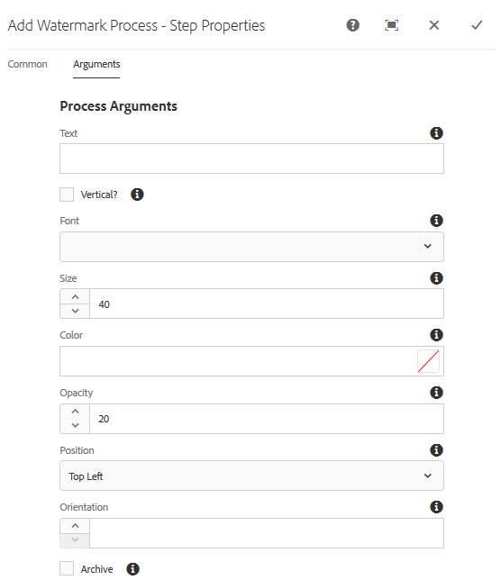

# Filigrana le risorse {#watermarking}

Risorse Adobe Experience Manager (AEM) consente di aggiungere una filigrana digitale alle immagini per consentire agli utenti di verificare l’autenticità e la proprietà del copyright delle risorse. Risorse AEM supporta il testo da usare come filigrana nei file PNG e JPEG.

Per applicare una filigrana alle risorse, aggiungi il passaggio [!UICONTROL Filigrana] nel flusso di lavoro Aggiorna risorsa  DAM.

1. Tap the AEM logo, and go to **[!UICONTROL Tools]** > **[!UICONTROL Workflow]** > **[!UICONTROL Models]**.
1. Dalla pagina Modelli di workflow, selezionate il flusso di lavoro **[!UICONTROL DAM Update Asset]** (Aggiorna risorsa) e fate clic su **[!UICONTROL Edit (Modifica)]**.

1. Dal pannello laterale, trascinate il passaggio **[!UICONTROL Aggiungi filigrana]** e aggiungetelo al flusso di lavoro Aggiorna risorsa  DAM.

   

   >[!NOTE]
   >
   >Posizionate il passaggio [!UICONTROL Aggiungi filigrana] ovunque prima del passaggio Miniatura  processo.

1. Aprite il passaggio **[!UICONTROL Aggiungi filigrana]** per visualizzarne le proprietà.
1. Nella scheda **[!UICONTROL Argomenti]** , specificate valori validi nei vari campi, inclusi testo, tipo di font, dimensione, colore, posizione, orientamento e così via. Per confermare le modifiche, toccate o fate clic sull’icona Fine.

   

1. Con il passaggio Filigrana, salva il flusso di lavoro **[!UICONTROL Risorsa di aggiornamento DAM]**.
1. Dall’interfaccia utente di AEM, caricate una risorsa di esempio. La filigrana viene visualizzata con la dimensione del font, il colore e così via, nella posizione configurata nei passaggi precedenti.
