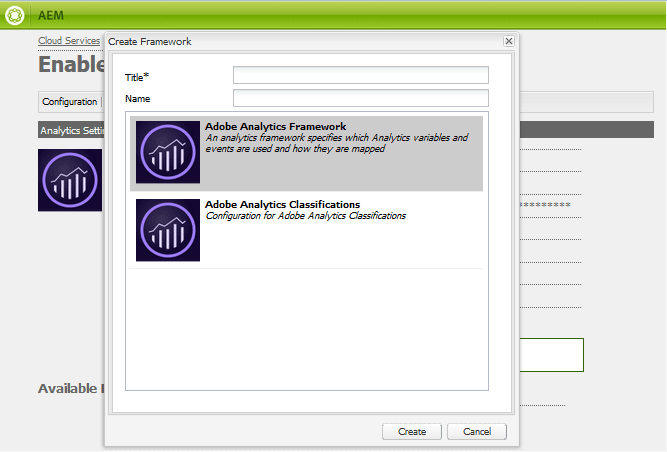

# Configurazione di Analytics per le funzioni Community {#analytics-configuration-for-communities-features}

## Panoramica {#overview}

Adobe Analytics e Adobe Experience Manager (AEM) sono entrambe soluzioni di Adobe Marketing Cloud.

Adobe Analytics può essere configurato per AEM Communities in modo che, quando un membro interagisce con le funzioni Community supportate, gli eventi vengano inviati ad Adobe Analytics da cui vengono generati i report.

Ad esempio, quando un membro di un sito community di abilitazione visualizza una risorsa video assegnata, il lettore delle risorse invia eventi ad Analytics, inclusi i dati heartbeat video. Dal sito della community, gli amministratori possono visualizzare vari rapporti sulla riproduzione del video.

Inoltre, l&#39;analisi è necessaria per:

* Nell’ambiente di pubblicazione:

   * Relazioni sulle [tendenze comunitarie](trends.md)
   * Consenti ai visitatori del sito di ordinare per &quot;più visualizzati&quot;, &quot;più attivi&quot;, &quot;più graditi&quot;
   * Visualizzare i conteggi negli elenchi UGC

* Nell’ambiente di authoring:

   * Visualizzazione dei dati di partecipazione nella console [di gestione dei](members.md) membri (viste, post, follower, Mi piace)
   * Riepilogo delle tendenze, heartbeat video e dispositivo video per abilitare i [rapporti sulle risorse](reports.md)

Le funzioni Community supportate includono:

* [Risorse di abilitazione](resources.md)
* [Forum](forum.md)
* [D/R](working-with-qna.md)
* [Blog](blog-feature.md)
* [Libreria file](file-library.md)
* [Calendario](calendar.md)

Questa sezione della documentazione descrive come collegare una suite di rapporti di Analytics alle funzioni di Communities. I passaggi di base sono:

1. [Replicare la chiave](#replicate-the-crypto-key) di crittografia per garantire che la crittografia/decrittografia si verifichi correttamente su tutte le istanze di AEM
1. Preparare una suite di [rapporti di Adobe Analytics](#adobe-analytics-report-suite-for-video-reporting)
1. Creare un servizio [e un](#aem-analytics-cloud-service-configuration) framework [cloud di AEM Analytics](#aem-analytics-framework-configuration)
1. [Abilita Analytics](#enable-analytics-for-a-community-site) per un sito community
1. [Verifica](#verify-analytics-to-aem-variable-mapping) della mappatura delle variabili di Analytics in AEM
1. Identificare l&#39;editore [principale](#primary-publisher)
1. [Pubblicare](#publish-community-site-and-analytics-cloud-service) il sito della community
1. Configurare l&#39; [importazione di dati](#obtaining-reports-from-analytics) del report da Adobe Analytics al sito community

## Prerequisiti {#prerequisites}

Per configurare le funzioni di Analytics for Communities, è necessario collaborare con il rappresentante commerciale di riferimento per configurare un account Adobe Analytics e una suite [di](#adobe-analytics-report-suite-for-video-reporting)rapporti. Una volta stabilite, devono essere disponibili le seguenti informazioni:

* Nome società

   Società associata all&#39;account Adobe Analytics
* Nome utente

   Il nome utente di accesso per l&#39;utente autorizzato a gestire l&#39;account Analytics

   (Deve includere i privilegi di accesso al servizio Web)

* Password

   La password di accesso per l&#39;utente autorizzato

* Centro dati di Analytics

   URL del centro dati di Analytics per l&#39;account

* Suite di rapporti

   Nome della suite di rapporti di Analytics da utilizzare

## Adobe Analytics Report Suite for Video Reporting {#adobe-analytics-report-suite-for-video-reporting}

Utilizzando Adobe Marketing Cloud [Report Suite Manager](https://marketing.adobe.com/resources/help/en_US/reference/new_report_suite.html), è possibile configurare le suite di rapporti di Analytics in modo che un sito community possa essere abilitato per fornire rapporti per le funzioni Community.

Effettuando l&#39;accesso ad [Adobe Marketing Cloud](https://marketing.adobe.com/resources/help/en_US/analytics/getting-started/analytics-navigation.html) con Nome [società e Nome utente](analytics.md#prerequisites), è possibile configurare una suite di rapporti nuova o esistente con:

* [11 Variabili](https://marketing.adobe.com/resources/help/en_US/reference/conversion_var_admin.html) di conversione (evar)

   * **`evar1`** tramite **`evar11`** abilitato
   * Può riadattare (rinominare) le variabili evar esistenti o crearne di nuove da utilizzare per le funzioni Community

* [7 Eventi](https://marketing.adobe.com/resources/help/en_US/reference/success_event.html) di successo (eventi)

   * **`event1`** tramite **`event7`** abilitato
   * Tipo **`Counter`**

      * not **`Counter (no subrelations)`**
   * Può riadattare (rinominare) gli eventi esistenti o crearne di nuovi da utilizzare per le funzioni Community


* [Gestione video](https://marketing.adobe.com/resources/help/en_US/sc/appmeasurement/hbvideo/video_analytics_config.html)

   * Video Reporting console

      * Abilita `Video Core`
      * Seleziona Salva
   * Console di misurazione video

      * Seleziona `Use Solution Variables`
      * Seleziona Salva


Se utilizzate una **nuova suite** di rapporti, tenete presente che una nuova suite di rapporti può contenere solo 4 variabili evar e 6 eventi, mentre per le community sono richieste 11 variabili evar e 7 variabili evento.

Se utilizzi una suite **di rapporti** esistente, potrebbe essere necessario [modificare la mappatura](#modifying-analytics-variable-mapping) delle variabili prima di attivare il framework Analytics per un sito community. Contatta il tuo rappresentante commerciale per qualsiasi dubbio sulle variabili dedicate alle Community.

>[!CAUTION]
>
>**Se si utilizza una suite di rapporti esistente che utilizza già variabili all&#39;interno di**
>
>* **`evar1`** through **`evar11`**
>* **`event1`** through **`event7`**
>
>
**Prima della pubblicazione del sito della community,** è importante ripristinare la mappatura preesistente spostando le variabili AEM che venivano automaticamente mappate sulle variabili Analytics quando Analytics era abilitato per un sito della community.
>
>Per ripristinare la mappatura preesistente e spostare le variabili AEM in altre variabili di Analytics, consulta la sezione sulla [modifica della mappatura](#modifying-analytics-variable-mapping)delle variabili di Analytics.
>
>In caso contrario si potrebbe determinare una perdita di dati non recuperabile.

### Video Heartbeat Analytics {#video-heartbeat-analytics}

Quando viene concessa la licenza di Video Heartbeat Analytics, `Marketing Cloud Org Id` viene assegnata una licenza.

Per abilitare il reporting Video Heartbeat dopo la [configurazione della suite di rapporti Analytics per il reporting](#adobe-analytics-report-suite-for-video-reporting)video:

* Creare un servizio cloud [Analytics](#aem-analytics-cloud-service-configuration)
* Abilitare [Analytics per un sito community](#enable-analytics-for-a-community-site)
* Associare il sito `Marketing Cloud Org Id` alla community

L&#39; `Marketing Cloud Org Id` indicazione può essere effettuata al momento della creazione [o successivamente del sito](sites-console.md#enablement) comunitario [modificando](sites-console.md#modifying-site-properties) le proprietà del sito. [](#aem-analytics-cloud-service-configuration)


Quando Video Heartbeat Analytics è abilitato, il codice Javascript (JS) per il lettore video crea un&#39;istanza del codice della libreria heartbeat video (anche in JS) che gestisce tutte le logiche per l&#39;invio di aggiornamenti dello stato dei video ai server di tracciamento video di Analytics ogni 10 secondi (non configurabili) e infine l&#39;invio di un rapporto cumulativo della sessione video ai server Analytics principali.

Se non è attivato, il codice heartbeat video non viene mai istanziato e solo l&#39;avanzamento video e il tracciamento della posizione di ripresa vengono memorizzati nell&#39;SRP per il reporting.

## Configurazione del servizio cloud di AEM Analytics {#aem-analytics-cloud-service-configuration}

Per creare una nuova integrazione di Analytics, che integra Adobe Analytics con il sito della community AEM, utilizzate l’interfaccia utente standard nell’istanza di creazione:

* Dalla navigazione globale: **[!UICONTROL Strumenti > Distribuzione > Servizi cloud]**
* Scorri verso il basso fino ad **[!UICONTROL Adobe Analytics]**
* Selezionate **[!UICONTROL Configura ora]** o **[!UICONTROL Mostra configurazioni]**


### Finestra di dialogo Crea configurazione {#create-configuration-dialog}

* Seleziona `[+]` l&#39;icona accanto a Configurazioni **** disponibili per creare una nuova configurazione

Nella finestra di dialogo Crea configurazione, i valori da immettere identificano la configurazione.


* **[!UICONTROL Titolo]**

   (Obbligatorio) Titolo di visualizzazione per la configurazione.

   Ad esempio, immettete *Enablement Community Analytics*

* **[!UICONTROL Nome]**

   (Facoltativo) Se non viene specificato, per impostazione predefinita il nome verrà impostato su un nome di nodo valido derivato dal titolo.

   For example, enter *communities*


* **[!UICONTROL Modello]**

   Seleziona `Adobe Analytics Configuration`

* Seleziona **[!UICONTROL Crea]**
   * Avvia la pagina di configurazione e apre la `Analytics Settings` finestra di dialogo

### Finestra di dialogo Impostazioni analisi {#analytics-settings-dialog}

La creazione iniziale di una nuova configurazione di Analytics determina la visualizzazione della configurazione e una nuova finestra di dialogo per l&#39;immissione delle impostazioni di Analytics. Questa finestra di dialogo richiede le informazioni [account](#prerequisites) preliminari ottenute dal rappresentante commerciale di riferimento.


* **[!UICONTROL Azienda]**

   Società associata all&#39;account Adobe Analytics

* **[!UICONTROL Nome utente]**

   Il nome utente di accesso per l&#39;utente autorizzato a gestire l&#39;account Analytics

* **[!UICONTROL Password]**

   La password di accesso per l&#39;utente autorizzato

* **[!UICONTROL Datacenter]**

   Seleziona il centro dati di Analytics in cui risiede la suite di rapporti

* **[!UICONTROL Non aggiungere tag di tracciamento alla pagina]**

   Mantieni come predefinito (non selezionato)

* **[!UICONTROL Usa AppMeasurement]**

   Mantieni come predefinito (non selezionato)

* **[!UICONTROL Non importare di notte le impression della pagina (creazione)]**

   Mantieni come predefinito (non selezionato)

* **[!UICONTROL Non importare di notte le impression della pagina (pubblicazione)]**

   Mantieni come predefinito (selezionato)

Per salvare le impostazioni:


* Seleziona **[!UICONTROL Connetti ad Analytics]**

   * In caso contrario,

      * Verificare che le voci non contengano spazi iniziali
      * Provare un datacenter diverso
      * Contattare il rappresentante commerciale di riferimento

* Selezionare **[!UICONTROL OK]**


### Crea framework {#create-framework}

Dopo la configurazione corretta della connessione di base ad Adobe Analytics, è necessario creare o modificare un framework per il sito della community. Lo scopo del framework è mappare le variabili delle funzioni Community (AEM) alle variabili Analytics (suite di rapporti).

* Selezionate `[+]` l&#39;icona accanto a Framework **[!UICONTROL disponibili]** per creare un nuovo framework



* **[!UICONTROL Titolo]**

   (Obbligatorio) Titolo visualizzato per il framework

   Ad esempio, immettete *Enablement Community Framework*

* **[!UICONTROL Nome]**

   (Facoltativo) Se non viene specificato, per impostazione predefinita il nome verrà impostato su un nome di nodo valido derivato dal titolo.

   For example, enter *communities*

* **[!UICONTROL Modello]**

   Seleziona `Adobe Analytics Framework`

* Seleziona **[!UICONTROL Crea]**

La creazione di Analytics Framework apre il framework per la configurazione.

## Configurazione del framework AEM Analytics {#aem-analytics-framework-configuration}

Lo scopo del framework è mappare le variabili AEM a variabili Analytics (evar ed eventi). Le variabili di Analytics disponibili per la mappatura sono [definite nella suite](#adobe-analytics-report-suite-for-video-reporting)di rapporti.


### Seleziona suite di rapporti {#select-report-suite}

Selezionate la suite di rapporti impostata per il reporting video.

Se una suite di rapporti non è ancora stata creata o non è stata configurata correttamente, consulta la sezione precedente:\
[Adobe Analytics Report Suite for Video Reporting](#adobe-analytics-report-suite-for-video-reporting)

La barra laterale non è necessaria e può essere ridotta a icona in modo da non ostacolare l’accesso alle impostazioni Suite di rapporti.

#### Finestra di dialogo Suite di rapporti prima e dopo la selezione di &#39;Aggiungi elemento&#39; {#report-suites-dialog-before-and-after-selecting-add-item}


1. Seleziona **[!UICONTROL Aggiungi elemento +]** vengono visualizzate due caselle a discesa
1. Scegli una suite `Report suite` di rapporti associata all&#39;account Società da selezionare
1. Selezionate **[!UICONTROL Sì]** nella finestra di dialogo che si apre: ```Load default server settings? Do you want to load the default server settings and overwrite current values in the Server section?```
1. Choose a `Run Mode`\
   Scegliete **[!UICONTROL Pubblica]**


Il servizio e il framework di Analytics Cloud ora sono completi. Le mappature verranno definite dopo la creazione di un sito community con il servizio Analytics abilitato.

## Abilitare Analytics per un sito community {#enable-analytics-for-a-community-site}

### Abilita per nuovo sito community {#enable-for-new-community-site}

Per aggiungere il servizio cloud di Analytics durante [la creazione di un nuovo sito](sites-console.md)community:


* Nel passaggio 3
* Nella scheda [ANALYTICS](sites-console.md#analytics):

   * Selezionate la casella di controllo **[!UICONTROL Abilita analisi]** .
   * Scegliete il framework dalla casella a discesa

* Facoltativamente, tornate alla configurazione del framework Analytics per regolare le mappature delle variabili.

### Abilita per sito community esistente {#enable-for-existing-community-site}

Per aggiungere il servizio cloud di Analytics a un sito [community](sites-console.md#modifying-site-properties)esistente:


* Passare alla console **[!UICONTROL Community > Siti]**
* Selezionate l&#39;icona Modifica sito della community
* Selezionare le impostazioni
* Nella sezione Analisi:

   * Selezionate la casella di controllo **[!UICONTROL Abilita analisi]** .
   * Scegliete il framework dalla casella a discesa


* Facoltativamente, tornate alla configurazione del framework Analytics per regolare le mappature delle variabili.

### Abilita per siti personalizzati {#enable-for-customized-sites}

Affinché il tracciamento di Analytics e l&#39;importazione possano funzionare correttamente per un sito community, deve essere presente un elemento pagina con gli attributi `scf-js-site-title` class e href. Nella pagina dovrebbe esistere un solo elemento di questo tipo, ad esempio in uno `sitepage.hbs` script non modificato per un sito community. Il valore di `siteUrl` viene estratto e inviato ad Adobe Analytics come percorso *del* sito.

```xml
# present in default sitepage.hbs
# only one scf-js-site-title class should be included
# this example sets it to be hidden as it serves no visual purpose
<div
    class="navbar-brand scf-js-site-title"
    href="{{siteUrl}}.html"
    style="visibility: hidden;"
>
</div>
```

Per un sito **community** personalizzato che sovrappone lo `sitepage.hbs` script, accertatevi che l&#39;elemento sia presente. La `siteUrl`variabile viene impostata quando viene eseguito il rendering sul server prima di essere trasmessa al client.

Per un sito **AEM** generico che include componenti Community, ma non viene creato con la procedura guidata [di creazione del](sites-console.md)sito, è necessario aggiungere l’elemento. Il valore di href deve essere il percorso del sito. Ad esempio, se il percorso del sito è `/content/my/company/en`, utilizzate:

```xml
<div
    class="navbar-brand scf-js-site-title"
    href="/content/my/company/en.html"
    style="visibility: hidden;"
>
</div>
```

## Funzioni di Analytics per community {#analytics-for-communities-features}

Analytics viene utilizzato automaticamente per diverse funzioni Community.

La configurazione [](../../help/sites-deploying/configuring-osgi.md)OSGi dell’ambiente di authoring `AEM Communities Analytics Component Configuration`fornisce un elenco dei componenti che sono stati strumentalizzati per Analytics. La mappatura automatica delle variabili è determinata dai componenti elencati.

Se vengono creati nuovi componenti personalizzati dotati di strumenti per Analytics, questi devono essere aggiunti a questo elenco di componenti configurati.

### Configurazione componente {#component-configuration}


Nota: i `journal` componenti vengono utilizzati per implementare la funzione blog.

### Analisi mappata su variabili AEM {#mapped-analytics-to-aem-variables}

Una volta salvato il sito community con Analytics abilitato e selezionato il framework di configurazione cloud, le variabili AEM saranno mappate automaticamente alle variabili e agli eventi di Analytics che iniziano rispettivamente con evar1 ed event1 e aumentano di 1.

Se utilizzate una suite di rapporti esistente che ha mappato una qualsiasi delle variabili all’interno di evar1 attraverso evar11 e event1 tramite event7, sarà necessario [ricompilare le variabili](#modifying-analytics-variable-mapping) AEM e ripristinare la mappatura originale.

Di seguito è riportato un esempio di mappature predefinite dopo aver seguito l&#39;esercitazione [introduttiva](getting-started-enablement.md):


#### Mappa delle eVar inviate con ogni evento {#map-of-evars-sent-with-each-event}

|  | Tipo risorsa abilitazione | Titolo sito | Tipo di funzione | Titolo gruppo | Percorso gruppo | Tipo UGC | Titolo UGC | Utente (membro) | Percorso UGC | Percorso sito |
|------------------------|------------------------|-----------|--------------|------------|-----------|---------|----------|--------------|---------|----------|
|  | **eVar1** | **eVar2** | **eVar3** | **eVar4** | **eVar5** | **eVar6** | **eVar7** | **eVar8** | **eVar9** | **eVar10** |
| event1 Resource Play | (a) | - | - | - | - | - | - | - | i) | - |
| event2SCFView | (a) | b) | c) | (d) | (e) | (f) | (g) | (h) | i) | j) |
| event3SCFCreate (Post) | - | b) | c) | (d) | (e) | (f) | (g) | (h) | i) | j) |
| event4SCFFollow | - | b) | c) | (d) | (e) | (f) | (g) | (h) | i) | j) |
| event5SCFVoteUp | - | b) | c) | (d) | (e) | (f) | (g) | (h) | i) | j) |
| event6SCFVoteDown | - | b) | c) | (d) | (e) | (f) | (g) | (h) | i) | j) |
| event7SCFRate | - | b) | c) | (d) | (e) | (f) | (g) | (h) | i) | j) |

**Esempi per i valori eVar:**

* [Tipo](https://www.iana.org/assignments/media-types)MIME:video/mp4
* [Titolo](sites-console.md#step13asitetemplate)del sito community: Geometrixx Communities
* [Nome](functions.md)funzione community:Forum
* [Nome](creating-groups.md#creating-a-new-group)gruppo community: Escursione
* Percorso del contenuto del gruppo community: /content/sites/community/it/group/hiking
* [UGC component resourceType](essentials.md): social/forum/components/hbs/topic
* Titolo del componente UGC: Argomenti relativi all&#39;esecuzione
* Login (ID autorizzabile): aaron.mcdonald@mailinator.com
* Percorso SRP per UGC: /content/usergenerated/asi/.../forum/jmtz-topic3 o *percorso del componente da seguire*: /content/sites/community/it/jcr:content/content/main/forum
* Percorso del contenuto del sito community: /content/sites/community/it

### Modifica della mappatura delle variabili di Analytics {#modifying-analytics-variable-mapping}

La mappatura delle variabili evar ed eventi di Analytics alle variabili AEM è visibile dalla configurazione del framework dopo che Analytics è abilitato per un sito community.

Dopo l&#39;abilitazione di Analytics e prima della pubblicazione del sito community, la mappatura può essere modificata nel framework trascinando l&#39;evento o l&#39;evento Analytics desiderato dalla barra a sinistra e rilasciandolo nella riga corrispondente nella tabella di mappatura.

Per evitare mappature duplicate, accertatevi di rimuovere la variabile evar o l&#39;evento Analytics sostituito dalla riga posizionando il puntatore del mouse sopra di essa e selezionando la &quot;X&quot; che appare a destra dell&#39;elemento della variabile Analytics.

Se le variabili e gli eventi Community sovrascrivono le mappature pre-esistenti nella suite di rapporti, quindi per evitare la perdita di dati, assegna le variabili AEM per le funzionalità Community ad altre variabili e/o eventi di Analytics e ripristina le mappature originali.

>[!CAUTION]
>
>È importante rimappare prima che il sito della community venga [pubblicato](#publishing-the-community-site) con Analytics abilitato, altrimenti esiste il rischio di perdita di dati.

#### Esempio 1: Trascinamento di Analytics evar14 nella tabella di mappatura {#example-step-dragging-analytics-evar-into-mapping-table}


#### Esempio 2: Selezione di &#39;x&#39; per rimuovere evar11 sostituito {#example-step-selecting-x-to-remove-replaced-evar}


#### Esempio 3: AEM var eventdata.siteId riassociato ad Analytics evar14 {#example-step-aem-var-eventdata-siteid-remapped-to-analytics-evar}


## Pubblicazione del sito della community {#publishing-the-community-site}

### Verifica della mappatura delle variabili Analytics in AEM {#verify-analytics-to-aem-variable-mapping}

È consigliabile verificare la mappatura delle variabili prima di pubblicare il sito community, che pubblica anche il servizio e il framework cloud di Analytics.

Vedere sezioni:

* [Analisi mappata su variabili AEM](#mapped-analytics-to-aem-variables)
* [Modifica della mappatura delle variabili di Analytics](#modifying-analytics-variable-mapping)

>[!CAUTION]
>
>**Se si utilizza una suite di rapporti esistente che utilizza già variabili all&#39;interno di**
>
>* **`evar1`** through **`evar11`**
>* **`event1`** through **`event7`**
>
>
**Prima della pubblicazione del sito della community,** è importante ripristinare la mappatura preesistente e spostare le variabili AEM di Communities che venivano mappate automaticamente (quando Analytics era abilitato per il sito della community) su altre variabili Analytics. La nuova mappatura deve essere coerente tra tutti i componenti Community.
>
>In caso contrario si potrebbe determinare una perdita di dati non recuperabile.

### Editore principale {#primary-publisher}

Quando la distribuzione scelta è una farm [di](topologies.md#tarmk-publish-farm)pubblicazione, un&#39;istanza di pubblicazione AEM deve essere identificata come editore principale per il polling di Adobe Analytics per i dati del report da scrivere a [SRP](working-with-srp.md).

Per impostazione predefinita, la configurazione `AEM Communities Publisher Configuration` OSGi identifica l’istanza di pubblicazione come editore principale, in modo che tutte le istanze di pubblicazione in una farm di pubblicazione si identifichino come principali.

Pertanto, è necessario modificare la configurazione in tutte le istanze di pubblicazione secondarie per deselezionare la casella di controllo Editore **** principale.

Per istruzioni specifiche, consultate la sezione relativa all&#39;editore principale di [Distribuzione di Communities](deploy-communities.md#primary-publisher).

>[!CAUTION]
>
>È importante che l’editore principale sia configurato per impedire il polling da più istanze di pubblicazione.

### Replicare la chiave Crypto {#replicate-the-crypto-key}

Le credenziali di Adobe Analytics sono crittografate. Per facilitare la replica o la trasmissione di credenziali di analisi crittografate tra autori ed editori, tutte le istanze AEM devono condividere la stessa chiave di crittografia master.

A tale scopo, seguire le istruzioni in [Replica della chiave](deploy-communities.md#replicate-the-crypto-key)di crittografia.

### Pubblica sito community e servizio di Analytics Cloud {#publish-community-site-and-analytics-cloud-service}

Dopo che il servizio cloud di Analytics è stato abilitato per un sito community e, se necessario, dopo aver modificato [la](#mapped-analytics-to-aem-variables)mappatura delle variabili Analytics in AEM, è necessario replicare la configurazione nell&#39;ambiente di pubblicazione [(ri)pubblicando nuovamente il sito](sites-console.md#publishing-the-site)community.

## Come ottenere report da Analytics {#obtaining-reports-from-analytics}

### Gestione report {#report-management}

La configurazione [](../../help/sites-deploying/configuring-osgi.md)OSGi dell&#39;autore e dell&#39;editore principale, `AEM Communities Analytics Report Management`, viene utilizzata per eseguire query in Analytics.

In fase di creazione, le query sono per report in tempo reale.

Nell&#39;editore principale, le query vengono utilizzate per fornire informazioni in preparazione all&#39;importazione di dati Analytics da parte dell&#39;importatore di report.

L&#39;intervallo di query predefinito è 10 secondi.

### Importatore report {#report-importer}

Dopo la pubblicazione di un sito community abilitato per Analytics, la configurazione [](../../help/sites-deploying/configuring-osgi.md)OSGi dell&#39;editore principale può essere configurata `AEM Communities Analytics Report Importer`per impostare l&#39;intervallo di polling predefinito per le configurazioni che non sono configurate singolarmente in CRXDE.

L’intervallo di polling controlla la frequenza delle richieste ad Adobe Analytics per il pulling e il salvataggio dei dati nell’ [SRP](working-with-srp.md).

Quando i dati possono essere classificati come &quot;grandi dati&quot;, sondaggi più frequenti potrebbero mettere un carico elevato sul sito della comunità.

L’intervallo **predefinito di** importazione polling è impostato su 12 ore.


### Personalizzazione report componente {#component-report-customization}

Al momento, per personalizzare le metriche da monitorare, nell&#39;archivio vengono creati nodi che definiscono i periodi di tempo per i quali generare un rapporto su tale metrica.

L&#39;argomento forum è attualmente l&#39;unico esempio di questa personalizzazione:

* Nell&#39;editore principale
* Accesso con privilegi amministrativi
* Passa a [CRXDE Lite](../../help/sites-developing/developing-with-crxde-lite.md)

   * Ad esempio, [http://localhost:4503/crx/de](http://localhost:4503/crx/de)

* Sotto il `jcr:content` nodo della radice della lingua

   * Ad esempio: `/content/sites/engage/en/jcr:content`

* Passa al componente configurato per il reporting di Analytics

   * Ad esempio: `analytics/reportConfigs/social_forum_components_hbs_topic`

* Osserva i periodi di tempo creati

   * `last30Days`
   * `last90Days`
   * `thisYear`

* Osserva il `total`nodo

   * Modificando la `interval` proprietà si ignora l&#39;intervallo di Importazione report
   * Il valore è espresso in secondi ed è impostato su 4 ore (14400 secondi)


## Gestione dei dati utente in Analytics {#manage-user-data-in-analytics}

Adobe Analytics fornisce API che consentono di accedere, esportare ed eliminare dati utente. Per ulteriori informazioni, vedere [Sottomettere richieste](https://marketing.adobe.com/resources/help/en_US/analytics/gdpr/gdpr_submit_access_delete.html)di accesso ed eliminazione.

## Risorse {#resources}

* Adobe Marketing Cloud: Guida e riferimento di [Analytics](https://marketing.adobe.com/resources/help/en_US/reference/)
* AEM: [Integrating with Adobe Analytics](../../help/sites-administering/adobeanalytics.md)
* AEM: [Analytics con provider esterni](../../help/sites-administering/external-providers.md)

