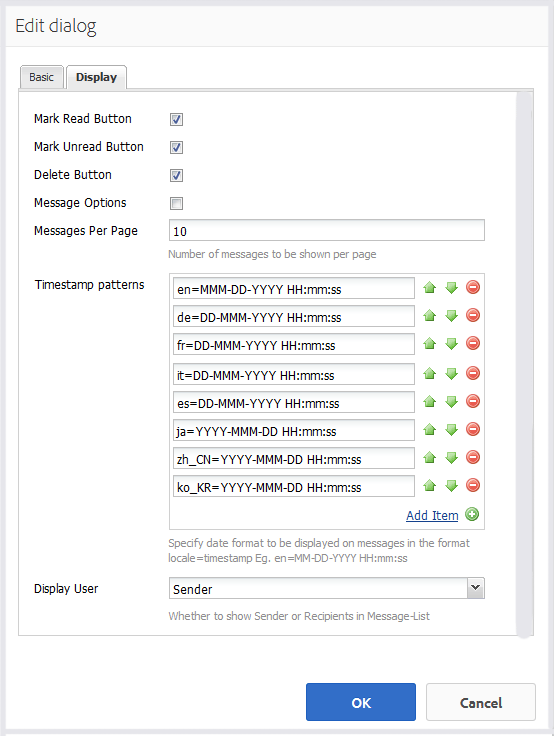

# Funzionalità di messaggistica {#messaging-feature}

Oltre alle interazioni visibili al pubblico che si verificano nei forum e nei commenti, la funzione di messaggistica di AEM Communities consente ai membri della community di interagire più in privato.

Questa funzione può essere inclusa quando si crea un sito  community.

Le funzioni di messaggistica consentono di:

* Inviare un messaggio a uno o più membri della community
* Invio di un messaggio a un gruppo di membri della community
* Invio di un messaggio con allegati
* Inoltra un messaggio
* Rispondi a un messaggio
* Eliminare un messaggio
* Ripristino di un messaggio eliminato

Per abilitare e modificare la funzione di messaggistica, visita

* [Configurazione dei messaggi](messaging.md) per gli amministratori
* [Messaging Essentials](essentials-messaging.md) for developer

>[!NOTE]
>
>Non è supportato aggiungere `Compose Message, Message, or Message List` componenti (nel gruppo di `Communities`componenti) a una pagina in modalità di modifica dell’autore.

## Configurazione dei componenti di messaggistica {#configuring-messaging-components}

Quando la messaggistica è abilitata per un sito community, viene completamente configurata senza bisogno di ulteriori configurazioni. Queste informazioni vengono fornite se è necessario modificare la configurazione predefinita.

### Configurazione dell&#39;elenco dei messaggi (messagebox) {#configuring-message-list-messagebox}

Per modificare la configurazione dell’elenco dei messaggi per le pagine **Posta in arrivo**, **Inviati** e **Cestino** della funzione di messaggistica, aprite il sito in modalità [di modifica dell’](sites-console.md#authoring-site-content)autore.

In `Preview` modalità, selezionate il collegamento **[!UICONTROL Messaggi]** per aprire la pagina di messaggi principale. Selezionate quindi **[!UICONTROL Casella in entrata, Elementi inviati o Cestino]** per configurare il componente per l’elenco dei messaggi.

In `Edit` modalità, selezionate il componente sulla pagina.

Per accedere alla finestra di dialogo di configurazione, è necessario annullare l’ereditarietà selezionando l’ `link`icona .

Una volta completata la configurazione, è necessario ripristinare l&#39;ereditarietà selezionando l&#39; `broken link` icona.

Una volta annullata l&#39;ereditarietà, sarà possibile selezionare l&#39; `configure` icona per aprire la finestra di dialogo di configurazione.

#### Basic tab {#basic-tab}

* **[!UICONTROL Selettore]** del servizio (*obbligatorio*) Impostare questo valore sulla proprietà `serviceSelector.name` dal servizio Operazioni messaggistica di [AEM Communities](messaging.md#messaging-operations-service).

* **[!UICONTROL Componi pagina]**(*richiesta*) La pagina da aprire quando un membro fa clic sul `Reply` pulsante. La pagina di destinazione deve contenere il modulo **[!UICONTROL Componi messaggio]** .

* **[!UICONTROL Rispondi/Visualizza come risorsa]** Se questa opzione è selezionata, l&#39;URL di risposta e l&#39;URL di visualizzazione faranno riferimento a una risorsa. In caso contrario, i dati vengono passati come parametri di query nell&#39;URL.

* **[!UICONTROL Modulo]** di visualizzazione profilo Modulo di profilo da utilizzare per visualizzare il profilo di mittenti.

* **[!UICONTROL Cartella]** Cestino Se questa opzione è selezionata, questo componente Elenco messaggi visualizza solo i messaggi contrassegnati come eliminati (cestino).

* **[!UICONTROL Percorsi]** cartella (*obbligatorio*) Con riferimento ai valori impostati per `inbox.path.name` e `sentitems.path.name` nel servizio Operazioni messaggistica di AEM Communities. Quando si configura per un `Inbox`, aggiungere una voce utilizzando il valore di `inbox.path.name`. Quando si configura per un `Outbox`, aggiungere una voce utilizzando il valore di `sentitems.path.name`. Durante la configurazione per `Trash`, aggiungere due voci con entrambi i valori.

#### Scheda Visualizzazione {#display-tab}

* **[!UICONTROL Contrassegna pulsante]** di lettura Se questa opzione è selezionata, visualizza un `Read`pulsante che consente di contrassegnare un messaggio come letto.

* **[!UICONTROL Contrassegna pulsante]** non letto Se questa opzione è selezionata, visualizza un `Mark Unread` pulsante che consente di contrassegnare un messaggio come letto.

* **[!UICONTROL Pulsante]** Elimina Se questa opzione è selezionata, visualizza un `Delete`pulsante che consente di contrassegnare un messaggio come letto. Duplica la funzionalità di eliminazione se **`Message Options`** è selezionata.

* **[!UICONTROL Opzioni]** messaggio Se questa opzione è selezionata, vengono visualizzati **`Reply`**, **`Reply All`** e **`Forward`** **`Delete`** i pulsanti che consentono di inviare o eliminare un messaggio. Duplica la funzionalità di eliminazione se **`Delete Button`** è selezionata.

* **[!UICONTROL Messaggi per pagina]** Il numero specificato corrisponde al numero massimo di messaggi visualizzati per pagina in uno schema di impaginazione. Se non viene specificato alcun numero (lasciato vuoto), vengono visualizzati tutti i messaggi e non è prevista alcuna impaginazione.

* **[!UICONTROL Pattern]** di marca temporale Fornisci pattern di marca temporale per una o più lingue. Il valore predefinito è en, de, fr, it, es, ja, zh_CN, ko_KR.

* **[!UICONTROL Visualizza utente]** Scegliere **`Sender`** o **`Recipients`** per determinare se visualizzare il mittente o i destinatari.

### Configurazione del messaggio di composizione {#configuring-compose-message}

Per modificare la configurazione della pagina Componi messaggio, aprite il sito in modalità [di modifica](sites-console.md#authoring-site-content)dell’autore.

In `Preview`modalità, selezionate il collegamento **[!UICONTROL Messaggi]** per aprire la pagina di messaggi principale. Quindi fate clic sul pulsante Nuovo messaggio per aprire la `Compose Message` pagina.

In `Edit` modalità, selezionate il componente principale nella pagina contenente il corpo del messaggio.

Per accedere alla finestra di dialogo di configurazione, è necessario annullare l’ereditarietà selezionando l’ `link`icona .

Una volta completata la configurazione, è necessario ripristinare l&#39;ereditarietà selezionando l&#39; `broken link` icona.

Una volta annullata l&#39;ereditarietà, sarà possibile selezionare l&#39; `configure` icona per aprire la finestra di dialogo di configurazione.

#### Basic tab {#basic-tab-1}

* **[!UICONTROL URL]** di reindirizzamento Immettere l&#39;URL della pagina visualizzata dopo l&#39;invio del messaggio. Ad esempio, `../messaging.html`.

* **[!UICONTROL Annulla URL]** Immettere l&#39;URL della pagina visualizzata se il mittente annulla il messaggio. Ad esempio, `../messaging.html`.

* **[!UICONTROL Lunghezza massima oggetto]** messaggio Il numero massimo di caratteri consentiti nel campo Oggetto. Ad esempio, 500. Il valore predefinito non è alcun limite.

* **[!UICONTROL Lunghezza massima del corpo]** del messaggio Il numero massimo di caratteri consentiti nel campo Contenuto. Ad esempio, 10000. Il valore predefinito non è alcun limite.

* **[!UICONTROL Selettore]** del servizio (*obbligatorio*) Impostare questo valore sulla proprietà **`serviceSelector.name`** dal servizio Operazioni messaggistica di [AEM Communities](messaging.md#messaging-operations-service).

#### Scheda Visualizzazione {#display-tab-1}

* **[!UICONTROL Mostra campo]** oggetto Se questa opzione è selezionata, mostra il `Subject` campo e abilita l’aggiunta di un oggetto al messaggio. Il valore predefinito non è selezionato.

* **[!UICONTROL Etichetta]** oggetto Immettere il testo da visualizzare accanto al `Subject` campo. Default is `Subject`.

* **[!UICONTROL Mostra campo]** file allegato Se questa opzione è selezionata, mostrare il `Attachment` campo e abilitare l&#39;aggiunta di allegati al messaggio. Il valore predefinito non è selezionato.

* **[!UICONTROL Etichetta]** file allegato Immettere il testo da visualizzare accanto al `Attachment` campo. Default is **`Attach File`**.

* **[!UICONTROL Mostra campo]** contenuto Se questa opzione è selezionata, mostra il `Content` campo e abilita l&#39;aggiunta di un corpo del messaggio. Il valore predefinito non è selezionato.

* **[!UICONTROL Etichetta]** contenuto Immettere il testo da visualizzare accanto al `Content` campo. Default is **`Body`**.

* **[!UICONTROL Se questa opzione è selezionata, l&#39;Editor]** Rich Text indica l&#39;utilizzo di una casella di testo Contenuto personalizzata con un proprio editor Rich Text. Il valore predefinito non è selezionato.

* **[!UICONTROL Pattern]** di marca temporale Fornisci pattern di marca temporale per una o più lingue. Il valore predefinito è en, de, fr, it, es, ja, zh_CN, ko_KR.

