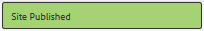

# Creare un nuovo sito della community {#author-a-new-community-site}

>[!CAUTION]
>
>AEM 6.4 ha raggiunto la fine del supporto esteso e questa documentazione non viene più aggiornata. Per maggiori dettagli, consulta la nostra [periodi di assistenza tecnica](https://helpx.adobe.com/it/support/programs/eol-matrix.html). Trova le versioni supportate [qui](https://experienceleague.adobe.com/docs/).

## Creare un nuovo sito community {#create-a-new-community-site}

Utilizza l’istanza di authoring per creare un nuovo sito community

* Accesso con privilegi di amministratore
* Dalla navigazione globale: **[!UICONTROL Navigazione > Community > Sites]**

La console Sites di Communities fornisce una procedura guidata per guidarne uno nei passaggi necessari per la creazione di un sito community. È possibile passare al `Next`passo o `Back`al passaggio precedente prima di impegnare il sito nel passaggio finale.

Per iniziare a creare un nuovo sito community:

* Seleziona la `Create` pulsante

### Passaggio 1: Modello del sito {#step-site-template}

Sulla [Passaggio al modello di sito](sites-console.md#step2013asitetemplate), inserisci un titolo, una descrizione e il nome dell&#39;URL, quindi seleziona un modello di sito community, ad esempio:

* **[!UICONTROL Titolo del sito community]**: `Getting Started Tutorial`

* **[!UICONTROL Descrizione del sito community]**: `A site for engaging with the community.`

* **[!UICONTROL Radice sito community]**: (lasciare vuoto per la radice predefinita `/content/sites`)

* **[!UICONTROL Configurazioni cloud]**: (lascia vuoto se non sono specificate configurazioni cloud) fornisci il percorso delle configurazioni cloud specificate.
* **[!UICONTROL Lingua di base del sito community]**: (lasciare intatti per una sola lingua: Inglese) usa il menu a discesa per sceglierne uno *o più* lingue di base delle lingue disponibili: tedesco, italiano, francese, giapponese, spagnolo, portoghese (Brasile), cinese (tradizionale) e cinese (semplificato). Verrà creato un sito community per ogni lingua aggiunta, che si troverà all’interno della stessa cartella del sito seguendo le best practice descritte in [Traduzione di contenuti per siti multilingue](../../help/sites-administering/translation.md). La pagina principale di ciascun sito conterrà una pagina figlia denominata dal codice della lingua di una delle lingue selezionate, ad esempio &quot;en&quot; per l’inglese o &quot;fr&quot; per il francese.

* **[!UICONTROL Nome sito community]**: coinvolgere

   * Controlla il nome in quanto non viene facilmente modificato dopo la creazione del sito
   * L’URL iniziale verrà visualizzato sotto il nome del sito community
   * Per un URL valido, aggiungi un codice della lingua di base + &quot;.html&quot;
   * *Esempio*, http://localhost:4502/content/sites/ `engage/en.html`

* **[!UICONTROL Modello]**: scegli `Reference Site`

Seleziona **[!UICONTROL Avanti]**

### Passaggio 2: Progettazione {#step-design}

La fase Progettazione è presentata in due sezioni per selezionare il tema e il banner di branding:

#### TEMA DEL SITO COMUNITARIO {#community-site-theme}

Selezionare lo stile desiderato da applicare al modello. Se selezionato, il tema verrà sovrapposto con un segno di spunta.

#### MARCATURA DEL SITO COMMUNITY {#community-site-branding}

(Facoltativo) Carica un&#39;immagine banner da visualizzare nelle pagine del sito. Il banner viene fissato al bordo sinistro del browser, tra l&#39;intestazione del sito community e il menu (collegamenti di navigazione). L’altezza del banner viene ritagliata a 120 pixel. Il banner non viene ridimensionato in modo da adattarsi alla larghezza del browser e all’altezza di 120 pixel.

 

Seleziona **[!UICONTROL Avanti]**.

### Passaggio 3: Impostazioni {#step-settings}

Nel passaggio Impostazioni, prima di selezionare `Next`, noterai che esistono sette sezioni che forniscono accesso alle configurazioni che coinvolgono gestione utenti, assegnazione tag, moderazione, gestione dei gruppi, analisi, traduzione e abilitazione.

Visita il [Guida introduttiva ad AEM Communities per l&#39;abilitazione](getting-started-enablement.md) esercitazione per scoprire come utilizzare le funzioni di abilitazione.

#### GESTIONE UTENTE {#user-management}

Seleziona tutte le caselle di controllo per [Gestione utente](sites-console.md#user-management)

* Per consentire ai visitatori del sito di registrarsi autonomamente
* Per consentire ai visitatori del sito di visualizzare il sito senza accedere
* Per consentire ai membri di inviare e ricevere messaggi da altri membri della community
* Consentire l’accesso con Facebook invece di registrare e creare un profilo
* Consentire l’accesso con Twitter invece di registrare e creare un profilo

>[!NOTE]
>
>Per un ambiente di produzione, è necessario creare applicazioni Facebook e Twitter personalizzate. Vedi [Accesso social con Facebook e Twitter](social-login.md).

#### TAG {#tagging}

I tag che possono essere applicati al contenuto della community vengono controllati selezionando AEM namespace definiti in precedenza tramite [Console assegnazione tag](../../help/sites-administering/tags.md#tagging-console) (ad esempio [Spazio dei nomi tutorial](setup.md#create-tutorial-tags)).

La ricerca di spazi dei nomi è semplice tramite la ricerca tipo-avanti. Ad esempio:

* Digitare &quot;tut&quot;
* Seleziona `Tutorial`

#### RUOLI {#roles}

[Ruoli dei membri della community](users.md) sono assegnate tramite le impostazioni nella sezione Ruoli .

Per consentire a un membro della comunità (o a un gruppo di membri) di utilizzare il sito come gestore della community, utilizza la ricerca tipo-avanti e seleziona il nome del membro o del gruppo dalle opzioni nel menu a discesa.

Ad esempio:

* Digitare &quot;q&quot;
* Seleziona [Quinn Harper](enablement-setup.md#publishcreateenablementmembers)

>[!NOTE]
>
>[Servizio tunnel](https://helpx.adobe.com/experience-manager/6-3/communities/using/deploy-communities.html#tunnel-service-on-author) consente la selezione di membri e gruppi esistenti solo nell’ambiente di pubblicazione.

#### MODERAZIONE {#moderation}

Accettare le impostazioni globali predefinite per [moderatore](sites-console.md#moderation) contenuto generato dall’utente (UGC).

#### ANALYTICS {#analytics}

Se Adobe Analytics dispone di una licenza e è stato configurato un servizio cloud e un framework di Analytics, è possibile abilitare Analytics e selezionare il framework.

Vedi [Funzionalità di configurazione di Analytics for Communities](analytics.md).

#### TRADUZIONE {#translation}

La [Impostazioni di traduzione](sites-console.md#translation) specificare la lingua di base del sito, nonché se l&#39;UGC può essere tradotto o meno e in quale lingua, in tal caso.

* Controlla **[!UICONTROL Consenti traduzione automatica]**
* Lasciare selezionate le lingue predefinite per la traduzione dal servizio di traduzione automatica predefinito
* Lascia provider di traduzione e configurazione predefiniti
* Non c&#39;è bisogno di un negozio globale perché non ci sono copie per lingua
* Seleziona **[!UICONTROL Traduci tutta la pagina]**
* Lascia l’opzione di persistenza predefinita

#### ABILITARE {#enablement}

Lascia vuoto quando crei una community di coinvolgimento.

Per un&#39;esercitazione simile per creare rapidamente un [comunità di abilitazione](overview.md#enablement-community), vedi [Guida introduttiva ad AEM Communities per l&#39;abilitazione](getting-started-enablement.md).

Seleziona **[!UICONTROL Avanti]**.

### Passaggio 4: Crea sito community {#step-create-communities-site}

Seleziona **[!UICONTROL Crea]**.

Al termine del processo, la cartella del nuovo sito viene visualizzata nella console Community - Sites .

## Pubblica il nuovo sito della community {#publish-the-new-community-site}

Il sito creato deve essere gestito dalla console Communities - Sites , la stessa console da cui è possibile creare nuovi siti.

Dopo aver selezionato la cartella del sito community per aprirla, passa il puntatore sull&#39;icona del sito in modo che vengano visualizzate quattro icone di azione:

Quando si seleziona la quarta icona dei puntini di sospensione (Altre azioni), vengono visualizzate le opzioni Esporta sito ed Elimina sito .

Da sinistra a destra sono:

* **Apri sito**
Seleziona l’icona a forma di matita per aprire il sito della community in modalità di modifica dell’autore, per aggiungere e/o configurare i componenti della pagina

* **Modifica sito**
Seleziona l’icona delle proprietà per aprire il sito community e modificare le proprietà, ad esempio il titolo o il tema

* **Pubblica sito**
Seleziona l&#39;icona del mondo per pubblicare il sito della community (ad esempio, se il server di pubblicazione è in esecuzione sul computer locale, per impostazione predefinita a localhost:4503)

* **Esporta sito**
Seleziona l&#39;icona di esportazione per creare un pacchetto del sito della community memorizzato entrambi in [gestore di pacchetti](../../help/sites-administering/package-manager.md) e scaricato.

   UGC non è incluso nel pacchetto del sito.

* **Elimina sito**

   seleziona l&#39;icona elimina il sito community da **[!UICONTROL Console Communities > Sites]**. Questa azione rimuove tutti gli elementi associati al sito, come UGC, gruppi di utenti, risorse e record di database.

>[!NOTE]
>
>Se non utilizzi la porta predefinita 4503 per l&#39;istanza di pubblicazione, modifica l&#39;agente di replica predefinito per impostare il numero di porta sul valore corretto.
>
>Nell’istanza dell’autore, dal menu principale
>
>1. Passa a **[!UICONTROL Strumenti > Operazioni > Replica]** menu
>1. Seleziona **[!UICONTROL Agenti sull&#39;autore]**
>1. Seleziona **[!UICONTROL Agente predefinito (pubblicazione)]**
>1. Accanto a **[!UICONTROL Impostazioni]** select **[!UICONTROL Modifica]**
>1. Nella finestra di dialogo a comparsa per Impostazioni agente, selezionare la scheda Trasporto
>1. In URI, cambiare il numero di porta 4503 in quello desiderato

>
>Ad esempio, per utilizzare la porta 6103: `http://localhost:6103/bin/receive?sling:authRequestLogin=1`
>
>1. Seleziona **[!UICONTROL OK]**
>1. (Facoltativo) Seleziona `Clear` o `Force Retry` per reimpostare la coda di replica

### Seleziona Pubblica {#select-publish}

Dopo aver verificato che il server di pubblicazione sia in esecuzione, seleziona l’icona del mondo per pubblicare il sito della community.

Quando il sito community è stato pubblicato correttamente, viene visualizzato un messaggio breve:

### Nuovi gruppi di utenti della community {#notice-new-community-user-groups}

Insieme al nuovo sito della community, vengono creati nuovi gruppi di utenti con le autorizzazioni appropriate impostate per diverse funzioni amministrative. Per maggiori dettagli, visita [Gruppi di utenti per siti della community](users.md#usergroupsforcommunitysites).

Per questo nuovo sito della community, dato il nome del sito &quot;coinvolgi&quot; nel passaggio 1, i quattro nuovi gruppi di utenti possono essere visti dal [Console Gruppi](members.md) (navigazione globale: Comunità, gruppi):

* Community Engage manager
* Amministratori di gruppi di coinvolgimento della community
* Membri della community Engage
* Moderatori di coinvolgimento della community
* Membri con privilegi di coinvolgimento della community
* Community Engage Sitecontentmanager

Tieni presente che [Aaron McDonald](tutorials.md#demo-users) è membro di

* Community Engage manager
* Moderatori di coinvolgimento della community
* Membri della community Engage (indirettamente come membro del gruppo Moderatori)

#### http://localhost:4503/content/sites/engage/en.html {#http-localhost-content-sites-engage-en-html}

## Configurazione per errore di autenticazione {#configure-for-authentication-error}

Una volta che un sito è stato configurato e inviato per la pubblicazione, [configurare la mappatura degli accessi](sites-console.md#configure-for-authentication-error) ( `Adobe Granite Login Selector Authentication Handler`) sull’istanza di pubblicazione. Il vantaggio è che quando le credenziali di accesso non vengono inserite correttamente, l&#39;errore di autenticazione rimostrerà la pagina di accesso del sito della community con un messaggio di errore.

Aggiungi un `Login Page Mapping` come

* /content/sites/interazione/it/signin:/content/sites/interazione/it

## Passaggi opzionali {#optional-steps}

### Modificare la home page predefinita {#change-the-default-home-page}

Quando si lavora con il sito di pubblicazione a scopo dimostrativo, potrebbe essere utile modificare la home page predefinita nel nuovo sito.

A tal fine è necessario utilizzare [CRXDE](http://localhost:4503/crx/de) Lite per modificare il [mappatura delle risorse](../../help/sites-deploying/resource-mapping.md) tabella sulla pubblicazione.

Per iniziare:

1. Al momento della pubblicazione, accedi con privilegi di amministratore
1. Sfoglia per [http://localhost:4503/crx/de](http://localhost:4503/crx/de)
1. Nel browser del progetto, espandi `/etc/map`
1. Seleziona la `http` nodo

   * Seleziona **[!UICONTROL Crea nodo]**

      * **Nome** localhost.4503

         (do *not* use `:`)

      * **Tipo** [sling:Mapping](https://sling.apache.org/documentation/the-sling-engine/mappings-for-resource-resolution.html)

1. Con la nuova creazione `localhost.4503` nodo selezionato

   * Aggiungi proprietà

      * **Nome** sling:match
      * **Tipo** Stringa
      * **Valore** localhost.4503/\$

         (deve terminare con il carattere &#39;$&#39;)
   * Aggiungi proprietà

      * **Nome** sling:internalRedirect
      * **Tipo** Stringa
      * **Valore** /content/sites/engage/en.html

1. Seleziona **[!UICONTROL Salva tutto]**
1. (facoltativo) Elimina la cronologia di navigazione
1. Sfoglia http://localhost:4503/

   * Arriva a http://localhost:4503/content/sites/engage/en.html

>[!NOTE]
>
>Per disattivare, è sufficiente anteporre al comando `sling:match` valore della proprietà con un valore &#39;x&#39; - `xlocalhost.4503/$` - e **[!UICONTROL Salva tutto]**.

#### Risoluzione dei problemi: Errore durante il salvataggio della mappa {#troubleshooting-error-saving-map}

Se non riesci a salvare le modifiche, assicurati che il nome del nodo sia `localhost.4503`, con un separatore &quot;punto&quot; e non `localhost:4503` con un separatore a due punti, come `localhost`non è un prefisso dello spazio dei nomi valido.

#### Risoluzione dei problemi: Impossibile reindirizzare {#troubleshooting-fail-to-redirect}

Il **$**&quot; alla fine dell&#39;espressione regolare `sling:match`la stringa è cruciale, in modo che solo `http://localhost:4503/` è mappato, altrimenti il valore di reindirizzamento viene preceduto da qualsiasi percorso che potrebbe esistere dopo server:port nell&#39;URL. Pertanto, quando AEM tenta di reindirizzare alla pagina di accesso, non riesce.

### Modificare il sito {#modify-the-site}

Dopo la creazione iniziale del sito, gli autori possono utilizzare il [Icona Apri sito](sites-console.md#authoring-site-content) per eseguire attività di authoring standard AEM.

Inoltre, gli amministratori possono utilizzare [Icona Modifica sito](sites-console.md#modifying-site-properties) per modificare le proprietà del sito, ad esempio il titolo.

Dopo qualsiasi modifica, ricorda di **save** e **ripubblicare** il sito.

>[!NOTE]
>
>Se non hai familiarità con AEM, consulta la documentazione su [trattamento di base](../../help/sites-authoring/basic-handling.md) e [guida rapida all’authoring delle pagine](../../help/sites-authoring/qg-page-authoring.md).
