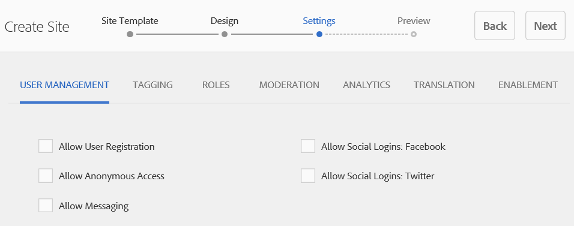

# Creazione di un nuovo sito community {#author-a-new-community-site}

## Create a New Community Site {#create-a-new-community-site}

Utilizzate l&#39;istanza di creazione per creare un nuovo sito community

* Accesso con privilegi di amministratore
* Dalla navigazione globale: **[!UICONTROL Navigazione > Community > Siti]**

La console Siti community offre una procedura guidata che guida l’utente attraverso i passaggi necessari per creare un sito community. È possibile passare al `Next`passo precedente o `Back`al passo precedente prima di impegnare il sito nel passaggio finale.

Per iniziare a creare un nuovo sito community:

* Selezionare il `Create` pulsante

### Passaggio 1: Modello del sito {#step-site-template}

Nel passaggio [Modello](sites-console.md#step2013asitetemplate)sito, immettete un titolo, una descrizione, il nome dell&#39;URL e selezionate un modello di sito community, ad esempio:

* **[!UICONTROL Titolo del sito community]**: `Getting Started Tutorial`

* **[!UICONTROL Descrizione del sito community]**: `A site for engaging with the community.`

* **[!UICONTROL Radice]** sito community: (lasciare vuoto per la radice predefinita `/content/sites`)

* **[!UICONTROL Configurazioni]** cloud: (lasciate vuoto se non sono specificate configurazioni cloud) fornite il percorso alle configurazioni cloud specificate.
* **[!UICONTROL Lingua]** di base del sito community: (lasciare invariate le lingue per una sola: Inglese) utilizzate il menu a discesa per scegliere una *o più* lingue di base tra quelle disponibili: tedesco, italiano, francese, giapponese, spagnolo, portoghese (Brasile), cinese tradizionale e cinese (semplificato). Verrà creato un sito community per ogni lingua aggiunta, all&#39;interno della stessa cartella del sito seguendo la procedura descritta in [Traduzione di contenuti per siti](../../help/sites-administering/translation.md)multilingue. La pagina principale di ciascun sito conterrà una pagina figlia denominata dal codice della lingua di una delle lingue selezionate, ad esempio &#39;en&#39; per l&#39;inglese o &#39;fr&#39; per il francese.

* **[!UICONTROL Nome]** sito community: coinvolgimento

   * Ricontrolla il nome perché non viene facilmente modificato dopo la creazione del sito
   * L&#39;URL iniziale verrà visualizzato sotto il nome del sito community
   * Per un URL valido, aggiungete un codice della lingua di base + &quot;.html&quot;
   * *Ad esempio*, http://localhost:4502/content/sites/ `engage/en.html`

* **[!UICONTROL Modello]**: premuto per scegliere `Reference Site`

Seleziona **[!UICONTROL Avanti]**

### Passaggio 2: Progettazione {#step-design}

Il passaggio Progettazione viene presentato in due sezioni per selezionare il tema e il banner di branding:

#### COMMUNITY SITE THEME {#community-site-theme}

Selezionate lo stile da applicare al modello. Quando è selezionato, il tema sarà sovrapposto con un segno di spunta.

#### COMMUNITY SITE BRANDING {#community-site-branding}

(Facoltativo) Caricate un&#39;immagine banner da visualizzare nelle pagine del sito. Il banner è fissato al bordo sinistro del browser, tra l&#39;intestazione del sito community e il menu (collegamenti di navigazione). L’altezza del banner viene ritagliata a 120 pixel. Il banner non può essere ridimensionato in modo da adattarlo alla larghezza del browser e all&#39;altezza di 120 pixel.

 

Seleziona **[!UICONTROL Avanti]**.

### Passaggio 3:Impostazioni {#step-settings}

Nella fase Settings (Impostazioni), prima di selezionare `Next`, sono presenti sette sezioni che forniscono l&#39;accesso alle configurazioni che includono gestione utente, tag, moderazione, gestione dei gruppi, analisi, traduzione e abilitazione.

Per provare a utilizzare le funzioni di abilitazione, consulta l’esercitazione [Guida introduttiva ad AEM Communities for Enablement](getting-started-enablement.md) .

#### USER MANAGEMENT {#user-management}

Seleziona tutte le caselle di controllo per Gestione [utente](sites-console.md#user-management)

* Per consentire ai visitatori del sito di registrarsi autonomamente
* Per consentire ai visitatori del sito di visualizzare il sito senza effettuare l&#39;accesso
* Per consentire ai membri di inviare e ricevere messaggi da altri membri della community
* Per consentire l&#39;accesso a Facebook invece di registrare e creare un profilo
* Per consentire l&#39;accesso con Twitter invece di registrare e creare un profilo

>[!NOTE]
>
>Per un ambiente di produzione, è necessario creare applicazioni Facebook e Twitter personalizzate. Consultate Accesso [social network con Facebook e Twitter](social-login.md).

#### TAGGING {#tagging}

I tag che possono essere applicati al contenuto della community sono controllati selezionando gli spazi di nomi AEM precedentemente definiti tramite la console  Tagging (ad esempio lo spazio dei nomi [delle](setup.md#create-tutorial-tags)esercitazioni).

La ricerca di spazi dei nomi è semplice tramite la ricerca tipo-avanti. Ad esempio:

* Tipo &#39;tut&#39;
* Seleziona `Tutorial`

#### ROLES {#roles}

[I ruoli](users.md) dei membri della community vengono assegnati tramite le impostazioni nella sezione Ruoli.

Per consentire a un membro della community (o a un gruppo di membri) di utilizzare il sito come manager della community, utilizzate la ricerca tipo avanti e selezionate il nome del membro o del gruppo dalle opzioni disponibili nel menu a discesa.

Ad esempio:

* Tipo &quot;q&quot;
* Seleziona [Quinn Harper](enablement-setup.md#publishcreateenablementmembers)

>[!NOTE]
>
>[Il servizio](https://helpx.adobe.com/experience-manager/6-3/communities/using/deploy-communities.html#tunnel-service-on-author) Tunnel consente la selezione di membri e gruppi esistenti solo nell’ambiente di pubblicazione.

#### MODERATION {#moderation}

Accettate le impostazioni globali predefinite per [moderare](sites-console.md#moderation) il contenuto generato dall&#39;utente (UGC).

#### ANALYTICS {#analytics}

Se Adobe Analytics dispone di una licenza e sono stati configurati un servizio e un framework cloud di Analytics, è possibile abilitare Analytics e selezionare il framework.

Consultate Configurazione [di Analytics per le funzioni](analytics.md)Community.

#### TRANSLATION {#translation}

Le impostazioni [di](sites-console.md#translation) traduzione specificano la lingua di base del sito, nonché se è possibile tradurre o meno l&#39;UGC e in quale lingua, in tal caso.

* Controlla **[!UICONTROL Consenti traduzione automatica]**
* Lasciare le lingue predefinite selezionate per la traduzione dal servizio di traduzione automatica predefinito
* Lascia il provider di traduzione predefinito e la configurazione
* Non c&#39;è bisogno di uno store globale perché non ci sono copie in lingua
* Seleziona **[!UICONTROL Traduci tutta la pagina]**
* Opzione Mantieni persistenza predefinita

#### ENABLEMENT {#enablement}

Lasciate vuoto quando create una community di coinvolgimento.

Per un’esercitazione simile per creare rapidamente una community di [abilitazione](overview.md#enablement-community), consultate [Guida introduttiva ad AEM Communities per l’abilitazione](getting-started-enablement.md).

Seleziona **[!UICONTROL Avanti]**.

### Passaggio 4: Crea sito community {#step-create-communities-site}

Seleziona **[!UICONTROL Crea]**.

Al termine del processo, la cartella del nuovo sito viene visualizzata nella console Community - Siti.

## Pubblicare il nuovo sito della community {#publish-the-new-community-site}

Il sito creato deve essere gestito dalla console Community - Siti, la stessa console da cui è possibile creare nuovi siti.

Dopo aver selezionato la cartella del sito della community per aprirla, posizionate il puntatore sull&#39;icona del sito in modo che vengano visualizzate quattro icone di azione:

Selezionando la quarta icona di ellissi (Altre azioni), vengono visualizzate le opzioni Esporta sito ed Elimina sito.

Da sinistra a destra sono:

* **Apri sito** Selezionate l’icona matita per aprire il sito della community in modalità di modifica dell’autore, per aggiungere e/o configurare componenti della pagina

* **Modifica sito** Selezionate l&#39;icona delle proprietà per aprire il sito della community e modificare le proprietà, ad esempio il titolo o il tema

* **Pubblica sito** Selezionate l&#39;icona del mondo per pubblicare il sito della community (ad esempio, se il server di pubblicazione è in esecuzione sul computer locale, per impostazione predefinita viene utilizzato localhost:4503)

* **Esporta sito** Selezionate l&#39;icona di esportazione per creare un pacchetto del sito della community che viene memorizzato e scaricato in [Package Manager](../../help/sites-administering/package-manager.md) .

   UGC non è incluso nel pacchetto del sito.

* **Elimina sito**

   selezionate l&#39;icona Elimina per eliminare il sito community dalla console **** Community > Siti. Questa azione rimuove tutti gli elementi associati al sito, come UGC, gruppi di utenti, risorse e record del database.

>[!NOTE]
>
>Se non utilizzate la porta predefinita 4503 per l&#39;istanza di pubblicazione, modificate l&#39;agente di replica predefinito per impostare il numero di porta sul valore corretto.
>
>Nell’istanza di creazione, dal menu principale
>
>1. Selezionare **[!UICONTROL Strumenti > Operazioni > Menu Replica]** .
>1. Seleziona **[!UICONTROL agenti sull’autore]**
>1. Seleziona agente **[!UICONTROL predefinito (pubblicazione)]**
>1. Accanto a **[!UICONTROL Impostazioni]** , seleziona **[!UICONTROL Modifica]**
>1. Nella finestra di dialogo a comparsa per Impostazioni agente, seleziona la scheda Trasporto
>1. In URI, modificate il numero di porta 4503 in base al numero di porta desiderato
>
>
Ad esempio, per utilizzare la porta 6103: `http://localhost:6103/bin/receive?sling:authRequestLogin=1`
>
>1. Selezionare **[!UICONTROL OK]**
>1. (Facoltativo) Selezionare `Clear` o `Force Retry` reimpostare la coda di replica

### Selezionate Pubblica {#select-publish}

Dopo aver verificato che il server di pubblicazione sia in esecuzione, selezionate l&#39;icona del mondo per pubblicare il sito della community.

Quando il sito community è stato pubblicato correttamente, viene visualizzato un breve messaggio:

### Notifica nuovi gruppi di utenti community {#notice-new-community-user-groups}

Insieme al nuovo sito della community, vengono creati nuovi gruppi di utenti con le autorizzazioni appropriate impostate per diverse funzioni amministrative. Per informazioni dettagliate, consultate Gruppi di [utenti per i siti](users.md#usergroupsforcommunitysites)della community.

Per questo nuovo sito community, dato il nome del sito &quot;coinvolgimento&quot; nel passaggio 1, i quattro nuovi gruppi di utenti possono essere visualizzati dalla console  Gruppi (navigazione globale: Community, Gruppi):

* Community Engagement
* Amministratori di gruppi di coinvolgimento community
* Membri di coinvolgimento della community
*  Moderatori di coinvolgimento community
* Community Engagement Privileged members
* Community Engage Sitecontentmanager

Tieni presente che [Aaron McDonald](tutorials.md#demo-users) è membro di

* Community Engagement
*  Moderatori di coinvolgimento community
* Partecipazione community (indirettamente come membro del gruppo Moderatori)

#### http://localhost:4503/content/sites/engage/en.html {#http-localhost-content-sites-engage-en-html}

## Configura per errore di autenticazione {#configure-for-authentication-error}

Una volta configurato un sito e inviato per la pubblicazione, [configurate la mappatura](sites-console.md#configure-for-authentication-error) di accesso ( `Adobe Granite Login Selector Authentication Handler`) nell’istanza di pubblicazione. Il vantaggio è che quando le credenziali di accesso non vengono immesse correttamente, l&#39;errore di autenticazione riaprirà la pagina di accesso del sito community con un messaggio di errore.

Aggiungi un `Login Page Mapping` nome

* /content/sites/interazione/it/signing:/content/sites/interazione/it

## Passaggi opzionali {#optional-steps}

### Modificare la home page predefinita {#change-the-default-home-page}

Quando lavorate con il sito di pubblicazione a scopo dimostrativo, potrebbe essere utile modificare la pagina principale predefinita nel nuovo sito.

A tal fine, è necessario utilizzare [CRXDE](http://localhost:4503/crx/de) Lite per modificare la tabella di mappatura [delle](../../help/sites-deploying/resource-mapping.md) risorse al momento della pubblicazione.

Per iniziare:

1. Al momento della pubblicazione, effettuate l’accesso con privilegi di amministratore
1. Passa a [http://localhost:4503/crx/de](http://localhost:4503/crx/de)
1. Nel browser del progetto, espandi `/etc/map`
1. Selezionare il `http` nodo

   * Seleziona **[!UICONTROL Crea nodo]**

      * **Nome** localhost.4503

         ( *non* utilizzare `:`)

      * **Tipo** [sling:mapping](https://sling.apache.org/documentation/the-sling-engine/mappings-for-resource-resolution.html)

1. Con `localhost.4503` nodo appena creato selezionato

   * Aggiungi, proprietà

      * **Nome** sling:match
      * **Stringa tipo**
      * **Valore** localhost.4503/\$

         (deve terminare con il carattere &#39;$&#39;)
   * Aggiungi, proprietà

      * **Nome** sling:internalRedirect
      * **Stringa tipo**
      * **Valore** /content/sites/engage/en.html

1. Seleziona **[!UICONTROL Salva tutto]**
1. (facoltativo) Elimina la cronologia di navigazione
1. Passa a http://localhost:4503/

   * Arrivate a http://localhost:4503/content/sites/engage/en.html

>[!NOTE]
>
>Per disattivare, anteponete semplicemente il valore della `sling:match` proprietà con &#39;x&#39; - `xlocalhost.4503/$` - e **[!UICONTROL Salva tutto]**.

#### Risoluzione dei problemi: Errore durante il salvataggio della mappa {#troubleshooting-error-saving-map}

Se non è possibile salvare le modifiche, assicurarsi che il nome del nodo sia `localhost.4503`, con un separatore &#39;punto&#39; e non `localhost:4503` con un separatore &#39;due punti&#39;, in quanto non `localhost`è un prefisso valido per lo spazio nomi.

#### Risoluzione dei problemi: Impossibile eseguire il reindirizzamento {#troubleshooting-fail-to-redirect}

Il valore &#39;**$**&#39; alla fine della `sling:match`stringa di espressione regolare è cruciale, in modo che solo `http://localhost:4503/` venga mappato esattamente, altrimenti il valore di reindirizzamento viene anteposto a qualsiasi percorso che potrebbe esistere dopo il server:port nell&#39;URL. Pertanto, quando AEM tenta di reindirizzare alla pagina di accesso, non riesce.

### Modifica del sito {#modify-the-site}

Dopo la creazione iniziale del sito, gli autori possono utilizzare l’icona  Apri sito per eseguire le attività standard di authoring di AEM.

Inoltre, gli amministratori possono utilizzare l’icona  Modifica sito per modificare le proprietà del sito, ad esempio il titolo.

Dopo ogni modifica, ricordate di **salvare** e **pubblicare** nuovamente il sito.

>[!NOTE]
>
>Se non avete familiarità con AEM, consultate la documentazione sulla gestione  di base e una guida [rapida alle pagine](../../help/sites-authoring/qg-page-authoring.md)di authoring.