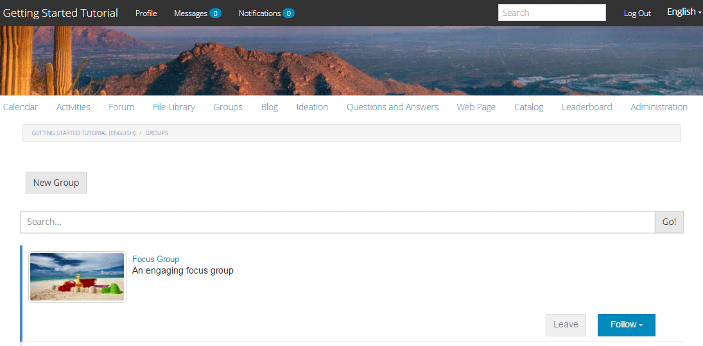

# Gruppi community {#community-groups}

>[!CAUTION]
>
>AEM 6.4 ha raggiunto la fine del supporto esteso e questa documentazione non viene più aggiornata. Per maggiori dettagli, consulta la nostra [periodi di assistenza tecnica](https://helpx.adobe.com/it/support/programs/eol-matrix.html). Trova le versioni supportate [qui](https://experienceleague.adobe.com/docs/).

La funzione gruppi community consente a una sottocommunity di creare in modo dinamico all’interno di un sito community utenti autorizzati (membri della community e autori) dagli ambienti di pubblicazione e authoring.

Questa funzionalità è presente quando [funzione gruppi](functions.md#groups-function) è presente nel [sito della community](sites-console.md) struttura.

A [modello di gruppo community](tools-groups.md) fornisce la progettazione della pagina del gruppo community quando un gruppo community viene creato in modo dinamico.

Uno o più modelli di gruppo vengono selezionati per la funzione dei gruppi quando la funzione viene aggiunta alla struttura di un sito community o a un modello di sito community. Questo elenco di modelli di gruppo viene presentato al membro o all&#39;autore che crea in modo dinamico un nuovo gruppo dall&#39;interno del sito community.

## Creazione di un nuovo gruppo {#creating-a-new-group}

La capacità di creare un nuovo gruppo community si basa sull&#39;esistenza di un sito community che include la funzione dei gruppi, come quella creata dalla ` [Reference Site Template](sites.md)`.

Gli esempi che seguono utilizzano il sito della community creato dal `Reference Site Template` come descritto nel [Guida introduttiva ad AEM Communities](getting-started.md) esercitazione.

Questa è la pagina che viene caricata al momento della pubblicazione **[!UICONTROL Gruppi]** voce di menu selezionata:

Quando selezioni la **[!UICONTROL Nuovo gruppo]** viene visualizzata una finestra di dialogo di modifica.

Sotto la **[!UICONTROL Impostazioni]** fornisce le funzioni di base del gruppo:

* **[!UICONTROL Nome gruppo]**
Titolo del gruppo da visualizzare sul sito della community.

* **[!UICONTROL Descrizione]**
Una descrizione del gruppo da visualizzare sul sito della community.

* **[!UICONTROL Invito]**
Un elenco di membri da invitare a far parte del gruppo. La ricerca di tipo &quot;type-ahead&quot; fornirà suggerimenti dei membri della community da invitare.

* **[!UICONTROL Nome URL gruppo]**
Nome della pagina del gruppo che diventa parte dell’URL.

* **[!UICONTROL Apri gruppo]**
Selezione 
`Open Group` indica che un visitatore anonimo del sito può visualizzare il contenuto e deseleziona `Member Only Group`.

* **[!UICONTROL Gruppo solo membri]**
Selezione 
`Member Only Group` indica che solo i membri del gruppo possono visualizzare il contenuto e deseleziona `Open Group`.

Sotto la **[!UICONTROL Modello]** tab è la possibilità di selezionare dall&#39;elenco dei modelli di gruppo community specificati quando la funzione gruppi è stata inclusa nella struttura del sito community o in un modello di sito community.

Sotto la **[!UICONTROL Immagine]** tab è la capacità di caricare un&#39;immagine da visualizzare per il gruppo nella pagina Groups del sito community. Il foglio di stile predefinito ridimensiona l’immagine a 170 x 90 pixel.

Selezionando la **[!UICONTROL Crea gruppo]** le pagine del gruppo vengono create in base al modello scelto e viene creato un gruppo di utenti per l’iscrizione. La pagina Gruppi verrà aggiornata per mostrare la nuova sottocomunità.

Ad esempio, la pagina Groups (Gruppi) con una nuova sottocommunity denominata &quot;Focus Group&quot;, per la quale è stata caricata una miniatura dell’immagine, verrà visualizzata come segue (ancora connesso come amministratore del gruppo community):

Selezione della `Focus Group` Il collegamento consente di aprire la pagina Gruppo di elementi attivi nel browser, che ha un aspetto iniziale basato sul modello scelto, e include un sottomenu sotto il menu del sito della community principale:

## Componente elenco membri gruppo community {#community-group-member-list-component}

La `Community Group Member List` Il componente è destinato agli sviluppatori di modelli di gruppo.

## Informazioni aggiuntive {#additional-information}

Per ulteriori informazioni, consulta [Nozioni di base sui gruppi community](essentials-groups.md) per sviluppatori.

Per altre informazioni relative ai gruppi della community, visita [Gestione di utenti e gruppi di utenti](users.md).
