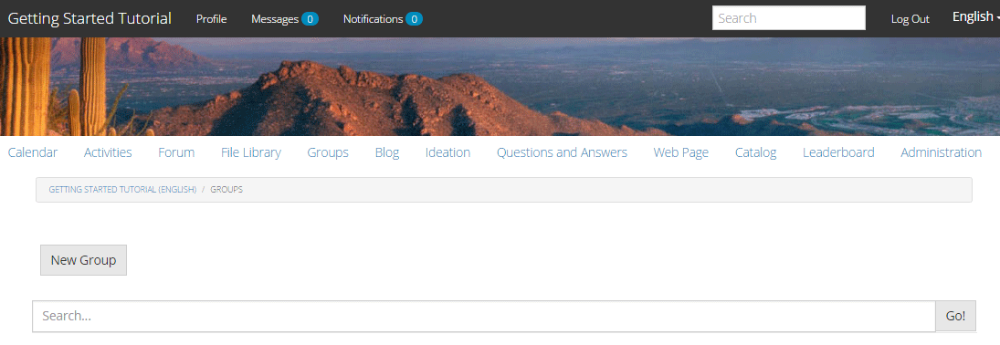

# Gruppi community {#community-groups}

La funzione per i gruppi della community è la possibilità per una sottocomunità di essere creata in modo dinamico all&#39;interno di un sito della community da utenti autorizzati (membri della community e autori) dagli ambienti di pubblicazione e authoring.

Questa funzionalità è presente quando la funzione [group](functions.md#groups-function) è presente nella struttura [del sito community](sites-console.md).

Un [modello di gruppo community](tools-groups.md) fornisce la progettazione della pagina del gruppo community quando un gruppo community viene creato in modo dinamico.

Uno o più modelli di gruppo vengono selezionati per la funzione dei gruppi quando la funzione viene aggiunta alla struttura di un sito community o a un modello di sito community. Questo elenco di modelli di gruppo viene presentato al membro o all&#39;autore che crea in modo dinamico un nuovo gruppo dall&#39;interno del sito della community.

## Creazione di un nuovo gruppo {#creating-a-new-group}

La capacità di creare un nuovo gruppo community si basa sull&#39;esistenza di un sito community che include la funzione dei gruppi, come quella creata dal ` [Reference Site Template](sites.md)`.

Gli esempi seguenti utilizzano il sito della community creato da `Reference Site Template` come descritto nell&#39;esercitazione [Guida introduttiva  AEM Communities](getting-started.md).

Questa è la pagina che viene caricata al momento della pubblicazione quando è selezionata la voce di menu **[!UICONTROL Groups]**:

Quando si seleziona l&#39;icona **[!UICONTROL Nuovo gruppo]**, si apre una finestra di dialogo di modifica.

Nella scheda **[!UICONTROL Settings]** (Impostazioni), sono disponibili le funzioni di base del gruppo:

* **[!UICONTROL Nome gruppo:]**
il titolo del gruppo da visualizzare sul sito della community.

* ****
Descrizione: una descrizione del gruppo da visualizzare sul sito della community.

* ****
InviteUn elenco di membri da invitare a far parte del gruppo. La ricerca di tipo &quot;Type-ahead&quot; fornirà suggerimenti da invitare da parte dei membri della community.

* **[!UICONTROL Nome URL gruppo:]**
il nome della pagina del gruppo che diventa parte dell’URL.

* **[!UICONTROL Apri]**
gruppoSelezione 
`Open Group` indica che qualsiasi visitatore anonimo del sito può visualizzare il contenuto e deseleziona  `Member Only Group`.

* **[!UICONTROL Solo]**
gruppo membroSelezione 
`Member Only Group` indica che solo i membri del gruppo possono visualizzare il contenuto e ne deseleziona  `Open Group`.

Nella scheda **[!UICONTROL Template]** (Modello) è possibile selezionare dall&#39;elenco dei modelli di gruppo community specificati quando la funzione group è stata inclusa nella struttura del sito community o in un modello di sito community.

Nella scheda **[!UICONTROL Immagine]** è possibile caricare un&#39;immagine da visualizzare per il gruppo nella pagina Gruppi del sito della community. Il foglio di stile predefinito ridimensiona l&#39;immagine a 170 x 90 pixel.

Selezionando il pulsante **[!UICONTROL Crea gruppo]**, le pagine del gruppo vengono create in base al modello scelto, e viene creato un gruppo di utenti per l&#39;appartenenza e la pagina Gruppi viene aggiornata per mostrare la nuova sottocomunità.

Ad esempio, la pagina Gruppi con una nuova sottocomunità denominata &quot;Focus Group&quot;, per la quale è stata caricata una miniatura di immagine, verrà visualizzata come segue (ancora con accesso come amministratore di gruppo community):

Selezionando il collegamento `Focus Group` si aprirà la pagina Gruppo di interesse nel browser, con un aspetto iniziale basato sul modello scelto, e un sottomenu sotto il menu del sito della community principale:

## Componente elenco membri gruppo community {#community-group-member-list-component}

Il componente `Community Group Member List` è destinato agli sviluppatori di modelli di gruppo.

## Informazioni aggiuntive {#additional-information}

Ulteriori informazioni sono disponibili nella pagina [Community Group Essentials](essentials-groups.md) dedicata agli sviluppatori.

Per altre informazioni relative ai gruppi della community, visita [Gestione di utenti e gruppi di utenti](users.md).
