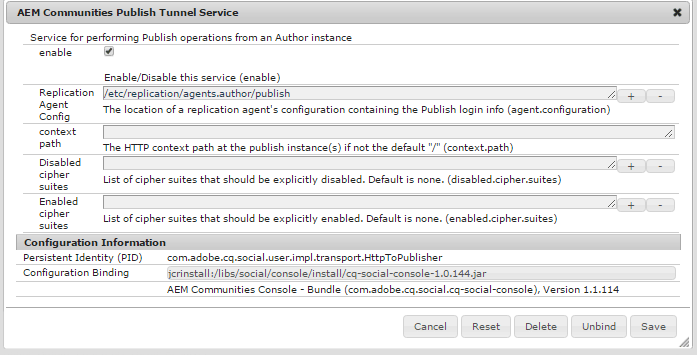

# Distribuzione di Communities {#deploying-communities}

## Prerequisiti {#prerequisites}

* [Piattaforma AEM 6.4](../../help/sites-deploying/deploy.md)

* Licenza AEM Communities

* Licenze opzionali per:

   * [Funzioni di Adobe Analytics for Communities](analytics.md)
   * [MongoDB per MSRP](msrp.md)
   * [Adobe Cloud per ASRP](asrp.md)

## Elenco di controllo dell&#39;installazione {#installation-checklist}

**Per la piattaforma  [AEM](../../help/sites-deploying/deploy.md#what-is-aem)**

* Installa gli ultimi [AEM 6.4 Aggiornamenti](#aem-updates)

* Se non utilizzi le porte predefinite (4502, 4503), [configura agenti di replica](#replication-agents-on-author)
* [replicare la chiave crittografica](#replicate-the-crypto-key)
* Se supporta la globalizzazione, [imposta la traduzione automatica](../../help/sites-administering/translation.md)

   (impostazione di esempio disponibile per lo sviluppo)

**Per la funzionalità  [Community](overview.md)**

* Se distribuisci un [file farm di pubblicazione](../../help/sites-deploying/recommended-deploys.md#tarmk-farm), [identifica l&#39;editore principale](#primary-publisher)

* [Attiva il servizio tunnel](#tunnel-service-on-author)
* [Abilita accesso social](social-login.md#adobe-granite-oauth-authentication-handler)
* [Configurare Adobe Analytics](analytics.md)
* Configurare un [servizio e-mail predefinito](email.md)
* Identifica la scelta per [memoria UGC condivisa](working-with-srp.md) (**SRP**)

   * Se MongoDB SRP [(MSRP)](msrp.md)

      * [Installare e configurare MongoDB](msrp.md#mongodb-configuration)
      * [Configura Solr](solr.md)
      * [Seleziona MSRP](srp-config.md)
   * Se il database relazionale SRP [(DSRP)](dsrp.md)

      * [Installare il driver JDBC per MySQL](#jdbc-driver-for-mysql)
      * [Installare e configurare MySQL per DSRP](dsrp-mysql.md)
      * [Configura Solr](solr.md)
      * [Seleziona DSRP](srp-config.md)
   * Se Adobe SRP [(ASRP)](asrp.md)

      * Collabora con il rappresentante del tuo account per il provisioning
      * [Seleziona ASRP](srp-config.md)
   * Se JCR SRP [(JSRP)](jsrp.md)

      * Non è un archivio UGC condiviso:

         * UGC non viene mai replicato
         * UGC visibile solo su AEM&#39;istanza o cluster in cui è stato inserito
      * Il valore predefinito è JSRP

   Per la **[funzione di abilitazione](overview.md#enablement-community)**

   * [Installare e configurare FFmpeg](ffmpeg.md)
   * [Installare il driver JDBC per MySQL](#jdbc-driver-for-mysql)
   * [Installare AEM Communities SCORM-Engine](#scorm-package)
   * [Installare e configurare MySQL per l&#39;abilitazione](mysql.md)


## Versioni più recenti {#latest-releases}

AEM 6.4 Communities GA include il pacchetto Community. Per informazioni sugli aggiornamenti di AEM 6.4 [Communities](/help/release-notes/release-notes.md#experience-manager-communities), consulta [AEM Note sulla versione 6.4](/help/release-notes/release-notes.md#release-information).

### Aggiornamenti di AEM 6.4 {#aem-updates}

A partire dalla AEM 6.3, gli aggiornamenti alle Community vengono forniti come parte di AEM Cumulative Fix Pack e Service Pack.

Per gli ultimi aggiornamenti a AEM 6.4, assicurati di controllare [Adobe Experience Manager 6.4 Cumulative Fix Pack e Service Pack](https://experienceleague.adobe.com/docs/experience-manager-release-information/aem-release-updates/aem-releases-updates.html?lang=it).

### Cronologia versioni {#version-history}

Come in AEM 6.4 e versioni successive, le funzioni e gli hotfix di AEM Communities fanno parte dei pacchetti correzioni cumulativi e dei Service Pack di AEM Communities. Non esistono pertanto pacchetti di funzioni separati.

### Driver JDBC per MySQL {#jdbc-driver-for-mysql}

Due funzionalità di Communities utilizzano un database MySQL:

* Per [abilitazione](enablement.md): registrazione di attività SCORM e studenti
* Per [DSRP](dsrp.md): archiviazione di contenuti generati dall’utente (UGC)

Il connettore MySQL deve essere ottenuto e installato separatamente.

Le misure necessarie sono:

1. Scarica l&#39;archivio ZIP da [https://dev.mysql.com/downloads/connector/j/](https://dev.mysql.com/downloads/connector/j/)

   * La versione deve essere >= 5.1.38

1. Estrai mysql-connector-java-&lt;version>-bin.jar (bundle) dall&#39;archivio

1. Usa la console web per installare e avviare il bundle:

   * Ad esempio, http://localhost:4502/system/console/bundles
   * Seleziona **`Install/Update`**
   * Sfoglia... per selezionare il bundle estratto dall&#39;archivio ZIP scaricato
   * Controlla che il driver JDBC di *Oracle Corporation per MySQLcom.mysql.jdbc* sia attivo e avvialo in caso contrario (o controlla i registri)

1. Se esegui l’installazione su un’implementazione esistente dopo la configurazione di JDBC, esegui un rebind JDBC al nuovo connettore, salvando nuovamente la configurazione JDBC dalla console Web:

   * Ad esempio, http://localhost:4502/system/console/configMgr
   * Individua la configurazione `Day Commons JDBC Connections Pool`
   * Seleziona per aprire
   * Seleziona `Save`

1. Ripeti i passaggi 3 e 4 su tutte le istanze di authoring e pubblicazione

Ulteriori informazioni sull&#39;installazione dei bundle sono disponibili nella pagina [Console web](/help/sites-deploying/web-console.md#bundles) .

#### Esempio: Bundle del connettore MySQL installato {#example-installed-mysql-connector-bundle}


### Pacchetto SCORM {#scorm-package}

SCORM (Shared Content Object Reference Model) è una raccolta di standard e specifiche per l&#39;e-learning. SCORM definisce anche come il contenuto può essere confezionato in un file ZIP trasferibile.

Il motore AEM Communities SCORM è necessario per la funzione [enablement](overview.md#enablement-community) . I pacchetti Scorm supportati nella versione AEM Communities 6.4 sono:

* **[cq -social- scorm -package, versione 1.2.11](https://www.adobeaemcloud.com/content/marketplace/marketplaceProxy.html?packagePath=/content/companies/public/adobe/packages/cq640/social/scorm/cq-social-scorm-pkg)**. Questo pacchetto SCORM è supportato da tutte le versioni di AEM 6.4 Communities.

* **[cq -social- scorm -package, versione 2.2.2](https://www.adobeaemcloud.com/content/marketplace/marketplaceProxy.html?packagePath=/content/companies/public/adobe/packages/cq640/social/scorm/cq-social-scorm-2017-pkg)** include il motore  [SCORM 2017.1](https://rusticisoftware.com/blog/scorm-engine-2017-released/) . Questo pacchetto SCORM è supportato a partire AEM versione 6.4.2.x Communities.

Per una nuova installazione del motore SCORM, utilizzare il pacchetto contenente [SCORM 2017.1](https://rusticisoftware.com/blog/scorm-engine-2017-released/) (che è [ cq -social-scorm -package, versione 2.2.2](https://www.adobeaemcloud.com/content/marketplace/marketplaceProxy.html?packagePath=/content/companies/public/adobe/packages/cq640/social/scorm/cq-social-scorm-2017-pkg)). In modo da poter utilizzare le risorse di apprendimento supportate da SCORM 2017.

<!--This section used to be an accordion until converted to straight Markdown. When accordions are enabled, revert-->

### Per installare un pacchetto SCORM per la prima volta

1. Installa il pacchetto **[cq-social-scorm-package, versione 2.2.2](https://www.adobeaemcloud.com/content/marketplace/marketplaceProxy.html?packagePath=/content/companies/public/adobe/packages/cq640/social/scorm/cq-social-scorm-2017-pkg).**
1. Scarica **`/libs/social/config/scorm/database_scormengine_data.sql`** dall&#39;istanza cq ed eseguilo in mysql server per creare uno schema scormEngineDB aggiornato.
1. Aggiungi `/content/communities/scorm/RecordResults` nella proprietà Percorsi esclusi nel filtro CSRF da `https://<hostname>;:<port>/system/console/configMgr` agli editori.

Le installazioni SCORM esistenti possono essere aggiornate a [**cq-social-scorm-package, versione 2.2.2**](https://www.adobeaemcloud.com/content/marketplace/marketplaceProxy.html?packagePath=/content/companies/public/adobe/packages/cq640/social/scorm/cq-social-scorm-2017-pkg) (che utilizza [SCORM 2017.1](https://rusticisoftware.com/blog/scorm-engine-2017-released/)), se il contenuto del corso creato richiede SCORM 2017.1.

>[!NOTE]
>
>L&#39;aggiornamento al pacchetto SCORM 2017.1 richiede la migrazione del database esistente (come spiegato più avanti).

<!--This section used to be an accordion until converted to straight Markdown. When accordions are enabled, revert-->

### Per aggiornare la versione del motore SCORM

1. Esegui il backup dello schema ScormEngineDB.
1. Installa il pacchetto **[cq-social-scorm-package, versione 2.2.2](https://www.adobeaemcloud.com/content/marketplace/marketplaceProxy.html?packagePath=/content/companies/public/adobe/packages/cq640/social/scorm/cq-social-scorm-2017-pkg).**
1. Scarica il pacchetto da `/libs/social/config/scorm/ScormEngine.zip` ed estrai lo stesso.
1. Vai alla cartella **Installer** della directory estratta.
1. Aggiorna `SystemDatabaseConnectionString` con il tuo `scorm db connection url` nel file **[!UICONTROL EngineInstall.xml]**.
1. Esegui lo strumento di aggiornamento dello schema mysql nella cartella Installer con il comando:

   `java -Dlogback.configurationFile=logback.xml -cp "lib/*" RusticiSoftware.ScormContentPlayer.Logic.Upgrade.ConsoleApp EngineInstall.xml`
1. Monitora il file `engine_upgrade.log` per qualsiasi tipo di errore e stato di aggiornamento dello schema.
1. Aggiungi `/content/communities/scorm/RecordResults` nella proprietà **[!UICONTROL Percorsi esclusi]** nel filtro CSRF da `https://<hostname>:<port>/system/console/configMgr` agli editori.

### Registrazione SCORM {#scorm-logging}

Come installato, tutte le attività di abilitazione vengono registrate in modo dettagliato nella console di sistema.

Se lo desideri, puoi impostare il livello di log su WARN per il pacchetto `RusticiSoftware.*`.

Per utilizzare i registri, vedere [Uso dei record di controllo e dei file di registro](../../help/sites-deploying/monitoring-and-maintaining.md#working-with-audit-records-and-log-files).

### MLS avanzate AEM {#aem-advanced-mls}

Per la raccolta SRP (MSRP o DSRP) per supportare la ricerca multilingue avanzata (MLS), sono necessari nuovi plug-in Solr oltre a uno schema personalizzato e una configurazione Solr. Tutti gli elementi richiesti vengono assemblati in un file zip scaricabile.

Il download avanzato di MLS (noto anche come &#39;phasetwo&#39;) è disponibile dall&#39;archivio Adobe:

* Fasetwo AEM-SOLR-MLS
Per ottenere il pacchetto MLS avanzato, vedi [AEM MLS avanzate](deploy-communities.md#aem-advanced-mls) nella sezione di distribuzione della documentazione.

   * Versione 1.2.40, 6 aprile 2016
   * Scarica AEM-SOLR-MLS-phasetwo-1.2.40.zip

Per informazioni dettagliate e sull&#39;installazione, visita [Configurazione solare](solr.md) per SRP.

### Informazioni sui collegamenti alla condivisione dei pacchetti {#about-links-to-package-share}

**Pacchetti visibili in Adobe AEM Cloud**

I collegamenti ai pacchetti in questa pagina non richiedono alcuna istanza in esecuzione di AEM in quanto devono condividere i pacchetti in `adobeaemcloud.com`. Mentre i pacchetti sono visualizzabili, il pulsante `Install`è per installare i pacchetti in un sito ospitato da Adobe. Se desideri eseguire l’installazione su un’istanza AEM locale, la selezione di `Install`genera un errore.

**Come eseguire l&#39;installazione su un&#39;istanza AEM locale**

Per installare i pacchetti visibili in `adobeaemcloud.com` in un&#39;istanza AEM locale, è necessario prima scaricare il pacchetto su un disco locale:

* Seleziona la scheda **[!UICONTROL Risorse]**
* Seleziona **[!UICONTROL scarica su disco]**

Nell&#39;istanza AEM locale, utilizza il gestore dei pacchetti (ad esempio [http://localhost:4502/crx/packmgr/](http://localhost:4502/crx/packmgr/)) per caricare nell&#39;archivio dei pacchetti AEM locale.

In alternativa, per accedere al pacchetto utilizzando la condivisione del pacchetto dall&#39;istanza AEM locale (ad esempio, [http://localhost:4502/crx/packageshare/](http://localhost:4502/crx/packageshare/)), il pulsante `Download`verrà scaricato nell&#39;archivio dei pacchetti dell&#39;istanza AEM locale.

Una volta nell&#39;archivio dei pacchetti dell&#39;istanza AEM locale, utilizza il gestore dei pacchetti per installare il pacchetto.

Per ulteriori informazioni, visita [Come lavorare con i pacchetti](../../help/sites-administering/package-manager.md#package-share).

## Implementazioni consigliate {#recommended-deployments}

In AEM Communities, un archivio comune viene utilizzato per memorizzare i contenuti generati dagli utenti (UGC) e viene spesso indicato come [provider di risorse di archiviazione (SRP)](working-with-srp.md). La distribuzione consigliata si basa sulla scelta di un’opzione SRP per lo store comune.

L&#39;archivio comune supporta la moderazione e l&#39;analisi degli UGC nell&#39;ambiente di pubblicazione, eliminando al contempo la necessità di [replica](sync.md) di UGC.

* [Archivio](working-with-srp.md) contenuti community: illustra le opzioni di storage SRP per le AEM community

* [Topologie](topologies.md) consigliate: discute la topologia da utilizzare in base al caso d’uso e alla scelta dell’SRP

## Aggiornamento {#upgrading}

Quando esegui l’aggiornamento alla piattaforma AEM 6.4 dalle versioni precedenti di AEM, è importante leggere Aggiornamento a AEM 6.4.

Oltre ad aggiornare la piattaforma, leggi [Aggiornamento ad AEM Communities 6.4](upgrade.md) per informazioni sulle modifiche apportate a Communities.

## Configurazioni {#configurations}

### Editore principale {#primary-publisher}

Quando la distribuzione scelta è una [farm di pubblicazione](topologies.md#tarmk-publish-farm), un&#39;istanza di pubblicazione AEM deve essere identificata come **`primary publisher`** per le attività che non devono verificarsi su tutte le istanze, ad esempio le funzionalità che si basano su **notifiche** o **Adobe Analytics**.

Per impostazione predefinita, la configurazione `AEM Communities Publisher Configuration` OSGi è configurata con la casella di controllo **`Primary Publisher`** selezionata, in modo che tutte le istanze di pubblicazione in una farm di pubblicazione si identifichino automaticamente come principali.

Pertanto, è necessario **modificare la configurazione su tutte le istanze di pubblicazione secondarie** per deselezionare la casella di controllo **`Primary Publisher`**.


Per tutte le altre istanze di pubblicazione (secondarie) in una farm di pubblicazione:

* Accesso con privilegi di amministratore
* Accedi alla [console Web](../../help/sites-deploying/configuring-osgi.md)

   * Ad esempio, [http://localhost:4503/system/console/configMgr](http://localhost:4503/system/console/configMgr)

* Individua il `AEM Communities Publisher Configuration`
* Seleziona l’icona di modifica
* Deseleziona la casella **[!UICONTROL Editore principale]**
* Seleziona **[!UICONTROL Salva]**

### Agenti di replica sull’autore {#replication-agents-on-author}

La replica viene utilizzata per i contenuti del sito creati nell&#39;ambiente di pubblicazione, ad esempio i gruppi di community, nonché per la gestione di membri e gruppi di membri dall&#39;ambiente di authoring tramite il [servizio tunnel](#tunnel-service-on-author).

Per l&#39;editore principale, assicurati che [Replication Agent Config](../../help/sites-deploying/replication.md) identifichi correttamente il server di pubblicazione e l&#39;utente autorizzato. L&#39;utente autorizzato predefinito `admin,` dispone già delle autorizzazioni appropriate (è membro di `Communities Administrators`).

Affinché un altro utente disponga delle autorizzazioni appropriate, deve essere aggiunto come membro al gruppo di utenti `administrators` (anche un membro di `Communities Administrators`).

Nell’ambiente di authoring sono disponibili due agenti di replica che richiedono la configurazione corretta del trasporto.

* Accedere alla console Replica sull’autore

   * Dalla navigazione globale: **[!UICONTROL Strumenti > Implementazione > Replica > Agenti su autore]**

* Seguire la stessa procedura per entrambi gli agenti:

   * **Agente predefinito (pubblicazione)**
   * **Agente di replica inversa (pubblicazione inversa)**

      1. Seleziona l&#39;agente
      1. Seleziona **[!UICONTROL modifica]**
      1. Seleziona la scheda **[!UICONTROL Trasporto]**
      1. Se non è presente la porta `4503`, modificare l&#39; **[!UICONTROL URI]** per specificare la porta corretta
      1. Se non l&#39;utente `admin`, modifica **[!UICONTROL Utente]** e **[!UICONTROL Password]** per specificare un membro del gruppo di utenti `administrators`

Le immagini seguenti mostrano i risultati della modifica della porta da 4503 a 6103:

#### Agente predefinito (pubblicazione) {#default-agent-publish}


#### Agente di replica inversa (pubblicazione inversa) {#reverse-replication-agent-publish-reverse}


### Servizio tunnel su Autore {#tunnel-service-on-author}

Quando si utilizza l&#39;ambiente di authoring per [creare siti](sites-console.md), [modificare proprietà del sito](sites-console.md#modifying-site-properties) o [gestire membri della community](members.md), è necessario accedere ai membri (utenti) registrati nell&#39;ambiente di pubblicazione, non agli utenti registrati sull&#39;autore.

Il servizio tunnel fornisce questo accesso utilizzando l&#39;agente di replica sull&#39;autore.

Per attivare il servizio tunnel:

* Su **autore**
* Accesso con privilegi amministrativi
* Se l&#39;editore non è localhost:4503 o l&#39;utente del trasporto non è `admin`,

   Quindi [configura l&#39;agente di replica](#replication-agents-on-author)

* Accedi alla [Console web](../../help/sites-deploying/configuring-osgi.md)

   * Ad esempio, [http://localhost:4502/system/console/configMgr](http://localhost:4502/system/console/configMgr)

* Individua il `AEM Communities Publish Tunnel Service`
* Seleziona l’icona di modifica
* Seleziona la casella **[!UICONTROL enable]**
* Seleziona **[!UICONTROL Salva]**



### Replicare la chiave Crypto {#replicate-the-crypto-key}

Esistono due funzioni di AEM Communities che richiedono che tutte le istanze AEM server utilizzino le stesse chiavi di crittografia. Si tratta di [Analytics](analytics.md) e [ASRP](asrp.md).

A partire da AEM 6.3, il materiale chiave viene memorizzato nel file system e non più nel repository.

Per copiare il materiale chiave dall’autore a tutte le altre istanze, è necessario:

* Accedi all&#39;istanza AEM, in genere un&#39;istanza dell&#39;autore, che contiene il materiale chiave da copiare

   * Individua il bundle `com.adobe.granite.crypto.file` nel file system locale

      Esempio,

      * `<author-aem-install-dir>/crx-quickstart/launchpad/felix/bundle21`
      * Il file `bundle.info` identificherà il bundle
   * Passa alla cartella dati

      Esempio,

      * `<author-aem-install-dir>/crx-quickstart/launchpad/felix/bundle21/data`
   * Copia i file hmac e i file dei nodi principali


* Per ogni istanza AEM target

   * Passa alla cartella dati

      Esempio,

      * `<publish-aem-install-dir>/crx-quickstart/launchpad/felix/bundle21/data`
   * Incolla i 2 file precedentemente copiati
   * È necessario [aggiornare il bundle Granite Crypto](#refresh-the-granite-crypto-bundle) se l&#39;istanza di AEM di destinazione è attualmente in esecuzione


>[!CAUTION]
>
>Se è già stata configurata un’altra funzione di sicurezza basata sulle chiavi crittografiche, la replica delle chiavi crittografiche potrebbe danneggiare la configurazione. Per assistenza, [contatta l&#39;assistenza clienti](https://helpx.adobe.com/it/marketing-cloud/contact-support.html).

#### Replica dell’archivio {#repository-replication}

È possibile conservare il materiale chiave memorizzato nell&#39;archivio, come nel caso di AEM 6.2 e versioni precedenti, specificando la seguente proprietà di sistema al primo avvio di ogni istanza AEM (che crea l&#39;archivio iniziale):

* `-Dcom.adobe.granite.crypto.file.disable=true`

>[!NOTE]
>
>È importante verificare che l&#39; [agente di replica su author](#replication-agents-on-author) sia configurato correttamente.

Con il materiale chiave memorizzato nell’archivio, il modo per replicare la chiave crittografica dall’autore ad altre istanze è il seguente:

Utilizzando [CRXDE Lite](../../help/sites-developing/developing-with-crxde-lite.md):

* vai a [https://&lt;server>:&lt;port>/crx/de](http://localhost:4502/crx/de)
* select `/etc/key`
* apri la scheda `Replication`
* seleziona `Replicate`

* [aggiorna il bundle Granite Crypto](#refresh-the-granite-crypto-bundle)


#### Aggiorna il bundle Crypto Granite {#refresh-the-granite-crypto-bundle}

* Su ogni istanza di pubblicazione, accedi alla [Console web](../../help/sites-deploying/configuring-osgi.md)

   * Ad esempio, [https://&lt;server>:&lt;port>/system/console/bundles](http://localhost:4503/system/console/bundles)

* Individua il bundle `Adobe Granite Crypto Support` (com.adobe.granite.crypto)
* Seleziona **[!UICONTROL Aggiorna]**


* Dopo un momento, viene visualizzata una finestra di dialogo **Success**:

   `Operation completed successfully.`

### Server HTTP Apache {#apache-http-server}

Se utilizzi il server HTTP Apache, assicurati di utilizzare il nome server corretto per tutte le voci pertinenti.

In particolare, fai attenzione a utilizzare il nome server corretto, non `localhost`, nel `RedirectMatch`.

#### campione httpd.conf {#httpd-conf-sample}

```shell
<IfModule alias_module>
     # XAMPP does not have a favicon; this prevents any 404 errors which may arise.
     Redirect 404 /favicon.ico
     <Location /favicon.ico>
         ErrorDocument 404 "No favicon"
     </Location>

    # Return from "Sign Out" generates response header directing you to "/", generating a 404 error
    # The RedirectMatch resolves it correctly when modified for the target Community Site:
    RedirectMatch ^/$ https://[server name]/content/sites/engage/en.html
 ...
 </IfModule>
```

### Dispatcher {#dispatcher}

Se utilizzi un’istanza di Dispatcher, consulta:

* Documentazione AEM [Dispatcher](https://helpx.adobe.com/experience-manager/dispatcher/using/dispatcher.html)
* [Installazione di Dispatcher](https://helpx.adobe.com/experience-manager/dispatcher/using/dispatcher-install.html)
* [Configurazione di Dispatcher per Communities](dispatcher.md)
* [Problemi noti](troubleshooting.md#dispatcher-refetch-fails)

## Documentazione di Communities correlata {#related-communities-documentation}

* Per informazioni su come creare un sito community, configurare modelli di sito community, moderare i contenuti della community, gestire i membri e configurare i messaggi, visita [Amministrazione siti community](administer-landing.md) .

* Visita [Sviluppo di community](communities.md) per informazioni sul framework dei componenti social (SCF) e sulla personalizzazione dei componenti e delle funzionalità di Communities.

* Per informazioni su come eseguire l’authoring con e configurare i componenti di Communities, visita [Authoring Communities Components](author-communities.md) .
