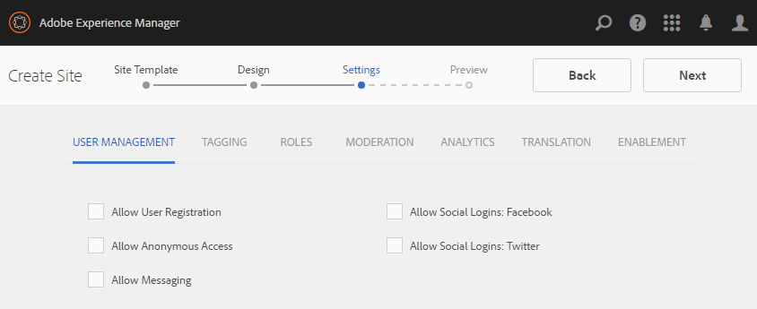

# Creare un nuovo sito community per l’abilitazione {#author-a-new-community-site-for-enablement}

>[!CAUTION]
>
>AEM 6.4 ha raggiunto la fine del supporto esteso e questa documentazione non viene più aggiornata. Per maggiori dettagli, consulta la nostra [periodi di assistenza tecnica](https://helpx.adobe.com/it/support/programs/eol-matrix.html). Trova le versioni supportate [qui](https://experienceleague.adobe.com/docs/).

## Crea sito community {#create-community-site}

[Creazione di siti community](sites-console.md) utilizza una procedura guidata che ti guida attraverso i passaggi necessari per creare un sito community. È possibile passare al `Next`passo o `Back`al passaggio precedente prima di impegnare il sito nel passaggio finale.

Per iniziare a creare un nuovo sito community:

Utilizzo della [istanza autore](Http://localhost:4502/)

* Accesso con privilegi di amministratore
* Passa a **[!UICONTROL Community > Sites]**

* Seleziona **[!UICONTROL Crea]**

### Passaggio 1: Modello del sito {#step-site-template}

Sulla **Modello del sito** , inserisci un titolo, una descrizione, il nome dell&#39;URL e seleziona un modello di sito community, ad esempio:

* **Titolo del sito community**: `Enablement Tutorial`

* **Descrizione del sito community**: `A site for enabling the community to learn.`

* **Radice sito community**: (lasciare vuoto per la radice predefinita `/content/sites`)

* **Configurazioni cloud**: (lascia vuoto se non sono specificate configurazioni cloud) fornisci il percorso delle configurazioni cloud specificate.
* **Lingua di base del sito community**: (lasciare intatti per una sola lingua: Inglese) usa il menu a discesa per sceglierne uno *o più* lingue di base delle lingue disponibili: tedesco, italiano, francese, giapponese, spagnolo, portoghese (Brasile), cinese (tradizionale) e cinese (semplificato). Verrà creato un sito community per ogni lingua aggiunta, che si troverà all’interno della stessa cartella del sito seguendo le best practice descritte in [Traduzione di contenuti per siti multilingue](../../help/sites-administering/translation.md). La pagina principale di ciascun sito conterrà una pagina figlia denominata dal codice della lingua di una delle lingue selezionate, ad esempio &quot;en&quot; per l’inglese o &quot;fr&quot; per il francese.

* **[!UICONTROL Nome sito community]**: `enable`

   * l&#39;URL iniziale verrà visualizzato sotto il nome del sito community
   * per un URL valido, aggiungi un codice della lingua di base + &quot;.html&quot;

      *per esempio*, http://localhost:4502/content/sites/ `enable/en.html`

* **[!UICONTROL Modello del sito di riferimento]**: scegli `Reference Structured Learning Site Template`

Seleziona **[!UICONTROL Avanti]**

### Passaggio 2: Progettazione {#step-design}

La fase Progettazione è presentata in due sezioni per selezionare il tema e il banner di branding:

#### TEMA DEL SITO COMUNITARIO {#community-site-theme}

Selezionare lo stile desiderato da applicare al modello. Se selezionato, il tema verrà sovrapposto con un segno di spunta.

#### MARCATURA DEL SITO COMMUNITY {#community-site-branding}

(Facoltativo) Carica un&#39;immagine banner da visualizzare nelle pagine del sito. Il banner viene fissato al bordo sinistro del browser, tra l&#39;intestazione del sito community e il menu (collegamenti di navigazione). L’altezza del banner viene ritagliata a 120 pixel. Il banner non viene ridimensionato in modo da adattarsi alla larghezza del browser e all’altezza di 120 pixel.

 

Seleziona **[!UICONTROL Avanti]**.

### Passaggio 3: Impostazioni {#step-settings}

Nel passaggio Impostazioni, prima di selezionare `Next`, noterai che esistono sette sezioni che forniscono accesso alle configurazioni che coinvolgono gestione utenti, assegnazione tag, ruoli, moderazione, analisi, traduzione e abilitazione.

#### GESTIONE UTENTE {#user-management}

Si consiglia di: [comunità di abilitazione](overview.md#enablement-community) sia privato.

Un sito community è privato quando ai visitatori anonimi viene negato l’accesso, non può registrarsi autonomamente e non può utilizzare l’accesso social.

Verificare che la maggior parte delle caselle di controllo non sia selezionata [Gestione utente](sites-console.md#user-management):

* NON consentire ai visitatori del sito di registrarsi autonomamente
* NON consentire ai visitatori anonimi del sito di visualizzare il sito
* Facoltativo se consentire o meno la messaggistica tra i membri della community
* NON consentire l&#39;accesso con Facebook
* NON consentire l&#39;accesso con Twitter

#### TAG {#tagging}

I tag che possono essere applicati al contenuto della community vengono controllati selezionando AEM namespace definiti in precedenza tramite [Console assegnazione tag](../../help/sites-administering/tags.md#tagging-console) (ad esempio [Spazio dei nomi tutorial](enablement-setup.md#create-tutorial-tags)).

Inoltre, selezionando Tag Namespace per il sito community , la selezione presentata viene limitata quando definisci cataloghi e risorse di abilitazione. Vedi [Risorse di abilitazione assegnazione tag](tag-resources.md) per informazioni importanti.

La ricerca di spazi dei nomi è semplice tramite la ricerca tipo-avanti. Ad esempio:

* Digitare &quot;tut&quot;
* Seleziona `Tutorial`

### RUOLI {#roles}

[Ruoli dei membri della community](users.md) sono assegnate tramite le impostazioni nella sezione Ruoli .

Per consentire a un membro della comunità (o a un gruppo di membri) di utilizzare il sito come gestore della community, utilizza la ricerca tipo-avanti e seleziona il nome del membro o del gruppo dalle opzioni nel menu a discesa.

Ad esempio:

* Digitare &quot;q&quot;
* Seleziona [Quinn Harper](enablement-setup.md#publishcreateenablementmembers)

>[!NOTE]
>
>[Servizio tunnel](deploy-communities.md#tunnel-service-on-author) consente la selezione di membri e gruppi esistenti solo nell’ambiente di pubblicazione.

#### MODERAZIONE {#moderation}

Accettare le impostazioni globali predefinite per [moderatore](sites-console.md#moderation) contenuto generato dall’utente (UGC).

#### ANALYTICS {#analytics}

Dal menu a discesa, seleziona il framework del servizio cloud di Analytics configurato per questo sito community.

La selezione vista nello screenshot, `Communities`, è l&#39;esempio di framework dal [documentazione sulla configurazione.](analytics.md#aem-analytics-framework-configuration)

#### TRADUZIONE {#translation}

La [Impostazioni di traduzione](sites-console.md#translation) specificare se l&#39;UGC può essere tradotto o meno e in quale lingua, in tal caso.

* Controlla **[!UICONTROL Consenti traduzione automatica]**
* Usa le impostazioni predefinite

#### ABILITARE {#enablement}

Per una comunità di abilitazione, è necessario identificare uno o più manager di abilitazione della community.

* **[!UICONTROL Manager di abilitazione]**
(obbligatorio) Membri 
`Community Enablement Managers` sono disponibili per la gestione del sito community.

   * Tipo &quot;s&quot;
   * Seleziona `Sirius Nilson`

* **[!UICONTROL ID organizzazione Marketing Cloud]**
(Facoltativo) L&#39;ID per un account Adobe Analytics necessario quando include [Video Heartbeat Analytics](analytics.md#video-heartbeat-analytics) nel rapporto di abilitazione.

Seleziona **[!UICONTROL Avanti]**.

### Passaggio 4: Crea sito community {#step-create-community-site}

Seleziona **[!UICONTROL Crea]**.

Al termine del processo, la cartella del nuovo sito viene visualizzata nella console Community - Sites .

### Pubblica il nuovo sito della community {#publish-the-new-community-site}

Il sito creato deve essere gestito dalla console Communities - Sites , la stessa console da cui è possibile creare nuovi siti.

Dopo aver selezionato la cartella del sito community, passa il puntatore sull’icona del sito in modo che vengano visualizzate quattro icone di azione:

Quando si seleziona l’icona dei puntini di sospensione (icona Altre azioni), vengono visualizzate le opzioni Esporta sito ed Elimina sito .

Da sinistra a destra sono:

* **Apri sito**
Seleziona l’icona a forma di matita per aprire il sito della community in modalità di modifica dell’autore, per aggiungere e/o configurare i componenti della pagina

* **Modifica sito**
Seleziona l’icona delle proprietà per aprire il sito community e modificare le proprietà, ad esempio il titolo o il tema

* **Pubblica sito**
Seleziona l&#39;icona del mondo per pubblicare il sito della community (su localhost:4503 per impostazione predefinita)

* **Esporta sito**
Seleziona l&#39;icona di esportazione per creare un pacchetto del sito della community memorizzato entrambi in [gestore di pacchetti](../../help/sites-administering/package-manager.md) e scaricato.

   UGC non è incluso nel pacchetto del sito.

* **Elimina sito**
Per eliminare il sito community, seleziona l’icona Elimina sito visualizzata quando si passa il mouse sul sito nella console Sito di Communities. Questa azione rimuove tutti gli elementi associati al sito, come UGC, gruppi di utenti, risorse e record di database.

#### Seleziona Pubblica {#select-publish}

Seleziona l&#39;icona del mondo per pubblicare il sito della community.

Ci sarà un&#39;indicazione che il sito è stato pubblicato.

## Utenti e gruppi di utenti della community {#community-users-user-groups}

### Nuovi gruppi di utenti della community {#notice-new-community-user-groups}

Insieme al nuovo sito della community, vengono creati nuovi gruppi di utenti con le autorizzazioni appropriate impostate per diverse funzioni amministrative. Per maggiori dettagli, visita [Gruppi di utenti per siti della community](users.md#usergroupsforcommunitysites).

Per questo nuovo sito della community, dato il nome del sito &quot;enable&quot; nel passaggio 1, i nuovi gruppi di utenti esistenti nell’ambiente di pubblicazione possono essere visualizzati dal [Console Membri e gruppi delle community](members.md#groups-console):

### Assegna membri a gruppo di membri di abilitazione community {#assign-members-to-community-enable-members-group}

Su autore, con il servizio tunnel abilitato, è possibile assegnare il [utenti creati durante la configurazione iniziale](enablement-setup.md#publishcreateenablementmembers) al gruppo dei membri della community per il sito della community appena creato.

Utilizzando la console Gruppi della community, i membri possono essere aggiunti singolarmente o tramite l’appartenenza a un gruppo.

In questo esempio, il gruppo `Community Ski Class` viene aggiunto come membro del gruppo `Community Enable Members` nonché membro `Quinn Harper`.

* Passa a **[!UICONTROL Community > Gruppi]** console
* Seleziona **[!UICONTROL Community Abilita membri]** gruppo
* Invio `ski` nel **[!UICONTROL Aggiungi membri al gruppo]** casella di ricerca
* Seleziona **[!UICONTROL Classe sciistica comunitaria]** (gruppo di studenti)
* Invio `quinn` nella casella di ricerca
* Seleziona **[!UICONTROL Quinn Harper]** (contatto risorse di abilitazione)

* Seleziona **[!UICONTROL Salva]**

## Configurazioni su pubblicazione {#configurations-on-publish}

### http://localhost:4503/content/sites/enable/en.html {#http-localhost-content-sites-enable-en-html}

### Configurazione per errore di autenticazione {#configure-for-authentication-error}

Una volta che un sito è stato configurato e inviato per la pubblicazione, [configurare la mappatura degli accessi](sites-console.md#configure-for-authentication-error) ( `Adobe Granite Login Selector Authentication Handler`) sull’istanza di pubblicazione. Il vantaggio è che quando le credenziali di accesso non vengono inserite correttamente, l&#39;errore di autenticazione rimostrerà la pagina di accesso del sito della community con un messaggio di errore.

Aggiungi un `Login Page Mapping` come

* /content/sites/enable/it/signin:/content/sites/enable/it

### (Facoltativo) Modificare la home page predefinita {#optional-change-the-default-home-page}

Quando si lavora con il sito di pubblicazione a scopo dimostrativo, potrebbe essere utile modificare la home page predefinita nel nuovo sito.

A tal fine è necessario utilizzare [CRX|DE](http://localhost:4503/crx/de) Lite per modificare il [mappatura delle risorse](../../help/sites-deploying/resource-mapping.md) tabella sulla pubblicazione.

Introduzione

1. Al momento della pubblicazione, accedi a CRXDE e accedi con privilegi di amministratore

   * Ad esempio, cerca [http://localhost:4503/crx/de](http://localhost:4503/crx/de) e accedi con `admin/admin`

1. Nel browser del progetto, espandi `/etc/map`
1. Seleziona la `http` nodo

   * Seleziona **[!UICONTROL Crea nodo]**

      * **Nome** localhost.4503

         (Do *not* use `:`)

      * **Tipo** [sling:Mapping](https://sling.apache.org/documentation/the-sling-engine/mappings-for-resource-resolution.html)

1. Con la nuova creazione `localhost.4503` nodo selezionato

   * Aggiungi proprietà

      * **Nome** sling:match
      * **Tipo** Stringa
      * **Valore** localhost.4503/\$

         (Deve terminare con il carattere &#39;$&#39;)
   * Aggiungi proprietà

      * **Nome** sling:internalRedirect
      * **Tipo** Stringa
      * **Valore** /content/sites/enable/en.html

1. Seleziona **[!UICONTROL Salva tutto]**
1. (facoltativo) Elimina la cronologia di navigazione
1. Sfoglia http://localhost:4503/

   * Arriva a http://localhost:4503/content/sites/enable/en.html

>[!NOTE]
>
>Per disattivare, è sufficiente anteporre al comando `sling:match` valore della proprietà con un valore &#39;x&#39; - `xlocalhost.4503/$` - e **[!UICONTROL Salva tutto]**.

#### Risoluzione dei problemi: Errore durante il salvataggio della mappa {#troubleshooting-error-saving-map}

Se non riesci a salvare le modifiche, assicurati che il nome del nodo sia `localhost.4503`, con un separatore &quot;punto&quot; e non `localhost:4503` con un separatore a due punti, come `localhost`non è un prefisso dello spazio dei nomi valido.

#### Risoluzione dei problemi: Impossibile reindirizzare {#troubleshooting-fail-to-redirect}

Il **$**&quot; alla fine dell&#39;espressione regolare `sling:match`la stringa è cruciale, in modo che solo `http://localhost:4503/` è mappato, altrimenti il valore di reindirizzamento viene preceduto da qualsiasi percorso che potrebbe esistere dopo server:port nell&#39;URL. Pertanto, quando AEM tenta di reindirizzare alla pagina di accesso, non riesce.

## Modifica del sito della community {#modifying-the-community-site}

Dopo la creazione iniziale del sito, gli autori possono utilizzare il [Icona Apri sito](sites-console.md#authoring-site-content) per eseguire attività di authoring standard AEM.

Inoltre, gli amministratori possono utilizzare [Icona Modifica sito](sites-console.md#modifying-site-properties) per modificare le proprietà del sito, ad esempio il titolo.

Dopo qualsiasi modifica, ricorda di **Salva** e **Pubblica** il sito.

>[!NOTE]
>
>Se non hai familiarità con AEM, consulta la documentazione su [trattamento di base](../../help/sites-authoring/basic-handling.md) e [guida rapida all’authoring delle pagine](../../help/sites-authoring/qg-page-authoring.md).

### Aggiungere un catalogo {#add-a-catalog}

Il modello di sito community scelto per questo sito community deve contenere la funzione di catalogo.

In caso contrario, è possibile aggiungere facilmente la funzione di catalogo. In questo modo gli altri membri della community, non assegnati a risorse di abilitazione o a un percorso di apprendimento, potranno selezionare risorse di abilitazione da un catalogo.

Se la struttura del sito contiene già la funzione catalogo, è possibile modificare il relativo Titolo.

Per modificare la struttura del sito, passa alla **[!UICONTROL Community, Sites]** aprire la console `enable` e seleziona la **Modifica sito** per accedere alle proprietà di `Enablement Tutorial`.

Seleziona il pannello STRUTTURA per aggiungere un catalogo o modificare un catalogo esistente:

* **Titolo**: `Ski Catalog`

* **URL**: `catalog`

* **Seleziona tutti i namespace**: lascia come predefinito.
* Seleziona **[!UICONTROL Salva]**

Utilizzare l&#39;icona Posizione per spostare la funzione Catalogo nella seconda posizione, dopo Assegnazioni.

Seleziona **[!UICONTROL Salva]** nell&#39;angolo in alto a destra per salvare le modifiche al sito community.

Quindi ri-**Pubblica** il sito.
