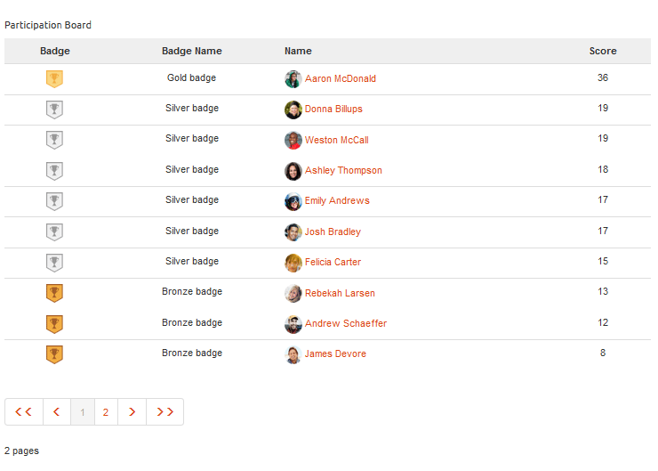

# Funzionalità della classifica {#leaderboard-feature}

## Introduzione {#introduction}

Il `Leaderboard` componente fornisce la capacità di ottenere un&#39;idea di come i membri interagiscono all&#39;interno della comunità, in base ai punti guadagnati (punteggio di base) o alla loro esperienza (punteggio avanzato).

Prima di includere il componente della classifica in una pagina, è necessario configurare [Communities Scoring and Badges](implementing-scoring.md).

Questa sezione della documentazione descrive

* Aggiunta del `Leaderboard` componente a un sito [community](overview.md#community-sites)

* Impostazioni di configurazione per il `Leaderboard` componente

## Adding a Leaderboard to a Page {#adding-a-leaderboard-to-a-page}

Per aggiungere un `Leaderboard` componente a una pagina in modalità di creazione, individuare il componente

* `Communities / Leaderboard`

e trascinarlo nella posizione desiderata su una pagina.

Per le informazioni necessarie, visita [Community Components Basics](basics.md).

La prima volta che il componente viene inserito in una pagina di un sito community, viene visualizzato così:

## Configurazione della classifica {#configuring-leaderboard}

Selezionate il `Leaderboard` componente inserito a cui accedere e selezionate l’ `Configure` icona che apre la finestra di dialogo di modifica.

 

### scheda Impostazioni {#settings-tab}

Nella scheda **[!UICONTROL Impostazioni]** , specificate le informazioni relative al membro da visualizzare:

* **[!UICONTROL Nome]** visualizzato Un nome descrittivo da visualizzare per la bacheca, che riflette le regole selezionate per la visualizzazione di simboli e punteggi.

   Il valore predefinito è `Leaderboard`, se non è stato immesso nulla.

* **[!UICONTROL Badge]** Se questa opzione è selezionata, nella classifica è inclusa una colonna per le icone dei simboli.

   Il valore predefinito è deselezionato.

* **[!UICONTROL Nome]** contrassegno Se questa opzione è selezionata, nella classifica viene inclusa una colonna per il nome del contrassegno.

   Il valore predefinito è deselezionato.

* **[!UICONTROL Usa avatar]** Se questa opzione è selezionata, l&#39;immagine avatar del membro viene inclusa nella classifica, accanto al collegamento del nome al profilo membro.

   Il valore predefinito è deselezionato.

### Scheda Regole {#rules-tab}

Nella scheda **[!UICONTROL Regole]** , il sito della community e le relative regole di valutazione e contrassegno

* **[!UICONTROL Posizione]** regola (richiesta) Posizione in cui è configurata la regola Punteggio/Badging.

* **[!UICONTROL Regola]** punteggio (obbligatoria) Regola specifica che genera i punteggi da visualizzare.

* **[!UICONTROL Regola]** di Badging (obbligatoria) Regola specifica che genera il contrassegno da visualizzare.

* **[!UICONTROL Limite]** di visualizzazione Numero di membri da visualizzare per pagina.

   Il valore predefinito è 10.

## Esempio: Guida dei partecipanti {#example-participants-leaderboard}

Questo rapporto della classifica deriva dall&#39;applicazione di regole di punteggio di base.

Configurazione del componente della classifica:

* **[!UICONTROL scheda Impostazioni]** :

   * Nome visualizzato = `Participation Board`
   * `checked`:

      * Badge
      * Nome badge
      * Usa avatar

* **[!UICONTROL Scheda Regole]** :

   * Percorso regola = `/content/sites/communities/jcr:content`
   * Regola punteggio = `/etc/community/scoring/rules/forums-scoring`
   * Regola assegnazione badge = `/etc/community/badging/rules/reference-badging`
   * Limite di visualizzazione = `10`

## Esempio: Leaderboard di esperti {#example-experts-leaderboard}

Questo rapporto della classifica deriva dall&#39;applicazione di regole di punteggio avanzate.

Configurazione del componente della classifica:

* **[!UICONTROL scheda Impostazioni]** :

   * Nome visualizzato = `Expertise Board`
   * `checked`:

      * Badge
      * Usa avatar

* **[!UICONTROL Scheda Regole]** :

   * Percorso regola = `/content/sites/communities/jcr:content`
   * Regola punteggio = `/etc/community/scoring/rules/adv-forums-scoring`
   * Regola assegnazione badge = `/etc/community/badging/rules/adv-forums-badging`
   * Limite di visualizzazione = `10`

## Informazioni aggiuntive {#additional-information}

Ulteriori informazioni sono disponibili nella pagina [Leaderboard Essentials](leaderboard.md) per gli sviluppatori.

Le istruzioni per la creazione di regole sono fornite nella pagina [Communities Scoring and Badges](implementing-scoring.md) (Punteggio e Badgecommunity) per gli amministratori.
