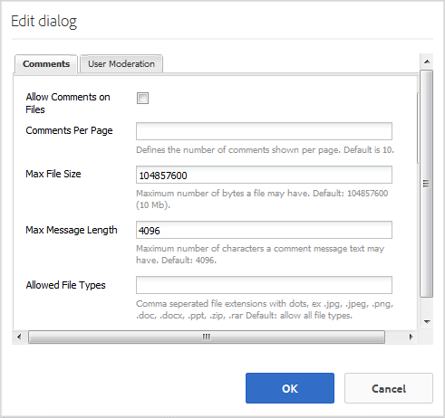

# Funzione Libreria file {#file-library-feature}

## Introduzione {#introduction}

La funzione di libreria dei file consente ai visitatori del sito che hanno effettuato l&#39;accesso (membri della community) di caricare, gestire e scaricare i file all&#39;interno del sito della community.

Questa sezione della documentazione descrive

* Aggiunta della funzione di libreria file a un sito AEM
* Impostazioni di configurazione per il `File Library` componente

## Aggiunta di una libreria di file a una pagina {#adding-a-file-library-to-a-page}

Per aggiungere un `File Library` componente a una pagina in modalità di creazione, individuare il componente

* `Communities / File Library`

e trascinarlo nella posizione desiderata su una pagina.

Per le informazioni necessarie, visita [Community Components Basics](basics.md).

Quando sono incluse le librerie [lato client](essentials-file-library.md#essentials-for-client-side) richieste, verrà visualizzato il `File Library` componente:

## Configurazione della libreria dei file {#configuring-file-library}

Selezionate il `File Library` componente inserito a cui accedere e selezionate l’ `Configure` icona che apre la finestra di dialogo di modifica.

 

### Scheda Commenti {#comments-tab}

Nella scheda **[!UICONTROL Commenti]** , specificate se e come vengono visualizzati i commenti per i file caricati:

* **[!UICONTROL Consenti commenti sui file]** Se questa opzione è selezionata, consenti commenti sui file caricati. Il valore predefinito è deselezionato.

* **[!UICONTROL Commenti per pagina]** Limita il numero di commenti visualizzati per pagina e il numero di risposte visualizzate. Default is **10**.

* **[!UICONTROL Dimensione]** massima file Questo valore limita le dimensioni del file caricato. Il limite predefinito è 104857600 (10 Mb).

* **[!UICONTROL Lunghezza]** massima messaggio Numero massimo di caratteri che possono essere immessi nella casella di testo. Il valore predefinito è 4096 caratteri.

* **[!UICONTROL Tipi]** di file consentiti Elenco separato da virgole di estensioni di file con il separatore &quot;punto&quot;. Ad esempio: .jpg, .jpeg, .png, .doc, .docx, .pdf. Se vengono specificati dei tipi di file, quelli non specificati non saranno consentiti. Il valore predefinito non è specificato, pertanto tutti i tipi di file sono consentiti.

* **[!UICONTROL Editor]** Rich Text Se questa opzione è selezionata, è possibile inserire commenti con tag. Il valore predefinito è deselezionato.

* **[!UICONTROL Elimina commenti]** Se questa opzione è selezionata, gli utenti possono eliminare i propri commenti. Il valore predefinito è selezionato.

* **[!UICONTROL Consenti tag]** Se questa opzione è selezionata, verrà abilitata la possibilità di aggiungere al file un tag. Il valore predefinito è deselezionato.

* **[!UICONTROL Spazi dei nomi consentiti]** Se l’opzione Consenti tag è selezionata, i tag disponibili saranno limitati agli spazi dei nomi selezionati. Se non ne è selezionata alcuna, sono tutti consentiti. Il valore predefinito è tutti gli spazi dei nomi.

* **[!UICONTROL Limite]** suggerimenti Se l’opzione Consenti tag è selezionata, questa impostazione limita il numero di tag suggeriti da visualizzare. Se è impostato su -1, non è previsto alcun limite. Il valore predefinito è -1.

* **[!UICONTROL Consenti votazione]** Se questa opzione è selezionata, la possibilità di votare per un file verrà abilitata. Il valore predefinito è deselezionato.

* **[!UICONTROL Consenti]** se questa opzione è selezionata, includete la seguente funzione per gli articoli di blog, che consente ai membri di ricevere [notifiche](notifications.md) per i nuovi post. Il valore predefinito è deselezionato.

* **[!UICONTROL Consenti risposte]** filettate se questa opzione è selezionata, consenti risposte ai commenti inviati. Il valore predefinito è deselezionato.

### Scheda Moderazione utente {#user-moderation-tab}

Nella scheda Moderazione **** utente configurate la moderazione dei commenti, se i commenti sono consentiti:

* **[!UICONTROL Pre-moderazione]** Se questa opzione è selezionata, i commenti devono essere approvati prima che vengano visualizzati su un sito di pubblicazione. Il valore predefinito è deselezionato.

* **[!UICONTROL Elimina commenti]** Se questa opzione è selezionata, il visitatore che ha pubblicato il commento può eliminarlo. Il valore predefinito è selezionato.

* **[!UICONTROL Rifiuta commenti]** Se questa opzione è selezionata, consente ai moderatori membri attendibili di negare i commenti. Il valore predefinito è deselezionato.

* **[!UICONTROL Chiudi/Riapri commenti]** Se questa opzione è selezionata, consente ai moderatori membri attendibili di chiudere e riaprire i commenti. Il valore predefinito è deselezionato.

* **[!UICONTROL Contrassegna commenti]** Se questa opzione è selezionata, i visitatori possono contrassegnare i commenti come non appropriati. Il valore predefinito è deselezionato.

* **[!UICONTROL Elenco]** motivi contrassegno Se questa opzione è selezionata, i visitatori possono scegliere, da un elenco a discesa, il motivo per cui contrassegnare un commento come non appropriato. Il valore predefinito è deselezionato.

* **[!UICONTROL Motivo]** contrassegno personalizzato Se questa opzione è selezionata, i visitatori possono immettere il proprio motivo per cui un commento viene contrassegnato come inappropriato. Il valore predefinito è deselezionato.

* **[!UICONTROL Soglia]** moderazione Consente di specificare quante volte un commento deve essere contrassegnato dai visitatori prima che i moderatori ricevano una notifica. Il valore predefinito è una tantum (**1**).

* **[!UICONTROL Limite]** contrassegno Consente di specificare quante volte deve essere segnalato un commento prima di essere nascosto nella visualizzazione pubblica. Questo numero deve essere maggiore o uguale alla soglia di **moderazione**. Il valore predefinito è 5.

## Informazioni aggiuntive {#additional-information}

Ulteriori informazioni sono disponibili nella pagina [File Library Essentials](essentials-file-library.md) per gli sviluppatori.

Per la moderazione degli argomenti e dei commenti pubblicati, consultate [Moderazione del contenuto](moderate-ugc.md)generato dall&#39;utente.

Per assegnare tag agli argomenti e ai commenti inviati, consultate [Assegnazione di tag ai contenuti](tag-ugc.md)generati dagli utenti.
