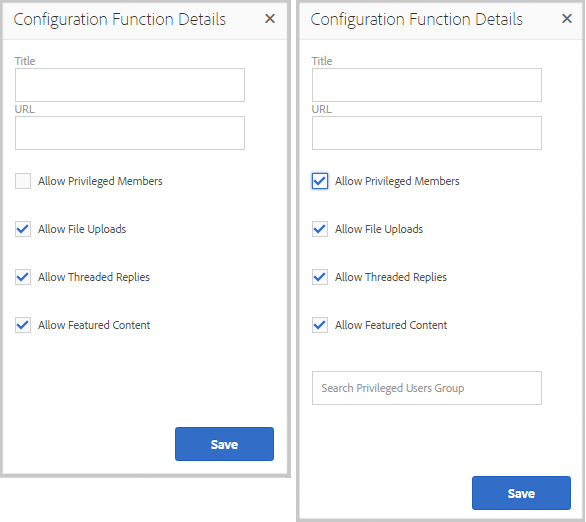

# Funzioni per community {#community-functions}

Il tipo di funzionalità previste da un&#39;esperienza di community è noto. Le funzioni della community Internet sono disponibili come funzioni della community Internet. Essenzialmente, si tratta di una o più pagine precollegate per implementare una funzione community che richiede più di un semplice aggiunta di un componente a una pagina in modalità di creazione. Sono gli elementi costitutivi utilizzati per definire la struttura di un modello [di sito](sites.md) community da cui vengono [creati](sites-console.md)siti community.

Una volta creato un sito community, il contenuto può essere aggiunto alle pagine risultanti utilizzando la modalità [di authoring standard](../../help/sites-authoring/editing-content.md)AEM.

Una serie di funzioni della community sono immediatamente disponibili, come mostrato nella console delle funzioni della community. Ulteriori funzioni della community verranno fornite nelle release future e sarà possibile creare funzioni personalizzate.

>[!NOTE]
>
>Le console per la creazione di siti community, modelli [di siti](sites.md)community, modelli [di gruppi](tools-groups.md) community e funzioni  community sono utilizzabili solo nell’ambiente di authoring.

## Console Funzioni community {#community-functions-console}

Nell’ambiente di authoring, per accedere alla console delle funzioni per community

* Dalla navigazione globale: **[!UICONTROL Strumenti > Community > Funzioni della community]**

## Funzioni pre-costruite {#pre-built-functions}

Segue una breve descrizione delle funzioni fornite con  AEM Communities. Ogni funzione è composta da una o più pagine AEM contenenti componenti Community collegati tra loro in una funzione facilmente incorporata in un modello [di sito](sites.md)community.

Un modello di sito community fornisce la struttura di un sito community, inclusi login, profili utente, notifiche, messaggi, menu del sito, ricerca, temi e funzioni di branding.

### Impostazioni titolo e URL {#title-and-url-settings}

**Titolo** e **URL** sono proprietà comuni a tutte le funzioni della community.

Quando una funzione community viene aggiunta a un modello di sito community o quando si [modifica](sites-console.md#modifying-site-properties) la struttura di un sito community, si apre la finestra di dialogo della funzione in modo che sia possibile configurare il Titolo e l&#39;URL.

#### Dettagli funzione di configurazione {#configuration-function-details}

* **[!UICONTROL Titolo]**
(
*richiesto*) Testo visualizzato nel menu delle funzioni per il sito

* **[!UICONTROL URL]**(*obbligatorio*) Nome utilizzato per generare l’URI. Il nome deve essere conforme alle convenzioni [di](../../help/sites-developing/naming-conventions.md) denominazione imposte da AEM e JCR.

Ad esempio, utilizzando il sito creato seguendo l&#39;esercitazione [Guida introduttiva](getting-started.md) , se

* Titolo = Pagina Web
* URL = page

Quindi l’URL della pagina è http://local_host:4503/content/sites/engage/en/page.html e il collegamento del menu per la pagina viene visualizzato come:

### Funzione Flusso attività {#activity-stream-function}

La funzione del flusso di attività è una pagina con un componente [Flussi di](activities.md) attività con tutte le viste selezionate (tutte le attività, le attività utente e così via). Consultate anche [Activity Stream Essentials](essentials-activities.md) per gli sviluppatori.

Quando viene aggiunto a un modello, si apre la finestra di dialogo seguente:

#### Dettagli funzione di configurazione {#configuration-function-details-1}

* Consultate Impostazioni [titolo e URL](#title-and-url-settings)
* **[!UICONTROL Mostra visualizzazione]**&quot;Attività personali&quot; Se questa opzione è selezionata, la pagina Attività includerà una scheda che filtra le attività in base a quelle generate all&#39;interno della community dal membro corrente. Il valore predefinito è selezionato.

* **[!UICONTROL Mostra visualizzazione]**&quot;Tutte le attività&quot; Se questa opzione è selezionata, la pagina Attività includerà una scheda che include tutte le attività generate all&#39;interno della comunità a cui il membro corrente ha accesso. Il valore predefinito è selezionato.

* **[!UICONTROL Mostra visualizzazione]**&quot;Feed notizie&quot; Se questa opzione è selezionata, la pagina Attività includerà una scheda che filtra le attività in base a quelle che il membro corrente sta seguendo. Il valore predefinito è selezionato.

### Funzione Assegnazioni {#assignments-function}

La funzione assegnazioni è la funzione di base che definisce un sito [community per l&#39;abilitazione](overview.md#enablement-community). Consente di assegnare le risorse di abilitazione ai membri della community. Consultate anche [Assignments Essentials](essentials-assignments.md) for developers (Assegnazioni di base per sviluppatori).

Questa funzione è disponibile come funzione del componente aggiuntivo di [abilitazione](enablement.md). Il componente aggiuntivo di abilitazione richiede licenze aggiuntive da utilizzare in un ambiente di produzione.

Quando viene aggiunta a un modello, l’unica configurazione è [Titolo e Impostazioni](#title-and-url-settings)URL.

### Funzione Blog {#blog-function}

La funzione blog è una pagina con un componente  Blog configurato per l’assegnazione di tag, il caricamento di file, i seguenti elementi, i membri per l’automodifica, il voto e la moderazione. Vedere anche [Blog Essentials](blog-developer-basics.md) per gli sviluppatori.

Quando viene aggiunto a un modello, si apre la finestra di dialogo seguente:

* Consultate Impostazioni [titolo e URL](#title-and-url-settings)
* **[!UICONTROL Consenti membri]** privilegiati Se questa opzione è selezionata, il blog consente solo ai membri privilegiati di creare articoli consentendo la selezione di un gruppo [di membri](users.md#privileged-members-group)privilegiati. Se questa opzione non è selezionata, tutti i membri della community possono creare. Il valore predefinito è deselezionato.

* **[!UICONTROL Consenti caricamenti]** file Se questa opzione è selezionata, il blog includerà la possibilità per i membri di caricare i file. Il valore predefinito è selezionato.

* **[!UICONTROL Consenti risposte]** filettate Se questa opzione non è selezionata, il blog consente di rispondere (commenti) a un articolo, ma non è consentito rispondere ai commenti. Il valore predefinito è selezionato.

* **[!UICONTROL Consenti contenuti]** contenuti contenuti contenutiSe questa opzione è selezionata, l’idea può essere identificata come contenuto contenuticontenuti contenuti. Il valore predefinito è selezionato.

### Funzione Calendario {#calendar-function}

La funzione Calendario è una pagina con un componente  Calendario configurato per consentire l’assegnazione di tag. Consultate anche [Calendar Essentials](calendar-basics-for-developers.md) for developers.

Quando viene aggiunto a un modello, si apre la finestra di dialogo seguente:

* Consultate Impostazioni [titolo e URL](#title-and-url-settings)
* **[!UICONTROL Consenti blocco]** Se questa opzione è selezionata, il forum consente di fissare le risposte dell&#39;argomento all&#39;inizio dell&#39;elenco dei commenti. Il valore predefinito è selezionato.

* **[!UICONTROL Consenti membri]** privilegiati Se questa opzione è selezionata, il blog consente solo ai membri privilegiati di creare articoli consentendo la selezione di un gruppo [di membri](users.md#privileged-members-group)privilegiati. Se questa opzione non è selezionata, tutti i membri della community possono creare. Il valore predefinito è deselezionato.

* **[!UICONTROL Consenti caricamenti]** file Se questa opzione è selezionata, il blog includerà la possibilità per i membri di caricare i file. Il valore predefinito è selezionato.

* **[!UICONTROL Consenti risposte]** filettate Se questa opzione non è selezionata, il blog consente di rispondere (commenti) a un articolo, ma non è consentito rispondere ai commenti. Il valore predefinito è selezionato.

* **[!UICONTROL Consenti contenuti]** contenuti contenuti contenutiSe questa opzione è selezionata, l’idea può essere identificata come contenuto contenuticontenuti contenuti. Il valore predefinito è selezionato.

### Funzione Catalogo {#catalog-function}

La funzione catalogo consente ai membri della comunità di [abilitare i membri della comunità](overview.md#enablement-community) di sfogliare le risorse di abilitazione che non sono loro assegnate. Consultate [Assegnazione di tag alle risorse](tag-resources.md) di abilitazione e [Catalog Essentials](catalog-developer-essentials.md) per gli sviluppatori.

Tutte le risorse di abilitazione e i percorsi di apprendimento per il sito community verranno visualizzati in tutti i cataloghi se la loro proprietà ` [Show in Catalog](resources.md)`, è impostata su true. Per includere esplicitamente le risorse e i percorsi di apprendimento, è necessario applicare un [pre-filtro](catalog-developer-essentials.md#pre-filters) al catalogo.

Quando viene aggiunta a un modello, la configurazione consente di specificare i nomi dei tag utilizzati per configurare il filtro dei tag presentato ai visitatori del sito:

* Consultate Impostazioni [titolo e URL](#title-and-url-settings)
* **[!UICONTROL Seleziona tutti i namespace]**

   * Gli spazi dei nomi dei tag selezionati definiscono quali tag possono essere selezionati dai visitatori per filtrare l’elenco delle risorse di abilitazione elencate nel catalogo.
   * Se questa opzione è attivata, sono disponibili tutti gli spazi dei nomi dei tag consentiti per il sito della community.
   * Se questa opzione è deselezionata, è possibile selezionare uno o più spazi di nomi consentiti per il sito community.
   * Il valore predefinito è selezionato.

### Funzione Contenuto {#featured-content-function}

La funzione di contenuto disponibile è una pagina con un componente [Contenuto](featured.md) contenuto configurato per consentire l’aggiunta e l’eliminazione di commenti.

La capacità di visualizzare il contenuto può essere consentita o disabilitata per componente (vedere Funzione Blog, Funzione Calendario, Funzione Forum, Funzione Ideazione e Funzione QnA).

Quando viene aggiunta a un modello, l’unica configurazione è [Titolo e Impostazioni](#title-and-url-settings)URL.

### Funzione Libreria file {#file-library-function}

La funzione Libreria file è una pagina con un componente [Libreria](file-library.md) file configurato per consentire l&#39;aggiunta e l&#39;eliminazione di commenti.

Quando viene aggiunta a un modello, l’unica configurazione è [Titolo e Impostazioni](#title-and-url-settings)URL.

### Funzione Forum {#forum-function}

La funzione forum è una pagina con un componente  Forum configurato per l’assegnazione di tag, il caricamento di file, i seguenti elementi, i membri per la modifica automatica, il voto e la moderazione.

Quando viene aggiunto a un modello, si apre la finestra di dialogo seguente:

#### Dettagli funzione di configurazione {#configuration-function-details-2}

* Consultate Impostazioni [titolo e URL](#title-and-url-settings)
* **[!UICONTROL Consenti blocco]** Se questa opzione è selezionata, il forum consente di fissare le risposte dell&#39;argomento all&#39;inizio dell&#39;elenco dei commenti. Il valore predefinito è selezionato.

* **[!UICONTROL Consenti membri]** privilegiati Se questa opzione è selezionata, il forum consente solo ai membri privilegiati di pubblicare argomenti consentendo la selezione di un gruppo [di membri](users.md#privileged-members-group)privilegiati. Se questa opzione non è selezionata, tutti i membri della community possono essere inseriti. Il valore predefinito è deselezionato.

* **[!UICONTROL Consenti caricamenti]** file Se questa opzione è selezionata, il forum includerà la possibilità per i membri di caricare i file. Il valore predefinito è selezionato.

* **[!UICONTROL Consenti risposte]** filettate Se questa opzione non è selezionata, il forum consente di inserire commenti su un argomento, ma le risposte a tali commenti non sono consentite. Il valore predefinito è selezionato.

* **[!UICONTROL Consenti contenuti]** contenuti contenuti contenutiSe questa opzione è selezionata, l’idea può essere identificata come contenuto contenuticontenuti contenuti. Il valore predefinito è selezionato.

### Funzione Groups {#groups-function}

>[!CAUTION]
>
>La funzione dei gruppi *non* deve essere né la *prima né l&#39;unica* funzione nella struttura di un sito o in un modello di sito community.
>
>Qualsiasi altra funzione, come la funzione page, deve essere inclusa ed elencata per prima.

La funzione Groups (Gruppi) consente ai membri della community di creare sub-community all&#39;interno del sito della community nell&#39;ambiente di pubblicazione.

A seconda delle [impostazioni](sites-console.md#groupmanagement) in cui la funzione Gruppi è inclusa in un modello [di sito](sites.md)community, i gruppi possono essere pubblici o privati e uno o più modelli di gruppo community possono essere configurati per fornire una scelta di modelli quando il gruppo community viene effettivamente creato (ad esempio dall&#39;ambiente di pubblicazione). Un modello [di gruppo](tools-groups.md) community specifica quali funzioni Community vengono create per le pagine del gruppo, ad esempio forum e calendari.

Quando viene creato un gruppo di community, viene creato dinamicamente un gruppo membro per il nuovo gruppo a cui i membri possono essere assegnati o associati. Per ulteriori informazioni, consulta [Gestione di utenti e gruppi](users.md)di utenti.

Dal [Feature Pack 1](deploy-communities.md#latestfeaturepack)di Communities, i gruppi di community vengono creati nell&#39;ambiente di authoring tramite la console [Gruppi di siti di](groups.md)Communities e, se abilitata, possono essere creati nell&#39;ambiente di pubblicazione.

Quando viene aggiunto a un modello, si apre la finestra di dialogo seguente:

* Consultate Impostazioni [titolo e URL](#title-and-url-settings)
* **[!UICONTROL Selezionate Modelli]** gruppo Un menu a discesa che consente di selezionare uno o più modelli di gruppo abilitati da cui può scegliere il futuro creatore di un nuovo gruppo community (nell’ambiente di pubblicazione).

* **[!UICONTROL Consenti membri]** privilegiati Se questa opzione è selezionata, il forum consente solo ai membri privilegiati di pubblicare argomenti consentendo la selezione di un gruppo [di protezione dei membri](users.md#privileged-members-group)privilegiati. Se questa opzione non è selezionata, tutti i membri della community possono essere inseriti. Il valore predefinito è deselezionato.

* **[!UICONTROL Consenti creazione]** pubblicazione Se questa opzione è selezionata, i membri della community autorizzati possono creare un gruppo nell’ambiente di pubblicazione. Se questa opzione è deselezionata, è possibile creare nuovi gruppi (sub-community) solo nell’ambiente di authoring dalla console Gruppi di siti community.

   Default is `checked`.

### Funzione ideazione {#ideation-function}

La funzione ideazione è una pagina con un componente [Ideazione](ideation-feature.md).

Quando viene aggiunta a un modello, si apre la finestra di dialogo seguente, che specifica i nomi predefiniti di Titolo e URL, nonché le impostazioni di visualizzazione predefinite per il modello:

* Consultate Impostazioni [titolo e URL](#title-and-url-settings)
* **[!UICONTROL Consenti membri]** privilegiati Se questa opzione è selezionata, il forum consente solo ai membri privilegiati di pubblicare argomenti consentendo la selezione di un gruppo [di protezione dei membri](users.md#privileged-members-group)privilegiati. Se questa opzione non è selezionata, tutti i membri della community possono essere inseriti. Il valore predefinito è deselezionato.

* **[!UICONTROL Consenti caricamenti]** file Se questa opzione è selezionata, l&#39;idea includerà la possibilità per i membri di caricare i file. Il valore predefinito è selezionato.

* **[!UICONTROL Consenti risposte]** filettate Se questa opzione non è selezionata, l&#39;idea consente di rispondere (commenti) a un argomento, ma non è possibile rispondere ai commenti. Il valore predefinito è selezionato.

* **[!UICONTROL Consenti contenuti]** contenuti contenuti contenutiSe questa opzione è selezionata, l’idea può essere identificata come contenuto contenuticontenuti contenuti. Il valore predefinito è selezionato.

### Funzione Classifica {#leaderboard-function}

La funzione della classifica è una pagina con un componente della classifica.

**NOTA**: il componente Leaderboard dovrà essere configurato ulteriormente *dopo* la creazione di un sito community da un modello community che include la funzione Leaderboard. Le [regole](enabling-leaderboard.md#rules-tab) del componente Leaderboard dovranno essere specificate, a seconda della configurazione del [punteggio e dei badge](implementing-scoring.md) per il sito community.

Quando viene aggiunta a un modello, si apre la finestra di dialogo seguente, che specifica i nomi predefiniti di Titolo e URL, nonché le impostazioni di visualizzazione predefinite per il modello:

* Consultate Impostazioni [titolo e URL](#title-and-url-settings)
* **[!UICONTROL Visualizza badge]** Se questa opzione è selezionata, nella classifica è inclusa una colonna per le icone dei simboli.

   Il valore predefinito è deselezionato.

* **[!UICONTROL Visualizza nome]** contrassegno Se questa opzione è selezionata, nella classifica è inclusa una colonna per il nome del contrassegno.

   Il valore predefinito è deselezionato.

* **[!UICONTROL Visualizza avatar]** Se questa opzione è selezionata, l&#39;immagine avatar del membro viene inclusa nella classifica, accanto al collegamento del nome al profilo del membro.

   Il valore predefinito è deselezionato.

### Funzione Pagina {#page-function}

La funzione page aggiunge una pagina vuota al sito della community che viene collegata alle funzioni del sito della community: login, menu, notifiche, messaggi, temi e branding. Il contenuto può essere aggiunto alla pagina utilizzando la modalità [AEM authoring](../../help/sites-authoring/editing-content.md)standard.

Quando viene aggiunta a un modello, l’unica configurazione è [Titolo e Impostazioni](#title-and-url-settings)URL.

### Funzione D/R {#qna-function}

La funzione QnA è una pagina con un componente  QnA configurato per l’assegnazione di tag, il caricamento di file, i seguenti elementi, i membri per la modifica automatica, il voto e la moderazione.

Quando viene aggiunta a un modello, la configurazione consente restrizioni ai membri privilegiati:

* Consultate Impostazioni [titolo e URL](#title-and-url-settings)
* **[!UICONTROL Consenti blocco]** Se questa opzione è selezionata, il forum consente di fissare le risposte dell&#39;argomento all&#39;inizio dell&#39;elenco dei commenti. Il valore predefinito è selezionato.

* **[!UICONTROL Consenti membri]** privilegiati Se questa opzione è selezionata, il forum QnA consente solo ai membri privilegiati di porre domande consentendo la selezione di un gruppo [di membri](users.md#privileged-members-group)privilegiati. Se questa opzione non è selezionata, tutti i membri della community possono essere inseriti. Il valore predefinito è deselezionato.

* **[!UICONTROL Consenti caricamenti]** file Se questa opzione è selezionata, il forum QnA includerà la possibilità per i membri di caricare i file. Il valore predefinito è selezionato.

* **[!UICONTROL Consenti risposte]** filettate Se non è selezionata, il forum QnA consente di inserire commenti (risposte) a una domanda pubblicata, ma non è consentito rispondere alle risposte. Il valore predefinito è selezionato.

* **[!UICONTROL Consenti contenuti]** contenuti contenuti contenutiSe questa opzione è selezionata, l’idea può essere identificata come contenuto contenuticontenuti contenuti. Il valore predefinito è selezionato.

## Crea funzione community {#create-community-function}

Per creare una funzione community, selezionate l&#39; `Create Community Function` icona nella parte superiore della console Funzioni community. Possono essere create più funzioni basate sulla stessa Blueprint AEM e successivamente personalizzate in modo univoco aprendo la modalità di modifica dell’autore.

### Nome funzione community {#community-function-name}

Nel pannello Nome funzione community, sono configurati un nome, una descrizione e se la funzione è abilitata o disabilitata:

* **[!UICONTROL Nome]** funzione community Il nome della funzione utilizzata per la visualizzazione e l&#39;archiviazione

* **[!UICONTROL Descrizione]** della funzione La descrizione della funzione per la visualizzazione

* **[!UICONTROL Disattivato/Abilitato]** Un interruttore di attivazione/disattivazione che controlla se la funzione è di riferimento

### Blueprint AEM {#aem-blueprint}

Sul `AEM Blueprint` pannello è possibile selezionare il modello che è l&#39;implementazione sottostante della funzione comunitaria.

La funzione community è un mini-sito composto da una o più pagine, preconnesso per l&#39;inclusione in un sito community che include login, profili utente, notifiche, messaggi, menu del sito, ricerca, temi e funzioni di branding. Una volta creata la funzione, è possibile [aprire la funzione](#open-community-function) in modalità di modifica dell’autore e personalizzare le impostazioni della pagina e/o del componente.

Poiché la funzione community è implementata come [live copy](../../help/sites-administering/msm.md#live-copies) di un [blueprint](../../help/sites-administering/msm-livecopy.md#creatingablueprint), è possibile eseguire il rollout delle modifiche apportate a una funzione che interessa tutte le pagine del sito community create dal modello [di sito](sites.md) community o dal modello [di gruppo](tools-groups.md) community che includeva la funzione. È inoltre possibile dissociare una pagina dal relativo blueprint padre per apportare modifiche a livello di pagina.

Vedere anche [Multi Site Manager](../../help/sites-administering/msm.md).

### Miniatura  {#thumbnail}

Nel pannello Miniature, è possibile caricare un’immagine da visualizzare nella console [Funzioni](#community-functions-console)community.

## Apri funzione community {#open-community-function}

Selezionate l’ `Open Community Function` icona per passare alla modalità di modifica dell’autore per creare il contenuto della pagina e modificare la configurazione dei componenti della funzione.

### Configurazione dei componenti {#configuring-components}

Una funzione community è implementata come Live Copy di una Blueprint AEM, i cui dettagli sono documentati in [Multi Site Manager](../../help/sites-administering/msm.md).

È possibile creare non solo contenuti di pagina, ma anche componenti.

Se si configura un componente in una pagina di un sito community creato, potrebbe essere necessario annullare l&#39; [ereditarietà](../../help/sites-administering/msm-livecopy.md#changing-live-copy-content) per configurare il componente. L&#39;ereditarietà deve essere ristabilita al termine della configurazione.

Per i dettagli di configurazione, visitate [Community Components](author-communities.md) (Componenti community per gli autori).

## Funzione modifica per community {#edit-community-function}

Selezionare l&#39; `Edit Community Function` icona per modificare le proprietà della funzione utilizzando gli stessi pannelli utilizzati per [creare una funzione](#create-community-function)community, compresa l&#39;attivazione o disattivazione della funzione.
