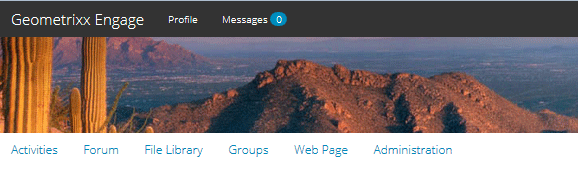
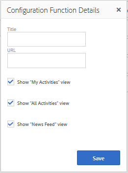

# Funzioni per community {#community-functions}

Il tipo di funzionalità previsto da un’esperienza community è noto. Le funzioni della community sono disponibili come funzioni della community. In sostanza, si tratta di una o più pagine precablate per implementare una funzione community che richiede più che semplicemente l’aggiunta di un componente a una pagina in modalità di authoring. Si tratta dei blocchi costitutivi utilizzati per definire la struttura di un [modello di sito community](sites.md) da cui vengono [creati i siti community](sites-console.md).

Una volta creato un sito community, il contenuto può essere aggiunto alle pagine risultanti utilizzando la modalità di authoring standard [AEM](../../help/sites-authoring/editing-content.md).

Una serie di funzioni della community sono immediatamente disponibili, come mostrato nella console delle funzioni della community. Nelle versioni future verranno fornite più funzioni della community e sarà possibile creare anche funzioni personalizzate.

>[!NOTE]
>
>Le console per la creazione di [siti della community](sites-console.md), [modelli di sito della community](sites.md), [modelli di gruppo della community](tools-groups.md) e [funzioni della community](functions.md) sono utilizzabili solo nell’ambiente di authoring.

## Console Funzioni community {#community-functions-console}

Nell’ambiente di authoring, è possibile accedere alla console funzioni della community

* Dalla navigazione globale: **[!UICONTROL Strumenti > Community > Funzioni della community]**

## Funzioni predefinite {#pre-built-functions}

Di seguito è riportata una breve descrizione delle funzioni fornite con AEM Communities. Ciascuna funzione è composta da una o più pagine AEM contenenti componenti di Communities collegati tra loro in una funzione facilmente incorporata in un [modello di sito community](sites.md).

Un modello di sito community fornisce la struttura di un sito community con login, profili utente, notifiche, messaggi, menu del sito, ricerca, temi e funzioni di branding.

### Impostazioni titolo e URL {#title-and-url-settings}

**** Titleand  **** URLsono proprietà comuni a tutte le funzioni della community.

Quando una funzione community viene aggiunta a un modello di sito community o quando [modifica](sites-console.md#modifying-site-properties) la struttura di un sito community, viene visualizzata la finestra di dialogo della funzione in modo che sia possibile configurare il Titolo e l’URL.

#### Dettagli funzione di configurazione {#configuration-function-details}

* **[!UICONTROL Titolo]**
(
*obbligatorio*) Testo visualizzato nel menu delle caratteristiche del sito

* **[!UICONTROL URL]**
 (*obbligatorio*) Il nome utilizzato per generare l’URI. Il nome deve essere conforme alle [convenzioni di denominazione](../../help/sites-developing/naming-conventions.md) imposte da AEM e JCR.

Ad esempio, utilizzando il sito creato seguendo l&#39;esercitazione [Guida introduttiva](getting-started.md), se

* Titolo = Pagina Web
* URL = page

L’URL della pagina è quindi http://local_host:4503/content/sites/engage/en/page.html e il collegamento del menu per la pagina viene visualizzato come:

### Funzione Flusso attività {#activity-stream-function}

La funzione flusso di attività è una pagina con un [componente Flussi di attività](activities.md) con tutte le visualizzazioni selezionate (tutte le attività, le attività dell&#39;utente e seguenti). Per gli sviluppatori, consulta anche [Activity Stream Essentials](essentials-activities.md) .

Quando viene aggiunto a un modello, si apre la seguente finestra di dialogo:

#### Dettagli funzione di configurazione {#configuration-function-details-1}

* Consulta [Impostazioni titolo e URL](#title-and-url-settings)
* **[!UICONTROL Mostra]**
visualizzazione &quot;Attività personali&quot; Se questa opzione è selezionata, la pagina Attività includerà una scheda che filtra le attività in base a quelle generate all’interno della community dal membro corrente. Il valore predefinito è selezionato.

* **[!UICONTROL Mostra]**
visualizzazione &quot;Tutte le attività&quot; Se questa opzione è selezionata, la pagina Attività includerà una scheda che include tutte le attività generate all’interno della comunità a cui il membro corrente ha accesso. Il valore predefinito è selezionato.

* **[!UICONTROL Mostra]**
visualizzazione &quot;Feed notizie&quot; Se questa opzione è selezionata, la pagina Attività includerà una scheda che filtra le attività in base a quelle che il membro corrente sta seguendo. Il valore predefinito è selezionato.

### Funzione Assegnazioni {#assignments-function}

La funzione assegnazioni è la funzione di base che definisce un [sito community per l&#39;abilitazione](overview.md#enablement-community). Consente l&#39;assegnazione di risorse di abilitazione ai membri della community. Per gli sviluppatori, consulta anche [Assegnazioni Essentials](essentials-assignments.md) .

Questa funzione è disponibile come funzione del componente aggiuntivo [enablement](enablement.md). Il componente aggiuntivo per l’abilitazione richiede licenze aggiuntive per l’utilizzo in un ambiente di produzione.

Quando viene aggiunta a un modello, l’unica configurazione è per [Impostazioni titolo e URL](#title-and-url-settings).

### Funzione Blog {#blog-function}

La funzione blog è una pagina con un [componente Blog](blog-feature.md) configurato per l&#39;assegnazione di tag, il caricamento di file, il seguito, i membri per la modifica automatica, il voto e la moderazione. Per gli sviluppatori, consulta anche [Blog Essentials](blog-developer-basics.md) .

Quando viene aggiunto a un modello, si apre la seguente finestra di dialogo:

* Consulta [Impostazioni titolo e URL](#title-and-url-settings)
* **[!UICONTROL Consenti]**
membri privilegiatiSe questa opzione è selezionata, il blog consente solo ai membri privilegiati di creare articoli consentendo la selezione di un gruppo [ di membri ](users.md#privileged-members-group)privilegiati. Se non è selezionato, tutti i membri della community possono creare. Il valore predefinito è deselezionato.

* **[!UICONTROL Consenti]**
caricamenti fileSe questa opzione è selezionata, il blog includerà la possibilità per i membri di caricare i file. Il valore predefinito è selezionato.

* **[!UICONTROL Consenti]**
risposte threadSe non è selezionato, il blog consentirà le risposte (commenti) a un articolo, ma le risposte ai commenti non sono consentite. Il valore predefinito è selezionato.

* **[!UICONTROL Consenti]**
contenuto in primo pianoSe questa opzione è selezionata, l&#39;idea può essere identificata come  [contenuto](featured.md) in primo piano. Il valore predefinito è selezionato.

### Funzione Calendario {#calendar-function}

La funzione Calendario è una pagina con un [componente Calendario](calendar.md) configurato per consentire l’assegnazione di tag. Per gli sviluppatori, consulta anche [Calendar Essentials](calendar-basics-for-developers.md) .

Quando viene aggiunto a un modello, si apre la seguente finestra di dialogo:

* Consulta [Impostazioni titolo e URL](#title-and-url-settings)
* **[!UICONTROL Consenti]**
bloccoSe questa opzione è selezionata, il forum consente di associare le risposte dell&#39;argomento all&#39;inizio dell&#39;elenco dei commenti. Il valore predefinito è selezionato.

* **[!UICONTROL Consenti]**
membri privilegiatiSe questa opzione è selezionata, il blog consente solo ai membri privilegiati di creare articoli consentendo la selezione di un gruppo [ di membri ](users.md#privileged-members-group)privilegiati. Se non è selezionato, tutti i membri della community possono creare. Il valore predefinito è deselezionato.

* **[!UICONTROL Consenti]**
caricamenti fileSe questa opzione è selezionata, il blog includerà la possibilità per i membri di caricare i file. Il valore predefinito è selezionato.

* **[!UICONTROL Consenti]**
risposte threadSe non è selezionato, il blog consentirà le risposte (commenti) a un articolo, ma le risposte ai commenti non sono consentite. Il valore predefinito è selezionato.

* **[!UICONTROL Consenti]**
contenuto in primo pianoSe questa opzione è selezionata, l&#39;idea può essere identificata come  [contenuto](featured.md) in primo piano. Il valore predefinito è selezionato.

### Funzione Catalogo {#catalog-function}

La funzione di catalogo consente ai membri della [community di abilitazione](overview.md#enablement-community) di sfogliare le risorse di abilitazione che non sono loro assegnate. Per gli sviluppatori, consulta [Assegnazione tag alle risorse di abilitazione](tag-resources.md) e [Nozioni di base sul catalogo](catalog-developer-essentials.md) .

Tutte le risorse di abilitazione e i percorsi di apprendimento per il sito community verranno visualizzati in tutti i cataloghi se la loro proprietà, ` [Show in Catalog](resources.md)`, è impostata su true. Per includere in modo esplicito le risorse e i percorsi di apprendimento, è necessario applicare un [pre-filtro](catalog-developer-essentials.md#pre-filters) al catalogo.

Quando viene aggiunta a un modello, la configurazione consente di specificare i namespace dei tag utilizzati per configurare il filtro tag presentato ai visitatori del sito:

* Consulta [Impostazioni titolo e URL](#title-and-url-settings)
* **[!UICONTROL Seleziona tutti i namespace]**

   * Gli spazi dei nomi dei tag selezionati definiscono quali tag possono essere selezionati dai visitatori per filtrare l’elenco delle risorse di abilitazione elencate nel catalogo.
   * Se questa opzione è selezionata, sono disponibili tutti i namespace consentiti per il sito community.
   * Se deselezionata, è possibile selezionare uno o più namespace consentiti per il sito community.
   * Il valore predefinito è selezionato.

### Funzione di contenuto {#featured-content-function}

La funzione di contenuto in primo piano è una pagina con un [componente Contenuto in primo piano](featured.md) configurato per consentire l’aggiunta e l’eliminazione di commenti.

La possibilità di utilizzare il contenuto può essere consentita o disabilitata per componente (consulta [Funzione blog](#blog-function), [Funzione calendario](#calendar-function), [Funzione forum](#forum-function), [Funzione ideazione](#ideation-function) e [Funzione QnA](#qna-function)).

Quando viene aggiunta a un modello, l’unica configurazione è per [Impostazioni titolo e URL](#title-and-url-settings).

### Funzione Libreria file {#file-library-function}

La funzione libreria file è una pagina con un [componente Libreria file](file-library.md) configurato per consentire l&#39;aggiunta e l&#39;eliminazione di commenti.

Quando viene aggiunta a un modello, l’unica configurazione è per [Impostazioni titolo e URL](#title-and-url-settings).

### Funzione Forum {#forum-function}

La funzione forum è una pagina con un [componente Forum](forum.md) configurato per l’assegnazione di tag, il caricamento di file, i seguenti membri per la modifica automatica, il voto e la moderazione.

Quando viene aggiunto a un modello, si apre la seguente finestra di dialogo:

#### Dettagli funzione di configurazione {#configuration-function-details-2}

* Consulta [Impostazioni titolo e URL](#title-and-url-settings)
* **[!UICONTROL Consenti]**
bloccoSe questa opzione è selezionata, il forum consente di associare le risposte dell&#39;argomento all&#39;inizio dell&#39;elenco dei commenti. Il valore predefinito è selezionato.

* **[!UICONTROL Consenti]**
membri con privilegiSe questa opzione è selezionata, il forum consente ai membri con privilegi di pubblicare argomenti solo consentendo la selezione di un gruppo [ di membri con ](users.md#privileged-members-group)privilegi. Se non è selezionato, tutti i membri della community possono effettuare la pubblicazione. Il valore predefinito è deselezionato.

* **[!UICONTROL Consenti]**
caricamenti fileSe questa opzione è selezionata, il forum includerà la possibilità per i membri di caricare i file. Il valore predefinito è selezionato.

* **[!UICONTROL Consenti]**
risposte threadSe non è selezionato, il forum consente di inserire commenti su un argomento, ma le risposte a tali commenti non sono consentite. Il valore predefinito è selezionato.

* **[!UICONTROL Consenti]**
contenuto in primo pianoSe questa opzione è selezionata, l&#39;idea può essere identificata come  [contenuto](featured.md) in primo piano. Il valore predefinito è selezionato.

### Funzione Groups {#groups-function}

>[!CAUTION]
>
>La funzione dei gruppi deve essere *not* la funzione *prima o la funzione unica* nella struttura di un sito o in un modello di sito community.
>
>Qualsiasi altra funzione, come la [funzione pagina](#page-function), deve essere inclusa ed elencata per prima.

La funzione gruppi consente ai membri della community di creare sottocommunity all’interno del sito della community nell’ambiente di pubblicazione.

A seconda delle [impostazioni](sites-console.md#groupmanagement) quando la funzione Groups è inclusa in un [modello di sito community](sites.md), i gruppi possono essere pubblici o privati e uno o più modelli di gruppo community possono essere configurati per fornire una scelta di modelli quando il gruppo community viene effettivamente creato (ad esempio dall&#39;ambiente di pubblicazione). Un [modello di gruppo community](tools-groups.md) specifica quali funzioni di Communities vengono create per le pagine del gruppo, ad esempio forum e calendari.

Quando viene creato un gruppo di community, viene creato in modo dinamico un gruppo di membri per il nuovo gruppo, a cui è possibile assegnare o unire i membri. Per ulteriori informazioni, consulta [Gestione di utenti e gruppi di utenti](users.md).

A partire dal [feature pack 1](deploy-communities.md#latestfeaturepack) di Communities, i gruppi di community vengono creati nell&#39;ambiente di authoring utilizzando la [console Gruppi di siti di Communities](groups.md) e possono essere creati nell&#39;ambiente di pubblicazione quando abilitato.

Quando viene aggiunto a un modello, si apre la seguente finestra di dialogo:

* Consulta [Impostazioni titolo e URL](#title-and-url-settings)
* **[!UICONTROL Seleziona]**
Modelli di gruppoMenu a discesa che consente di selezionare uno o più modelli di gruppo abilitati da cui scegliere il futuro creatore di un nuovo gruppo di community (nell’ambiente di pubblicazione).

* **[!UICONTROL Consenti]**
membri con privilegiSe questa opzione è selezionata, il forum consente ai membri con privilegi di pubblicare argomenti solo consentendo la selezione di un gruppo [ di sicurezza dei membri con ](users.md#privileged-members-group)privilegi. Se non è selezionato, tutti i membri della community possono effettuare la pubblicazione. Il valore predefinito è deselezionato.

* **[!UICONTROL Consenti]**
creazione pubblicazioneSe questa opzione è selezionata, i membri della community autorizzati possono creare un gruppo nell&#39;ambiente di pubblicazione. Se questa opzione è deselezionata, i nuovi gruppi (sottocommunity) possono essere creati solo nell’ambiente di authoring dalla console Gruppi di siti di Communities.

   Il valore predefinito è `checked`.

### Funzione ideazione {#ideation-function}

La funzione di ideazione è una pagina con un [componente Ideazione](ideation-feature.md).

Quando viene aggiunta a un modello, viene visualizzata la finestra di dialogo seguente, che specifica il Titolo e i nomi URL predefiniti, nonché le impostazioni di visualizzazione predefinite per il modello:

* Consulta [Impostazioni titolo e URL](#title-and-url-settings)
* **[!UICONTROL Consenti]**
membri con privilegiSe questa opzione è selezionata, il forum consente ai membri con privilegi di pubblicare argomenti solo consentendo la selezione di un gruppo [ di sicurezza dei membri con ](users.md#privileged-members-group)privilegi. Se non è selezionato, tutti i membri della community possono effettuare la pubblicazione. Il valore predefinito è deselezionato.

* **[!UICONTROL Consenti]**
caricamenti fileSe questa opzione è selezionata, l&#39;idea includerà la possibilità per i membri di caricare i file. Il valore predefinito è selezionato.

* **[!UICONTROL Consenti]**
risposte threadSe non è selezionato, l&#39;idea consentirà di rispondere (commenti) a un argomento, ma le risposte ai commenti non sono consentite. Il valore predefinito è selezionato.

* **[!UICONTROL Consenti]**
contenuto in primo pianoSe questa opzione è selezionata, l&#39;idea può essere identificata come  [contenuto](featured.md) in primo piano. Il valore predefinito è selezionato.

### Funzione Classifica {#leaderboard-function}

La funzione della classifica è una pagina con un [componente della classifica](enabling-leaderboard.md).

**NOTA**: il componente Leaderboard dovrà essere ulteriormente configurato  ** dopo la creazione di un sito community da un modello community che include la funzione Leaderboard. Sarà necessario specificare le [regole](enabling-leaderboard.md#rules-tab) del componente Leaderboard, che dipendono dalla configurazione del [punteggio e dei badge](implementing-scoring.md) per il sito della community.

Quando viene aggiunta a un modello, viene visualizzata la finestra di dialogo seguente, che specifica il Titolo e i nomi URL predefiniti, nonché le impostazioni di visualizzazione predefinite per il modello:

* Consulta [Impostazioni titolo e URL](#title-and-url-settings)
* **[!UICONTROL Visualizza]**
badgeSe questa opzione è selezionata, nella classifica è inclusa una colonna per le icone del badge.

   Il valore predefinito è deselezionato.

* **[!UICONTROL Visualizza]**
nome badgeSe questa opzione è selezionata, nella classifica è inclusa una colonna relativa al nome del badge.

   Il valore predefinito è deselezionato.

* **[!UICONTROL Visualizza]**
avatarSe questa opzione è selezionata, l&#39;immagine avatar del membro viene inclusa nella classifica, accanto al suo collegamento nome al suo profilo membro.

   Il valore predefinito è deselezionato.

### Funzione Pagina {#page-function}

La funzione page aggiunge al sito community una pagina vuota che è collegata alle funzioni del sito community: accesso, menu, notifiche, messaggistica, temi e branding. Il contenuto può essere aggiunto alla pagina utilizzando la [modalità di authoring AEM standard](../../help/sites-authoring/editing-content.md).

Quando viene aggiunta a un modello, l’unica configurazione è per [Impostazioni titolo e URL](#title-and-url-settings).

### Funzione D/R {#qna-function}

La funzione QnA è una pagina con un componente [QnA](working-with-qna.md) configurato per l&#39;assegnazione di tag, il caricamento di file, i seguenti elementi, i membri per la modifica automatica, il voto e la moderazione.

Quando viene aggiunta a un modello, la configurazione consente restrizioni ai membri con privilegi:

* Consulta [Impostazioni titolo e URL](#title-and-url-settings)
* **[!UICONTROL Consenti]**
bloccoSe questa opzione è selezionata, il forum consente di associare le risposte dell&#39;argomento all&#39;inizio dell&#39;elenco dei commenti. Il valore predefinito è selezionato.

* **[!UICONTROL Consenti]**
membri privilegiatiSe questa opzione è selezionata, il forum QnA consente solo ai membri privilegiati di inviare domande consentendo la selezione di un gruppo [ di membri ](users.md#privileged-members-group)privilegiati. Se non è selezionato, tutti i membri della community possono effettuare la pubblicazione. Il valore predefinito è deselezionato.

* **[!UICONTROL Consenti]**
caricamenti fileSe questa opzione è selezionata, il forum QnA includerà la possibilità per i membri di caricare i file. Il valore predefinito è selezionato.

* **[!UICONTROL Consenti]**
risposte threadSe non è selezionato, il forum QnA consente l&#39;inserimento di commenti (risposte) a una domanda pubblicata, ma le risposte alle risposte non sono consentite. Il valore predefinito è selezionato.

* **[!UICONTROL Consenti]**
contenuto in primo pianoSe questa opzione è selezionata, l&#39;idea può essere identificata come  [contenuto](featured.md) in primo piano. Il valore predefinito è selezionato.

## Crea funzione community {#create-community-function}

Per creare una funzione community, seleziona l’icona `Create Community Function` situata nella parte superiore della console Funzioni community . È possibile creare più funzioni basate sullo stesso Blueprint AEM e quindi personalizzate in modo univoco aprendo in modalità di modifica dell’autore.

### Nome funzione community {#community-function-name}

Nel pannello Nome funzione community sono configurati un nome, una descrizione e se la funzione è abilitata o disabilitata:

* **[!UICONTROL Nome della funzione]**
della communityNome della funzione utilizzata per la visualizzazione e l&#39;archiviazione

* **[!UICONTROL Descrizione]**
della funzione della communityDescrizione della funzione per la visualizzazione

* **[!UICONTROL Interruttore Disabilitato/]**
AbilitatoA che controlla se la funzione è referenziabile

### Blueprint AEM {#aem-blueprint}

Nel pannello `AEM Blueprint` è possibile selezionare il modello che è l&#39;implementazione sottostante della funzione community.

La funzione community è un mini sito composto da una o più pagine, preconnesso per l’inclusione in un sito community che include login, profili utente, notifiche, messaggistica, menu del sito, ricerca, temi e funzioni di branding. Una volta creata la funzione, è possibile [aprire la funzione](#open-community-function) in modalità di modifica dell&#39;autore e personalizzare le impostazioni della pagina e/o del componente.

Poiché la funzione community è implementata come [Live Copy](../../help/sites-administering/msm.md#live-copies) di un [blueprint](../../help/sites-administering/msm-livecopy.md#creatingablueprint), è possibile eseguire il rollout delle modifiche apportate a una funzione che interessa tutte le pagine del sito community create dal [modello di sito community](sites.md) o dal [modello di gruppo community](tools-groups.md) che include la funzione. È inoltre possibile dissociare una pagina dalla relativa blueprint principale per apportare modifiche a livello di pagina.

Vedere anche [Multi Site Manager](../../help/sites-administering/msm.md).

### Miniatura  {#thumbnail}

Nel pannello Miniatura, è possibile caricare un&#39;immagine da visualizzare nella [console Funzioni della community](#community-functions-console).

## Apri funzione community {#open-community-function}

Seleziona l’ icona `Open Community Function` per accedere alla modalità di modifica dell’autore per creare il contenuto della pagina e modificare la configurazione dei componenti della funzione.

### Configurazione dei componenti {#configuring-components}

Una funzione community viene implementata come Live Copy di una blueprint AEM, i cui dettagli sono documentati in [Multi Site Manager](../../help/sites-administering/msm.md).

È possibile non solo creare il contenuto della pagina, ma anche configurare i componenti.

Se si configura un componente in una pagina di un sito community creato, potrebbe essere necessario annullare [ereditarietà](../../help/sites-administering/msm-livecopy.md#changing-live-copy-content) per configurare il componente. L’ereditarietà deve essere ristabilita al termine della configurazione.

Per informazioni sulla configurazione, visita [Componenti di Communities](author-communities.md) per gli autori.

## Funzione modifica per community {#edit-community-function}

Seleziona l&#39;icona `Edit Community Function` per modificare le proprietà della funzione utilizzando gli stessi pannelli di [creazione di una funzione community](#create-community-function), inclusa l&#39;abilitazione o la disattivazione della funzione.
