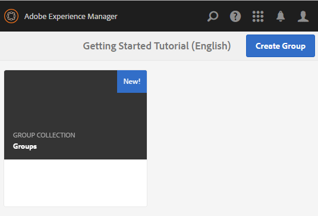

# Console Gruppi community {#community-groups-console}

La console Gruppi consente di accedere alla creazione di gruppi di community quando la struttura [modello di un sito community](sites-console.md#step1) include la funzione [group](functions.md#groups-function).

* I gruppi possono essere nidificati all’interno di altri gruppi. Ciò si verifica quando la struttura [del nuovo gruppo](tools-groups.md) contiene la funzione dei gruppi.
* Solo per l’ambiente di authoring, è disponibile una procedura guidata per la creazione di gruppi simile a quella per la creazione di siti.
* Se i membri possono creare o meno gruppi dall’ambiente di pubblicazione è possibile configurare l’aggiunta di una funzione Gruppi a una struttura del sito community o di un gruppo community.

Dei tre modelli di gruppo inclusi, solo il modello `Reference Group` include una funzione di gruppo nella sua struttura.

Diversi aspetti dei gruppi comunitari sono:

* Creazione: è possibile creare un nuovo gruppo all’autore ed eventualmente alla pubblicazione
* Controllo: gruppo può essere aperto o segreto
* Nidificazione: un gruppo può contenere zero o più gruppi

>[!NOTE]
>
>I gruppi di community, creati nell&#39;ambiente di pubblicazione prima dell&#39; [esistenza della console Gruppi community](https://helpx.adobe.com/in/experience-manager/6-3/communities/using/version-history.html#FeaturePack1FP1), non vengono elencati nella console Gruppi community e quindi non possono essere modificati utilizzando la console.

>[!NOTE]
>
>Questa console Gruppi, accessibile solo dalla console Siti community, non deve essere confusa con la console Gruppi [membro](members.md) per la gestione dei gruppi di membri.
>
>I gruppi di membri sono gruppi di utenti registrati nell&#39;ambiente di pubblicazione e a cui si accede dall&#39;ambiente di authoring mediante il [servizio tunnel](deploy-communities.md#tunnel-service-on-author).

## Creazione gruppo {#group-creation}

Per accedere alla console Gruppi:

* Al momento dell&#39;authoring, effettuate l&#39;accesso con privilegi di amministratore
* Dalla navigazione globale: **[!UICONTROL Community > Siti]**
* Selezionate una cartella del sito community esistente per aprirla
* Selezionare un&#39;istanza di un sito community all&#39;interno della cartella

   * La struttura del sito comunitario deve includere una funzione di gruppo
   * Queste schermate sono estratte dall&#39;esercitazione Guida introduttiva dopo la [creazione di gruppi in fase di pubblicazione](published-site.md)

Selezionare la cartella **[!UICONTROL Groups]** per aprirla.

Quando vengono aperti, vengono visualizzati tutti i gruppi esistenti, sia quelli creati al momento dell’authoring che quelli creati al momento della pubblicazione.

Da questa console Gruppi è possibile creare nuovi gruppi.

* Selezionare il pulsante **[!UICONTROL Crea gruppo]**

### Passaggio 1: Modello gruppo community {#step-community-group-template}

* **[!UICONTROL Titolo]** gruppo community: Titolo visualizzato per il gruppo.

   Il titolo viene visualizzato sul sito pubblicato per il gruppo.

* **[!UICONTROL Descrizione]** gruppo community: Descrizione del gruppo.
* **[!UICONTROL Radice]** gruppo community: Il percorso principale del gruppo.

   La radice predefinita è il sito principale principale, ma può essere spostata in qualsiasi posizione all&#39;interno del sito Web. Non è consigliato modificarlo.

* **[!UICONTROL Lingue aggiuntive disponibili per i gruppi community]** menu: Utilizzate il menu a discesa per selezionare le lingue dei gruppi di community disponibili. Nel menu vengono visualizzate tutte le lingue in cui viene creato il sito community principale. Gli utenti possono selezionare una di queste lingue per creare gruppi in più lingue in questo singolo passaggio. Lo stesso gruppo viene creato in più lingue specificate nella console Gruppi dei rispettivi siti della community.

* **[!UICONTROL Nome]** gruppo community: Nome della pagina principale del gruppo che viene visualizzata nell’URL

   * Ricontrolla il nome perché non viene facilmente modificato dopo la creazione del gruppo
   * L&#39;URL di base verrà visualizzato sotto la `Community Group Name`
   * Per un URL valido, aggiungi &quot;.html&quot;

      *Esempio*, `http://localhost:4502/content/sites/mysight/en/mygroup.html`

* **[!UICONTROL Community Group]** Templatemenu: utilizzate il menu a discesa per scegliere un modello [ di gruppo di ](tools.md)community disponibile.

### Passaggio 2: Progettazione {#step-design}

#### TEMA DEL GRUPPO COMMUNITY {#community-group-theme}

Il framework utilizza [Bootstrap Twitter](https://twitterbootstrap.org/) per fornire al sito un design reattivo e flessibile. È possibile selezionare uno dei numerosi temi di Bootstrap precaricati per definire lo stile del modello di gruppo di community selezionato, oppure caricare un tema di Bootstrap.

Quando è selezionato, il tema verrà sovrapposto con un segno di spunta blu opaco.

È possibile selezionare un tema diverso dal tema del sito padre.

Dopo la pubblicazione del sito della community, è possibile [modificare le proprietà](#modifying-group-properties) e selezionare un altro tema.

#### MARCHIO DEL GRUPPO COMMUNITY {#community-group-branding}

Il marchio Community del sito è un&#39;immagine visualizzata come intestazione nella parte superiore di ogni pagina. È possibile visualizzare un banner per il gruppo che differisce dalle altre pagine del sito.

Le dimensioni dell’immagine devono corrispondere alla larghezza prevista per la visualizzazione della pagina nel browser e a 120 pixel in altezza.

Quando create o selezionate un’immagine, tenete presente:

* L’altezza dell’immagine viene ritagliata a 120 pixel, misurati dal bordo superiore dell’immagine
* L&#39;immagine viene bloccata sul bordo sinistro della finestra del browser
* L&#39;immagine non viene ridimensionata, pertanto quando la larghezza dell&#39;immagine è impostata su ...

   * Con una larghezza inferiore a quella del browser, l&#39;immagine si ripeterà in orizzontale
   * Maggiore della larghezza del browser, l&#39;immagine apparentemente verrà ritagliata

### Passaggio 3: Impostazioni {#step-settings}

#### MODERAZIONE {#moderation}

Per impostazione predefinita, l&#39;elenco di moderatori del sito community principale è ereditato.

È possibile aggiungere moderatori specifici per il gruppo:

* Cercare membri (dall’ambiente di pubblicazione) per aggiungerli come moderatori

#### APPARTENENZA {#membership}

L&#39;impostazione di appartenenza consente di selezionare uno dei tre modi per proteggere un gruppo community.

* Iscrizione opzionale

   Se selezionato, il gruppo community è un gruppo pubblico. I membri del sito possono partecipare al gruppo e pubblicare post senza entrare esplicitamente nel gruppo. Il valore predefinito è selezionato.
* Iscrizione obbligatoria

   se selezionato, il gruppo community è un gruppo aperto. I membri del sito community possono visualizzare il contenuto del gruppo, ma devono unirsi al gruppo prima di poter pubblicare contenuti. I membri si uniscono selezionando il pulsante `Join` nell&#39;ambiente di pubblicazione. Il valore predefinito non è selezionato.

* Iscrizione limitata

   se selezionato, il gruppo community è un gruppo segreto. I membri della community devono essere invitati esplicitamente. I membri invitati vengono inseriti nella casella di ricerca. I membri possono essere aggiunti successivamente utilizzando le [console Membri e Gruppi](members.md) nell&#39;ambiente di authoring. Il valore predefinito non è selezionato.

#### MINIATURA {#thumbnail}

La miniatura è un’immagine da visualizzare per il gruppo al momento dell’authoring e della pubblicazione.

Le dimensioni ottimali per un’immagine di gruppo sono 170 x 90 pixel in un formato immagine supportato (ad esempio, JPG o PNG).

Se non viene aggiunta alcuna immagine, viene visualizzata un&#39;immagine predefinita.

### Passaggio 4: Crea gruppo {#step-create-group}

Se sono necessarie delle regolazioni, utilizzate il pulsante **Indietro** per eseguirle.

Una volta che **Create** è selezionato e avviato, il processo di creazione del gruppo non può essere interrotto.

Al termine del processo, la scheda per il nuovo sito della community secondaria (gruppo) viene visualizzata nella console Gruppi siti community, da cui gli autori possono aggiungere contenuti di pagina o gli amministratori possono modificare le proprietà del sito.

>[!NOTE]
>
>Il gruppo viene creato in tutte le lingue, come specificato in [Passo 1: Modello di gruppo community](groups.md#step1communitygrouptemplate) in ulteriori lingue di gruppo community disponibili, nella console Gruppi community dei rispettivi siti community.

## Creazione di contenuti di gruppo {#authoring-group-content}

Il contenuto della pagina di un gruppo può essere creato con gli stessi strumenti di qualsiasi altra pagina AEM. Per aprire il gruppo per la creazione, selezionate l&#39;icona Apri sito che viene visualizzata quando passate il puntatore del mouse sulla scheda del gruppo.

## Modifica delle proprietà del gruppo {#modifying-group-properties}

Le proprietà di un sito sub-community esistente, specificate durante il processo di creazione del gruppo community, possono essere modificate selezionando l&#39;icona Modifica sito che viene visualizzata quando si passa il puntatore sulla scheda del gruppo:

I dettagli delle seguenti proprietà corrispondono alle descrizioni fornite nella sezione [Creazione di gruppi](#group-creation). È possibile modificare qualsiasi gruppo nidificato, creato nell’ambiente di pubblicazione o di creazione.

### Modifica base {#modify-basic}

Il pannello BASIC consente di modificare

* Titolo gruppo community
* Descrizione gruppo community

Impossibile modificare il nome del gruppo community.

La scelta di un diverso modello di gruppo community non avrebbe alcun effetto su un sito di gruppo community esistente, in quanto non rimane alcuna connessione tra i modelli e i siti.

È invece possibile modificare la [STRUTTURA](#modify-structure) della sottocomunità.

### Modifica struttura {#modify-structure}

Il pannello STRUTTURA consente di modificare la struttura creata inizialmente dal modello di gruppo community selezionato al momento della creazione del sito della sottocomunità dall’ambiente di creazione o pubblicazione. Dal pannello è possibile

* Trascinare ulteriori [funzioni della community](functions.md) nella struttura del sito
* In un&#39;istanza di una funzione community nella struttura del sito:

   * **`gear icon`**

      Modificare le impostazioni, inclusi il titolo visualizzato e il nome dell&#39;URL, nonché i gruppi di membri privilegiati ](users.md#privilegedmembersgroups)[

   * **`trashcan icon`**

      Rimuovere (eliminare) funzioni dalla struttura del sito

   * **`grid icon`**

      Modificare l&#39;ordine delle funzioni come visualizzate nella barra di navigazione di livello superiore del sito

>[!CAUTION]
>
>Anche se il titolo visualizzato può essere modificato senza effetti collaterali, si consiglia di non modificare il nome URL di una funzione community appartenente a un sito community.
>
>Ad esempio, la ridenominazione dell’URL non comporterà lo spostamento dell’UGC esistente, con l’effetto di perdere l’UGC.

>[!CAUTION]
>
>La funzione dei gruppi deve *not* essere la *prima e la funzione unica* nella struttura del sito.
>
>Qualsiasi altra funzione, come la funzione [page](functions.md#page-function), deve essere inclusa ed elencata per prima.

#### Esempio: Aggiunta di una funzione di calendario a una struttura di sottocomunità (gruppo) {#example-adding-a-calendar-function-to-a-sub-community-group-structure}

### Modifica progettazione {#modify-design}

Il pannello PROGETTAZIONE consente di modificare il tema:

* [Tema gruppo community](#community-group-theme)
* [Marchio gruppo community](#community-group-branding)

   * Scorri fino in fondo al pannello per cambiare l’immagine del marchio

### Modifica impostazioni {#modify-settings}

Il pannello IMPOSTAZIONI consente di aggiungere la community [moderatori](#moderation).

### Modifica appartenenza {#modify-membership}

Il pannello [MEMBERSHIP](#membership) è solo informativo. Non è possibile modificare il tipo di appartenenza al gruppo stabilito, sia essa facoltativa, obbligatoria o limitata.

### Modifica miniatura {#modify-thumbnail}

Il pannello [THUMBNAIL](#thumbnail) consente di caricare un&#39;immagine per rappresentare il gruppo community ai visitatori del sito nell&#39;ambiente di pubblicazione e nella console Gruppi del sito community nell&#39;ambiente di authoring.

## Pubblicazione del gruppo {#publishing-the-group}

Dopo che un gruppo di community è stato creato o modificato di recente, è possibile pubblicare (attivare) il gruppo selezionando l&#39;icona `Publish Site`.

Dopo che il gruppo è stato pubblicato correttamente, viene visualizzato un messaggio:

>[!CAUTION]
>
>Il sito della comunità padre e i gruppi padre dovrebbero essere già stati pubblicati.
>
>Il sito della community e i gruppi nidificati devono essere pubblicati in modo top-down.

## Eliminazione del gruppo {#deleting-the-group}

Per eliminare un gruppo dalla console Gruppi della community, fate clic sull’icona Elimina gruppo, visualizzata quando si passa il mouse sul gruppo.

Questo rimuove tutti gli elementi associati al gruppo, ad esempio tutto il contenuto del gruppo viene eliminato definitivamente e le appartenenze utente vengono rimosse dal sistema.
