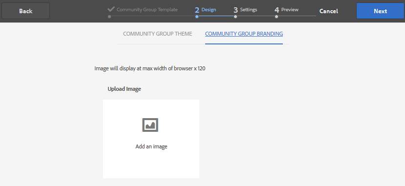

# Console Gruppi per community {#community-groups-console}

La console Gruppi consente di accedere alla creazione di gruppi di community quando la [struttura del modello di un sito community](sites-console.md#step1) include la funzione [gruppi](functions.md#groups-function).

* I gruppi possono essere nidificati all’interno di altri gruppi. Questo accade quando la struttura [del nuovo gruppo](tools-groups.md) contiene la funzione gruppi.
* Solo per l’ambiente di authoring, esiste una procedura guidata per la creazione di gruppi simile alla procedura guidata per la creazione di siti.
* Il fatto che i membri possano o meno creare gruppi dall&#39;ambiente di pubblicazione è configurabile quando si aggiunge una funzione Groups a una struttura di sito community o a una struttura di gruppo community.

Dei tre modelli di gruppo inclusi, solo il modello `Reference Group` include una funzione di gruppo nella sua struttura.

Diversi aspetti dei gruppi comunitari sono:

* Creazione: è possibile creare un nuovo gruppo su autore ed eventualmente su pubblicazione
* Controllo: il gruppo può essere aperto o segreto
* Nidificazione: un gruppo può contenere zero o più gruppi

>[!NOTE]
>
>I gruppi community creati nell&#39;ambiente di pubblicazione prima dell&#39; [esistenza della console Gruppi community](https://helpx.adobe.com/in/experience-manager/6-3/communities/using/version-history.html#FeaturePack1FP1) non verranno elencati nella console Gruppi community e quindi non possono essere modificati utilizzando la console .

>[!NOTE]
>
>Questa console Groups, accessibile solo dalla console Sites di Communities, non deve essere confusa con il membro [Console Groups](members.md) per la gestione dei gruppi di membri.
>
>I gruppi di membri sono gruppi di utenti registrati nell&#39;ambiente di pubblicazione e a cui si accede dall&#39;ambiente di authoring utilizzando il [servizio tunnel](deploy-communities.md#tunnel-service-on-author).

## Creazione gruppo {#group-creation}

Per accedere alla console Gruppi :

* All&#39;autore, accedi con privilegi di amministratore
* Dalla navigazione globale: **[!UICONTROL Community > Sites]**
* Selezionare una cartella del sito community esistente per aprirla
* Selezionare un&#39;istanza di un sito community all&#39;interno della cartella

   * La struttura del sito comunitario deve comprendere una funzione di gruppo
   * Queste schermate sono tratti dall&#39;esercitazione Guida introduttiva dopo la [creazione di gruppi su publish](published-site.md)

Seleziona la cartella **[!UICONTROL Gruppi]** per aprirla.

Quando vengono aperti, vengono visualizzati tutti i gruppi esistenti, creati in fase di creazione o di pubblicazione.

Da questa console Gruppi è possibile creare nuovi gruppi.

* Pulsante Seleziona **[!UICONTROL Crea gruppo]**

### Passaggio 1: Modello Gruppo community {#step-community-group-template}

* **[!UICONTROL Titolo]** gruppo community: Titolo da visualizzare per il gruppo.

   Il titolo viene visualizzato sul sito pubblicato per il gruppo.

* **[!UICONTROL Descrizione]** gruppo community: Descrizione del gruppo.
* **[!UICONTROL Radice]** gruppo community: Percorso principale del gruppo.

   La radice predefinita è il sito padre, ma la radice può essere spostata in qualsiasi posizione all&#39;interno del sito Web. Non è consigliabile modificarlo.

* **[!UICONTROL Menu Lingue disponibili supplementari per i gruppi della community]** : Utilizza il menu a discesa per selezionare le lingue del gruppo community disponibili. Nel menu vengono visualizzate tutte le lingue in cui viene creato il sito della community principale. In questo singolo passaggio gli utenti possono selezionare una di queste lingue per creare gruppi in più impostazioni internazionali. Lo stesso gruppo viene creato in più lingue specificate nella console Gruppi dei rispettivi siti della community.

* **[!UICONTROL Nome]** gruppo community: Nome della pagina principale del gruppo visualizzata nell&#39;URL

   * Ricontrolla il nome in quanto non viene facilmente modificato dopo la creazione del gruppo
   * L&#39;URL di base verrà visualizzato sotto la sezione `Community Group Name`
   * Per un URL valido, aggiungi &quot;.html&quot;

      *Esempio*, `http://localhost:4502/content/sites/mysight/en/mygroup.html`

* **[!UICONTROL Menu]** del gruppo della community: utilizza il menu a discesa per scegliere un modello di gruppo  [community](tools.md) disponibile.

### Passaggio 2: Progettazione {#step-design}

#### TEMA DEL GRUPPO COMUNITARIO {#community-group-theme}

Il framework utilizza `Twitter Bootstrap` per apportare al sito una progettazione reattiva e flessibile. È possibile selezionare uno dei molti temi di Bootstrap precaricati per assegnare uno stile al modello di gruppo community selezionato oppure caricare un tema di Bootstrap.

Quando è selezionato, il tema viene sovrapposto con un segno di spunta blu opaco.

È possibile selezionare un tema diverso dal tema del sito padre.

Dopo la pubblicazione del sito community, è possibile [modificare le proprietà](#modifying-group-properties) e selezionare un tema diverso.

#### MARCHIO DEL GRUPPO COMUNITARIO {#community-group-branding}

Il branding del sito community è un’immagine visualizzata come intestazione nella parte superiore di ogni pagina. È possibile visualizzare un banner per il gruppo che differisce dalle altre pagine del sito.

Le dimensioni dell’immagine devono essere pari alla visualizzazione prevista della pagina nel browser e a 120 pixel in altezza.

Quando crei o selezioni un’immagine, tieni presente quanto segue:

* L&#39;altezza dell&#39;immagine viene ritagliata a 120 pixel misurati dal bordo superiore dell&#39;immagine
* L&#39;immagine viene fissata al bordo sinistro della finestra del browser
* L&#39;immagine non viene ridimensionata, in modo tale che quando la larghezza dell&#39;immagine è...

   * Inferiore alla larghezza del browser, l&#39;immagine si ripeterà in orizzontale
   * Maggiore della larghezza del browser, l&#39;immagine apparirà ritagliata

### Passaggio 3: Impostazioni {#step-settings}

#### MODERAZIONE {#moderation}

Per impostazione predefinita, viene ereditato l&#39;elenco dei moderatori del sito della comunità padre.

È possibile aggiungere moderatori specifici al gruppo:

* Cerca membri (da ambiente di pubblicazione) per aggiungerli come moderatori

#### ISCRIZIONE {#membership}

L&#39;impostazione di appartenenza consente di selezionare uno dei tre modi per garantire un gruppo di comunità.

* Iscrizione opzionale

   Se selezionato, il gruppo community è un gruppo pubblico. I membri del sito possono partecipare al gruppo e pubblicare senza entrare esplicitamente nel gruppo. Il valore predefinito è selezionato.
* Iscrizione obbligatoria

   se selezionato, il gruppo community è un gruppo aperto. I membri del sito della community possono visualizzare i contenuti del gruppo, ma devono unirsi al gruppo prima di poter pubblicare contenuti. I membri si uniscono selezionando il pulsante `Join` nell’ambiente di pubblicazione. Il valore predefinito non è selezionato.

* Iscrizione limitata

   se selezionato, il gruppo community è un gruppo segreto. I membri della comunità devono essere invitati esplicitamente. I membri invitati vengono inseriti nella casella di ricerca. I membri possono essere aggiunti successivamente utilizzando le [console Membri e Gruppi](members.md) nell’ambiente di authoring. Il valore predefinito non è selezionato.

#### MINIATURA {#thumbnail}

La miniatura è un’immagine da visualizzare per il gruppo all’atto dell’authoring e della pubblicazione.

Le dimensioni ottimali per un&#39;immagine di gruppo sono 170 x 90 pixel in un formato immagine supportato (come JPG o PNG).

Se non viene aggiunta alcuna immagine, viene visualizzata un’immagine predefinita.

### Passaggio 4: Crea gruppo {#step-create-group}

Se sono necessarie delle regolazioni, utilizza il pulsante **Indietro** per eseguirle.

Una volta selezionato e avviato **Crea**, il processo di creazione del gruppo non può essere interrotto.

Al termine del processo, la scheda per il nuovo sito della sottocomunità (gruppo) viene visualizzata nella console Gruppi di siti di Communities, da cui gli autori possono aggiungere contenuti di pagina o gli amministratori possono modificare le proprietà del sito.

>[!NOTE]
>
>Il gruppo viene creato in tutte le lingue, come specificato in [Passaggio 1: Modello per gruppo community](groups.md#step1communitygrouptemplate) in Lingue disponibili supplementari per gruppi community, nella console Gruppi community dei rispettivi siti community.

## Creazione di contenuti di gruppo {#authoring-group-content}

Il contenuto della pagina di un gruppo può essere creato con gli stessi strumenti di qualsiasi altra pagina AEM. Per aprire il gruppo per l’authoring, selezionate l’icona Apri sito che viene visualizzata quando passate il puntatore del mouse sulla scheda del gruppo.

## Modifica delle proprietà del gruppo {#modifying-group-properties}

Le proprietà di un sito della sottocomunità esistente, specificate durante il processo di creazione del gruppo community, possono essere modificate selezionando l’icona Modifica sito che viene visualizzata quando si passa il mouse sulla scheda del gruppo:

I dettagli delle seguenti proprietà corrispondono alle descrizioni fornite nella sezione [Creazione di gruppi](#group-creation) . È possibile modificare qualsiasi gruppo nidificato, creato nell’ambiente di pubblicazione o di authoring.

### Modifica base {#modify-basic}

Il pannello BASIC consente di modificare

* Titolo gruppo community
* Descrizione gruppo community

Impossibile modificare il nome del gruppo comunitario.

La scelta di un diverso modello di gruppo community non avrebbe alcun impatto su un sito di gruppo community esistente, in quanto non rimane alcuna connessione tra modelli e siti.

È invece possibile modificare la [STRUTTURA](#modify-structure) della sottocomunità.

### Modifica struttura {#modify-structure}

Il pannello STRUTTURA consente di modificare la struttura inizialmente creata dal modello di gruppo community selezionato durante la creazione del sito sub-community dall’ambiente di authoring o di pubblicazione. Dal pannello è possibile

* Trascina [funzioni community aggiuntive](functions.md) nella struttura del sito
* In un&#39;istanza di una funzione comunitaria nella struttura del sito:

   * **`gear icon`**

      Modifica le impostazioni, inclusi il titolo di visualizzazione e il nome dell&#39;URL, nonché [gruppi di membri privilegiati](users.md#privilegedmembersgroups)

   * **`trashcan icon`**

      Rimuovere (eliminare) funzioni dalla struttura del sito

   * **`grid icon`**

      Modificare l&#39;ordine delle funzioni come visualizzato nella barra di navigazione di livello superiore del sito

>[!CAUTION]
>
>Anche se il titolo visualizzato può essere modificato senza effetti collaterali, si sconsiglia di modificare il nome URL di una funzione community appartenente a un sito community.
>
>Ad esempio, la ridenominazione dell’URL non comporterà lo spostamento dell’UGC esistente, con l’effetto di perdere l’UGC.

>[!CAUTION]
>
>La funzione dei gruppi deve *non* essere la funzione *prima né la funzione unica* nella struttura del sito.
>
>Qualsiasi altra funzione, come la [funzione pagina](functions.md#page-function), deve essere inclusa ed elencata per prima.

#### Esempio: Aggiunta di una funzione di calendario a una struttura della sottocomunità (gruppo) {#example-adding-a-calendar-function-to-a-sub-community-group-structure}

### Modifica progettazione {#modify-design}

Il pannello PROGETTAZIONE consente di modificare il tema:

* [Tema gruppo community](#community-group-theme)
* [Marchio gruppo community](#community-group-branding)

   * Scorri fino alla parte inferiore del pannello per modificare l’immagine del marchio

### Modifica impostazioni {#modify-settings}

Il pannello IMPOSTAZIONI consente di aggiungere community [moderatori](#moderation).

### Modifica appartenenza {#modify-membership}

Il pannello [MEMBERSHIP](#membership) è solo informativo. Non è possibile modificare il tipo di appartenenza al gruppo stabilito, sia esso facoltativo, obbligatorio o limitato.

### Modifica miniatura {#modify-thumbnail}

Il pannello [THUMBNAIL](#thumbnail) consente di caricare un’immagine per rappresentare il gruppo di community per i visitatori del sito nell’ambiente di pubblicazione e nella console Gruppi del sito di Communities nell’ambiente di authoring.

## Pubblicazione del gruppo {#publishing-the-group}

Una volta creato o modificato un gruppo di community, è possibile pubblicare (attivare) il gruppo selezionando l&#39;icona `Publish Site` .

Dopo la corretta pubblicazione del gruppo, viene visualizzato un messaggio:

>[!CAUTION]
>
>Il sito della comunità padre e i gruppi padre dovrebbero essere già stati pubblicati.
>
>Il sito community e i gruppi nidificati devono essere pubblicati in modo dall’alto verso il basso.

## Eliminazione del gruppo {#deleting-the-group}

Per eliminare un gruppo dalla console Gruppi della community, seleziona l’icona Elimina gruppo , visualizzata quando si passa il mouse sul gruppo.

Questo rimuove tutti gli elementi associati al gruppo, ad esempio tutti i contenuti del gruppo vengono eliminati in modo permanente e le appartenenze utente vengono rimosse dal sistema.
