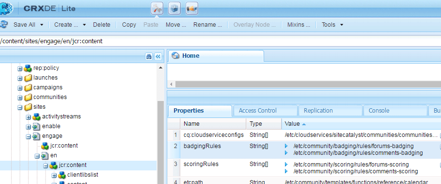

# Punteggio e badge delle community {#communities-scoring-and-badges}

## Panoramica {#overview}

La funzione di valutazione e badge di AEM Communities consente di identificare e premiare i membri della community.

I principali aspetti del punteggio e dei badge sono:

* [Assegnare ](#assign-and-revoke-badges) un badge per identificare il ruolo di un membro nella community

* [Assegnazione di base dei ](#enable-scoring) badgesto ai membri per incoraggiarne la partecipazione (quantità di contenuto creato)
* [Assegnazione avanzata di ](advanced.md) badgto per identificare i membri come esperti (qualità dei contenuti creati)

**** L’assegnazione dei badge  [non è abilitata per impostazione predefinita](implementing-scoring.md#main-pars-text-237875536).

>[!CAUTION]
>
>La struttura di implementazione visibile in CRXDE Lite è soggetta a modifiche una volta che l’interfaccia utente diventa disponibile.

## Badge {#badges}

I badge vengono inseriti sotto il nome di un membro per indicare il suo ruolo o la sua posizione nella comunità. I badge possono essere visualizzati come immagine o come nome. Quando viene visualizzato come immagine, il nome viene incluso come testo alternativo per l’accessibilità.

Per impostazione predefinita, i badge si trovano nell’archivio all’indirizzo

* /etc/community/badging/images

Se vengono memorizzati in una posizione diversa, tutti devono essere accessibili in lettura.

I distintivi sono differenziati in UGC per quanto riguarda il fatto che siano stati assegnati o sono stati guadagnati in base alle regole. Al momento, i badge assegnati vengono visualizzati come testo e i badge guadagnati vengono visualizzati come immagine.

### Interfaccia utente per la gestione dei badge {#badge-management-ui}

La console Communities [Badges](badges.md) consente di aggiungere badge personalizzati che possono essere visualizzati per un membro al momento della maturazione (assegnazione) o quando assume un ruolo specifico nella community (assegnazione).

### Badge assegnati {#assigned-badges}

I badge basati sul ruolo vengono assegnati da un amministratore ai membri della community in base al loro ruolo nella community.

I badge assegnati (e awared) sono memorizzati nell’ [SRP](srp.md) selezionato e non sono direttamente accessibili. Fino a quando non è disponibile un’interfaccia grafica, l’unico modo per assegnare i badge basati su ruoli consiste nel farlo con codice o cURL. Per istruzioni su cURL, consulta la sezione intitolata [Assegnare e revocare i badge](#assign-and-revoke-badges).

Nella versione sono inclusi tre badge basati sui ruoli:

* Moderatore

   `/etc/community/badging/images/moderator/jcr:content/moderator.png`

* Gestione dei gruppi

   `/etc/community/badging/images/group-manager/jcr:content/group-manager.png`

* Membro privilegiato

   `/etc/community/badging/images/privileged-member/jcr:content/privileged-member.png`


### Badge aggiudicati {#awarded-badges}

I badge basati sui premi vengono assegnati dal servizio di punteggio ai membri della comunità in base alle regole applicate alla loro attività nella comunità.

Affinché i badge vengano visualizzati come ricompensa per l’attività, devono verificarsi due eventi:

* Il badging deve essere [abilitato](#enable-badges-for-component) per il componente caratteristica
* Le regole di valutazione e contrassegno devono essere [applicate](#apply-rules-to-content) alla pagina (o all’predecessore) in cui è posizionato il componente

Nella versione sono inclusi tre badge basati su premi:

* Oro

   `/etc/community/badging/images/gold-badge/jcr:content/gold.png`

* Argento

   `/etc/community/badging/images/silver-badge/jcr:content/silver.png`

* Bronzo

   `/etc/community/badging/images/bronze-badge/jcr:content/bronze.png`


>[!NOTE]
>
>Le regole di valutazione possono essere configurate per assegnare punti negativi per i post contrassegnati come inappropriati e quindi influenzare il valore del punteggio. Tuttavia, una volta guadagnato un badge, questo non verrà rimosso automaticamente a causa di modifiche della regola di riduzione del punto di punteggio o della regola di punteggio.
>
>I badge assegnati possono essere revocati nello stesso modo dei badge assegnati. Consulta la sezione [Assegna e revoca badge](#assign-and-revoke-badges) . I miglioramenti futuri includeranno un’interfaccia utente per gestire i badge dei membri.

### Badge personalizzati {#custom-badges}

I badge personalizzati possono essere installati utilizzando la [console Badge](badges.md) e possono essere assegnati o specificati nelle regole di badging.

Quando vengono installati dalla console Badge , i badge personalizzati vengono replicati automaticamente nell’ambiente di pubblicazione.

## Abilita punteggio {#enable-scoring}

Il punteggio non è abilitato per impostazione predefinita. I passaggi fondamentali per l’impostazione e l’abilitazione del punteggio e del rilascio dei badge sono i seguenti:

* Identificare le regole per i punti di guadagno ([regole di punteggio](#scoring-rules))
* Per i punti accumulati per regole di punteggio, assegna [badge](#badges) ([regole di badging](#badging-rules))

* [Applicare le regole di valutazione e contrassegno a un sito community](#apply-rules-to-content)
* [Abilitazione del badge per le funzioni della community](#enable-badges-for-component)

Consulta la sezione [Test rapido](#quick-test) per abilitare il punteggio per un sito community utilizzando le regole di punteggio e contrassegno predefinite per forum e commenti.

### Applica regole al contenuto {#apply-rules-to-content}

Per abilitare il punteggio e i badge, aggiungi le proprietà `scoringRules` e `badgingRules`a qualsiasi nodo della struttura del contenuto del sito.

Se il sito è già pubblicato, dopo aver applicato tutte le regole e aver abilitato i componenti, ripubblica il sito.

Le regole che si applicano a un componente abilitato per i badging sono quelle per il nodo corrente o per il relativo predecessore.

Se il nodo è di tipo `cq:Page` (consigliato), quindi, utilizzando CRXDE|Lite, aggiungi le proprietà al relativo nodo `jcr:content`.

| **Proprietà** | **Tipo** | **Descrizione** |
|---|---|---|
| badgingRules | Stringa[] | un elenco array di [regole di badging](#badging-rules) |
| scoringRules | Stringa[] | un elenco array di [regole di punteggio](#scoring-rules) |

>[!NOTE]
>
>Se una regola di punteggio sembra non avere alcun effetto sull’assegnazione dei badge, assicurati che la regola di punteggio non sia stata bloccata dalla proprietà scoringRules della regola di badging. Vedere la sezione intitolata [Regole di badging](#badging-rules).

### Abilita badge per componente {#enable-badges-for-component}

Le regole di valutazione e di binding sono valide solo per le istanze di componenti che hanno abilitato il contrassegno modificando la configurazione del componente in [modalità di authoring](author-communities.md).

Una proprietà booleana `allowBadges` abilita/disabilita la visualizzazione dei badge per un’istanza di componente. È configurabile nella finestra di dialogo [modifica componente](author-communities.md) per i componenti forum, QnA e commento tramite una casella di controllo denominata **Badge di visualizzazione**.

#### Esempio: allowBadges per l’istanza del componente Forum {#example-allowbadges-for-forum-component-instance}


>[!NOTE]
>
>Qualsiasi componente può essere sovrapposto per visualizzare i badge utilizzando il codice HBS presente in forum, QnA e commenti come esempio.

## Regole di valutazione {#scoring-rules}

Le regole di valutazione sono alla base del punteggio allo scopo di assegnare i badge.

Molto semplicemente, ogni regola di punteggio è un elenco di una o più regole secondarie. Le regole di valutazione vengono applicate al contenuto del sito della community per identificare le regole da applicare quando i badge sono abilitati.

Le regole di valutazione vengono ereditate ma non aggiunte. Esempio:

* Se la pagina2 contiene la regola di punteggio2 e la relativa pagina1 contiene la regola di punteggio1
* Un&#39;azione su un componente page2 richiama sia la regola1 che la regola2
* Se entrambe le regole contengono sub-regole applicabili per lo stesso `topic/verb`:

   * Solo la regola secondaria da rule2 influirà sul punteggio
   * I punteggi provenienti da entrambe le sottorubriche non vengono sommati

Se è presente più di una regola di punteggio, i punteggi vengono mantenuti separatamente per ogni regola.

Le regole di punteggio sono nodi di tipo `cq:Page` con proprietà sul relativo nodo `jcr:content`che specificano l’elenco di regole secondarie che lo definiscono.

I punteggi sono memorizzati in SRP.

>[!NOTE]
>
>Best practice: assegna un nome univoco a ciascuna regola di punteggio.
>
>I nomi delle regole di punteggio devono essere univoci a livello globale; non devono terminare con lo stesso nome.
>
>Un esempio di cosa *non* fare:\
>/etc/community/scoring/rules/site1/forums-scoring\
>/etc/community/scoring/rules/site2/forums-scoring

### Regole di valutazione secondarie {#scoring-sub-rules}

Le regole del punteggio contengono le proprietà che descrivono i valori per la partecipazione alla community.

Ogni sottoregola di punteggio identifica

* Quali attività vengono tracciate
* Quale funzione comunitaria specifica è coinvolta?
* Quanti punti sono attribuiti

Per impostazione predefinita, i punti vengono assegnati al membro che esegue un&#39;azione, a meno che la regola secondaria non specifichi il proprietario del contenuto come destinatario dei punti ( `forOwner`).

Ogni regola secondaria può essere inclusa in una o più regole di punteggio.

Il nome della regola secondaria in genere segue il pattern di utilizzo di un oggetto *oggetto, oggetto* e *verb*. Esempio:

* creazione-commento-membro
* voto riservato ai membri

Le sub-regole sono nodi di tipo `cq:Page` con proprietà sul relativo nodo `jcr:content`che specificano i [verbi e gli argomenti](#topics-and-verbs) .

<table> 
 <tbody> 
  <tr> 
   <th>Proprietà</th> 
   <th>Tipo</th> 
   <th> Valore Descrizione</th> 
  </tr> 
  <tr> 
   <td><i><code>VERB</code></i></td> 
   <td>Lungo</td> 
   <td> 
    <ul> 
     <li>obbligatorio; il verbo corrisponde a un'azione evento</li> 
     <li>deve esserci almeno una proprietà verbo</li> 
     <li>il verbo deve essere inserito in tutte le lettere maiuscole</li> 
     <li>possono essere presenti più proprietà verbo, ma non sono presenti duplicati</li> 
     <li>il valore è il punteggio da applicare per questo evento</li> 
     <li>il valore può essere positivo o negativo</li> 
     <li>un elenco di verbi supportati nella versione si trova nella sezione <a href="#topics-and-verbs">Argomenti e verbi</a></li> 
    </ul> </td> 
  </tr> 
  <tr> 
   <td><code>topics</code></td> 
   <td>Stringa[]</td> 
   <td> 
    <ul> 
     <li>facoltativo; limita la sottoregola ai componenti della community identificati da argomenti dell’evento</li> 
     <li>se specificato: value è una stringa con più valori di argomenti dell'evento</li> 
     <li>un elenco di argomenti nella versione si trova nella sezione <a href="#topics-and-verbs">Argomenti e verbi</a></li> 
     <li>l'impostazione predefinita è applicata a tutti gli argomenti associati al verbo o ai verbi</li> 
    </ul> </td> 
  </tr> 
  <tr> 
   <td><code>forOwner</code></td> 
   <td>Booleano</td> 
   <td> 
    <ul> 
     <li>facoltativo; non pertinente quando un membro agisce in base a contenuti di sua proprietà</li> 
     <li>se true, applica il punteggio al proprietario del contenuto su cui viene agito</li> 
     <li>se false, applica il punteggio all'azione del membro</li> 
     <li>il valore predefinito è false</li> 
    </ul> </td> 
  </tr> 
  <tr> 
   <td><code>scoringType</code></td> 
   <td>Stringa</td> 
   <td> 
    <ul> 
     <li>facoltativo; identifica il motore di punteggio</li> 
     <li>se "basic", specifica il motore di punteggio in base alla quantità 
      <ul> 
       <li>incluso nella versione</li> 
      </ul> </li> 
     <li>se "advanced", specifica il motore di punteggio in base alla qualità e alla quantità 
      <ul> 
       <li>richiede un <a href="advanced.md">pacchetto aggiuntivo</a></li> 
      </ul> </li> 
     <li>Il valore predefinito è "basic"</li> 
    </ul> </td> 
  </tr> 
 </tbody> 
</table>

### Regole di valutazione e sottoregole incluse {#included-scoring-rules-and-sub-rules}

Nella versione sono incluse due regole di valutazione per la [Funzione forum](functions.md#forum-function) (una per ciascuna delle componenti Forum e Commenti della funzione Forum):

1. /etc/community/scoring/rules/comments-scoring

   * subRules[] =

      /etc/community/scoring/rules/sub-rules/membro-comment-create

      /etc/community/scoring/rules/sub-rules/Member-receive-vote

      /etc/community/scoring/rules/sub-rules/Member-dare-vote

      /etc/community/scoring/rules/sub-rules/membro-is-moderated

1. /etc/community/scoring/rules/forums-scoring

   * subRules[] =

      /etc/community/scoring/rules/sub-rules/membro-forum-create

      /etc/community/scoring/rules/sub-rules/Member-receive-vote

      /etc/community/scoring/rules/sub-rules/Member-dare-vote

      /etc/community/scoring/rules/sub-rules/membro-is-moderated

**Note:**

* I nodi `rules`e `sub-rules` sono entrambi di tipo cq:Page

* `subRules`è un attributo di tipo Stringon [] the  `jcr:content` node della regola

* `sub-rules` può essere condiviso tra diverse regole di punteggio
* `rules`devono trovarsi in una posizione archivio con autorizzazione di lettura per tutti

   * I nomi delle regole devono essere univoci indipendentemente dalla posizione

### Attivazione di regole di valutazione personalizzate {#activating-custom-scoring-rules}

Eventuali modifiche o aggiunte apportate alle regole di punteggio o alle sotto-regole apportate nell’ambiente di authoring devono essere installate al momento della pubblicazione.

## Regole di contrassegno {#badging-rules}

Le regole di contrassegno collegano le regole di punteggio ai badge specificando:

* Quale regola di punteggio
* Punteggio necessario per ricevere un badge specifico

Le regole di contrassegno sono nodi di tipo `cq:Page` con proprietà sul relativo nodo `jcr:content`che correlano le regole di punteggio a punteggi e badge.

Le regole per il contrassegno consistono in una proprietà obbligatoria `thresholds`che è un elenco ordinato di punteggi mappati su badge. I punteggi devono essere ordinati in valore crescente. Esempio:

* `1|/etc/community/badging/images/bronze-badge/jcr:content/bronze.png`

   * Un badge in bronzo è premiato per guadagnare 1 punto

* `60|/etc/community/badging/images/silver-badge/jcr:content/silver.png`

   * Un distintivo d&#39;argento viene assegnato quando sono stati accumulati 60 punti

* `80|/etc/community/badging/images/gold-badge/jcr:content/gold.png`

   * Un badge in oro è avvertito quando sono stati accumulati 80 punti

Le regole di badging sono associate alle regole di punteggio, che determinano l’accumulo di punti. Consulta la sezione intitolata [Applica regole al contenuto](#apply-rules-to-content).

La proprietà `scoringRules`di una regola di badging limita semplicemente le regole di punteggio che possono essere associate a quella particolare regola di badging.

>[!NOTE]
>
>Procedure consigliate: crea immagini di badge univoche per ogni sito AEM.


<table> 
 <tbody> 
  <tr> 
   <th>Proprietà</th> 
   <th>Tipo</th> 
   <th>Valore Descrizione</th> 
  </tr> 
  <tr> 
   <td>soglie</td> 
   <td>Stringa[]</td> 
   <td><em>(obbligatorio)</em> Stringa con più valori del modulo 'number|path' 
    <ul> 
     <li>number = score</li> 
     <li>| = tratto verticale (U+007C)</li> 
     <li>percorso = percorso completo della risorsa immagine del badge</li> 
    </ul> Le stringhe devono essere ordinate in modo che i numeri aumentino in valore e non deve apparire spazio vuoto tra il numero e il percorso.<br /> Esempio di voce:<br /> <code>80|/etc/community/badging/images/gold-badge/jcr:content/gold.png</code></td> 
  </tr> 
  <tr> 
   <td>badgingType</td> 
   <td>Stringa</td> 
   <td><em>(facoltativo)</em> Identifica il motore di punteggio come "base" o "avanzato". Se desideri utilizzare un motore di punteggio avanzato, consulta <a href="advanced.md">Punteggio avanzato e Badge</a>. Il valore predefinito è "basic".</td> 
  </tr> 
  <tr> 
   <td> 
    <code>scoringRules </code></td> 
   <td>Stringa[]</td> 
   <td>(<em>facoltativo</em>) Una stringa con più valori per limitare la regola di contrassegno agli eventi di punteggio identificati dalle regole di punteggio</td> 
  </tr> 
 </tbody> 
</table>

### Regole di contrassegno incluse {#included-badging-rules}

Nella versione sono incluse due regole di badging corrispondenti alle [Regole di valutazione dei forum e dei commenti](#includedscoringrules).

* /etc/community/badging/rules/comments-badging
* /etc/community/badging/rules/forums-badging

**Note:**

* `rules` i nodi sono di tipo cq:Page
* `rules`devono trovarsi in una posizione archivio con autorizzazione di lettura per tutti

   * I nomi delle regole devono essere univoci indipendentemente dalla posizione

### Attivazione di regole di badging personalizzate {#activating-custom-badging-rules}

Eventuali modifiche o aggiunte apportate alle regole di badging o alle immagini effettuate nell’ambiente di authoring devono essere installate al momento della pubblicazione.

## Assegnare e revocare i badge {#assign-and-revoke-badges}

I badge possono essere assegnati ai membri utilizzando la [console membri](members.md#badges-tab) o a livello di programmazione utilizzando i comandi cURL.

I seguenti comandi cURL mostrano cosa è necessario per una richiesta HTTP per l’assegnazione e la revoca dei badge. Il formato di base è:

cURL -i -X POST -H *header* -u *signin * -F *operation * -F *badge * *membro-profile-url*

*header* = &quot;Accept:application/json&quot;\
intestazione personalizzata da passare al server (richiesta)

*sign* = administrator-id:password\
ad esempio: admin:admin

*operation* = &quot;:operation=social:assignBadge&quot; OR &quot;:operation=social:deleteBadge&quot;

*badge* = &quot;badgeContentPath=*badge-image-file*&quot;

*badge-image-file* = posizione del file di immagine del badge nell&#39;archivio\
ad esempio: /etc/community/badging/images/moderator/jcr:content/moderator.png

*membro-profile-url* = endpoint per il profilo del membro al momento della pubblicazione\
ad esempio: https://&lt;server>:&lt;port>/home/users/community/riley/profile.social.json

>[!NOTE]
>
>Il *membro-profile-url*
>
>* Può fare riferimento a un&#39;istanza dell&#39;autore se il servizio [Tunnel Service](users.md#tunnel-service) è abilitato
>* Può essere un nome casuale e oscuro - consulta [Lista di controllo sicurezza](../../help/sites-administering/security-checklist.md#verify-that-you-are-not-disclosing-personally-identifiable-information-in-the-users-home-path) per quanto riguarda l’ID autorizzabile

>


### Esempi: {#examples}

#### Assegnare un badge del moderatore {#assign-a-moderator-badge}

```shell
curl -i -X POST -H "Accept:application/json" -u admin:admin -F ":operation=social:assignBadge" -F "badgeContentPath=/etc/community/badging/images/moderator/jcr:content/moderator.png" /home/users/community/updcs9DndLEI74DB9zsB/profile.social.json
```

#### Revoca di un badge d&#39;argento assegnato {#revoke-an-assigned-silver-badge}

```shell
curl -i -X POST -H "Accept:application/json" -u admin:admin -F ":operation=social:deleteBadge" -F "badgeContentPath=/etc/community/badging/images/silver/jcr:content/silver.png" /home/users/community/updcs9DndLEI74DB9zsB/profile.social.json
```

>[!NOTE]
>
>L’utilizzo di cURL per assegnare e revocare i badge funziona per qualsiasi immagine di badge, ma quando viene assegnata al posto di earned, vengono contrassegnati come badge assegnati e gestiti di conseguenza.

## Punteggio e badge per componenti personalizzati {#scoring-and-badges-for-custom-components}

Le regole di valutazione e di contrassegno possono essere create per i componenti personalizzati associando gli argomenti evento creati per il componente ai verbi.

## Argomenti e verbi {#topics-and-verbs}

Quando i membri interagiscono con le funzioni di Communities, vengono inviati eventi che possono attivare listener asincroni, come notifiche e punteggio.

L&#39;istanza SocialEvent di un componente registra gli eventi come `actions`che si verificano per un `topic`. SocialEvent include un metodo per restituire un `verb`associato all&#39;azione. Esiste una relazione *n-1* tra `actions`e `verbs`.

Per i componenti della community consegnati, le tabelle seguenti descrivono i valori `verbs`definiti per ogni `topic`disponibile per l&#39;utilizzo in [regole secondarie di punteggio](#scoring-sub-rules).

>[!NOTE]
>
>Una nuova proprietà booleana, `allowBadges`, abilita/disabilita la visualizzazione dei badge per un’istanza di componente. Sarà configurabile nelle finestre di dialogo di modifica dei componenti [aggiornate](author-communities.md) tramite una casella di controllo denominata **Badge di visualizzazione**.

**[Calendario](calendar.md)**
ComponentSocialEvent  `topic`= com/adobe/cq/social/calendar

| **Verbo** | **Descrizione** |
|---|---|
| POST | un membro crea un evento calendario |
| AGGIUNGI | commenti dei membri su un evento calendario |
| AGGIORNA | modifica dell&#39;evento calendario o del commento del membro |
| ELIMINA | l&#39;evento o il commento del calendario del membro viene eliminato |

**[Commenti](comments.md)**
ComponentSocialEvent  `topic`= com/adobe/cq/social/comment

| **Verbo** | **Descrizione** |
|---|---|
| POST | crea un commento |
| AGGIUNGI | risposta del membro al commento |
| AGGIORNA | modifica del commento del membro |
| ELIMINA | il commento del membro viene eliminato |

**[Libreria file](file-library.md)**
ComponentSocialEvent  `topic`= com/adobe/cq/social/fileLibrary

| **Verbo** | **Descrizione** |
|---|---|
| POST | crea una cartella |
| ATTACCO | il membro carica un file |
| AGGIORNA | un membro aggiorna una cartella o un file |
| ELIMINA | elimina una cartella o un file |

**[Forum](forum.md)**
ComponentSocialEvent  `topic`= com/adobe/cq/social/forum

| **Verbo** | **Descrizione** |
|---|---|
| POST | argomento del forum crea membri |
| AGGIUNGI | risposte dei membri all&#39;argomento del forum |
| AGGIORNA | argomento forum o risposta del membro viene modificato |
| ELIMINA | l&#39;argomento o la risposta del forum del membro è cancellata |

**[Journal](blog-feature.md)**
ComponentSocialEvent  `topic`= com/adobe/cq/social/journal

| **Verbo** | **Descrizione** |
|---|---|
| POST | crea un articolo di blog |
| AGGIUNGI | commenti di un membro su un articolo di blog |
| AGGIORNA | articolo o commento del blog del membro è modificato |
| ELIMINA | l&#39;articolo o il commento del blog del membro è stato cancellato |

**[QnA](working-with-qna.md)**
ComponentSocialEvent  `topic` = com/adobe/cq/social/qna

| **Verbo** | **Descrizione** |
|---|---|
| POST | crea una domanda QnA |
| AGGIUNGI | crea una risposta QnA |
| AGGIORNA | viene modificata la domanda o la risposta QnA del membro |
| SELEZIONA | risposta del membro selezionata |
| ANNULLA | la risposta del membro è deselezionata |
| ELIMINA | la domanda o la risposta QnA del membro viene eliminata |

**[Recensioni](reviews.md)**
ComponentSocialEvent  `topic`= com/adobe/cq/social/review

| **Verbo** | **Descrizione** |
|---|---|
| POST | crea revisione |
| AGGIORNA | modifica della revisione del membro |
| ELIMINA | la revisione del membro viene eliminata |

**[Rating](rating.md)**
ComponentSocialEvent  `topic`= com/adobe/cq/social/tally/rating

| **Verbo** | **Descrizione** |
|---|---|
| AGGIUNGI VALUTAZIONE | il contenuto del membro è stato valutato |
| RIMUOVI VALUTAZIONE | il contenuto del membro è stato valutato in modo non corretto |

**[Voto](voting.md)**
ComponentSocialEvent  `topic`= com/adobe/cq/social/tally/vote

| **Verbo** | **Descrizione** |
|---|---|
| AGGIUNGI VOTO | il contenuto del membro è stato votato |
| RIMUOVI VOTO | il contenuto del membro è stato respinto |

****
Componenti abilitati per moderazioneSocialEvent  `topic`= com/adobe/cq/social/moderation

| **Verbo** | **Descrizione** |
|---|---|
| NEGA | contenuto del membro negato |
| FLAG-AS INAPPROPRIATO | il contenuto del membro è contrassegnato |
| NON APPROPRIATO | il contenuto del membro viene rimosso |
| ACCETTARE | il contenuto del membro è approvato dal moderatore |
| CHIUDI | il membro chiude il commento alle modifiche e alle risposte |
| APERTO | riapre il commento |

### Eventi dei componenti personalizzati {#custom-component-events}

Per un componente personalizzato, viene creata un&#39;istanza di SocialEvent per registrare gli eventi del componente come `actions`che si verificano per un `topic`.

Per supportare il punteggio, SocialEvent deve sovrascrivere il metodo `getVerb()` in modo che venga restituito un `verb`appropriato per ogni elemento `action`. Il `verb` restituito per un&#39;azione può essere uno dei più comunemente utilizzati (come `POST`) o uno specializzato per il componente (come `ADD RATING`). Esiste una relazione *n-1* tra `actions`e `verbs`.

## Risoluzione dei problemi {#troubleshooting}

### I badge non compaiono {#badges-are-not-appearing}

Se al contenuto del sito web sono state applicate regole di valutazione e contrassegno, ma non sono stati avvertiti badge per alcuna attività, assicurati che i badge siano stati abilitati per l’istanza del componente.

Vedere [Abilita badge per componente](#enable-badges-for-component).

### La regola di punteggio non ha alcun effetto {#scoring-rule-has-no-effect}

Se sono state applicate regole di punteggio e contrassegno al contenuto del sito web e i badge vengono assegnati per alcune azioni, ma non per altre, verifica che la regola di badging non abbia limitato le regole di punteggio a cui si applica.

Vedere la proprietà `scoringRules`di [Regole di contrassegno](#badging-rules).

### Typo sensibile a maiuscole e minuscole {#case-sensitive-typo}

La maggior parte delle proprietà e dei valori, in particolare i verbi, sono sensibili all&#39;uso di maiuscole e minuscole. I verbi devono essere tutti UPPERCASE quando utilizzati in una regola secondaria di punteggio.

Se la funzione non funziona come previsto, verifica che i dati siano stati immessi correttamente.

## Test rapido {#quick-test}

Puoi provare rapidamente a usare il punteggio e il contrassegno utilizzando il sito [Esercitazione introduttiva](getting-started.md) (coinvolgi):

* Accedere ad CRXDE Lite sull’autore
* Passa alla pagina di base:

   * /content/sites/it/jcr:content

* Aggiungi la proprietà badgingRules :

   * **Nome**: `badgingRules`
   * **Tipo**: `String`
   * Seleziona **[!UICONTROL Multi]**
   * Seleziona **[!UICONTROL Aggiungi]**
   * Inserisci `/etc/community/badging/rules/forums-badging`
   * Seleziona `+`
   * Inserisci `/etc/community/badging/rules/comments-badging`
   * Seleziona **[!UICONTROL OK]**

* Aggiungi la proprietà scoringRules :

   * **Nome**: `scoringRules`
   * **Tipo**: `String`
   * Seleziona **[!UICONTROL Multi]**
   * Seleziona **[!UICONTROL Aggiungi]**
   * Inserisci `/etc/community/scoring/rules/forums-scoring`
   * Seleziona `+`
   * Inserisci `/etc/community/scoring/rules/comments-scoring`
   * Seleziona **[!UICONTROL OK]**

* Seleziona **[!UICONTROL Salva tutto]**



Successivamente, assicurati che i componenti forum e commenti consentano la visualizzazione dei badge:

* Utilizzare ancora CRXDE Lite
* Passa al componente forum

   * `/content/sites/engage/en/forum/jcr:content/content/primary/forum`

* Aggiungi la proprietà booleana allowBadges, se necessario, e accertati che sia vera

   * **Nome**: `allowBadges`
   * **Tipo**: `Boolean`
   * **Valore**:  `true`


Successivamente, [ripubblicare](sites-console.md#publishing-the-site) il sito della community.

Infine,

* Passa al componente nell’istanza di pubblicazione
* Accedi come membro della community (ad esempio: weston.mccall@dodgit.com / password)
* Pubblica un nuovo argomento del forum
* La pagina deve essere aggiornata affinché il badge sia visibile

   * Disconnessione e accesso come membro della community diverso (ad esempio: aaron.mcdonald@mailinator.com / password)

* Selezionare il forum

Questo dovrebbe guadagnare al membro della comunità un badge di bronzo visibile con il loro post sul forum a causa della prima soglia della regola di badging del forum che è un punteggio di 1.


## Informazioni aggiuntive {#additional-information}

Per ulteriori informazioni, consulta la pagina [Punteggio e Badges Essentials](configure-scoring.md) per gli sviluppatori.

Per informazioni sul motore di punteggio avanzato, consulta [Punteggio avanzato e Badge](advanced.md).

La classifica configurabile [component](enabling-leaderboard.md) e [function](functions.md#leaderboard-function) semplifica la visualizzazione dei membri e dei relativi punteggi su un sito community.
