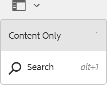
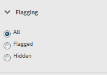

# Console di moderazione {#moderation-console}

In  AEM Communities, la [moderazione di contenuti](moderate-ugc.md) della community è possibile sia dall&#39;ambiente di creazione che da quello di pubblicazione da parte di amministratori e moderatori della comunità (membri della comunità attendibili assegnati come moderatori).

Gli amministratori e i moderatori della community possono eseguire anche la moderazione [contestuale](in-context.md) nell’ambiente di pubblicazione.

Una funzione di tutti i siti  della community è una voce di `Administration`menu disponibile per gli utenti che accedono con privilegi amministrativi. Il `Administration`collegamento consente di accedere alla console Moderazione.

Dalla console Moderazione, gli amministratori e i moderatori della community avranno accesso a tutti i contenuti generati dagli utenti (UGC) per i quali dispongono dell’autorizzazione per moderare. Se è consentito moderare più siti, è possibile visualizzare i post in tutti i siti o filtrare in base a siti di comunità selezionate.

Per ulteriori informazioni, visita [Gestione di utenti e gruppi](users.md)di utenti.

La console Moderazione supporta:
* Esecuzione di attività di moderazione in massa
* Ricerca UGC
* Visualizzazione dei dettagli UGC
* Visualizzazione dei dettagli dell’autore UGC

È possibile eseguire le attività di moderazione solo se l&#39;accesso è stato effettuato come amministratore o membro con ` [moderator permissions](in-context.md#identifyingtrustedmembers)`.

## Accesso all&#39;ambiente di pubblicazione {#publish-environment-access}

L&#39;accesso alla console Moderazione da un sito community pubblicato avviene tramite un collegamento Amministrazione che viene visualizzato al momento dell&#39;accesso di un moderatore della community.

Selezionando il collegamento Amministrazione, viene visualizzata la console Moderazione:

## Accesso all&#39;ambiente di authoring {#author-environment-access}

Nell’ambiente di authoring, per accedere alla console Moderazione

* Dalla navigazione globale: **[!UICONTROL Navigazione > Community > Moderazione]**

È possibile eseguire le attività di moderazione solo se l&#39;accesso è stato effettuato come amministratore o come membro ` [moderator permissions](in-context.md#identifyingtrustedmembers)`. L&#39;unico contenuto della community visualizzato è quello che il membro che ha effettuato l&#39;accesso può moderare.

>[!NOTE]
>
>L’UGC dell’ambiente di pubblicazione sarà visibile solo per gli autori se l’SRP scelto implementa uno store comune. Ad esempio, per impostazione predefinita l’archivio è JSRP, che non è uno store comune per l’autore e la pubblicazione. Consultate Archiviazione [dei contenuti](working-with-srp.md)della community.

## Interfaccia utente della console di moderazione {#moderation-console-ui}

Se si esclude la barra di navigazione a sinistra (visualizzata sull’autore, ma non sulla pubblicazione), l’interfaccia utente di moderazione presenta le seguenti aree principali:

* **[Barra di navigazione superiore](#top-navigation-bar)**
* **[Barra degli strumenti](#toolbar)**
* **[Area di contenuto](#content-area)**

### Barra di navigazione superiore {#top-navigation-bar}

La barra di navigazione superiore è costante per tutte le console. Per ulteriori informazioni, consultate [Operazioni](../../help/sites-authoring/basic-handling.md)di base.

### Barra degli strumenti {#toolbar}

La barra degli strumenti, situata sotto la barra di navigazione superiore, fornisce il seguente interruttore di attivazione/disattivazione sul lato sinistro:

* [La barra laterale](moderation.md#filter-rail) Filtro consente di aprire una barra laterale che consente di scegliere le proprietà su cui filtrare il contenuto.

La barra degli strumenti, situata sotto la barra di navigazione superiore, fornisce il seguente interruttore di attivazione/disattivazione sul lato sinistro:

[Barra dei filtri](moderation.md#filter-rail)\
Consente di aprire una barra laterale, selezionando Cerca, che consente di scegliere le proprietà su cui filtrare il contenuto.

### Area contenuto {#content-area}

L&#39;area contenuto contiene informazioni per gli UGC inviati:

* UGC pubblicato
* Nome membro
* avatar membro
* Posizione del post
* Quando è stato pubblicato
* Numero di risposte al post
* [Sentimento](moderate-ugc.md#sentiment) associato al post
* Se approvato, viene visualizzato un segno di spunta
* Se è presente un allegato, viene visualizzata una clip

>[!NOTE]
>
>L&#39;area contenuto presenta uno scorrimento ** infinito, che consente di continuare lo scorrimento fino alla fine del contenuto. La barra degli strumenti rimane in una posizione fissa e visibile sopra l&#39;area contenuto anche durante lo scorrimento.

### Barra Filtro {#filter-rail}

L’icona del pannello laterale apre la barra laterale del filtro. La barra laterale del filtro, visualizzata a sinistra dell&#39;area contenuto, fornisce diversi filtri, ciascuno dei quali ha un effetto immediato sull&#39;UGC di riferimento visualizzato nell&#39;area contenuto.

I filtri all&#39;interno di ciascuna categoria vengono **** suddivisi in OR e i filtri di diverse categorie vengono **** inseriti insieme in AND.

Ad esempio, se selezionate **Domanda** e **Risposta**, il contenuto visualizzato sarà una **domanda** *o* una **risposta**.

Tuttavia, se selezionate **Domanda** e **In sospeso**, verrà visualizzato solo il contenuto che è una **Domanda** ed è **In sospeso**.

>[!NOTE]
>
>I moderatori della community possono aggiungere segnalibri ai filtri predefiniti nell’interfaccia utente della console di moderazione. Poiché questi filtri vengono aggiunti alla fine dell’URL (come parametri della stringa di query), i moderatori possono tornare ai filtri con segnalibro in un secondo momento e condividere anche questi collegamenti.

Quando la barra laterale del filtro è aperta, l’icona Ricerca attiva/disattiva la chiusura del pannello laterale. Tuttavia, per chiudere la barra laterale del filtro e visualizzare solo il contenuto generato dall&#39;utente, fate clic sull&#39;icona Cerca e selezionate l&#39;opzione Solo contenuto.

#### Percorso contenuto {#content-path}

Percorso contenuto limita l&#39;UGC di riferimento visualizzato ai post inseriti nell&#39;archivio del contenuto specificato.

#### Ricerca di testo {#text-search}

La ricerca del testo limita l’UGC di riferimento visualizzato ai post che contengono il testo immesso.

#### Sito {#site}

Il sito limita l&#39;UGC di riferimento visualizzato ai post a siti community selezionati. Se non sono selezionati siti, vengono visualizzati tutti i riferimenti a UGC.

>[!NOTE]
>
>Quando un amministratore accede alla console di moderazione in blocco, vengono visualizzati tutti i riferimenti a UGC, compresi i siti non creati con la procedura guidata [di creazione del](sites-console.md)sito, ad esempio gli esempi di Geometrixx.
>
>Quando l&#39;accesso alla console di moderazione in blocco viene eseguito in seguito alla pubblicazione da parte di un membro della community affidabile, vengono visualizzati solo i riferimenti a UGC creati per i siti della community in cui il membro è autorizzato a moderare e possono essere filtrati con il filtro Sito.

#### Tipo di contenuto {#content-type}

Tipo di contenuto limita l&#39;UGC di riferimento visualizzato ai post del tipo di risorsa selezionato. È possibile selezionare uno o più dei seguenti tipi. Se non è selezionata alcuna opzione, vengono visualizzati tutti i tipi.

* **Commento**
* **Topic forum**
* **Risposta forum**
* **Domanda d/r**
* **Risposta D/R**
* **Articolo di blog**
* **Commento blog**
* **Evento calendario**
* **Commento calendario**
* **Cartella libreria file**
* **Documento libreria file**
* **Idea**
* **Commento ideazione**

#### Tipi di contenuto aggiuntivi {#additional-content-types}

Per aggiungere ulteriori risorse da filtrare:

* Su un’istanza di creazione
* Accesso come amministratore
* Apri console [Web](http://localhost:4502/system/console/configMgr)
* Individua `AEM Communities Moderation Dashboard Filters`
* Selezionare la configurazione da aprire in modalità di modifica
* Immettere ResourceType di un componente su cui filtrare
   * Ad esempio, per filtrare i componenti per il voto inclusi, immettere:\
      `Voting=social/tally/components/hbs/voting`

* Seleziona Salva
* Aggiornamento della console Community - Moderazione

Il risultato è un nuovo filtro selezionabile per `Voting`il gruppo di `Content Type` filtri.

Quando il filtro viene selezionato, il contenuto del dashboard mostrerà UGC che corrisponde a qualsiasi tipo di risorsa immesso.

#### Stato {#status}

Lo stato limita l&#39;UGC di riferimento visualizzato ai post dello stato selezionato, che possono essere uno o più dei messaggi in sospeso, approvati, rifiutati o chiusi, nonché bozza o pianificati per gli articoli del blog e risposta o non risposta alle domande di QnA. Se non è selezionata alcuna opzione, vengono visualizzati tutti gli elementi.

>[!NOTE]
>
>Se è selezionato solo lo stato Non risposto, il moderatore visualizzerà tutto il contenuto (per tutti i tipi di contenuto) tranne le domande cui è stato risposto. Questo perché la proprietà responsabile della domanda cui è stata fornita la risposta non esiste nel caso di domande senza risposta e altri contenuti quali l&#39;argomento del forum, l&#39;articolo del blog o i commenti.

#### Segnalazione {#flagging}

Contrassegno limita l’UGC di riferimento visualizzato ai post contrassegnati o nascosti.

Una volta che un contenuto è stato contrassegnato, rimane contrassegnato fino a quando non si annulla l’evidenziazione di quel singolo contenuto, selezionando nuovamente il pulsante **[!UICONTROL Contrassegna]** . Tenete presente che non esistono livelli di contrassegno, ad esempio importanti o successivi.

#### Membri {#members}

I membri limitano l&#39;UGC di riferimento visualizzato a UGC pubblicato dal nome membro immesso.

#### Pubblicato nell&#39;ultimo/a {#posted-in-the-last}

Pubblicato nell’ultimo limita la visualizzazione dell’UGC di riferimento ai post effettuati nell’ultima ora, giorno, settimana, mese o anno.

#### Sentimento {#sentiment}

[Il sentimento](moderate-ugc.md#sentiment) limita l&#39;UGC di riferimento visualizzato ai post con un valore sentimentale positivo, negativo o neutro.

## Azioni di moderazione {#moderation-actions}

[Le azioni](moderate-ugc.md#moderation-actions) di moderazione possono essere eseguite su una o più selezioni effettuate nell&#39;area contenuto o durante la visualizzazione dei dettagli del contenuto.

Per moderare in massa i post, nell&#39;area del contenuto fate clic sull&#39;icona Seleziona ( ) su un post, che viene visualizzata quando passate il puntatore del mouse (desktop) o tenendo premuto un dito sul post (mobile). A questo scopo, potete passare alla modalità multi-selezione e ora selezionare i post successivi da moderare in massa semplicemente facendo clic su di essi. Utilizzare i pulsanti visualizzati sulla barra degli strumenti per eseguire azioni di moderazione sui post selezionati. Tutte le azioni richiederanno la conferma.

Per moderare un singolo post nell&#39;area contenuto, posizionate il puntatore del mouse (desktop) o tenete premuto un dito sul post (mobile) in modo che sul post figurino dei pulsanti. Quando si utilizza un singolo dettaglio di contenuto, viene richiesta la conferma solo per un&#39;azione di eliminazione.

### Moderazione di più post {#moderating-multiple-posts}

Per passare alla modalità di selezione collettiva, fai clic sull’ `Select` icona di un post:

Per uscire dalla modalità di selezione in blocco, selezionate l’icona Annulla (x) sulla barra degli strumenti:

Le azioni di moderazione che possono essere eseguite su più post sono:

* Rifiuta
* Elimina
* Chiudi/riapri i post

Le icone che consentono di eseguire queste azioni vengono visualizzate sulla barra degli strumenti solo se sono selezionati più post.

### Moderazione di un singolo post {#moderating-a-single-post}

In modalità di selezione singola, è possibile

* Visualizzare i dettagli utente selezionando il nome dell’utente
* Visualizzare il post nel contesto selezionando il collegamento al post
* [Risposta](#reply)
* [Consenti](#allow)
* [Rifiuta](#deny)
* [Elimina](#delete)
* [Chiudi](#close)
* Visualizza cronologia [moderazione](#moderation-history)
* [Visualizza dettagli](#viewdetails)

Presente nella vista a schede sopra le icone delle azioni di moderazione è il testo del post e sotto i dati che indicano

* Se le risposte sono precedute dal numero di risposte
* Se è stato contrassegnato
* Se approvato
* Quando è stato pubblicato l&#39;UGC

#### Risposta {#reply}

Quando si lavora con un singolo post, viene visualizzata un&#39;icona Rispondi se il tipo UGC supporta le risposte ed è configurato per consentire le risposte.

#### Consenti {#allow}

Quando si utilizza un singolo post, l&#39;icona Consenti viene visualizzata quando il post è stato contrassegnato o rifiutato. Se questa opzione è contrassegnata, quando si seleziona Consenti verranno cancellati tutti i flag.

#### Rifiuta {#deny}

L&#39;azione **Rifiuta** moderazione è disponibile solo per il contenuto moderato e non viene visualizzata su contenuto non moderato tranne che in modalità multi-selezione.

Il contenuto non moderato viene sempre approvato.

Il contenuto moderato inizialmente entra in uno stato In sospeso e può essere successivamente modificato per essere approvato o rifiutato.

Il contenuto che lascia lo stato in sospeso non può mai tornare a uno stato in sospeso. Il contenuto contrassegnato come approvato o rifiutato può essere modificato in un altro stato in qualsiasi momento.

#### Elimina {#delete}

In modalità di selezione singola o in blocco, potete selezionare gli elementi ed eliminarli. L’azione di eliminazione crea una finestra di dialogo di conferma. Una volta eliminati, questi elementi scompaiono immediatamente dall&#39;area contenuto. **Una volta eliminato, l’UGC viene rimosso in modo permanente dall’archivio e non può essere recuperato in seguito.**

#### Chiudi {#close}

Quando si lavora con un singolo post, viene visualizzata un&#39;icona Chiudi se il tipo UGC supporta la capacità di impedire ulteriori post per tale risorsa.

#### Cronologia moderazione {#moderation-history}

Quando si lavora con un singolo post, quando si passa il puntatore sopra di esso viene visualizzata un&#39;icona Cronologia moderazione. Quando si seleziona l’icona, viene visualizzato un riquadro contenente una cronologia delle azioni eseguite rispetto al post UGC.

Per tornare alla visualizzazione dell&#39;area contenuto di più post UGC, selezionate la X nell&#39;angolo superiore destro del riquadro dei dettagli di visualizzazione.

Ad esempio:

#### Visualizza dettagli {#view-detail}

Quando si lavora con un singolo post, è possibile visualizzare ulteriori dettagli aprendo l&#39;UGC in modalità dettaglio.

A questo scopo, passate il mouse sul post per visualizzare l&#39; `View Detail` icona e selezionatela per visualizzare un pannello contenente ulteriori dettagli sul post.

Per tornare alla visualizzazione dell&#39;area contenuto di più post UGC, selezionate la X nell&#39;angolo superiore destro del riquadro dei dettagli di visualizzazione.

Ad esempio:

