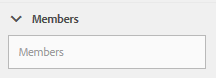

# Console di moderazione {#moderation-console}

>[!CAUTION]
>
>AEM 6.4 ha raggiunto la fine del supporto esteso e questa documentazione non viene più aggiornata. Per maggiori dettagli, consulta la nostra [periodi di assistenza tecnica](https://helpx.adobe.com/it/support/programs/eol-matrix.html). Trova le versioni supportate [qui](https://experienceleague.adobe.com/docs/).

In AEM Communities, in blocco [moderazione dei contenuti comunitari](moderate-ugc.md) è possibile sia dagli ambienti di authoring che di pubblicazione da parte di amministratori e moderatori della community (membri della community fidati assegnati come moderatori).

Possono inoltre eseguire [moderazione nel contesto](in-context.md) nell’ambiente di pubblicazione.

Una caratteristica di tutti [siti della community](sites-console.md) è un `Administration`voce di menu disponibile per gli utenti che accedono con privilegi amministrativi. La `Administration`fornisce l’accesso alla console Moderazione .

Dalla console Moderazione, gli amministratori e i moderatori della community avranno accesso a tutti i contenuti generati dagli utenti (UGC) per i quali dispongono dell’autorizzazione per moderare. Se è consentito moderare più siti, è possibile visualizzare i post in tutti i siti o filtrare in base a siti di comunità selezionati.

Per maggiori informazioni visita [Gestione di utenti e gruppi di utenti](users.md).

La console Moderazione supporta:
* Esecuzione in blocco di attività di moderazione
* Ricerca UGC
* Visualizzazione dei dettagli UGC
* Visualizzazione dei dettagli dell’autore UGC

Solo quando è stato effettuato l&#39;accesso come amministratore o come membro con ` [moderator permissions](in-context.md#identifyingtrustedmembers)`, possono essere eseguite attività di moderazione.

## Accesso all&#39;ambiente di pubblicazione {#publish-environment-access}

L&#39;accesso alla console di moderazione da un sito community pubblicato avviene tramite un collegamento Amministrazione , visualizzato all&#39;accesso di un moderatore della community.

Selezionando il collegamento Amministrazione, viene visualizzata la console Moderazione :

## Accesso all’ambiente di authoring {#author-environment-access}

Nell’ambiente di authoring, per raggiungere la console Moderazione

* Dalla navigazione globale: **[!UICONTROL Navigazione > Community > Moderazione]**

Solo quando è stato effettuato l’accesso come amministratore o come membro con ` [moderator permissions](in-context.md#identifyingtrustedmembers)`, possono essere eseguite attività di moderazione. L&#39;unico contenuto della community visualizzato è quello che il membro connesso può moderare.

>[!NOTE]
>
>L’UGC dell’ambiente di pubblicazione sarà visibile sull’autore solo se l’SRP scelto implementa un archivio comune. Ad esempio, per impostazione predefinita l’archiviazione è JSRP, che non è un negozio comune per l’authoring e la pubblicazione. Vedi [Archiviazione dei contenuti della community](working-with-srp.md).

## Interfaccia utente della console di moderazione {#moderation-console-ui}

Se si imposta la barra di navigazione a sinistra (che viene visualizzata sull’autore ma non sulla pubblicazione), l’interfaccia utente di moderazione presenta le seguenti aree principali:

* **[Barra di navigazione superiore](#top-navigation-bar)**
* **[Barra degli strumenti](#toolbar)**
* **[Area contenuto](#content-area)**

### Barra di navigazione superiore {#top-navigation-bar}

La barra di navigazione superiore è costante per tutte le console. Per ulteriori informazioni, consulta [Operazioni di base](../../help/sites-authoring/basic-handling.md).

### Barra degli strumenti {#toolbar}

La barra degli strumenti, situata sotto la barra di navigazione superiore, fornisce il seguente interruttore a sinistra:

* [Barra dei filtri](moderation.md#filter-rail) apre una barra che consente di scegliere le proprietà su cui filtrare il contenuto.

La barra degli strumenti, situata sotto la barra di navigazione superiore, fornisce il seguente interruttore a sinistra:

[Barra dei filtri](moderation.md#filter-rail)\
Apre una barra laterale, selezionando Ricerca, che consente di scegliere le proprietà su cui filtrare il contenuto.

### Area contenuto {#content-area}

L&#39;area contenuto contiene informazioni per gli UGC pubblicati:

* L&#39;UGC pubblicato
* Nome membro
* Avatar membro
* Posizione del post
* Quando è stato pubblicato
* Numero di risposte al post
* [Sentimento](moderate-ugc.md#sentiment) associato al post
* Se approvato, viene visualizzato un segno di spunta
* Se è presente un allegato, viene visualizzata una graffetta

>[!NOTE]
>
>L’area contenuto presenta *scorrimento infinito*, che consente di continuare lo scorrimento fino alla fine del contenuto. La barra degli strumenti rimane in una posizione fissa e visibile sopra l’area contenuto anche durante lo scorrimento.

### Barra Filtro {#filter-rail}

L’icona del pannello laterale apre la barra del filtro. La barra del filtro, visualizzata a sinistra dell’area contenuto, fornisce filtri diversi, ciascuno dei quali ha un effetto immediato sull’UGC di riferimento visualizzato nell’area contenuto.

I filtri all’interno di ogni categoria sono **O** e i filtri nelle diverse categorie sono **E** insieme.

Ad esempio, se controlli entrambi **Domanda** e **Risposta**, visualizzerai il contenuto di una **Domanda** *o* un **Risposta**.

Tuttavia, se selezioni **Domanda** e **In sospeso**, verrà visualizzato solo il contenuto di una **Domanda** e **In sospeso**.

>[!NOTE]
>
>I moderatori della community possono aggiungere ai segnalibri i filtri predefiniti nell’interfaccia utente della console di moderazione. Man mano che questi filtri vengono aggiunti alla fine dell&#39;URL (come parametri della stringa di query), i moderatori possono tornare ai filtri con segnalibro in un secondo momento e anche condividere questi collegamenti.

Quando la barra del filtro è aperta, l’icona Ricerca disattiva il pannello laterale chiuso. Tuttavia, per chiudere la barra del filtro e visualizzare solo il contenuto generato dall’utente, fai clic sull’icona Ricerca e seleziona l’opzione Solo contenuto .

#### Percorso contenuto {#content-path}

Percorso contenuto limita l’UGC di riferimento visualizzato ai post inseriti nell’archivio dei contenuti specificato.

#### Ricerca di testo {#text-search}

La ricerca del testo limita l’UGC di riferimento visualizzato ai post contenenti il testo inserito.

#### Sito {#site}

Il sito limita l&#39;UGC di riferimento visualizzato ai post a siti della community selezionati. Se non è selezionato alcun sito, vengono visualizzati tutti i riferimenti a UGC.

>[!NOTE]
>
>Quando un amministratore accede alla console di moderazione in blocco, vengono visualizzati tutti i riferimenti a UGC, inclusi i siti non creati con [creazione guidata sito](sites-console.md), ad esempio i campioni di Geometrixx.
>
>Quando si accede alla console di moderazione di massa al momento della pubblicazione da parte di un membro di una community fidato, vengono visualizzati solo i riferimenti a UGC creati per i siti della community in cui il membro è autorizzato a moderare e possono essere filtrati con il filtro Sito.

#### Tipo di contenuto {#content-type}

Il tipo di contenuto limita l’UGC a cui si fa riferimento ai post del tipo di risorsa selezionato. È possibile selezionare uno o più dei seguenti tipi. Se non è selezionata alcuna opzione, vengono visualizzati tutti i tipi.

* **Commenti**
* **Topic forum**
* **Risposta forum**
* **Domanda d/r**
* **Risposta D/R**
* **Articolo di blog**
* **Commento blog**
* **Evento calendario**
* **Commento calendario**
* **Cartella libreria file**
* **Documento libreria file**
* **Idea**
* **Commento ideazione**

#### Tipi di contenuto aggiuntivi {#additional-content-types}

Per aggiungere ulteriori risorse su cui filtrare:

* Su un&#39;istanza di authoring
* Accesso come amministratore
* Apri [Console web](http://localhost:4502/system/console/configMgr)
* Individua `AEM Communities Moderation Dashboard Filters`
* Seleziona la configurazione da aprire in modalità di modifica
* Immettere il ResourceType di un componente su cui filtrare
   * Ad esempio, per filtrare i componenti inclusi per la votazione, immetti:\
      `Voting=social/tally/components/hbs/voting`

* Seleziona Salva
* Aggiorna la console Community - Moderazione

Il risultato è un nuovo filtro selezionabile per `Voting`in `Content Type` gruppo di filtri.

Quando quel filtro è selezionato, il contenuto del dashboard mostrerà UGC che corrisponde a uno qualsiasi dei Tipi di risorse inseriti.

#### Stato {#status}

Lo stato limita l&#39;UGC di riferimento visualizzato ai post dello stato selezionato, che può essere uno o più di In sospeso, Approvato, Rifiutato o Chiuso, nonché Bozza o Pianificato per gli articoli di blog, e ha risposto o meno alle domande di QnA. Se non è selezionato nessuno, vengono visualizzati tutti.

>[!NOTE]
>
>Se è selezionato solo lo stato Non risposto, il moderatore visualizzerà tutti i contenuti (per tutti i tipi di contenuto) tranne le domande ricevute. Questo perché la proprietà responsabile della domanda con risposta non esiste nel caso di domande senza risposta e altri contenuti come l&#39;argomento del forum, l&#39;articolo del blog o i commenti.

#### Segnalazione {#flagging}

L’evidenziazione limita l’UGC a cui si fa riferimento ai post contrassegnati o nascosti.

Una volta che un contenuto viene contrassegnato, rimane contrassegnato finché non decontrassegni quel singolo contenuto selezionando il **[!UICONTROL Flag]** ancora una volta. Non esistono livelli di contrassegno, ad esempio importanti o di follow-up.

#### Membri {#members}

I membri limitano l&#39;UGC di riferimento visualizzato a UGC pubblicato dal nome membro inserito.

#### Pubblicato nell&#39;ultimo/a {#posted-in-the-last}

Posted In the Last limita l’UGC a cui si fa riferimento ai post effettuati nell’ultima ora, giorno, settimana, mese o anno.

#### Sentimento {#sentiment}

[Sentimento](moderate-ugc.md#sentiment) limita l&#39;UGC a cui si fa riferimento a post con un valore sentiment positivo, negativo o neutro.

## Azioni di moderazione {#moderation-actions}

[Azioni di moderazione](moderate-ugc.md#moderation-actions) possono essere eseguite su una o più selezioni effettuate nell’area contenuto o durante la visualizzazione dei dettagli del contenuto.

Per moderare in massa i post, fai clic su Seleziona ( ) su un post, che appare quando si passa il mouse sopra di esso (desktop) o si preme e si tiene premuto un dito sul post (mobile). A questo scopo, accedi alla modalità di selezione multipla e ora puoi selezionare i post successivi da moderare in massa semplicemente facendo clic su di essi. Utilizzare i pulsanti visualizzati sulla barra degli strumenti per eseguire azioni di moderazione sui post selezionati. Tutte le azioni richiederanno una conferma.

Per moderare un singolo post nell’area contenuto, posiziona il cursore del mouse su di esso (desktop) o tieni premuto un dito sulla postazione (mobile) in modo che i pulsanti vengano visualizzati sulla postazione. Quando si lavora su un singolo dettaglio di contenuto, viene richiesta una conferma solo per un’azione di eliminazione.

### Moderazione di più post {#moderating-multiple-posts}

Attiva la modalità di selezione collettiva facendo clic sul pulsante `Select` icona su un post:

Per uscire dalla modalità di selezione in blocco, seleziona l’icona Annulla (x) sulla barra degli strumenti:

Le azioni di moderazione che possono essere eseguite su più post sono:

* Rifiuta
* Eliminare
* Chiudi/riapri i post

Le icone che consentono di eseguire queste operazioni vengono visualizzate sulla barra degli strumenti solo se sono selezionati più post.

### Moderazione di un singolo post {#moderating-a-single-post}

In modalità di selezione singola, è possibile

* Visualizzare i dettagli utente selezionando il nome dell’utente
* Visualizza il post nel contesto selezionando il collegamento al post
* [Risposta](#reply)
* [Consenti](#allow)
* [Rifiuta](#deny)
* [Eliminare](#delete)
* [Chiudi](#close)
* Visualizza [Cronologia moderazione](#moderation-history)
* [Visualizza dettagli](#viewdetails)

Presente nella vista a schede sopra le icone delle azioni di moderazione è il testo del post e sotto sono i dati che indicano

* Se le risposte sono precedute dal numero di risposte
* Se è stato contrassegnato
* Se approvato
* Quando è stato pubblicato l&#39;UGC

#### Risposta {#reply}

Quando si lavora con un singolo post, viene visualizzata un’icona Risposta se il tipo UGC supporta le risposte e è configurato per consentire le risposte.

#### Consenti {#allow}

Quando si lavora con un singolo post, l&#39;icona Consenti viene visualizzata quando il post è stato contrassegnato o negato. Se contrassegnato, selezionando Consenti verranno cancellati tutti i flag.

#### Rifiuta {#deny}

La **Nega** l’azione di moderazione è disponibile solo per i contenuti sottoposti a moderazione e non viene visualizzata su contenuti non moderati, ad eccezione della modalità di selezione multipla.

Il contenuto non moderato viene sempre approvato.

Il contenuto moderato inizialmente entra in uno stato In sospeso e può essere successivamente modificato per essere approvato o negato.

Il contenuto che lascia lo stato in sospeso non può mai tornare a uno stato in sospeso. I contenuti contrassegnati come approvati o negati possono essere modificati in uno stato diverso in qualsiasi momento.

#### Eliminare {#delete}

In modalità di selezione singola o in modalità collettiva, puoi selezionare gli elementi ed eliminarli. L’azione di eliminazione si traduce in una finestra di dialogo di conferma. Una volta eliminati, tali elementi scompaiono immediatamente dall’area contenuto. **Una volta eliminato, l’UGC viene rimosso in modo permanente dall’archivio e non può essere recuperato in un secondo momento.**

#### Chiudi {#close}

Quando si lavora con un singolo post, viene visualizzata un’icona Chiudi se il tipo UGC supporta la capacità di impedire ulteriori post per quella risorsa.

#### Cronologia moderazione {#moderation-history}

Quando si lavora con un singolo post, quando si passa il mouse su di esso viene visualizzata un’icona Cronologia moderazioni . Quando si seleziona l’icona, viene visualizzato un riquadro contenente una cronologia delle azioni eseguite relative al post UGC.

Per tornare alla visualizzazione dell’area contenuto di più post UGC, seleziona la X nell’angolo in alto a destra del riquadro dei dettagli della visualizzazione.

Ad esempio:

#### Visualizza dettagli {#view-detail}

Quando si lavora con un singolo post, è possibile visualizzare più dettagli aprendo l&#39;UGC in modalità dettagliata.

Per farlo, passa il cursore del mouse sul post per visualizzare il `View Detail` e selezionala per visualizzare un pannello contenente ulteriori dettagli sul post.

Per tornare alla visualizzazione dell’area contenuto di più post UGC, seleziona la X nell’angolo in alto a destra del riquadro dei dettagli della visualizzazione.

Ad esempio:

