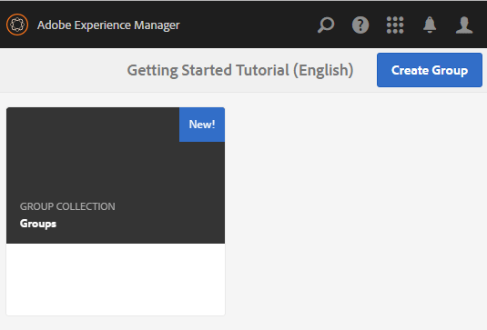

# Creazione di gruppi nidificati {#authoring-nested-groups}

## Creazione di gruppi sull&#39;autore {#creating-groups-on-author}

Per l&#39;authoring, dalla navigazione globale

* Selezionare **[!UICONTROL Communities > Sites]**
* Selezionare **[!UICONTROL cartella di coinvolgimento]** per aprirla
* Selezionate la scheda per il sito **[!UICONTROL Guida introduttiva all&#39;esercitazione]** inglese
   * Selezionate l&#39;immagine della scheda
   * Fare *not* selezionare un&#39;icona

Il risultato è quello di raggiungere la [console Gruppi](groups.md):

La funzione dei gruppi verrà visualizzata come una cartella in cui vengono create le istanze dei gruppi. Selezionate la cartella Gruppi per aprirla. Il gruppo creato al momento della pubblicazione è visibile.

## Crea gruppo di arti principali {#create-main-arts-group}

Questo gruppo può essere creato perché la struttura del sito per il coinvolgimento include una funzione di gruppi. Per impostazione predefinita, la configurazione della funzione in `Reference Template` del sito consente la selezione di qualsiasi modello di gruppo abilitato. Pertanto, il modello scelto per questo nuovo gruppo sarà il `Reference Group`.

Queste console sono molto simili alla console Siti di Communities.

* Selezionare **[!UICONTROL Crea gruppo]**
* `1 Community Group Template`:
   * Titolo gruppo community: Arti
   * Descrizione gruppo community: Un gruppo padre per vari gruppi artistici.
   * Radice gruppo community: *lasciare come predefinito*
   * Lingue aggiuntive per i gruppi di community disponibili:utilizzate il menu a discesa per selezionare le lingue disponibili per i gruppi di community. Nel menu vengono visualizzate tutte le lingue in cui viene creato il sito community principale. Gli utenti possono selezionare una di queste lingue per creare gruppi in più lingue in questo singolo passaggio. Lo stesso gruppo viene creato in più lingue specificate nella console Gruppi dei rispettivi siti della community.
   * Nome gruppo community: arte
   * Modello: premuto per selezionare `Reference Group`
   * Seleziona `Next`

      

Proseguite attraverso gli altri pannelli con le seguenti impostazioni:

* **2 Design**
   * Potete modificare la progettazione o consentire l&#39;impostazione predefinita per la progettazione del sito padre
   * Seleziona **[!UICONTROL Avanti]**
* **3 Impostazioni**
   * **Moderazione**
      * Lascia vuoto (eredita dal sito padre)
   * **Iscrizione**
      * utilizza il valore predefinito `Optional Membership`
   * **Miniatura**
      * `optional`
   * Seleziona `Next`
* Seleziona **[!UICONTROL Crea]**

### Nidificazione di gruppi nel gruppo Arti {#nesting-groups-within-arts-group}

La cartella `groups` ora deve contenere due gruppi (potrebbe essere necessario aggiornare la pagina).

#### Pubblica gruppo{#publish-group}

Prima di creare i gruppi nidificati all&#39;interno del gruppo `arts`, passate il puntatore del mouse sulla scheda `arts` e selezionate l&#39;icona di pubblicazione per pubblicarla.

Attendete la conferma della pubblicazione del gruppo.

Il gruppo `arts` deve contenere anche una cartella `groups`, ma vuota e in cui è possibile creare nuovi gruppi. Andate alla cartella del gruppo di arti e create 3 gruppi nidificati, ciascuno con un&#39;impostazione di appartenenza diversa:

1. Visuale
   * Titolo: `Visual Arts`
   * Nome: `visual`
   * Modello: `Reference Group`
   * Appartenenza: select `Optional Membership`
Un gruppo pubblico, aperto a tutti i membri
1. Auditory
   * Titolo: `Auditory Arts`
   * Nome: `auditory`
   * Modello: `Reference Group`
   * Appartenenza: select `Required Membership`
Un gruppo aperto, disponibile per i membri

1. Storia

   * Titolo: `Art History`
   * Nome: `history`
   * Modello: `Reference Group`
   * Appartenenza: select `Restricted Membership`
Un gruppo segreto, visibile solo ai membri invitati come esempio, invita 
[utente dimostrativo](tutorials.md#demo-users) `emily.andrews@mailinator.com`

Aggiornate la pagina per visualizzare tutti e tre i gruppi nidificati (sottocomunità).

Se necessario, per accedere ai gruppi nidificati dalla console Siti community:

* Selezionare **[!UICONTROL cartella di coinvolgimento]**
* Selezionare la scheda **[!UICONTROL Guida introduttiva all&#39;esercitazione]**
* Selezionare la cartella **[!UICONTROL Gruppi]**
* Selezionare **[!UICONTROL scheda grafica]**
* Selezionare la cartella **[!UICONTROL Gruppi]**

## Gruppi di pubblicazione {#publishing-groups}

Dopo la pubblicazione del sito della community principale, è necessario

* Pubblicare ciascun gruppo singolarmente
   * In attesa della conferma della pubblicazione del gruppo
* Pubblica gruppo padre prima di pubblicare qualsiasi gruppo nidificato all’interno di
   * Tutti i gruppi devono essere pubblicati in modo top-down.

## Esperienza su Pubblica {#experience-on-publish}

È possibile provare i diversi gruppi al momento dell&#39;accesso, ad esempio con gli utenti [demo](tutorials.md#demo-users) utilizzati per

* Membro del gruppo Art/History: emily.andrews@mailinator.com/password
   * Il gruppo limitato (segreto), arti/storia, sarà visibile
   * Può visualizzare i gruppi facoltativi (pubblici)
   * Può partecipare a gruppi limitati (aperti)
* Manager gruppo: aaron.mcdonald@mailinator.com/password
   * Può visualizzare i gruppi facoltativi (pubblici)
   * può partecipare a gruppi con restrizioni (aperti)
   * Non verranno visualizzati gruppi limitati (segreti)

Accedete alle console Community [Membri e gruppi](members.md) sull&#39;autore per aggiungere altri utenti a vari gruppi di membri che corrispondono ai gruppi della community.
