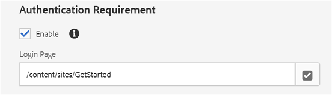

# Scopri il sito pubblicato {#experience-the-published-site}

## Passa a nuovo sito in Pubblica {#browse-to-new-site-on-publish}

Ora che il sito community appena creato è stato pubblicato, individuate l’URL visualizzato al momento della creazione del sito, ma sul server di pubblicazione, ad esempio

* URL autore = http://localhost:4502/content/sites/engage/en.html
* URL pubblicazione = http://localhost:4503/content/sites/engage/en.html

Per ridurre la confusione relativa al membro che ha effettuato l’accesso in fase di creazione e pubblicazione, si consiglia di utilizzare browser diversi per ogni istanza.

Al primo arrivo sul sito pubblicato, il visitatore del sito in genere non avrebbe già effettuato l’accesso e sarebbe anonimo.

## http://localhost:4503/content/sites/engage/en.html {#http-localhost-content-sites-engage-en-html}

## Visitatore del sito anonimo {#anonymous-site-visitor}

Un visitatore anonimo del sito vede quanto segue nell’interfaccia utente:

* Titolo del sito. Esercitazione introduttiva
* Nessun collegamento profilo
* Nessun collegamento messaggi
* Nessun collegamento di notifica
* Campo di ricerca
* Collegamento di accesso
* Il banner del marchio
* Collegamenti al menu per i componenti inclusi nel Modello del sito di riferimento

Se selezionate vari collegamenti, questi saranno in modalità di sola lettura.

## Impedire l&#39;accesso anonimo su JCR {#prevent-anonymous-access-on-jcr}

Un limite noto espone il contenuto del sito della community ai visitatori anonimi attraverso contenuti jcr e json, anche se **consente l&#39;accesso** anonimo è disabilitato per il contenuto del sito. Tuttavia, questo comportamento può essere controllato utilizzando Limitazioni Sling come soluzione alternativa.

Per proteggere i contenuti del sito della community dall&#39;accesso di utenti anonimi tramite contenuti jcr e json, procedi come segue:

1. Nell&#39;istanza di AEM Author, andate a https://&lt;host>:&lt;porta>/editor.html/content/site/&lt;nome sito>.html.

   >[!NOTE]
   >
   >Non andate al sito localizzato.

1. Vai a Proprietà **** pagina.

   

1. Vai alla scheda **[!UICONTROL Avanzate]** .

   

1. Enable **[!UICONTROL Authentication Requirement]**.
1. Aggiungete il percorso della pagina di login. Ad esempio, `/content/......./GetStarted`.
1. Pubblicate la pagina.

## Membro della comunità di fiducia {#trusted-community-member}

Questa esperienza presuppone che [ad Aaron McDonald](tutorials.md#demo-users) siano stati assegnati i ruoli di manager e moderatore [della](create-site.md#roles)comunità. In caso contrario, tornate nell&#39;ambiente di authoring per [modificare le impostazioni](sites-console.md#modifying-site-properties) del sito e selezionate Aaron McDonald come responsabile della community e moderatore.

Nell&#39;angolo superiore destro, selezionate `Log in`e firmate con nome utente &quot;aaron.mcdonald@mailinator.com&quot; e password &quot;password&quot;. Notate la possibilità di accedere con le credenziali di Twitter o Facebook.

Una volta effettuato l&#39;accesso, noterete che esiste una nuova voce di menu `Administration`, che viene visualizzata perché al membro è stato assegnato il ruolo di Moderatore. Ora la selezione di vari collegamenti è più interessante.

Notate che la pagina Calendario è la home page perché il modello di sito di riferimento scelto includeva prima la funzione Calendario, seguita dalla funzione Flusso di attività, dalla funzione Forum e così via. Questa struttura è visibile dalla console Modello  sito o quando si modificano le proprietà del sito nell’ambiente di authoring:

>[!NOTE]
>
>Per maggiori informazioni sui componenti e sulle funzioni di Community, visita
>
>* [Componenti](author-communities.md) Community (per autori)
>* [Componenti, funzioni e funzionalità Essentials](essentials.md) (per sviluppatori)
>

## Collegamento forum {#forum-link}

Per visualizzare la funzione forum di base, fate clic sul collegamento Forum.

I membri possono pubblicare un nuovo argomento o seguire un argomento.

I visitatori del sito possono visualizzare i post e ordinarli in vari modi.

## Collegamento gruppi {#groups-link}

Poiché Aaron è un amministratore di gruppo, selezionando il collegamento Gruppi, Aaron potrà creare un nuovo gruppo di community selezionando un modello di gruppo, un’immagine, un gruppo aperto o segreto e i membri invitati.

Questo è un esempio in cui viene creato un gruppo nell’ambiente di pubblicazione.

I gruppi possono essere creati anche nell’ambiente di authoring e gestiti all’interno del sito della community nell’ambiente di authoring (console [Gruppi](groups.md)community). Questa esercitazione illustra come [creare gruppi in fase di creazione](nested-groups.md) .

Crea un gruppo di riferimento:

1. Seleziona **[!UICONTROL nuovo gruppo]**
1. **[!UICONTROL scheda Impostazioni]**
   * Nome gruppo: `Sports`
   * Descrizione: `A parent group for various sporting groups`
   * Nome URL del gruppo: `sports`
   * select `Open Group` (consentire a qualsiasi membro della community di partecipare partecipando)
1. **[!UICONTROL Scheda Modello]**
   * Seleziona `Reference Group` (contiene una funzione di gruppi nella sua struttura per consentire i gruppi nidificati)
1. Seleziona **[!UICONTROL Crea gruppo]**

Dopo aver creato un nuovo gruppo, **selezionate il nuovo gruppo** Sport per creare due gruppi (nidificati) al suo interno. Poiché una struttura del sito non può iniziare con la funzione dei gruppi, dopo aver aperto il gruppo Sport, è necessario selezionare il collegamento Gruppi:

Il secondo gruppo di collegamenti, a partire da `Blog`, appartiene al gruppo attualmente selezionato, il `Sports`gruppo. Selezionando il collegamento Sport&#39; `Groups` , è possibile nidificare due gruppi all&#39;interno del gruppo Sport.

Ad esempio, aggiungere due n `ew groups.`

* Uno con nome `Baseball`
   * Lascialo impostato come `Open Group` (iscrizione obbligatoria)
   * Nella scheda Modelli, selezionare `Conversational Group`
* Uno con nome `Gymnastics`
   * Cambia l’impostazione in `Member Only Group` (iscrizione limitata)
   * Nella scheda Modelli, selezionare `Conversational Group`

**Avviso**:

* Prima di visualizzare entrambi i gruppi potrebbe essere necessario aggiornare la pagina
* Questo modello *non *include la funzione dei gruppi, per cui non sarà possibile effettuare un&#39;ulteriore nidificazione dei gruppi
* Per l’autore, la console  Gruppi offre una terza scelta, un’iscrizione `Public Group` (facoltativa)

Una volta creati entrambi i gruppi, selezionate il gruppo Baseball, un gruppo aperto e notate i relativi collegamenti: `Discussions` I collegamenti `What's New` `Members`del gruppo sono visualizzati sotto i collegamenti del sito principale e i risultati sono la seguente visualizzazione:

Per l’autore, con privilegi amministrativi, andate alla console [Gruppi di](members.md) Communities e aggiungete Weston McCall al `Community Engage Gymnastics <uid> Members` gruppo.

Continuando a pubblicare, disconnettetevi come Aaron McDonald e visualizzate i gruppi nel Gruppo sportivo come visitatore anonimo del sito:

* Dalla home page
* Select `Groups`link
* Select `Sports`link
* Selezionate il `Groups`collegamento Sport

Solo il gruppo di baseball sarà visibile.

Effettuate l&#39;accesso come Weston McCall (weston.mccall@dodgit.com / password) e andate alla stessa posizione. Notate che Weston è in grado di aprire `Join` il `Baseball` gruppo e `enter or Leave` il `Gymnastics`gruppo privato.

## Collegamento pagina Web {#web-page-link}

Visualizzare la pagina Web di base inclusa nel sito selezionando il collegamento Pagina Web. Gli strumenti di authoring standard di AEM possono essere utilizzati per aggiungere contenuti a questa pagina nell’ambiente di authoring.

Ad esempio, passate all’istanza di **creazione** , aprite la `engage` cartella nella console [Siti](sites-console.md)community, selezionate l’icona **Apri sito** per passare alla modalità di modifica dell’autore. Selezionate quindi la modalità di anteprima per selezionare il `Web Page`collegamento, quindi selezionate la modalità di modifica per aggiungere i componenti Titolo e Testo. Infine, ripubblicate solo la pagina o l’intero sito.

## Collegamento amministrazione {#administration-link}

Quando il membro della community dispone di privilegi di moderazione, il collegamento Amministrazione sarà visibile e la selezione di tale collegamento consente di visualizzare il contenuto della community pubblicato e di [moderarlo](moderate-ugc.md) in modo simile alla console [di](moderation.md) moderazione nell&#39;ambiente di authoring.

Utilizzate il pulsante Indietro del browser per tornare al sito pubblicato. La maggior parte delle console non è accessibile dalla navigazione globale nell’ambiente di pubblicazione.

## Autoregistrazione {#self-registration}

Dopo la disconnessione, è possibile creare una nuova registrazione utente.

* Seleziona `Log In`
* Seleziona `Sign up for a new account`

 

Per impostazione predefinita, l’indirizzo e-mail è l’ID di login. Se questa opzione è deselezionata, il visitatore può immettere il proprio ID di accesso (nome utente). Il nome utente deve essere univoco nell’ambiente di pubblicazione.

Dopo aver specificato il nome utente, l&#39;e-mail e la password, selezionando questa opzione `Sign Up`l&#39;utente verrà creato e sarà possibile apporvi la firma.

Una volta effettuato l’accesso, la prima pagina presentata è la `Profile`pagina corrispondente, che possono personalizzare.

Se il membro dimentica il suo ID di accesso, è possibile recuperare utilizzando il suo indirizzo e-mail.

