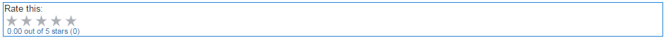

# Utilizzo delle valutazioni {#using-ratings}

>[!CAUTION]
>
>AEM 6.4 ha raggiunto la fine del supporto esteso e questa documentazione non viene più aggiornata. Per maggiori dettagli, consulta la nostra [periodi di assistenza tecnica](https://helpx.adobe.com/it/support/programs/eol-matrix.html). Trova le versioni supportate [qui](https://experienceleague.adobe.com/docs/).

La `Rating`viene utilizzato separatamente o insieme ad altre funzioni di Communities. Questo componente permette ai membri della community che hanno effettuato l’accesso di esprimere le proprie opinioni in base al contenuto del punteggio.

## Aggiunta di una valutazione a una pagina {#adding-a-rating-to-a-page}

Per aggiungere una `Rating`in una pagina in modalità di authoring, individua il componente `Communities / Rating` e trascinarlo nella posizione desiderata su una pagina, ad esempio una posizione relativa alla funzione per la valutazione dei membri.

Per le informazioni necessarie, visita [Nozioni di base sui componenti di Communities](basics.md).

Quando il [librerie lato client richieste](rating-basics.md#essentials-for-client-side) sono inclusi, è così che `Rating` apparirà .

## Configurazione della valutazione {#configuring-rating}

Seleziona il `Rating` per accedere e selezionare il `Configure` che apre la finestra di dialogo di modifica.

Sotto la **[!UICONTROL Testi ed etichette]** Specifica l’identificatore interno per la valutazione.

**[!UICONTROL Nome dell’alleanza]**
(*Obbligatorio*) Un nome semplice per `Rating`che identifica in modo univoco questa istanza. Deve essere un nome di nodo valido per il repository.

## Esperienza dei visitatori del sito {#site-visitor-experience}

### Membri {#members}

È consentita una sola classificazione per membro. Il membro può modificare il proprio rating in qualsiasi momento.

### Anonimo {#anonymous}

Pubblicazione anonima di una classificazione non supportata. I visitatori del sito devono registrarsi (diventare membro) e accedere per partecipare.

## Informazioni aggiuntive {#additional-information}

Per ulteriori informazioni, consulta [Nozioni di base sulla valutazione](rating-basics.md) per sviluppatori.
