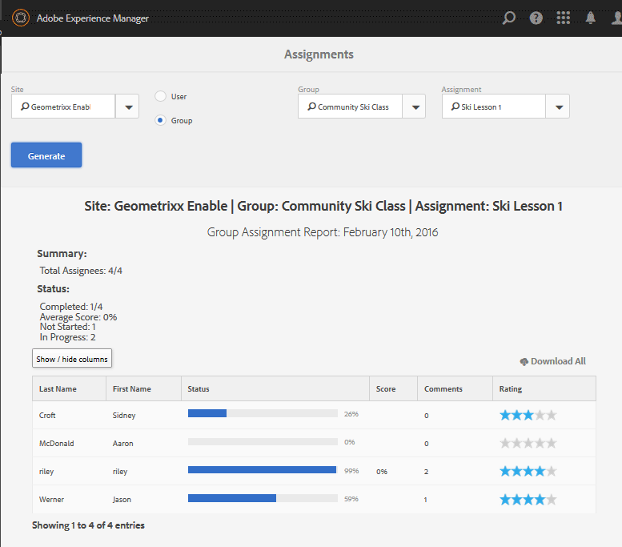

# Console Rapporti {#reports-console}

## Panoramica {#overview}

Per AEM Communities, è possibile accedere a diversi rapporti in diversi modi dall’ambiente di authoring.

In generale, le varie relazioni sono:

* [Rapporto Assegnazioni](#assignments-report) : per una comunità di  [abilitazione](overview.md#enablement-community), fornisce una panoramica dell&#39;avanzamento degli studenti nelle loro assegnazioni, incluso un punteggio associato se si implementa lo standard SCORM
* [Rapporto visualizzazioni](#views-report) : fornisce un grafico dei punti di vista dei contenuti dei membri della community e dei visitatori del sito per qualsiasi sito della community
* [Report post](#posts-report) : fornisce un grafico dei vari tipi di post dei membri della community su qualsiasi sito della community

Quando [Adobe Analytics è abilitato](sites-console.md#analytics), i rapporti includeranno il numero di visualizzazioni, riproduzioni, commenti e valutazioni per ogni risorsa di abilitazione nel tempo

I rapporti tabulari possono essere esportati in formato .csv per successive elaborazioni.

## Console di reporting {#reporting-consoles}

### Rapporti per siti della community {#reports-for-community-sites}

* Dalla navigazione globale: **[!UICONTROL Navigazione > Community > Rapporti]**
* Scegli tra
   * **[!UICONTROL Rapporto assegnazioni]**
      * Genera un report per la sede, l&#39;utente o il gruppo della community selezionati e l&#39;assegnazione
   * **[!UICONTROL Rapporto sui post]**
      * Genera un report per il sito della community selezionato, il tipo di contenuto e il periodo di tempo
   * **[!UICONTROL Rapporto visualizzazioni]**
      * Genera un report per il sito della community selezionato, il tipo di contenuto e il periodo di tempo
         

### Rapporti per risorse di abilitazione e percorsi di apprendimento {#reports-for-enablement-resources-and-learning-paths}

* Dalla navigazione globale: **[!UICONTROL Navigazione > Community > Risorse]**
* Seleziona un sito community di abilitazione esistente
   * Seleziona l&#39;icona **[!UICONTROL Report]** per generare rapporti che coprono tutte le risorse di abilitazione
   * Selezionare un percorso di apprendimento per l’abilitazione
   * Seleziona l&#39;icona **[!UICONTROL Report]** per generare report per
      * Risorse di abilitazione incluse
      * Gli studenti assegnati al percorso di apprendimento
* Tali rapporti forniscono:
   * Dati tabella, scaricabili come CSV
      * Identificazione dello studente
      * Il loro status
      * Assegnazione o accesso tramite catalogo
      * Numero di osservazioni formulate
      * Classificazione a stelle

Per ulteriori dettagli, consulta [Sezione Rapporti](resources.md#report) della console Risorse .

## Rapporto assegnazioni {#assignments-report}

La console Assegnazioni consente di filtrare i rapporti in base al sito della community di abilitazione, agli utenti o ai gruppi e all’assegnazione.

La relazione fornisce informazioni sui loro progressi nonché eventuali commenti o valutazioni forniti.

Seleziona i criteri per il rapporto:

* ****
SitoSeleziona un sito community di abilitazione
* **[!UICONTROL Utente o gruppo]**
   * Selezionare Utente per generare un rapporto per uno studente
   * Selezionare Gruppo per generare un rapporto per un gruppo di studenti
Il servizio tunnel accederà ai membri e ai gruppi di membri dall&#39;ambiente di pubblicazione
* ****
AssegnazioneScegli tra le risorse di abilitazione assegnate agli studenti selezionati

Seleziona **[!UICONTROL Genera]** per creare il rapporto:

## Rapporto visualizzazioni {#views-report}

La console Visualizzazioni consente di generare rapporti sulle visualizzazioni di pagina in base alle funzioni della community per un determinato periodo di tempo.

Seleziona i criteri per il rapporto:

* ****
SitoSeleziona un sito community
* **[!UICONTROL Contenuto]**
TipoPuò scegliere Tutto il contenuto o selezionare una delle funzioni presenti sul sito
* Intervallo temporale
Seleziona una delle seguenti opzioni:
   * Ultimi 7 giorni
   * Ultimi 30 giorni
   * Ultimi 90 giorni
   * Ultimo anno

Seleziona **[!UICONTROL Genera]** per creare il rapporto:

## Rapporto sui post {#posts-report}

La console Post consente di generare rapporti sul numero di post nelle funzioni della community per un determinato periodo di tempo.

Seleziona i criteri per il rapporto:

* ****
SitoSeleziona un sito community
* **[!UICONTROL Contenuto]**
TipoPuò scegliere Tutto il contenuto o selezionare una delle funzioni presenti sul sito
* Intervallo temporale
Seleziona una delle seguenti opzioni:
   * Ultimi 7 giorni
   * Ultimi 30 giorni
   * Ultimi 90 giorni
   * Ultimo anno

Seleziona **[!UICONTROL Genera]** per creare il rapporto:

## Risoluzione dei problemi {#troubleshooting}

### Nessun sito community elencato {#no-community-sites-listed}

Se non è presente alcun sito community, assicurati che Adobe Analytics sia stato abilitato per un sito. Se si selezionano i rapporti relativi alle assegnazioni, verificare che la funzione delle assegnazioni si trovi nella struttura del sito della community.
