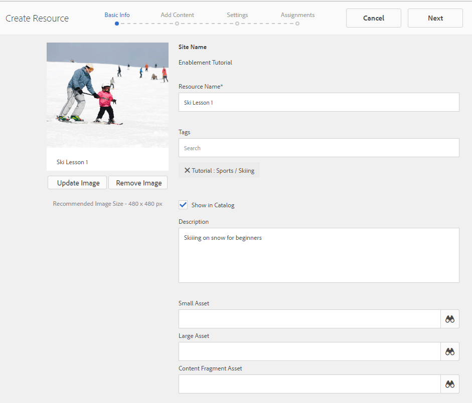

# Creare e assegnare risorse di abilitazione {#create-and-assign-enablement-resources}

>[!CAUTION]
>
>AEM 6.4 ha raggiunto la fine del supporto esteso e questa documentazione non viene più aggiornata. Per maggiori dettagli, consulta la nostra [periodi di assistenza tecnica](https://helpx.adobe.com/it/support/programs/eol-matrix.html). Trova le versioni supportate [qui](https://experienceleague.adobe.com/docs/).

## Aggiungi una risorsa di abilitazione {#add-an-enablement-resource}

Per aggiungere una risorsa di abilitazione al nuovo sito della community:

* Sull’istanza di authoring
   * Ad esempio: [http://localhost:4502/](Http://localhost:4503/)
* Accesso come amministratore di sistema
* Dalla navigazione globale, seleziona **Community > [Risorse](resources.md)**

   
   
* Seleziona il sito community a cui vengono aggiunte le risorse di abilitazione
   * Seleziona `Enablement Tutorial`
* Dal menu , seleziona ` Create`
* Seleziona **[!UICONTROL Risorsa]**

### Informazioni di base {#basic-info}

Compila le informazioni di base per la risorsa:

* **[!UICONTROL Nome del sito]**: impostato sul nome del sito community selezionato: Tutorial sull’abilitazione
* **[!UICONTROL Nome &amp;risorsa;]**: Lezioni di sci 1
* **[!UICONTROL Tag]**: Esercitazione: Sport / Sci
* **[!UICONTROL Mostra nel catalogo]**: On
* **[!UICONTROL Descrizione]**: Scivolare sulla neve per principianti
* **[!UICONTROL Aggiungi immagine]**: Aggiungi un&#39;immagine per rappresentare la risorsa al membro nella visualizzazione Assegnazioni
   
* Seleziona **[!UICONTROL Avanti]**

### Aggiungi contenuto {#add-content}

Viene visualizzato come se fosse possibile selezionare più risorse, ma solo una è consentita.

Seleziona la `'+' icon`, nell&#39;angolo in alto a destra, per iniziare il processo di scelta della risorsa identificando l&#39;origine.

 

Carica una risorsa. Se una risorsa video, carica un’immagine personalizzata da visualizzare prima dell’avvio della riproduzione del video o consente di generare una miniatura dal video (potrebbero essere necessari alcuni minuti, non è necessario attendere).

* select **[!UICONTROL Successivo]**

### Impostazioni {#settings}

* **[!UICONTROL Impostazioni social]**
Lascia le impostazioni predefinite per esaminare i commenti e la valutazione delle risorse di abilitazione da parte degli studenti.
* **[!UICONTROL Data di scadenza]**

   *(Facoltativo)* È possibile selezionare una data entro la quale l&#39;assegnazione deve essere completata.
* **[!UICONTROL Autore risorse]**

   *(Facoltativo)* Lascia vuoto.
* **[!UICONTROL Contatto &amp;risorsa;]**

   *(Obbligatorio)* Utilizzare il menu a discesa per selezionare un membro `Quinn Harper`.
* **[!UICONTROL Esperto risorse]**

   *(Facoltativo)* Lascia vuoto.
   **Nota**: se gli utenti o i gruppi non sono visibili, verifica che siano stati aggiunti al `Community Enable Members` gruppo e *Salvato* nell’istanza di pubblicazione.
   
* Seleziona **[!UICONTROL Avanti]**

### Assegnazioni {#assignments}

* **[!UICONTROL Aggiungi assegnatari]**
Lascia non impostato perché questa risorsa di abilitazione verrà aggiunta a un percorso di apprendimento. Se uno studente viene assegnato alla singola risorsa di abilitazione e a un percorso di apprendimento contenente la risorsa di abilitazione, lo studente verrà assegnato due volte alla risorsa di abilitazione.

* Seleziona **[!UICONTROL Crea]**

La creazione della risorsa viene ripristinata nella console Risorse selezionando la risorsa appena creata. Da questa console è possibile pubblicare, aggiungere studenti e modificare altre impostazioni.

Per caricare una nuova versione della risorsa di abilitazione, è consigliabile creare una nuova risorsa, quindi annullare l’iscrizione dei membri dalla versione precedente e iscriverli nella nuova versione.

### Pubblicare la risorsa {#publish-the-resource}

Prima che gli iscritti possano vedere il Rescourse assegnato, è necessario pubblicarlo:

* Seleziona il mondo `Publish`icona

L’attivazione viene confermata con un messaggio di successo:

## Aggiungi una seconda risorsa di abilitazione {#add-a-second-enablement-resource}

Ripeti i passaggi precedenti per creare e pubblicare una seconda risorsa di abilitazione correlata dalla quale verrà creato un percorso di apprendimento.

**Pubblica** la seconda risorsa.

Torna all’elenco delle risorse di Enablement Tutorial.

*Suggerimento: se entrambe le risorse non sono visibili, aggiorna la pagina.*

## Aggiungere un percorso di apprendimento {#add-a-learning-path}

Un percorso di apprendimento è un raggruppamento logico di risorse di abilitazione che formano un corso.

* Dalla console Risorse, seleziona `+ Create`
* Seleziona **[!UICONTROL Percorso di apprendimento]**

Aggiungi il **[!UICONTROL Informazioni di base]**:

* **[!UICONTROL Nome percorso di apprendimento]**: Lezioni di sci
* **[!UICONTROL Tag]**: Esercitazione: Sciare
* **[!UICONTROL Mostra nel catalogo]**: lascia senza controllo
* **[!UICONTROL Caricare un’immagine]** per rappresentare il percorso di apprendimento nella console Risorse

* Seleziona **[!UICONTROL Avanti]**

Ignora il pannello successivo in quanto non sono presenti percorsi di apprendimento preliminari da aggiungere.

* Seleziona **[!UICONTROL Avanti]**

Nel pannello Aggiungi risorse

* Seleziona `+ Add Resources` per selezionare le 2 risorse sciistiche da aggiungere al percorso di apprendimento

   Nota: Solo **pubblicato** Le risorse saranno selezionabili.

>[!NOTE]
>
>È possibile selezionare solo le risorse disponibili allo stesso livello del percorso di apprendimento. Ad esempio, per un percorso di apprendimento creato in un gruppo sono disponibili solo le risorse a livello di gruppo; per un percorso di apprendimento creato in un sito community, le risorse in tale sito sono disponibili per l’aggiunta al percorso di apprendimento.

* Seleziona **[!UICONTROL Invia]**.

 

* Seleziona **[!UICONTROL Avanti]**

* **[!UICONTROL Aggiungi assegnatari]**
Utilizza il menu a discesa per selezionare il 
`Community Ski Class` gruppo, che deve includere i membri `Riley Taylor` e `Sidney Croft.`

* **[!UICONTROL Percorso di apprendimento Contatti&amp;ast;]**

   *(Obbligatorio)* Utilizzare il menu a discesa per selezionare un membro `Quinn Harper`.

* Seleziona **[!UICONTROL Crea]**

La creazione corretta del percorso di apprendimento torna alla console Risorse con il percorso di apprendimento appena creato selezionato. Da questa console è possibile pubblicare, aggiungere studenti e modificare altre impostazioni.

**Pubblica** il percorso di apprendimento.
