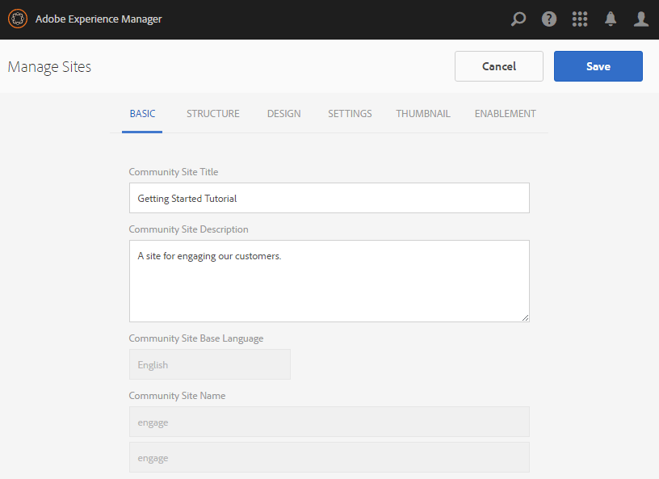
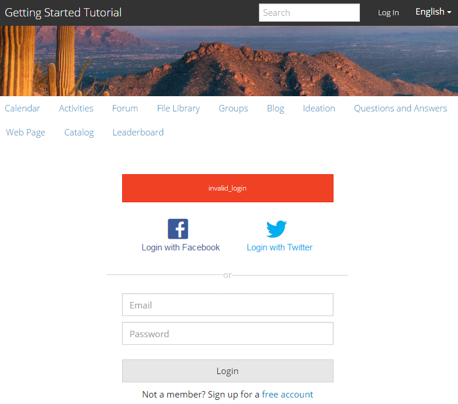

# Console Siti community {#communities-sites-console}

La console Siti community consente di accedere a:

* Creazione del sito
* Modifica del sito
* Gestione del sito
* [Creazione e modifica di gruppi](groups.md)  nidificati (sottocomunità)

Consultate la [Guida introduttiva  AEM Communities](getting-started.md) per verificare la rapidità con cui è possibile creare un sito community nell&#39;ambiente di authoring, nonché come creare gruppi community dagli ambienti di creazione e pubblicazione.

>[!NOTE]
>
>I menu principali Community per la creazione di [siti community](sites-console.md), [modelli di siti community](sites.md), [modelli di gruppi community](tools-groups.md) e [funzioni community](functions.md) sono utilizzabili solo nell&#39;ambiente di authoring.

## Prerequisiti {#prerequisites}

Prima di creare un sito community, *obbligatorio* è necessario:

* Verificare l&#39;esecuzione di una o più istanze di pubblicazione
* Abilitare il servizio [tunnel](deploy-communities.md#tunnel-service-on-author) per gestire membri e gruppi di membri
* Identificare il [editore principale](deploy-communities.md#primary-publisher)
* [Configurare ](deploy-communities.md#replication-agents-on-author) la replica quando la porta dell&#39;editore principale non è la porta predefinita (4503)

Per garantire che il sito sia pronto a supportare molte funzioni, è consigliabile adottare le seguenti misure:

* Installare il [pacchetto di funzionalità più recente](deploy-communities.md#latestfeaturepack)
* Abilita [ Adobe Analytics](analytics.md) per  AEM Communities
* Configurare [email](email.md)
* Identificare [gli amministratori della community](users.md#creating-community-members)
* [Abilita ](social-login.md#adobe-granite-oauth-authentication-handler) handler OAuth per accesso social

## Accesso alla console Siti di Communities {#accessing-communities-sites-console}

Nell’ambiente di authoring, per accedere alla console Siti community:

* Dalla navigazione globale: **[!UICONTROL Community > Siti]**

Nella console Siti community sono visualizzati tutti i siti community esistenti. Da questa console è possibile creare, modificare, gestire ed eliminare siti della community.

Per creare un nuovo sito community, selezionate l&#39;icona **Crea**.

Per accedere a un sito community esistente, allo scopo di creare, modificare, pubblicare, esportare o aggiungere un gruppo nidificato, selezionate l&#39;icona della cartella dei siti.

Ad esempio, l&#39;immagine seguente mostra la console Siti community principale, che mostra le cartelle per due siti della community: [abilita](getting-started-enablement.md) e [coinvolgi](getting-started.md):

## Creazione del sito {#site-creation}

La console per la creazione di siti offre un approccio graduale per assemblare le funzioni del sito in base a un [modello di sito community ](sites.md) e alle impostazioni selezionate.

Ogni sito creato include una funzione di login in quanto i visitatori del sito devono effettuare l’accesso prima di poter pubblicare contenuto, inviare messaggi o partecipare a un gruppo. Altre funzioni incluse sono profili utente, messaggi, notifiche, menu del sito, ricerca, temi e personalizzazione.

Il processo viene avviato selezionando il pulsante `Create` nella parte superiore della console Siti community.

Il processo di creazione è costituito da una serie di passaggi presentati come pannelli contenenti una serie di funzioni da configurare (presentate come sottopannelli). È possibile passare al passaggio **Successivo** o **Indietro** al passaggio precedente prima di eseguire il commit del sito nel passaggio finale.

### Passaggio 1: Modello del sito {#step-site-template}

Nel pannello Modello del sito sono specificati il Titolo, la Descrizione, la Radice del sito, la Lingua di base, il Nome e il Modello del sito:

* **[!UICONTROL Titolo]** sito community: Titolo visualizzato per il sito.

   Il titolo viene visualizzato sia nel sito pubblicato che nell’interfaccia utente di amministrazione del sito.

* **[!UICONTROL Descrizione]** sito community: Una descrizione del sito.

   La descrizione non viene visualizzata sul sito pubblicato.

* **[!UICONTROL Radice]** sito community: Percorso principale del sito.

   La radice predefinita è `/content/sites`, ma la radice può essere spostata in qualsiasi posizione all&#39;interno del sito Web.

* **[!UICONTROL Lingua]** di base del sito community: (lasciare invariate le lingue per una sola: Inglese) utilizzare il menu a discesa per scegliere una  *o* più lingue tra quelle disponibili: tedesco, italiano, francese, giapponese, spagnolo, portoghese (Brasile), cinese (tradizionale) e cinese (semplificato). Verrà creato un sito community per ogni lingua aggiunta, all&#39;interno della stessa cartella del sito seguendo la procedura consigliata in [Translating Content for Multilingual Sites](../../help/sites-administering/translation.md). La pagina principale di ciascun sito conterrà una pagina figlia denominata dal codice della lingua di una delle lingue selezionate, ad esempio &#39;en&#39; per l&#39;inglese o &#39;fr&#39; per il francese.

* **[!UICONTROL Nome]** sito community: Nome della pagina principale del sito che viene visualizzata nell’URL

   * Ricontrolla il nome perché non viene facilmente modificato dopo la creazione del sito
   * L&#39;URL di base ( `https://*server:port/site root/site name*)` verrà visualizzato sotto la `Community Site Name`
   * Per un URL valido, aggiungete un codice della lingua di base + &quot;.html&quot;

      *Esempio*, `http://localhost:4502/content/sites/mysight/en.html`

* **[!UICONTROL Community Site]** Templatemenu: Utilizzate il menu a discesa per scegliere un modello [ di sito ](tools.md)community disponibile.

Seleziona **[!UICONTROL Avanti]**

### Passaggio 2: Progettazione {#step-design}

Il pannello Progettazione contiene 2 pannelli secondari per selezionare il tema e il banner di branding:

#### TEMA DEL SITO COMUNITARIO {#community-site-theme}

Il framework utilizza [Bootstrap Twitter](https://twitterbootstrap.org/) per fornire al sito un design reattivo e flessibile. È possibile selezionare uno dei numerosi temi di Bootstrap precaricati per definire lo stile del modello di sito community selezionato oppure caricare un tema di Bootstrap.

Quando è selezionato, il tema verrà sovrapposto con un segno di spunta blu opaco.

Dopo la pubblicazione del sito della community, è possibile [modificare le proprietà](#modifying-site-properties) e selezionare un altro tema.

#### MARCHIO DEL SITO COMUNITARIO {#community-site-branding}

Il marchio Community del sito è un&#39;immagine visualizzata come intestazione nella parte superiore di ogni pagina.

Le dimensioni dell’immagine devono corrispondere alla larghezza prevista per la visualizzazione della pagina nel browser e a 120 pixel in altezza.

Quando create o selezionate un’immagine, tenete presente:

* L’altezza dell’immagine viene ritagliata a 120 pixel, misurati dal bordo superiore dell’immagine
* L&#39;immagine viene bloccata sul bordo sinistro della finestra del browser
* L&#39;immagine non viene ridimensionata, pertanto quando la larghezza dell&#39;immagine è impostata su ...

   * Con una larghezza inferiore a quella del browser, l&#39;immagine si ripeterà in orizzontale
   * Maggiore della larghezza del browser, l&#39;immagine apparentemente verrà ritagliata

Seleziona **[!UICONTROL Avanti]**.

### Passaggio 3: Impostazioni {#step-settings}

Il pannello Impostazioni contiene diversi pannelli secondari che presentano le funzioni da configurare prima di passare all’ultimo passaggio per la creazione del sito.

* [GESTIONE UTENTE](#user-management)
* [TAG](#tagging)
* [RUOLI](#roles)
* [MODERAZIONE](#moderation)
* [ANALYTICS](#analytics)
* [TRADUZIONE](#translation)
* [ABILITAZIONE](#enablement)

>[!NOTE]
>
>**Abilita servizio tunnel**
>
>Diversi pannelli secondari di Impostazioni consentono l’assegnazione di un membro affidabile per moderare l’UGC, gestire i gruppi o essere contatti per le risorse di abilitazione nell’ambiente di pubblicazione.
>
>La convenzione prevede che gli utenti e i gruppi di utenti [lato pubblicazione](users.md) (membri e gruppi di membri) non vengano duplicati nell&#39;ambiente di authoring.
>
>Pertanto, quando create il sito community nell&#39;ambiente di creazione e assegnate membri attendibili a vari ruoli, è necessario recuperare i dati dei membri dall&#39;ambiente di pubblicazione.
>
>A questo scopo, è possibile attivare l&#39;ambiente ` [AEM Communities Publish Tunnel Service](deploy-communities.md#tunnel-service-on-author)`di authoring.

#### GESTIONE UTENTE {#user-management}

>[!NOTE]
>
>È consigliabile che [i siti della community di abilitazione](overview.md#enablement-community) siano privati (per ulteriori informazioni, contattare il rappresentante commerciale di riferimento).
>
>Un sito community è privato quando ai visitatori anonimi viene negato l&#39;accesso, non può registrarsi autonomamente e non può utilizzare il login mediante social network.

* **[!UICONTROL Consenti registrazione utente]**

   Se questa opzione è attivata, i visitatori del sito possono diventare membri della community mediante autoregistrazione.

   Se questa opzione non è selezionata, il sito della community è *restricted* e i visitatori del sito devono essere assegnati al gruppo di membri della community, effettuare una richiesta o ricevere un invito via e-mail. Se questa opzione è deselezionata, non è consentito l&#39;accesso anonimo.

   Deselezionare la casella di controllo per un sito della community *privato*. Il valore predefinito è selezionato.

* **[!UICONTROL Consenti accesso anonimo]**

   Se questa opzione è attivata, il sito della community è *open* e qualsiasi visitatore del sito può accedere al sito.

   Se questa opzione è deselezionata, solo i membri che hanno effettuato l’accesso possono accedere al sito.

   Deselezionare la casella di controllo per un sito della community *privato*. Il valore predefinito è selezionato.

* **[!UICONTROL Consenti messaggi]**

   Se selezionato, i membri possono inviare messaggi tra loro e al gruppo all&#39;interno del sito della community.

   Se questa opzione è deselezionata, la messaggistica non viene configurata per la community.

   Il valore predefinito è deselezionato.

* **[!UICONTROL Consenti accesso social network: Facebook]**

   Se questa opzione è selezionata, consentite ai visitatori del sito di accedere con le credenziali del loro account Facebook. La [configurazione cloud Facebook ](social-login.md#create-a-facebook-connect-cloud-service) selezionata deve essere configurata per aggiungere utenti al gruppo di membri della community una volta creato il sito community.

   Se questa opzione è deselezionata, non viene presentato alcun login di Facebook.

   Non verificate la presenza di un sito della community *private*. Il valore predefinito è deselezionato.

* **[!UICONTROL Consenti accesso social network: Twitter]**

   Se questa opzione è selezionata, consentite ai visitatori del sito di accedere con le credenziali del loro account Twitter. La [configurazione cloud Twitter](social-login.md#create-a-twitter-connect-cloud-service) selezionata deve essere configurata per aggiungere utenti al gruppo di membri del sito community una volta creato il sito community.

   Se questa opzione è deselezionata, non viene presentato alcun login a Twitter.

   Non verificate la presenza di un sito della community *private*. Il valore predefinito è deselezionato.

>[!NOTE]
>
>**[!UICONTROL Consentire accessi tramite social network]**
>
>Anche se le configurazioni Facebook e Twitter di esempio possono esistere e essere selezionabili, per un [ambiente di produzione](../../help/sites-administering/production-ready.md) è necessario creare applicazioni Facebook e Twitter personalizzate. Consultate [Accesso tramite social network con Facebook e Twitter](social-login.md).

#### TAG {#tagging}

I tag che possono essere applicati al contenuto della community sono controllati selezionando Tag namespace definiti in precedenza tramite la [console Tagging](../../help/sites-administering/tags.md#tagging-console).

Inoltre, se si selezionano gli spazi dei nomi dei tag per il sito community, la selezione viene limitata quando si definiscono cataloghi e risorse. Per informazioni importanti, vedere [Risorse per l&#39;abilitazione dei tag](tag-resources.md).

* Casella di ricerca testo: inizia a digitare per identificare i tag consentiti nel sito

#### RUOLI {#roles}

I ruoli [dei membri della community](users.md) vengono assegnati con queste impostazioni.

La ricerca di membri della community è semplice grazie alla funzione di ricerca del tipo.

* **[!UICONTROL Manager community]**

   Inizia a digitare per selezionare uno o più membri della community o gruppi di membri che possono gestire membri della community e gruppi di membri.

* **[!UICONTROL Moderatori community]**

   Iniziate a digitare per selezionare uno o più membri della community o gruppi di membri da considerare affidabili come moderatori di contenuto generato dall&#39;utente.

* **[!UICONTROL Membri community con privilegi]**

   Inizia a digitare per selezionare uno o più membri della community o gruppi di membri ai quali assegnare la possibilità di creare nuovo contenuto quando `Allow Privileged Member` è stato selezionato per una funzione [community](functions.md).

#### MODERAZIONE {#moderation}

L&#39;impostazione globale per la moderazione del contenuto generato dall&#39;utente (UGC) è controllata da queste impostazioni. I singoli componenti dispongono di impostazioni aggiuntive per controllare la moderazione.

* **[!UICONTROL Il contenuto è premoderato]**

   Se questa opzione è attivata, il contenuto della community pubblicato non verrà visualizzato fino all&#39;approvazione di un moderatore. Il valore predefinito è deselezionato. Per ulteriori informazioni, vedere [Moderazione dei contenuti della community](moderate-ugc.md#premoderation).

* **[!UICONTROL Soglia di segnalazione prima che il contenuto venga nascosto]**

   Se è maggiore di 0, il numero di volte in cui un topic o un post deve essere contrassegnato prima che venga nascosto dalla visualizzazione pubblica. Se impostato su -1, l&#39;argomento o il post contrassegnati non viene mai nascosto dalla visualizzazione pubblica. Il valore predefinito è 5.

#### ANALYTICS {#analytics}

* **[!UICONTROL Abilita Analytics]**

   Disponibile solo se  Adobe Analytics è stato [configurato](analytics.md) per le funzioni Community.

   Il valore predefinito è deselezionato. Quando questa opzione è selezionata, viene visualizzato un menu di selezione aggiuntivo:

* **[!UICONTROL Riferimento framework configurazione Cloud]**

   Dal menu a discesa, seleziona il framework del servizio cloud di Analytics configurato per questo sito community.

   `Communities`è l&#39;esempio di framework della documentazione  [Analytics Configuration for Communities ](analytics.md#aem-analytics-framework-configuration) Feature.

#### TRADUZIONE {#translation}

* **[!UICONTROL Consenti]**
traduzione automatica: se questa opzione è selezionata (l&#39;impostazione predefinita è deselezionata), la traduzione automatica è abilitata per l&#39;UGC all&#39;interno del sito. Ciò non influisce su altri contenuti, come il contenuto della pagina, anche se il sito è configurato come sito multilingue. Per informazioni sulla configurazione di un servizio di traduzione concesso in licenza per  AEM Communities, vedere [Traduzione di contenuto generato dall&#39;utente](translate-ugc.md). Per una panoramica completa, vedere [Conversione di contenuti per siti multilingue](../../help/sites-administering/translation.md).

* **[!UICONTROL Attiva traduzione automatica per le lingue selezionate]**

   Le lingue abilitate per la traduzione automatica sono predefinite nell&#39;impostazione di sistema specificata dalla [configurazione dell&#39;integrazione di traduzione](translate-ugc.md#translation-integration-configuration). Queste impostazioni predefinite potrebbero essere sostituite per il sito eliminando le impostazioni predefinite e/o selezionando altre lingue dal menu a discesa.

* **[!UICONTROL Scegli il provider di traduzione]**

   Per impostazione predefinita, il provider di servizi è un servizio di prova che utilizza `microsoft`solo per la dimostrazione. Se nessun provider di servizi di traduzione è concesso in licenza, **Consenti traduzione automatica** deve essere deselezionato.

* **[!UICONTROL Scegli store condiviso globale]**

   Per un sito Web con più copie in lingua, uno store condiviso globale fornisce un singolo thread di conversazione, visibile da ogni copia in lingua. Questo si ottiene selezionando una delle lingue incluse come copia della lingua. Il valore predefinito è *No Global Shared Store*.

* **[!UICONTROL Scegli la configurazione del provider di traduzione]**

   Scegliete un [framework di integrazione traduzione](../../help/sites-administering/tc-tic.md) creato per il provider di traduzione con licenza.

* **Seleziona le opzioni di traduzione per il sito community**

   * **[!UICONTROL Traduci tutta la pagina]**

      Se selezionato, tutti gli UGC presenti in una pagina vengono tradotti nella lingua di base della pagina.

      Il valore predefinito è *non selezionato*.

   * **[!UICONTROL Traduci solo la selezione]**

      Se questa opzione è selezionata, accanto a ciascun post viene visualizzata un&#39;opzione di traduzione che consente di tradurre i singoli post nella lingua di base della pagina.

      Il valore predefinito è *selezionato*.

* **Seleziona le opzioni di persistenza**

   * **[!UICONTROL Traduci contributi su richiesta dell&#39;utente e in seguito mantieni le traduzioni]**

      Se questa opzione è selezionata, il contenuto non viene tradotto fino a quando non viene effettuata una richiesta. Una volta tradotta, la traduzione viene memorizzata nella directory archivio.

      Il valore predefinito è *non selezionato*.

   * **[!UICONTROL Non mantenere le traduzioni]**

      Se selezionata, le traduzioni non vengono memorizzate nella directory archivio.

      Se non è selezionata, le traduzioni sono persistenti.

      Il valore predefinito è *non selezionato*.

* **[!UICONTROL Smart]**
RenderSelezionate una delle seguenti opzioni

   * `Always show contributions in the original language` (impostazione predefinita)
   * `Always show contributions in user preferred language`
   * `Show contributions in user preferred language for only logged-in users`

#### ABILITAZIONE {#enablement}

Le `ENABLEMENT`impostazioni sono applicabili quando il modello di sito community scelto include la funzione [assegnazioni](functions.md#assignments-function), disponibile quando le funzioni di abilitazione sono autorizzate e [configurate](enablement.md). Il modello di sito di riferimento che include la funzione assegnazioni è `Reference Structured Learning Site Template.`

* **[!UICONTROL Gestione attivazione]**

   (obbligatorio) Per gestire questa community di abilitazione, è possibile selezionare solo i membri del gruppo `Community Enablementmanagers`. I manager dell’abilitazione sono responsabili dell’assegnazione dei membri alle risorse. Vedere anche [Gestione di utenti e gruppi di utenti](users.md).

* **[!UICONTROL ID organizzazione Marketing Cloud]**

   (facoltativo) ID per una licenza [Video Heartbeat Analytics](analytics.md#video-heartbeat-analytics).

Seleziona **[!UICONTROL Avanti]**.

### Passaggio 4: Crea sito community {#step-create-communities-site}

Se sono necessarie delle regolazioni, utilizzate il pulsante **Indietro** per eseguirle.

Una volta che **Create** è selezionato e avviato, il processo di creazione del sito non può essere interrotto.

Una volta creato il sito:

* La modifica dell&#39;URL (nome nodo) non è supportata
* Le future modifiche al modello di sito community non avranno effetto sul sito community creato
* La disattivazione del modello di sito community non influisce sul sito community creato
* È possibile modificare la [STRUTTURA](#modify-structure) di un sito community modificandone le proprietà

Al termine del processo, la cartella del nuovo sito viene visualizzata nella console Siti community, da cui gli autori possono aggiungere contenuti di pagina o gli amministratori possono modificare le proprietà del sito.

Per modificare un sito community, selezionatene la cartella per aprirlo:

Quando si passa il puntatore del mouse su un sito o si tocca una scheda del sito, vengono visualizzate delle icone che consentono di [modificare il sito in modalità di creazione](#authoring-site-content), [aprire le proprietà del sito per la modifica](#modifying-site-properties), [pubblicare il sito](#publishing-the-site), [esportare il sito](#exporting-the-site) e [eliminare il sito](#deleting-the-site).

## Creazione di contenuti del sito {#authoring-site-content}

Il contenuto di un sito può essere creato con gli stessi strumenti di qualsiasi altro sito Web AEM. Per aprire il sito per l&#39;authoring, selezionate l&#39;icona `Open Site` che viene visualizzata quando si passa il puntatore del mouse sul sito. Il sito verrà aperto in una nuova scheda in modo che la console Siti di Communities rimanga accessibile.

>[!NOTE]
>
>Se non avete familiarità con AEM, visualizzate la documentazione su [operazioni di base](../../help/sites-authoring/basic-handling.md) e una [guida rapida all&#39;authoring delle pagine](../../help/sites-authoring/qg-page-authoring.md).

## Modifica delle proprietà del sito {#modifying-site-properties}

Le proprietà di un sito esistente, specificate durante il processo di creazione del sito, possono essere modificate selezionando l&#39;icona `Edit Site`visualizzata al passaggio del mouse sul sito.

`Details of the following properties match the descriptions provided in the` [Sezione ](#site-creation) Creazione del sito.

### Modifica base {#modify-basic}

Il pannello BASIC consente di modificare

* Titolo del sito community
* Descrizione del sito community

Impossibile modificare il nome del sito community.

La scelta di un diverso modello di sito community non avrebbe alcun effetto su un sito community esistente, in quanto non resta alcuna connessione tra i modelli e i siti.

È invece possibile modificare la [STRUTTURA](#modify-structure) del sito comunitario.

### Modifica struttura {#modify-structure}

Il pannello STRUTTURA consente la modifica della struttura creata inizialmente dal modello di sito community selezionato. Dal pannello è possibile

* Trascinare ulteriori [funzioni della community](functions.md) nella struttura del sito
* In un&#39;istanza di una funzione community nella struttura del sito:

   * **`gear icon`**

      modificare le impostazioni, incluso il titolo visualizzato e il nome URL&amp;ast;

      nonché [gruppi di membri privilegiati](users.md#privilegedmembersgroups)

   * **`trashcan icon`**

      rimuovere (eliminare) funzioni dalla struttura del sito

   * **`grid icon`**

      modifica l&#39;ordine delle funzioni visualizzate nella barra di navigazione di livello superiore del sito

>[!NOTE]
>
>È possibile modificare l&#39;ordine di tutte le funzioni nella struttura del sito, ad eccezione della funzione nella parte superiore. Pertanto, la home page del sito community non può essere modificata.

>[!CAUTION]
>
>Anche se il titolo visualizzato può essere modificato senza effetti collaterali, si consiglia di non modificare il nome URL di una funzione community appartenente a un sito community.
>
>Ad esempio, la ridenominazione dell’URL non comporterà lo spostamento dell’UGC esistente, con l’effetto di perdere l’UGC.

>[!CAUTION]
>
>La funzione dei gruppi deve *not* essere la *prima e la funzione unica* nella struttura del sito.
>
>Qualsiasi altra funzione, come la funzione [page](functions.md#page-function), deve essere inclusa ed elencata per prima.

#### Esempio: Aggiunta di una funzione catalogo a una struttura del sito community {#example-adding-a-catalog-function-to-a-community-site-structure}

### Modifica progettazione {#modify-design}

Il pannello PROGETTAZIONE consente di applicare un nuovo tema:

* [Tema per sito community](#community-site-theme)
* [Marchio per sito community](#community-site-branding)
   * Scorri fino in fondo al pannello per cambiare l’immagine del marchio

### Modifica impostazioni {#modify-settings}

Il pannello IMPOSTAZIONI consente di accedere alla maggior parte delle impostazioni dei sottopannelli di per il Passaggio 3 della creazione di siti community:

* [Gestione utenti](#user-management)
* [Tag](#tagging)
* [Moderazione](#moderation)
* [Ruoli dei membri](#roles)
* [Analisi](#analytics)
* [Traduzione](#translation)

### Modifica miniatura {#modify-thumbnail}

Il pannello THUMBNAIL consente di caricare un’immagine per rappresentare il sito nella console Siti di Communities.

### Modifica abilitazione {#modify-enablement}

Il pannello ABILITAZIONE consente di accedere alle impostazioni fornite durante la creazione del sito community.

Vedere la descrizione di [ENABLEMENT](#enablement).

## Pubblicazione del sito {#publishing-the-site}

Dopo aver creato o modificato un sito community, è possibile pubblicare (attivare) il sito selezionando l&#39;icona `Publish Site` che viene visualizzata al passaggio del mouse sul sito.

Una volta che il sito è stato pubblicato correttamente, verrà visualizzata un&#39;indicazione.

### Pubblicazione con i gruppi nidificati {#publishing-with-nested-groups}

Dopo la pubblicazione di un sito community, è necessario pubblicare singolarmente ogni sottocomunità (gruppo nidificato) creata utilizzando la console [Gruppi](groups.md).

## Esportazione del sito {#exporting-the-site}

Selezionate l&#39;icona di esportazione, al passaggio del mouse sul sito, per creare un pacchetto del sito community che sia memorizzato in [package manager](../../help/sites-administering/package-manager.md) e scaricato.\
UGC non è incluso nel pacchetto del sito.

## Eliminazione del sito {#deleting-the-site}

Per eliminare il sito community, selezionate l&#39;icona Elimina sito visualizzata quando si passa il mouse sul sito nella console del sito di Communities. Questa azione rimuove tutti gli elementi associati al sito, come UGC, gruppi di utenti, risorse e record del database.

## Gruppi di utenti community creati {#created-community-user-groups}

Dopo la pubblicazione del nuovo sito della community, i nuovi gruppi di membri (i gruppi di utenti vengono creati nell&#39;ambiente di pubblicazione) che dispongono delle autorizzazioni appropriate impostate per i vari ruoli amministrativi e membri.

Il nome creato per i gruppi di membri include il *nome-sito* dato il sito in [Passaggio 1](#step13asitetemplate) (il nome che appare nell&#39;URL), nonché un ID univoco per evitare conflitti con i siti e i gruppi di community con lo stesso nome-sito per le diverse radici del sito community.

Ad esempio, se il nome fosse &quot;coinvolgimento&quot; per un sito denominato &quot;Esercitazione iniziale&quot;, il gruppo di utenti per i moderatori sarebbe:

* Titolo: Moderatori di coinvolgimento community
* Nome: community-*enigmatizzatori-uid*

Tutti i membri assegnati ruoli di moderatori o amministratori di gruppi durante la creazione del sito, verranno assegnati al gruppo appropriato e anche al gruppo di membri. Questi gruppi e assegnazioni di membri vengono creati al momento della pubblicazione quando il nuovo sito viene pubblicato.

Per informazioni dettagliate, consultate [Gestione di utenti e gruppi di utenti](users.md).

>[!NOTE]
>
>Se [Consenti accesso tramite social network: Facebook](#user-management) è abilitato, una volta che il gruppo di utenti
>
>* community-*&lt;site-name>*-*&lt;uid>*

viene creato, il [servizio cloud Facebook](social-login.md#createafacebookcloudservice) applicato deve essere configurato per aggiungere utenti a questo gruppo.

## Configura per errore di autenticazione {#configure-for-authentication-error}

Per impostazione predefinita, un sito community si reindirizzerà a una pagina di accesso di esempio quando l&#39;utente immette le credenziali errate e non riesce a effettuare l&#39;accesso. L&#39;accesso di esempio non sarà presente in un [server di produzione](../../help/sites-administering/production-ready.md).

Per eseguire correttamente il reindirizzamento, una volta che un sito è stato configurato e inviato per la pubblicazione, completare i seguenti passaggi per evitare che l&#39;autenticazione venga reindirizzata al sito della community:

* Su ogni istanza di pubblicazione AEM
* Accesso con privilegi di amministratore
* Accedere alla [console Web](../../help/sites-deploying/configuring-osgi.md)
   * Ad esempio, [http://localhost:4503/system/console/configMgr](http://localhost:4503/system/console/configMgr)

* Individua `Adobe Granite Login Selector Authentication Handler`
* Selezionate l&#39;icona `pencil`per aprire la configurazione per la modifica
* Immettete una **[!UICONTROL Mappature pagina di login]** come segue:

   `/content/sites/<site-name>/path/to/login/page:/content/sites/<site-name>`

   ad esempio:

   `/content/sites/engage/en/signin:/content/sites/engage/en`

* Seleziona **[!UICONTROL Salva]**

### Reindirizzamento autenticazione test {#test-authentication-redirection}

Nella stessa istanza di pubblicazione AEM configurata con una mappatura pagina di login per il sito della community:

* Passare alla home page del sito community
   * Ad esempio, [http://localhost:4503/content/sites/engage/en.html](http://localhost:4503/content/sites/engage/en.html)

* Seleziona uscita
* Seleziona login
* Immettere ovviamente credenziali errate, ad esempio nome utente &quot;x&quot; e password &quot;x&quot;
* La pagina di accesso deve essere visualizzata con un errore di accesso non valido

## Accesso ai siti community dalla console Siti principali {#accessing-community-sites-from-main-sites-console}

Dalla console di navigazione globale, i siti della community si trovano nella cartella `Community Sites`.

Anche se è possibile accedere a un sito della comunità in questo modo, per compiti amministrativi, il sito della community è accessibile dalla console Siti della community.

