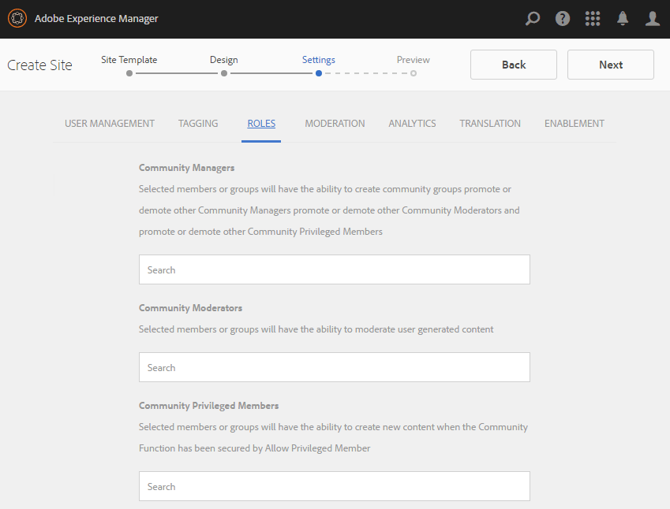

# Console Sites di Communities {#communities-sites-console}

La console Sites di Communities consente di accedere a:

* Creazione di siti
* Modifica del sito
* Gestione del sito
* [Creazione e modifica di gruppi nidificati](groups.md)  (sottocommunity)

Consulta la [Guida introduttiva ad AEM Communities](getting-started.md) per informazioni sulla velocità di creazione di un sito community nell’ambiente di authoring, nonché su come creare gruppi di community dagli ambienti di authoring e pubblicazione.

>[!NOTE]
>
>I menu principali di Communities per la creazione di [siti community](sites-console.md), [modelli di sito community](sites.md), [modelli di gruppo community](tools-groups.md) e [funzioni community](functions.md) sono utilizzabili solo nell&#39;ambiente di authoring.

## Prerequisiti {#prerequisites}

Prima di creare un sito community, è *obbligatorio* per:

* Assicurati che una o più istanze di pubblicazione siano in esecuzione
* Abilita il [servizio tunnel](deploy-communities.md#tunnel-service-on-author) per gestire membri e gruppi di membri
* Identifica il [editore principale](deploy-communities.md#primary-publisher)
* [Configura ](deploy-communities.md#replication-agents-on-author) la replica quando la porta dell&#39;editore principale non è l&#39;impostazione predefinita (4503)

Per garantire che il sito sia pronto a supportare molte funzioni, è consigliabile adottare le seguenti misure:

* Installa il [pacchetto di funzioni più recente](deploy-communities.md#latestfeaturepack)
* Abilita [Adobe Analytics](analytics.md) per AEM Communities
* Configura [e-mail](email.md)
* Identifica [Amministratori community](users.md#creating-community-members)
* [Abilita ](social-login.md#adobe-granite-oauth-authentication-handler) handlerer OAuth per l’accesso social

## Accesso alla console Sites di Communities {#accessing-communities-sites-console}

Nell’ambiente di authoring, per accedere alla console Sites di Communities:

* Dalla navigazione globale: **[!UICONTROL Community > Sites]**

Nella console Sites di Communities vengono visualizzati tutti i siti della community esistenti. Da questa console è possibile creare, modificare, gestire ed eliminare siti community.

Per creare un nuovo sito community, seleziona l’icona **Crea** .

Per accedere a un sito community esistente, seleziona l’icona della cartella Sites per modificarlo, pubblicare, esportare o aggiungere un gruppo nidificato.

Ad esempio, l’immagine seguente mostra la console Sites principale di Communities, che visualizza le cartelle per due siti della community: [abilita](getting-started-enablement.md) e [attiva](getting-started.md):

## Creazione di siti {#site-creation}

La console di creazione del sito fornisce un approccio dettagliato per assemblare le funzioni del sito in base a un [modello di sito community](sites.md) e alle impostazioni selezionate.

Ogni sito creato include una funzione di accesso, in quanto ai visitatori del sito viene richiesto di effettuare l’accesso prima di poter pubblicare contenuto, inviare messaggi o partecipare a un gruppo. Altre funzioni incluse sono profili utente, messaggistica, notifiche, menu del sito, ricerca, temi e branding.

Il processo viene avviato selezionando il pulsante `Create` situato nella parte superiore della console Sites di Communities.

Il processo di creazione è costituito da una serie di passaggi presentati come pannelli contenenti una serie di funzioni da configurare (presentate come pannelli secondari). È possibile passare al passaggio **Successivo** o **Indietro** al passaggio precedente prima di eseguire il commit del sito nel passaggio finale.

### Passaggio 1: Modello del sito {#step-site-template}

Nel pannello Modello del sito sono specificati Titolo, Descrizione, Directory principale del sito, Lingua di base, Nome e Modello del sito:

* **[!UICONTROL Titolo]** sito community: Titolo da visualizzare per il sito.

   Il titolo viene visualizzato nel sito pubblicato e nell’interfaccia utente amministratore del sito.

* **[!UICONTROL Descrizione]** sito community: Descrizione del sito.

   La descrizione non viene visualizzata sul sito pubblicato.

* **[!UICONTROL Directory principale]** sito community: Percorso principale del sito.

   La radice predefinita è `/content/sites`, ma la radice può essere spostata in qualsiasi posizione all&#39;interno del sito Web.

* **[!UICONTROL Lingua]** di base del sito community: (lasciare intatti per una sola lingua: Inglese) utilizza il menu a discesa per scegliere una  *o* più lingue tra le lingue disponibili: tedesco, italiano, francese, giapponese, spagnolo, portoghese (Brasile), cinese (tradizionale) e cinese (semplificato). Per ogni lingua aggiunta verrà creato un sito community all’interno della stessa cartella del sito seguendo la procedura consigliata descritta in [Traduzione di contenuti per siti multilingue](../../help/sites-administering/translation.md). La pagina principale di ciascun sito conterrà una pagina figlia denominata dal codice della lingua di una delle lingue selezionate, ad esempio &quot;en&quot; per l’inglese o &quot;fr&quot; per il francese.

* **[!UICONTROL Nome]** sito community: Nome della pagina principale del sito che appare nell&#39;URL

   * Controlla il nome in quanto non viene facilmente modificato dopo la creazione del sito
   * L&#39;URL di base ( `https://*server:port/site root/site name*)` verrà visualizzato sotto il `Community Site Name`
   * Per un URL valido, aggiungi un codice della lingua di base + &quot;.html&quot;

      *Esempio*, `http://localhost:4502/content/sites/mysight/en.html`

* **[!UICONTROL Menu]** del sito della community: Utilizza il menu a discesa per scegliere un modello di sito  [community](tools.md) disponibile.

Seleziona **[!UICONTROL Avanti]**

### Passaggio 2: Progettazione {#step-design}

Il pannello Progettazione contiene 2 pannelli secondari per la selezione del tema e del banner di branding:

#### TEMA DEL SITO DELLA COMMUNITY {#community-site-theme}

Il framework utilizza [Bootstrap Twitter](https://twitterbootstrap.org/) per portare un design reattivo e flessibile al sito. È possibile selezionare uno dei molti temi di Bootstrap precaricati per personalizzare lo stile del modello di sito community selezionato oppure caricare un tema di Bootstrap.

Quando è selezionato, il tema viene sovrapposto con un segno di spunta blu opaco.

Dopo la pubblicazione del sito community, è possibile [modificare le proprietà](#modifying-site-properties) e selezionare un tema diverso.

#### MARCHIO DEL SITO COMMUNITY {#community-site-branding}

Il branding del sito community è un’immagine visualizzata come intestazione nella parte superiore di ogni pagina.

Le dimensioni dell’immagine devono essere pari alla visualizzazione prevista della pagina nel browser e a 120 pixel in altezza.

Quando crei o selezioni un’immagine, tieni presente quanto segue:

* L&#39;altezza dell&#39;immagine viene ritagliata a 120 pixel misurati dal bordo superiore dell&#39;immagine
* L&#39;immagine viene fissata al bordo sinistro della finestra del browser
* L&#39;immagine non viene ridimensionata, in modo tale che quando la larghezza dell&#39;immagine è...

   * Inferiore alla larghezza del browser, l&#39;immagine si ripeterà in orizzontale
   * Maggiore della larghezza del browser, l&#39;immagine apparirà ritagliata

Seleziona **[!UICONTROL Avanti]**.

### Passaggio 3: Impostazioni {#step-settings}

Il pannello Impostazioni contiene diversi pannelli secondari che presentano funzioni da configurare prima di passare all’ultimo passaggio per creare il sito.

* [GESTIONE UTENTE](#user-management)
* [TAG](#tagging)
* [RUOLI](#roles)
* [MODERAZIONE](#moderation)
* [ANALYTICS](#analytics)
* [TRADUZIONE](#translation)
* [ABILITARE](#enablement)

>[!NOTE]
>
>**Attiva servizio tunnel**
>
>Diversi pannelli secondari Impostazioni consentono l’assegnazione di un membro fidato per moderare UGC, gestire gruppi o essere contatti per le risorse di abilitazione nell’ambiente di pubblicazione.
>
>La convenzione prevede che gli utenti e i gruppi di utenti [lato pubblicazione](users.md) (membri e gruppi di membri) non vengano duplicati nell’ambiente di authoring.
>
>Pertanto, quando crei il sito community nell’ambiente di authoring e assegni membri affidabili a vari ruoli, è necessario recuperare i dati dei membri dall’ambiente di pubblicazione.
>
>Questa operazione viene eseguita abilitando l’ ` [AEM Communities Publish Tunnel Service](deploy-communities.md#tunnel-service-on-author)`per l’ambiente di authoring.

#### GESTIONE UTENTI {#user-management}

>[!NOTE]
>
>Si consiglia di [abilitare i siti della community](overview.md#enablement-community) come privati (per ulteriori informazioni, contattare il rappresentante commerciale di riferimento).
>
>Un sito community è privato quando ai visitatori anonimi viene negato l’accesso, non può registrarsi autonomamente e non può utilizzare l’accesso social.

* **[!UICONTROL Consenti registrazione utente]**

   Se questa opzione è selezionata, i visitatori del sito possono diventare membri della community mediante registrazione automatica.

   Se questa opzione è deselezionata, il sito della community è *limitato* e i visitatori del sito devono essere assegnati al gruppo di membri del sito della community, fare una richiesta o essere inviati tramite e-mail di invito. Se questa opzione è deselezionata, l’accesso anonimo non deve essere consentito.

   Deseleziona un sito della community *privato*. Il valore predefinito è selezionato.

* **[!UICONTROL Consenti accesso anonimo]**

   Se questa opzione è selezionata, il sito della community è *open* e qualsiasi visitatore del sito può accedere al sito.

   Se questa opzione è deselezionata, solo i membri che hanno effettuato l’accesso possono accedere al sito.

   Deseleziona un sito della community *privato*. Il valore predefinito è selezionato.

* **[!UICONTROL Consenti messaggi]**

   Se questa opzione è selezionata, i membri possono inviare messaggi tra loro e al gruppo all&#39;interno del sito della community.

   Se questa opzione è deselezionata, la messaggistica non è impostata per la community.

   Il valore predefinito è deselezionato.

* **[!UICONTROL Consenti accesso social network: Facebook]**

   Se questa opzione è selezionata, consenti ai visitatori del sito di accedere con le proprie credenziali account Facebook. La [configurazione cloud di Facebook](social-login.md#create-a-facebook-connect-cloud-service) selezionata deve essere configurata per aggiungere utenti al gruppo di membri del sito community una volta creato il sito community.

   Se questa opzione è deselezionata, non viene presentato alcun accesso a Facebook.

   Lascia deselezionato un sito della community *privato*. Il valore predefinito è deselezionato.

* **[!UICONTROL Consenti accesso social network: Twitter]**

   Se questa opzione è selezionata, consenti ai visitatori del sito di accedere con le credenziali del loro account Twitter. La [configurazione cloud Twitter](social-login.md#create-a-twitter-connect-cloud-service) selezionata deve essere configurata per aggiungere utenti al gruppo di membri del sito community una volta creato il sito community.

   Se questa opzione è deselezionata, non viene presentato alcun accesso a Twitter.

   Lascia deselezionato un sito della community *privato*. Il valore predefinito è deselezionato.

>[!NOTE]
>
>**[!UICONTROL Consentire gli accessi social]**
>
>Anche se le configurazioni Facebook e Twitter di esempio possono esistere e essere selezionabili, per un [ambiente di produzione](../../help/sites-administering/production-ready.md), è necessario creare applicazioni Facebook e Twitter personalizzate. Consulta [Accesso social con Facebook e Twitter](social-login.md).

#### TAG {#tagging}

I tag che possono essere applicati al contenuto della community sono controllati selezionando Tag Namespace definiti in precedenza tramite la [Console tag](../../help/sites-administering/tags.md#tagging-console).

Inoltre, la selezione dei namespace dei tag per il sito community limita la selezione presentata durante la definizione di cataloghi e risorse. Per informazioni importanti, consulta [Assegnazione tag alle risorse di abilitazione](tag-resources.md) .

* Casella di ricerca testo: inizia a digitare per identificare i tag consentiti nel sito

#### RUOLI {#roles}

I [ruoli dei membri della community](users.md) vengono assegnati con queste impostazioni.

La ricerca di membri della community è semplice tramite la ricerca tipo-avanti.

* **[!UICONTROL Manager community]**

   Inizia a digitare per selezionare uno o più membri della community o gruppi di membri che possono gestire membri della community e gruppi di membri.

* **[!UICONTROL Moderatori community]**

   Inizia a digitare per selezionare uno o più membri della community o gruppi di membri di cui si deve fare affidamento come moderatori di contenuti generati dall’utente.

* **[!UICONTROL Membri community con privilegi]**

   Inizia a digitare per selezionare uno o più membri della community o gruppi di membri a cui assegnare la possibilità di creare nuovi contenuti quando `Allow Privileged Member` è stato selezionato per una [funzione community](functions.md).

#### MODERAZIONE {#moderation}

L’impostazione globale per la moderazione del contenuto generato dall’utente (UGC) è controllata da queste impostazioni. I singoli componenti dispongono di impostazioni aggiuntive per controllare la moderazione.

* **[!UICONTROL Il contenuto è premoderato]**

   Se questa opzione è selezionata, il contenuto della community pubblicato non verrà visualizzato fino all&#39;approvazione da parte di un moderatore. Il valore predefinito è deselezionato. Per ulteriori informazioni, consulta [Moderazione del contenuto della community](moderate-ugc.md#premoderation).

* **[!UICONTROL Soglia di segnalazione prima che il contenuto venga nascosto]**

   Se è maggiore di 0, il numero di volte in cui un argomento o un post deve essere contrassegnato prima che venga nascosto dalla visualizzazione pubblica. Se è impostato su -1, l&#39;argomento o il post contrassegnati non viene mai nascosto dalla visualizzazione pubblica. Il valore predefinito è 5.

#### ANALYTICS {#analytics}

* **[!UICONTROL Abilita Analytics]**

   Disponibile solo se Adobe Analytics è stato [configurato](analytics.md) per le funzioni di Communities.

   Il valore predefinito è deselezionato. Quando questa opzione è selezionata, viene visualizzato un menu di selezione aggiuntivo:

* **[!UICONTROL Riferimento framework configurazione Cloud]**

   Dal menu a discesa, seleziona il framework del servizio cloud di Analytics configurato per questo sito community.

   `Communities`è l’esempio di framework della documentazione Configurazione di  [Analytics per le ](analytics.md#aem-analytics-framework-configuration) funzioni di Communities.

#### TRADUZIONE {#translation}

* **[!UICONTROL Consenti]**
traduzione automaticaSe questa opzione è selezionata (l&#39;impostazione predefinita è deselezionata), la traduzione automatica è abilitata per UGC all&#39;interno del sito. Questo non influisce su altri contenuti, come il contenuto della pagina, anche se il sito è configurato come sito multilingue. Consulta [Traduzione di contenuti generati dagli utenti](translate-ugc.md) per informazioni sulla configurazione di un servizio di traduzione concesso in licenza per AEM Communities. Per una panoramica completa, consulta [Traduzione di contenuti per siti multilingue](../../help/sites-administering/translation.md) .

* **[!UICONTROL Attiva traduzione automatica per le lingue selezionate]**

   Le lingue abilitate per la traduzione automatica sono predefinite per l&#39;impostazione di sistema specificata dalla [configurazione dell&#39;integrazione di traduzione](translate-ugc.md#translation-integration-configuration). Queste impostazioni predefinite possono essere sostituite per questo sito eliminando le impostazioni predefinite e/o selezionando altre lingue dal menu a discesa.

* **[!UICONTROL Scegli il provider di traduzione]**

   Per impostazione predefinita, il provider di servizi è un servizio di prova che utilizza `microsoft`solo a scopo dimostrativo. Se nessun provider di servizi di traduzione è abilitato, **Consenti traduzione automatica** deve essere deselezionato.

* **[!UICONTROL Scegli store condiviso globale]**

   Per un sito web con più copie in lingua, un archivio condiviso globale fornisce un singolo thread di conversazione, visibile da ogni copia in lingua. Questo si ottiene selezionando una delle lingue incluse come copia per lingua. Il valore predefinito è *Nessun archivio condiviso globale*.

* **[!UICONTROL Scegli la configurazione del provider di traduzione]**

   Scegli un [framework di integrazione della traduzione](../../help/sites-administering/tc-tic.md) creato per il provider di traduzione con licenza.

* **Seleziona le opzioni di traduzione per il sito community**

   * **[!UICONTROL Traduci tutta la pagina]**

      Se selezionato, tutti gli UGC di una pagina vengono tradotti nella lingua di base della pagina.

      Il valore predefinito è *non selezionato*.

   * **[!UICONTROL Traduci solo la selezione]**

      Se selezionata, accanto a ciascun post viene visualizzata un’opzione di traduzione che consente di tradurre i singoli post nella lingua di base della pagina.

      Il valore predefinito è *selezionato*.

* **Seleziona le opzioni di persistenza**

   * **[!UICONTROL Traduci contributi su richiesta dell&#39;utente e in seguito mantieni le traduzioni]**

      Se selezionato, il contenuto non viene tradotto fino a quando non viene effettuata una richiesta. Una volta tradotta, la traduzione viene memorizzata nell&#39;archivio.

      Il valore predefinito è *non selezionato*.

   * **[!UICONTROL Non mantenere le traduzioni]**

      Se selezionata, le traduzioni non vengono memorizzate nell&#39;archivio.

      Se non è selezionata, le traduzioni vengono mantenute.

      Il valore predefinito è *non selezionato*.

* **[!UICONTROL Smart]**
RenderSeleziona una delle seguenti opzioni

   * `Always show contributions in the original language` (impostazione predefinita)
   * `Always show contributions in user preferred language`
   * `Show contributions in user preferred language for only logged-in users`

#### ABILITAZIONE {#enablement}

Le impostazioni `ENABLEMENT`sono applicabili quando il modello di sito community scelto include la [funzione di assegnazione](functions.md#assignments-function), disponibile quando le funzioni di abilitazione sono concesse in licenza e [configurate](enablement.md). Il modello di sito di riferimento che include la funzione assegnazioni è `Reference Structured Learning Site Template.`

* **[!UICONTROL Gestione attivazione]**

   (obbligatorio) Solo i membri del gruppo `Community Enablementmanagers` possono essere selezionati per gestire questa community di abilitazione. I responsabili dell&#39;abilitazione sono responsabili dell&#39;assegnazione dei membri alle risorse. Vedere anche [Gestione di utenti e gruppi di utenti](users.md).

* **[!UICONTROL ID organizzazione Marketing Cloud]**

   (facoltativo) ID per una licenza [Video Heartbeat Analytics](analytics.md#video-heartbeat-analytics) .

Seleziona **[!UICONTROL Avanti]**.

### Passaggio 4: Crea sito community {#step-create-communities-site}

Se sono necessarie delle regolazioni, utilizza il pulsante **Indietro** per eseguirle.

Una volta selezionato e avviato **Crea**, il processo di creazione del sito non può essere interrotto.

Una volta creato il sito:

* La modifica dell’url (nome nodo) non è supportata
* Le future modifiche al modello di sito community non influiranno sul sito community creato
* La disattivazione del modello di sito community non influisce sul sito community creato
* È possibile modificare la [STRUTTURA](#modify-structure) di un sito community modificandone le proprietà

Al termine del processo, la cartella per il nuovo sito viene visualizzata nella console Sites di Communities, da cui gli autori possono aggiungere contenuti di pagina o gli amministratori possono modificare le proprietà del sito.

Per modificare un sito community, seleziona la relativa cartella di progetto per aprirlo:

Quando si passa il mouse su un sito o si tocca una scheda del sito, vengono visualizzate icone che consentono di [modificare il sito in modalità di authoring](#authoring-site-content), [aprire le proprietà del sito per la modifica](#modifying-site-properties), [pubblicare il sito](#publishing-the-site), [esportare il sito](#exporting-the-site) e [eliminare il sito](#deleting-the-site).

## Creazione di contenuti del sito {#authoring-site-content}

Il contenuto di un sito può essere creato con gli stessi strumenti di qualsiasi altro sito web AEM. Per aprire il sito per l’authoring, seleziona l’icona `Open Site` che viene visualizzata quando si passa il mouse sul sito. Il sito verrà aperto in una nuova scheda in modo che la console Sites di Communities rimanga accessibile.

>[!NOTE]
>
>Se non hai dimestichezza con AEM, consulta la documentazione su [operazioni di base](../../help/sites-authoring/basic-handling.md) e una [guida rapida all’authoring delle pagine](../../help/sites-authoring/qg-page-authoring.md).

## Modifica delle proprietà del sito {#modifying-site-properties}

È possibile modificare le proprietà di un sito esistente, specificate durante il processo di creazione del sito, selezionando l&#39;icona `Edit Site`visualizzata quando si passa il mouse sul sito.

`Details of the following properties match the descriptions provided in the` [Sezione ](#site-creation) Creazione sito.

### Modifica base {#modify-basic}

Il pannello BASIC consente di modificare

* Titolo del sito community
* Descrizione del sito community

Impossibile modificare il nome del sito community.

La scelta di un diverso modello di sito community non avrebbe alcun impatto su un sito community esistente, in quanto non rimane alcuna connessione tra modelli e siti.

È invece possibile modificare la [STRUTTURA](#modify-structure) del sito della community.

### Modifica struttura {#modify-structure}

Il pannello STRUTTURA consente di modificare la struttura inizialmente creata dal modello di sito community selezionato. Dal pannello è possibile

* Trascina [funzioni community aggiuntive](functions.md) nella struttura del sito
* In un&#39;istanza di una funzione comunitaria nella struttura del sito:

   * **`gear icon`**

      modificare le impostazioni, inclusi il titolo visualizzato e il nome URL&amp;ast;

      nonché [gruppi di membri con privilegi](users.md#privilegedmembersgroups)

   * **`trashcan icon`**

      rimuovere (eliminare) funzioni dalla struttura del sito

   * **`grid icon`**

      modifica l&#39;ordine delle funzioni come visualizzate nella barra di navigazione di livello superiore del sito

>[!NOTE]
>
>È possibile modificare l&#39;ordine di tutte le funzioni nella struttura del sito, ad eccezione della funzione nella parte superiore. Pertanto, la home page del sito community non può essere modificata.

>[!CAUTION]
>
>Anche se il titolo visualizzato può essere modificato senza effetti collaterali, si sconsiglia di modificare il nome URL di una funzione community appartenente a un sito community.
>
>Ad esempio, la ridenominazione dell’URL non comporterà lo spostamento dell’UGC esistente, con l’effetto di perdere l’UGC.

>[!CAUTION]
>
>La funzione dei gruppi deve *non* essere la funzione *prima né la funzione unica* nella struttura del sito.
>
>Qualsiasi altra funzione, come la [funzione pagina](functions.md#page-function), deve essere inclusa ed elencata per prima.

#### Esempio: Aggiunta di una funzione di catalogo a una struttura del sito della community {#example-adding-a-catalog-function-to-a-community-site-structure}

### Modifica progettazione {#modify-design}

Il pannello PROGETTAZIONE consente di applicare un nuovo tema:

* [Tema per sito community](#community-site-theme)
* [Marchio per sito community](#community-site-branding)
   * Scorri fino alla parte inferiore del pannello per modificare l’immagine del marchio

### Modifica impostazioni {#modify-settings}

Il pannello IMPOSTAZIONI consente di accedere alla maggior parte delle impostazioni sotto i pannelli secondari di per il passaggio 3 della creazione di siti community:

* [Gestione utente](#user-management)
* [Tag](#tagging)
* [Moderazione](#moderation)
* [Ruoli dei membri](#roles)
* [Analytics](#analytics)
* [Traduzione](#translation)

### Modifica miniatura {#modify-thumbnail}

Il pannello THUMBNAIL consente di caricare un’immagine per rappresentare il sito nella console Sites di Communities.

### Modifica abilitazione {#modify-enablement}

Il pannello ENABLEMENT consente di accedere alle impostazioni fornite durante la creazione del sito community.

Consultare la descrizione [ENABLEMENT](#enablement) .

## Pubblicazione del sito {#publishing-the-site}

Una volta creato o modificato un sito community, è possibile pubblicarlo (attivarlo) selezionando l’ icona `Publish Site` , visualizzata al passaggio del mouse sul sito.

Dopo la corretta pubblicazione del sito verrà visualizzata un’indicazione.

### Pubblicazione con gruppi nidificati {#publishing-with-nested-groups}

Dopo aver pubblicato un sito community, è necessario pubblicare singolarmente ogni sottocommunity (gruppo nidificato) creata utilizzando la [console Gruppi](groups.md).

## Esportazione del sito {#exporting-the-site}

Seleziona l&#39;icona di esportazione, al passaggio del mouse sul sito, per creare un pacchetto del sito community che viene memorizzato e scaricato sia in [package manager](../../help/sites-administering/package-manager.md).\
UGC non è incluso nel pacchetto del sito.

## Eliminazione del sito {#deleting-the-site}

Per eliminare il sito community, seleziona l’icona Elimina sito visualizzata quando si passa il mouse sul sito nella console Sito di Communities. Questa azione rimuove tutti gli elementi associati al sito, come UGC, gruppi di utenti, risorse e record di database.

## Gruppi di utenti della community creata {#created-community-user-groups}

Una volta pubblicato il nuovo sito della community, i nuovi gruppi di membri (i gruppi di utenti vengono creati nell&#39;ambiente di pubblicazione) che dispongono delle autorizzazioni appropriate impostate per vari ruoli amministrativi e membri.

Il nome creato per i gruppi di membri include il *nome-sito* dato il sito in [Passaggio 1](#step13asitetemplate) (il nome che appare nell&#39;URL), nonché un ID univoco per evitare conflitti con siti e gruppi di community con lo stesso nome-sito per diverse radici del sito community.

Ad esempio, se il nome fosse &quot;coinvolgente&quot; per un sito intitolato &quot;Esercitazione introduttiva&quot;, il gruppo di utenti per i moderatori sarebbe:

* Titolo: Moderatori di coinvolgimento della community
* Nome: moderatori community-*interazione-uid*

Tutti i membri assegnati ruoli come moderatori o amministratori di gruppo durante la creazione del sito, verranno assegnati al gruppo appropriato e al gruppo di membri. Questi gruppi e assegnazioni di membri vengono creati al momento della pubblicazione del nuovo sito.

Per informazioni dettagliate, consulta [Gestione di utenti e gruppi di utenti](users.md).

>[!NOTE]
>
>Se [Consenti accesso social network: Facebook](#user-management) è abilitato una volta che il gruppo di utenti
>
>* membri della community-*&lt;site-name>*-*&lt;uid>*

viene creato, il [servizio cloud Facebook](social-login.md#createafacebookcloudservice) applicato deve essere configurato per aggiungere utenti a questo gruppo.

## Configura per l&#39;errore di autenticazione {#configure-for-authentication-error}

Per impostazione predefinita, un sito della community effettua il reindirizzamento a una pagina di accesso di esempio quando l’utente immette le credenziali errate e non riesce ad accedere. Questo accesso di esempio non sarà presente su un [server di produzione](../../help/sites-administering/production-ready.md).

Per reindirizzare correttamente, dopo che un sito è stato configurato e inviato per la pubblicazione, completa questi passaggi per ottenere l’errore di autenticazione durante il reindirizzamento al sito della community:

* Su ogni istanza di pubblicazione AEM
* Accesso con privilegi di amministratore
* Accedi alla [Console web](../../help/sites-deploying/configuring-osgi.md)
   * Ad esempio, [http://localhost:4503/system/console/configMgr](http://localhost:4503/system/console/configMgr)

* Individua `Adobe Granite Login Selector Authentication Handler`
* Seleziona l’icona `pencil`per aprire la configurazione per la modifica
* Inserisci una **[!UICONTROL mappature pagina di login]** come segue:

   `/content/sites/<site-name>/path/to/login/page:/content/sites/<site-name>`

   ad esempio:

   `/content/sites/engage/en/signin:/content/sites/engage/en`

* Seleziona **[!UICONTROL Salva]**

### Reindirizzamento autenticazione test {#test-authentication-redirection}

Nella stessa istanza di pubblicazione AEM configurata con una mappatura pagina di accesso per il sito della community:

* Passa alla home page del sito community
   * Ad esempio, [http://localhost:4503/content/sites/engage/en.html](http://localhost:4503/content/sites/engage/en.html)

* Seleziona Esci
* Seleziona accesso
* Immetti credenziali ovviamente errate, come il nome utente &quot;x&quot; e la password &quot;x&quot;
* La pagina di accesso deve essere visualizzata con un errore di &quot;login non valido&quot;

## Accesso ai siti della community dalla console Siti principali {#accessing-community-sites-from-main-sites-console}

Dalla console di navigazione globale Sites , i siti della community si trovano nella cartella `Community Sites` .

Sebbene sia possibile accedere in questo modo a un sito della community, per attività amministrative, il sito della community è accessibile dalla console Sites di Communities.

