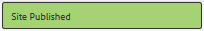
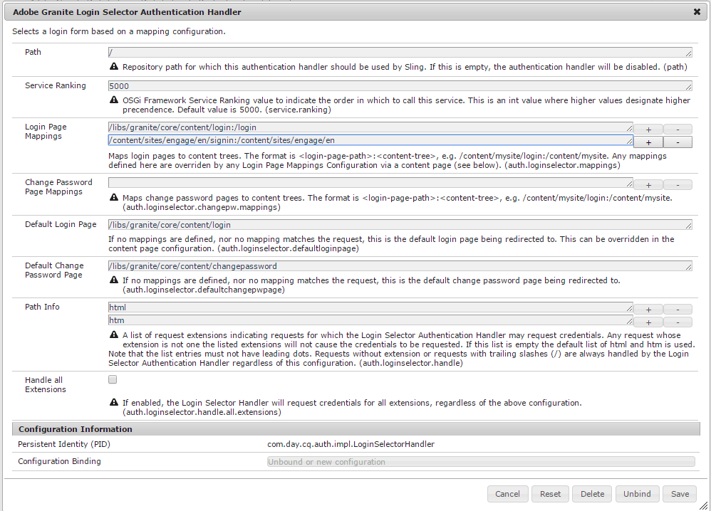

# Console Siti community {#communities-sites-console}

La console Siti community consente di accedere a:

* Creazione del sito
* Modifica del sito
* Gestione del sito
* [Creazione e modifica di gruppi](groups.md) nidificati (sottocomunità)

Consultate [Guida introduttiva  AEM Communities](getting-started.md) per verificare la rapidità con cui è possibile creare un sito community nell’ambiente di authoring, nonché come creare gruppi di community dagli ambienti di creazione e pubblicazione.

>[!NOTE]
>
>I principali menu Community per la creazione di siti community, modelli [di siti](sites.md)community, modelli [di gruppi](tools-groups.md) community e funzioni  community sono utilizzabili solo nell&#39;ambiente di authoring.

## Prerequisiti {#prerequisites}

Prima di creare un sito community, è *necessario* :

* Verificare l&#39;esecuzione di una o più istanze di pubblicazione
* Attivazione del servizio  tunnel per gestire membri e gruppi di membri
* Identificare l&#39;editore [principale](deploy-communities.md#primary-publisher)
* [Configurare la replica](deploy-communities.md#replication-agents-on-author) quando la porta dell&#39;editore principale non è l&#39;impostazione predefinita (4503)

Per garantire che il sito sia pronto a supportare molte funzioni, è consigliabile adottare le seguenti misure:

* Installare il pacchetto di funzioni [più recente](deploy-communities.md#latestfeaturepack)
* Abilita [Adobe Analytics](analytics.md) per  AEM Communities
* Configura [e-mail](email.md)
* Identificare gli amministratori [della community](users.md#creating-community-members)
* [Abilita gestore](social-login.md#adobe-granite-oauth-authentication-handler) OAuth per l&#39;accesso tramite social network

## Accesso alla console Siti di Communities {#accessing-communities-sites-console}

In the author environment, to reach the Communities Sites console:

* Dalla navigazione globale: **[!UICONTROL Community > Siti]**

Nella console Siti community sono visualizzati tutti i siti community esistenti. From this console, community sites may be created, edited, managed and deleted.

Per creare un nuovo sito community, selezionate l&#39;icona **Crea** .

To access an existing community site, for the purpose of authoring, modifying, publishing, exporting, or adding a nested group, select the sites&#39; folder icon.

For example, the following image shows the main Communities Sites console displaying the folders for two community sites: [enable](getting-started-enablement.md) and [engage](getting-started.md):

## Site Creation {#site-creation}

La console per la creazione di siti offre un approccio passo passo per assemblare le funzioni del sito in base a un modello [e alle impostazioni di sito](sites.md) community selezionate.

Ogni sito creato include una funzione di login in quanto i visitatori del sito devono effettuare l’accesso prima di poter pubblicare contenuto, inviare messaggi o partecipare a un gruppo. Altre funzioni incluse sono profili utente, messaggi, notifiche, menu del sito, ricerca, temi e personalizzazione.

Il processo viene avviato selezionando il `Create` pulsante situato nella parte superiore della console Siti community.

Il processo di creazione è costituito da una serie di passaggi presentati come pannelli contenenti una serie di funzioni da configurare (presentate come sottopannelli). È possibile passare al passaggio **Successivo** o **Indietro** al passaggio precedente prima di eseguire il commit del sito nel passaggio finale.

### Passaggio 1: Modello del sito {#step-site-template}

Nel pannello Modello del sito sono specificati il Titolo, la Descrizione, la Radice del sito, la Lingua di base, il Nome e il Modello del sito:

* **[!UICONTROL Titolo]** sito community: Titolo visualizzato per il sito.

   Il titolo viene visualizzato sia nel sito pubblicato che nell’interfaccia utente di amministrazione del sito.

* **[!UICONTROL Descrizione]** sito community: Descrizione del sito.

   The description does not appear on the published site.

* **[!UICONTROL Radice]** sito community: Percorso principale del sito.

   L&#39;elemento principale predefinito è `/content/sites`, ma l&#39;elemento principale può essere spostato in qualsiasi posizione all&#39;interno del sito Web.

* **[!UICONTROL Lingua]** di base del sito community: (lasciare invariate le lingue per una sola: Inglese) utilizzate il menu a discesa per scegliere una *o più* lingue di base tra quelle disponibili: tedesco, italiano, francese, giapponese, spagnolo, portoghese (Brasile), cinese (tradizionale) e cinese (semplificato). Verrà creato un sito community per ogni lingua aggiunta, all&#39;interno della stessa cartella del sito seguendo la procedura descritta in [Traduzione di contenuti per siti](../../help/sites-administering/translation.md)multilingue. La pagina principale di ciascun sito conterrà una pagina figlia denominata dal codice della lingua di una delle lingue selezionate, ad esempio &#39;en&#39; per l&#39;inglese o &#39;fr&#39; per il francese.

* **[!UICONTROL Nome]** sito community: Nome della pagina principale del sito che viene visualizzata nell’URL

   * Ricontrolla il nome perché non viene facilmente modificato dopo la creazione del sito
   * L&#39;URL di base ( `https://*server:port/site root/site name*)` viene visualizzato sotto la `Community Site Name`
   * Per un URL valido, aggiungete un codice della lingua di base + &quot;.html&quot;

      *Ad esempio*, `http://localhost:4502/content/sites/mysight/en.html`

* **[!UICONTROL Menu Modello]** sito community: Utilizzate il menu a discesa per scegliere un modello [di sito](tools.md)community disponibile.

Seleziona **[!UICONTROL Avanti]**

### Passaggio 2: Progettazione {#step-design}

Il pannello Progettazione contiene 2 pannelli secondari per selezionare il tema e il banner di branding:

#### COMMUNITY SITE THEME {#community-site-theme}

Il framework utilizza l’Bootstrap  Twitter per fornire al sito un design reattivo e flessibile. È possibile selezionare uno dei numerosi temi di Bootstrap precaricati per definire lo stile del modello di sito community selezionato oppure caricare un tema di Bootstrap.

Quando è selezionato, il tema verrà sovrapposto con un segno di spunta blu opaco.

Dopo la pubblicazione del sito community, è possibile [modificare le proprietà](#modifying-site-properties) e selezionare un tema diverso.

#### COMMUNITY SITE BRANDING {#community-site-branding}

Il marchio Community del sito è un&#39;immagine visualizzata come intestazione nella parte superiore di ogni pagina.

Le dimensioni dell’immagine devono corrispondere alla larghezza prevista per la visualizzazione della pagina nel browser e a 120 pixel in altezza.

When creating or selecting an image, keep in mind:

* L’altezza dell’immagine viene ritagliata a 120 pixel, misurati dal bordo superiore dell’immagine
* L&#39;immagine viene bloccata sul bordo sinistro della finestra del browser
* There is no resizing of the image, such that when the image width is...

   * Con una larghezza inferiore a quella del browser, l&#39;immagine si ripeterà in orizzontale
   * Maggiore della larghezza del browser, l&#39;immagine apparentemente verrà ritagliata

Seleziona **[!UICONTROL Avanti]**.

### Passaggio 3: Impostazioni {#step-settings}

Il pannello Impostazioni contiene diversi pannelli secondari che presentano le funzioni da configurare prima di passare all’ultimo passaggio per la creazione del sito.

* [GESTIONE UTENTE](#user-management)
* [TAG](#tagging)
* [RUOLI](#roles)
* [MODERAZIONE](#moderation)
* [ANALYTICS](#analytics)
* [TRADUZIONE](#translation)
* [ABILITAZIONE](#enablement)

>[!NOTE]
>
>**Enable Tunnel Service**
>
>Several of the Settings sub-panels allow assignment of a trusted member to moderate UGC, manage groups, or be contacts for enablement resources in the publish environment.
>
>The convention is for publish-side [users and user groups](users.md) (members and member groups) to not be duplicated in the author environment.
>
>Pertanto, quando create il sito community nell&#39;ambiente di creazione e assegnate membri attendibili a vari ruoli, è necessario recuperare i dati dei membri dall&#39;ambiente di pubblicazione.
>
>This is accomplished by enabling the ` [AEM Communities Publish Tunnel Service](deploy-communities.md#tunnel-service-on-author)`for the author environment.

#### USER MANAGEMENT {#user-management}

>[!NOTE]
>
>It is recommended that [enablement community sites](overview.md#enablement-community) be private (contact your account representative for more information).
>
>A community site is private when anonymous site visitors are denied access, may not self-register, and may not use social login.

* **[!UICONTROL Consenti registrazione utente]**

   If checked, site visitors may become community members by self-registration.

   If unchecked, the community site is *restricted* and site visitors must be assigned to the community site&#39;s members group, make a request or be sent an invitation by email. If unchecked, anonymous access should not be allowed.

   Uncheck for a *private* community site. Il valore predefinito è selezionato.

* **[!UICONTROL Consenti accesso anonimo]**

   If checked, the community site is *open* and any site visitor may access the site.

   Se questa opzione è deselezionata, solo i membri che hanno effettuato l’accesso possono accedere al sito.

   Uncheck for a *private* community site. Il valore predefinito è selezionato.

* **[!UICONTROL Consenti messaggi]**

   Se selezionato, i membri possono inviare messaggi tra loro e al gruppo all&#39;interno del sito della community.

   If unchecked, messaging is not setup for the community.

   Il valore predefinito è deselezionato.

* **[!UICONTROL Consenti accesso social network: Facebook]**

   If checked, allow site visitors to sign in with their Facebook account credentials. La configurazione [cloud](social-login.md#create-a-facebook-connect-cloud-service) Facebook selezionata deve essere configurata per aggiungere utenti al gruppo di membri del sito community una volta creato il sito community.

   Se questa opzione è deselezionata, non viene presentato alcun login di Facebook.

   Lasciate deselezionato un sito community *privato* . Il valore predefinito è deselezionato.

* **[!UICONTROL Consenti accesso social network: Twitter]**

   Se questa opzione è selezionata, consentite ai visitatori del sito di accedere con le credenziali del loro account Twitter. La configurazione [cloud](social-login.md#create-a-twitter-connect-cloud-service) Twitter selezionata dovrebbe essere configurata per aggiungere utenti al gruppo di membri del sito community una volta creato il sito community.

   Se questa opzione è deselezionata, non viene presentato alcun login a Twitter.

   Lasciate deselezionato un sito community *privato* . Il valore predefinito è deselezionato.

>[!NOTE]

**[!UICONTROL Consentire accessi tramite social network]**
>Anche se le configurazioni Facebook e Twitter di esempio possono esistere e essere selezionabili, per un ambiente [di](../../help/sites-administering/production-ready.md)produzione è necessario creare applicazioni Facebook e Twitter personalizzate. See [Social Login with Facebook and Twitter](social-login.md).
>
#### TAGGING {#tagging}

I tag che possono essere applicati al contenuto della community sono controllati selezionando Spazi dei nomi dei tag definiti in precedenza tramite la console Tagging.

Inoltre, se si selezionano gli spazi dei nomi dei tag per il sito community, la selezione viene limitata quando si definiscono cataloghi e risorse. See [Tagging Enablement Resources](tag-resources.md) for important information.

* Text search box: start typing to identify tags allowed to be used on the site

#### ROLES {#roles}

The [roles of community members](users.md) are assigned with these settings.

Finding community members is easy using type-ahead search.

* **[!UICONTROL Manager community]**

   Start typing to select one or more community members or member groups who may manager community members and member groups.

* **[!UICONTROL Moderatori community]**

   Start typing to select one or more community members or member groups who are to be trusted as moderators of user generated content.

* **[!UICONTROL Membri community con privilegi]**

   Start typing to select one or more community members or member groups to be given the ability to create new content when `Allow Privileged Member` has been selected for a [community function](functions.md).

#### MODERATION {#moderation}

The global setting for moderating user generated content (UGC) is controlled by these settings. Individual components have additional settings to control moderation.

* **[!UICONTROL Il contenuto è premoderato]**

   If checked, posted community content will not appear until approved by a moderator. Il valore predefinito è deselezionato. For more information, see [Moderating Community Content](moderate-ugc.md#premoderation).

* **[!UICONTROL Soglia di segnalazione prima che il contenuto venga nascosto]**

   Se è maggiore di 0, il numero di volte in cui un topic o un post deve essere contrassegnato prima che venga nascosto dalla visualizzazione pubblica. If set to -1, the flagged topic or post is never hidden from public view. Il valore predefinito è 5.

#### ANALYTICS {#analytics}

* **[!UICONTROL Abilita Analytics]**

   Only available when Adobe Analytics has been [configured](analytics.md) for Communities features.

   Il valore predefinito è deselezionato. When checked, an additional selection menu appears:

* **[!UICONTROL Riferimento framework configurazione Cloud]**

   Dal menu a discesa, seleziona il framework del servizio cloud di Analytics configurato per questo sito community.

   `Communities`è l&#39;esempio del framework fornito dalla documentazione di [Analytics Configuration for Communities Features](analytics.md#aem-analytics-framework-configuration) .

#### TRANSLATION {#translation}

* **[!UICONTROL Allow Machine Translation]**
When checked (default is unchecked), machine translation is enabled for UGC within the site. This does not affect any other content, such as page content, even if the site is setup as a multilingual site. See [Translating User Generated Content](translate-ugc.md) for information on configuring a licensed translation service for AEM Communities. Consultate [Traduzione di contenuti per siti](../../help/sites-administering/translation.md) multilingue per una panoramica completa.

* **[!UICONTROL Attiva traduzione automatica per le lingue selezionate]**

   Le lingue abilitate per la traduzione automatica sono predefinite nell&#39;impostazione di sistema specificata dalla configurazione [di integrazione della](translate-ugc.md#translation-integration-configuration)traduzione. These default settings may be overridden for this site by deleting defaults and/or selecting other languages from the pull-down menu.

* **[!UICONTROL Scegli il provider di traduzione]**

   By default, the service provider is a trial service using `microsoft`for demonstration only. Se nessun provider di servizi di traduzione è concesso in licenza, **Consenti traduzione** automatica deve essere deselezionato.

* **[!UICONTROL Scegli store condiviso globale]**

   Per un sito Web con più copie in lingua, uno store condiviso globale fornisce un singolo thread di conversazione, visibile da ogni copia in lingua. This is achieved by selecting one of the languages included as a language copy. Default is *No Global Shared Store*.

* **[!UICONTROL Scegli la configurazione del provider di traduzione]**

   Choose a [translation integration framework](../../help/sites-administering/tc-tic.md) created for the licensed translation provider.

* **Seleziona le opzioni di traduzione per il sito community**

   * **[!UICONTROL Traduci tutta la pagina]**

      If selected, all UGC on a page is translated into the base language of the page.

      Il valore predefinito *non è selezionato*.

   * **[!UICONTROL Traduci solo la selezione]**

      If selected, a translate option appears next to each post allowing individual posts to be translated into the base language of the page.

      Default is *selected*.

* **Seleziona le opzioni di persistenza**

   * **[!UICONTROL Traduci contributi su richiesta dell&#39;utente e in seguito mantieni le traduzioni]**

      If selected, content is not translated until a request is made. Once translated, the translation is stored in the repository.

      Default is *not selected*.

   * **[!UICONTROL Non mantenere le traduzioni]**

      If selected, translations are not stored in the repository.

      Se non è selezionata, le traduzioni sono persistenti.

      Default is *not selected*.

* **[!UICONTROL Smart Render]**
Select one of

   * `Always show contributions in the original language` (impostazione predefinita)
   * `Always show contributions in user preferred language`
   * `Show contributions in user preferred language for only logged-in users`

#### ENABLEMENT {#enablement}

The `ENABLEMENT`settings are applicable when the chosen community site template includes the [assignments function](functions.md#assignments-function), which is available when the enablement features are licensed and [configured](enablement.md). The reference site template that includes the assignments function is `Reference Structured Learning Site Template.`

* **[!UICONTROL Gestione attivazione]**

   (required) Only members of the `Community Enablementmanagers` group are available to be selected to manage this enablement community. I manager dell’abilitazione sono responsabili dell’assegnazione dei membri alle risorse. Consultate anche [Gestione di utenti e gruppi](users.md)di utenti.

* **[!UICONTROL ID organizzazione Marketing Cloud]**

   (facoltativo) ID per una licenza [Video Heartbeat Analytics](analytics.md#video-heartbeat-analytics) .

Seleziona **[!UICONTROL Avanti]**.

### Passaggio 4: Crea sito community {#step-create-communities-site}

Se sono necessarie delle regolazioni, fate clic sul pulsante **Indietro** .

Dopo aver selezionato e avviato **Crea** , il processo di creazione del sito non può essere interrotto.

Once the site is created:

* La modifica dell&#39;URL (nome nodo) non è supportata
* Le future modifiche al modello di sito community non avranno effetto sul sito community creato
* La disattivazione del modello di sito community non influisce sul sito community creato
* È possibile modificare la [STRUTTURA](#modify-structure) di un sito comunitario modificandone le proprietà

Al termine del processo, la cartella del nuovo sito viene visualizzata nella console Siti community, da cui gli autori possono aggiungere contenuti di pagina o gli amministratori possono modificare le proprietà del sito.

In order to modify a community site, select its project folder to open it:

Quando passate il puntatore del mouse su un sito con un mouse o toccate una scheda del sito, vengono visualizzate icone che consentono di [modificare il sito in modalità](#authoring-site-content)di creazione, [aprire le proprietà del sito per modificarle](#modifying-site-properties), [pubblicare il sito](#publishing-the-site), [esportare il sito](#exporting-the-site)ed [eliminare il sito](#deleting-the-site).

## Creazione di contenuti del sito {#authoring-site-content}

Il contenuto di un sito può essere creato con gli stessi strumenti di qualsiasi altro sito Web AEM. To open the site for authoring, select the `Open Site` iconm that appears on hovering the site with mouse. Il sito verrà aperto in una nuova scheda in modo che la console Siti di Communities rimanga accessibile.

>[!NOTE]
Se non avete familiarità con AEM, consultate la documentazione sulla gestione  di base e una guida [rapida alle pagine](../../help/sites-authoring/qg-page-authoring.md)di authoring.

## Modifica delle proprietà del sito {#modifying-site-properties}

Le proprietà di un sito esistente, specificate durante il processo di creazione del sito, possono essere modificate selezionando l&#39; `Edit Site`icona visualizzata quando si passa il puntatore del mouse sul sito.

`Details of the following properties match the descriptions provided in the` [Sezione Creazione](#site-creation) sito.

### Modifica base {#modify-basic}

Il pannello BASIC consente di modificare

* Titolo del sito community
* Descrizione del sito community

Impossibile modificare il nome del sito community.

Choosing a different community site template would have no affect on an existing community site as no connection remains between templates and sites.

Instead, the [STRUCTURE](#modify-structure) of the community site may be modified.

### Modify Structure {#modify-structure}

The STRUCTURE panel allows the modification of the structure initially created from the selected community site template. From the panel, it is possible to

* Drag-and-drop additional [community functions](functions.md) into the site structure
* On an instance of a community function in the site structure:

   * **`gear icon`**

      edit settings, including the display title and URL name&amp;ast;

      as well as [privileged members groups](users.md#privilegedmembersgroups)

   * **`trashcan icon`**

      remove (delete) functions from the site structure

   * **`grid icon`**

      modifiy the order of functions as displayed in the site&#39;s top level navigation bar

>[!NOTE]
You can change the order of all the functions in the Site Structure except for the function at the top. Therefore, the home page of communities site cannot be changed.

>[!CAUTION]
While the display title may be changed without side-effects, it is not recommended to edit the URL name of a community function belonging to a community site.
For example, renaming the URL will not move existing UGC, thus having the effect of &#39;losing&#39; UGC.

>[!CAUTION]
La funzione group *non* deve essere la *prima né l&#39;unica* funzione nella struttura del sito.
Qualsiasi altra funzione, come la funzione page, deve essere inclusa ed elencata per prima.

#### Example: Adding a Catalog Function to a Community Site Structure {#example-adding-a-catalog-function-to-a-community-site-structure}

### Modifica struttura {#modify-design}

Il pannello PROGETTAZIONE consente di applicare un nuovo tema:

* [Tema per sito community](#community-site-theme)
* [Marchio per sito community](#community-site-branding)
   * Scorri fino in fondo al pannello per cambiare l’immagine del marchio

### Modifica impostazioni {#modify-settings}

Il pannello IMPOSTAZIONI consente di accedere alla maggior parte delle impostazioni dei sottopannelli di per il Passaggio 3 della creazione di siti community:

* [User Management](#user-management)
* [Tag](#tagging)
* [Moderazione](#moderation)
* [Ruoli dei membri](#roles)
* [Analisi](#analytics)
* [Traduzione](#translation)

### Modifica miniatura {#modify-thumbnail}

Il pannello THUMBNAIL consente di caricare un’immagine per rappresentare il sito nella console Siti di Communities.

### Modifica abilitazione {#modify-enablement}

Il pannello ABILITAZIONE consente di accedere alle impostazioni fornite durante la creazione del sito community.

Consultate la descrizione [ABILITAZIONE](#enablement) .

## Pubblicazione del sito {#publishing-the-site}

Dopo aver creato o modificato un sito community, è possibile pubblicarlo (attivarlo) selezionando l&#39; `Publish Site` icona, visualizzata al passaggio del mouse sul sito.

Una volta che il sito è stato pubblicato correttamente, verrà visualizzata un&#39;indicazione.

### Pubblicazione con i gruppi nidificati {#publishing-with-nested-groups}

Dopo la pubblicazione di un sito community, è necessario pubblicare singolarmente ogni sottocomunità (gruppo nidificato) creata utilizzando la console Gruppi.

## Esportazione del sito {#exporting-the-site}

Selezionate l&#39;icona di esportazione, al passaggio del mouse sul sito, per creare un pacchetto del sito della community che sia memorizzato in [package manager](../../help/sites-administering/package-manager.md) e scaricato.\
UGC non è incluso nel pacchetto del sito.

## Eliminazione del sito {#deleting-the-site}

Per eliminare il sito community, selezionate l&#39;icona Elimina sito visualizzata quando si passa il mouse sul sito nella console del sito di Communities. Questa azione rimuove tutti gli elementi associati al sito, come UGC, gruppi di utenti, risorse e record del database.

## Gruppi utenti community creati {#created-community-user-groups}

Dopo la pubblicazione del nuovo sito della community, i nuovi gruppi di membri (i gruppi di utenti vengono creati nell&#39;ambiente di pubblicazione) che dispongono delle autorizzazioni appropriate impostate per i vari ruoli amministrativi e membri.

Il nome creato per i gruppi di membri include il nome- *sito* assegnato al sito nel [Passaggio 1](#step13asitetemplate) (il nome che appare nell&#39;URL), nonché un ID univoco per evitare conflitti con i siti e i gruppi della community che hanno lo stesso nome-sito per le diverse radici del sito della community.

Ad esempio, se il nome fosse &quot;coinvolgimento&quot; per un sito denominato &quot;Esercitazione iniziale&quot;, il gruppo di utenti per i moderatori sarebbe:

* Titolo: Moderatori di coinvolgimento community
* Nome: community-*use-uid*-moderatori

Tutti i membri assegnati ruoli di moderatori o amministratori di gruppi durante la creazione del sito, verranno assegnati al gruppo appropriato e anche al gruppo di membri. These groups and member assignments are created on publish when the new site is published.

For details, see [Managing Users and User Groups](users.md).

>[!NOTE]
If [Allow Social Login: Facebook](#user-management) is enabled, once the user group
* community-*&lt;site-name>*-*&lt;uid>*-members

is created, the applied [Facebook cloud service](social-login.md#createafacebookcloudservice) should be configured to add users to this group.

## Configure for Authentication Error {#configure-for-authentication-error}

By default, a community site will redirect to a sample login page when the user enters the wrong credentials and fails to login. L&#39;accesso di esempio non sarà presente in un server [di](../../help/sites-administering/production-ready.md)produzione.

Per eseguire correttamente il reindirizzamento, una volta che un sito è stato configurato e inviato per la pubblicazione, completare i seguenti passaggi per evitare che l&#39;autenticazione venga reindirizzata al sito della community:

* Su ogni istanza di pubblicazione AEM
* Accesso con privilegi di amministratore
* Accesso alla console [Web](../../help/sites-deploying/configuring-osgi.md)
   * Ad esempio, [http://localhost:4503/system/console/configMgr](http://localhost:4503/system/console/configMgr)

* Individua `Adobe Granite Login Selector Authentication Handler`
* Selezionate l’ `pencil`icona per aprire la configurazione per la modifica
* Immettete una mappatura pagina di **[!UICONTROL login]** come segue:

   `/content/sites/<site-name>/path/to/login/page:/content/sites/<site-name>`

   ad esempio:

   `/content/sites/engage/en/signin:/content/sites/engage/en`

* Seleziona **[!UICONTROL Salva]**

### Reindirizzamento autenticazione test {#test-authentication-redirection}

Nella stessa istanza di pubblicazione AEM configurata con una mappatura pagina di login per il sito della community:

* Passare alla home page del sito community
   * Ad esempio, [http://localhost:4503/content/sites/engage/en.html](http://localhost:4503/content/sites/engage/en.html)

* Seleziona uscita
* Seleziona login
* Immettere ovviamente credenziali errate, ad esempio nome utente &quot;x&quot; e password &quot;x&quot;
* La pagina di accesso deve essere visualizzata con un errore di accesso non valido

## Accesso ai siti della community dalla console Siti principali {#accessing-community-sites-from-main-sites-console}

Dalla console di navigazione globale Siti, i siti della community si trovano nella `Community Sites` cartella.

Anche se è possibile accedere a un sito della comunità in questo modo, per compiti amministrativi, il sito della community è accessibile dalla console Siti della community.

