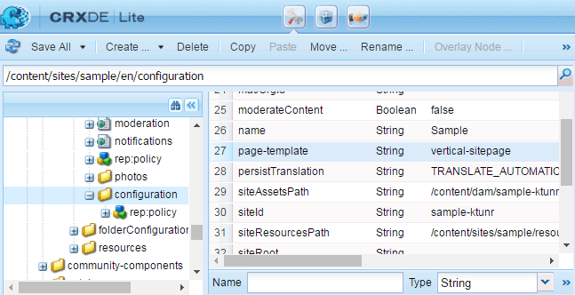

# Nozioni di base sul sito community {#community-site-essentials}

>[!CAUTION]
>
>AEM 6.4 ha raggiunto la fine del supporto esteso e questa documentazione non viene più aggiornata. Per maggiori dettagli, consulta la nostra [periodi di assistenza tecnica](https://helpx.adobe.com/it/support/programs/eol-matrix.html). Trova le versioni supportate [qui](https://experienceleague.adobe.com/docs/).

## Modello di sito personalizzato {#custom-site-template}

Un modello di sito personalizzato può essere specificato separatamente per ogni copia in lingua di un sito community.

Per farlo,

* Creare un modello personalizzato
* Sovrapponi il percorso predefinito del modello di sito
* Aggiungi il modello personalizzato al percorso di sovrapposizione
* Specifica il modello personalizzato aggiungendo un `page-template` della proprietà `configuration` nodo

**Modello predefinito**:

/**libs**/social/console/components/hbs/sitepage/**sitepage**.hbs

**Modello personalizzato nel percorso di sovrapposizione**:

/**app**/social/console/components/hbs/sitepage/**&lt;*template-name*>**.hbs

**Proprietà**: modello a pagina\
**Tipo**: Stringa\
**Valore**: &lt;*template-name*> (nessuna estensione)

**Nodo di configurazione**:

/content/&lt;*percorso del sito community*>/&lt;*lang*>/configurazione

Ad esempio: /content/sites/IT/configuration

>[!NOTE]
>
>Tutti i nodi nel percorso sovrapposto devono essere solo di tipo `Folder`.

>[!CAUTION]
>
>Se al modello personalizzato viene assegnato il nome *sitepage.hbs,* allora tutti i siti della community saranno personalizzati.

### Esempio di modello di sito personalizzato {#custom-site-template-example}

Ad esempio, `vertical-sitepage.hbs` è un modello di sito che consente di posizionare i collegamenti del menu verticalmente lungo il lato sinistro della pagina, anziché orizzontalmente sotto il banner.

[Ottieni file](assets/vertical-sitepage.hbs)
Posiziona il modello di sito personalizzato nella cartella di sovrapposizione:

/**app**/social/console/components/hbs/sitepage/**sitepage verticale**.hbs

Identificare il modello personalizzato aggiungendo un `page-template` al nodo di configurazione:

/content/sites/sample/en/configuration

Assicurati di **Salva tutto** e replica il codice personalizzato in tutte le istanze AEM (il codice personalizzato non è incluso quando il contenuto del sito community viene pubblicato dalla console).

La procedura consigliata per la replica del codice personalizzato è la seguente: [creare un pacchetto](../../help/sites-administering/package-manager.md#creating-a-new-package) e distribuiscila su tutte le istanze.

## Esportazione di un sito community {#exporting-a-community-site}

Una volta creato un sito community, è possibile esportare il sito come pacchetto AEM memorizzato in package manager e disponibile per il download e il caricamento.

È disponibile dal [Console Sites di Communities](sites-console.md#exporting-the-site).

Il codice UGC e personalizzato non è incluso nel pacchetto del sito community.

Per esportare gli UGC, utilizza il [Strumento di migrazione UGC di AEM Communities](https://github.com/Adobe-Marketing-Cloud/communities-ugc-migration), uno strumento di migrazione open source disponibile su GitHub.

## Eliminazione di un sito community {#deleting-a-community-site}

A partire da AEM Communities 6.3 Service Pack 1, l’icona Elimina sito viene visualizzata quando si passa il mouse sul sito della community dalla console Community > Sites . Durante lo sviluppo, puoi utilizzare questa funzionalità se desideri eliminare un sito community e iniziare da zero. Quando si elimina un sito community, vengono rimossi i seguenti elementi associati a tale sito:

* [UGC](#user-generated-content)
* [Gruppi di utenti](#community-user-groups)
* [Risorse](#enablement-assets)
* [Record del database](#database-records)

### ID sito univoco della community {#community-unique-site-id}

Per identificare l&#39;ID univoco del sito associato al sito community, utilizzando CRXDE:

* Passa alla directory principale della lingua del sito, ad esempio `/content/sites/*<site name>*/en/rep:policy`

* Trova il `allow<#>` nodo con un `rep:principalName` in questo formato `rep:principalName = *community-enable-nrh9h-members*`

* L&#39;ID sito è il terzo componente di `rep:principalName`
Ad esempio, se 
`rep:principalName = community-enable-nrh9h-members`

   * **nome del sito** = *abilita*
   * **ID sito** = *nrh9h*
   * **ID sito univoco** = *enable-nrh9h*

### Contenuto generato dall&#39;utente {#user-generated-content}

Ottieni il progetto communities-srp-tools da Github:

* [https://github.com/Adobe-Marketing-Cloud/communities-srp-tools](https://github.com/Adobe-Marketing-Cloud/communities-srp-tools)

Questo contiene un servlet per eliminare tutti gli UGC da qualsiasi SRP.

Tutti gli UGC possono essere rimossi o per un sito specifico, ad esempio:

* path=/content/usergenerate/asi/mongo/content/sites/engagement

Questo rimuove solo il contenuto generato dall’utente (inserito al momento della pubblicazione) e non il contenuto creato (inserito all’autore). Pertanto, [nodi ombra](srp.md#shadownodes) non sono interessati.

### Gruppi di utenti della community {#community-user-groups}

Per tutte le istanze di authoring e pubblicazione, dalla [console di sicurezza](../../help/sites-administering/security.md), individuare e rimuovere [gruppi di utenti](users.md) che sono:

* Prefisso con `community`
* Seguito da [id sito univoco](#community-unique-site-id)

Esempio: `community-engage-x0e11-members`.

### Risorse di abilitazione {#enablement-assets}

Dalla console principale:

* Seleziona **[!UICONTROL Risorse]**
* Invio **[!UICONTROL Seleziona]** modalità
* Seleziona la cartella denominata con [ID sito univoco](#community-unique-site-id)
* Seleziona **[!UICONTROL Elimina]** (potrebbe essere necessario selezionare tra **[!UICONTROL Altro...]**)

### Record del database {#database-records}

Non esiste uno strumento per eliminare selettivamente le voci di database per un sito community di abilitazione specifico.

Quando tutti i siti della community vengono eliminati, eliminare enablementdb e scormenginedb utilizzando MySQL Workbench.
