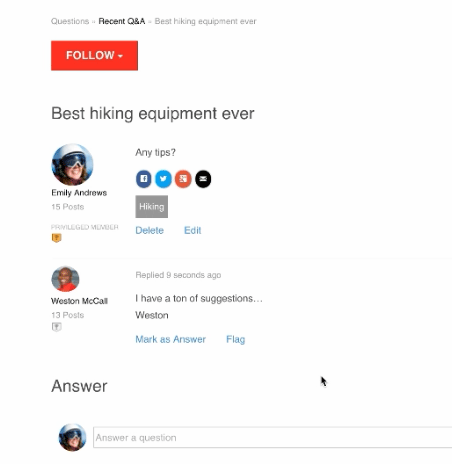

# Iscrizioni alle community {#communities-subscriptions}

>[!CAUTION]
>
>AEM 6.4 ha raggiunto la fine del supporto esteso e questa documentazione non viene più aggiornata. Per maggiori dettagli, consulta la nostra [periodi di assistenza tecnica](https://helpx.adobe.com/it/support/programs/eol-matrix.html). Trova le versioni supportate [qui](https://experienceleague.adobe.com/docs/).

## Panoramica {#overview}

A livello di Comunità [FP1](deploy-communities.md#latestfeaturepack), i membri della community possono interagire con la community tramite e-mail utilizzando una funzione denominata come abbonamenti.

Gli abbonamenti sono simili a [Notifiche](notifications.md) come membri possono iscriversi quando seguono articoli di blog, argomenti di forum o domande di QnA.

Ciò che distingue gli abbonamenti dalle notifiche è:

* I membri non possono iscriversi quando seguono altri membri
* L&#39;unica azione che i membri devono intraprendere è quella di selezionare `Email Subscriptions` quando segue
* Quando la risposta e-mail è configurata, i membri possono pubblicare efficacemente il contenuto semplicemente rispondendo all&#39;e-mail ricevuta

### Requisiti {#requirements}

**Configura e-mail**

È necessario configurare l’e-mail affinché le iscrizioni funzionino e affinché i membri rispondano via e-mail.

Per istruzioni sulla configurazione dell’e-mail, consulta [Configurazione e-mail](email.md).

**Abilita sottoscrizioni e segui**

I componenti devono essere configurati per abilitare gli abbonamenti *e* seguenti. Le funzionalità che consentono gli abbonamenti sono [blog](blog-feature.md), [forum](forum.md) e [QnA](working-with-qna.md).

## Abbonamenti da {#subscriptions-from-following}

La **Segui** Questo pulsante consente di seguire le voci come attività, abbonamenti e/o notifiche. Ogni volta che **Segui** è selezionato, è possibile attivare o disattivare una selezione.

Se è selezionato un metodo di seguito, il testo del pulsante diventa **Seguente**. Per comodità, è possibile selezionare `Unfollow All` per disattivare tutti i metodi.

La **Segui** il pulsante include `Email Subscriptions` solo quando un forum, QnA o un blog è configurato per abilitare gli abbonamenti alle e-mail. Verrà visualizzato questo pulsante

* Nella pagina delle funzioni principali per il forum abilitato, QnA o il blog abilitato

   * Invierà un’e-mail per tutte le attività che rientrano in quella funzione

* Per un post specifico, ad esempio un argomento del forum, una domanda QnA o un articolo di blog

   * Invia un messaggio e-mail quando è presente un’attività per quella voce specifica

## Risposta per e-mail {#reply-by-email}

Quando l’e-mail è [configurato per la risposta tramite e-mail](email.md#configure-polling-importer), il membro che si è iscritto riceverà un’e-mail con il contenuto pubblicato e un collegamento al contenuto online.

Se rispondono all’e-mail, il contenuto inserito nella risposta verrà visualizzato come contenuto online.

Il tempo necessario per la presentazione di una risposta è controllato dal [intervallo di aggiornamento dell’importatore del polling](email.md#configure-polling-importer).

