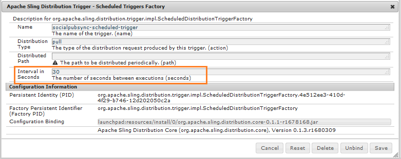

# Sincronizzazione utenti community {#communities-user-synchronization}

## Introduzione {#introduction}

In  AEM Communities, dall&#39;ambiente di pubblicazione (in base alle autorizzazioni configurate), i *visitatori del sito* possono diventare *membri*, creare *gruppi di utenti* e modificare il loro profilo *membro*.

*I* dati utente sono termini utilizzati per fare riferimento a  *utenti*,  *profili* utente e gruppi *di* utenti.

*Appartenenza* è un termine utilizzato per fare riferimento agli  ** utenti registrati nell’ambiente di pubblicazione, anziché agli utenti registrati nell’ambiente di authoring.

Per ulteriori informazioni sui dati utente, visitare [Gestione di utenti e gruppi di utenti](users.md).

## Sincronizzazione degli utenti in una farm di pubblicazione {#synchronizing-users-across-a-publish-farm}

Per impostazione predefinita, i dati utente creati nell’ambiente di pubblicazione non vengono visualizzati nell’ambiente di authoring.

La maggior parte dei dati utente creati nell’ambiente di authoring deve rimanere nell’ambiente di authoring e non deve essere sincronizzata né replicata nelle istanze di pubblicazione.

Quando la [topologia](topologies.md) è una [farm di pubblicazione](../../help/sites-deploying/recommended-deploys.md#tarmk-farm), la registrazione e le modifiche apportate a un&#39;istanza di pubblicazione devono essere sincronizzate con altre istanze di pubblicazione. I membri devono poter effettuare l’accesso e visualizzare i propri dati su qualsiasi nodo di pubblicazione.

Quando la sincronizzazione utente è abilitata, i dati utente vengono automaticamente sincronizzati tra le istanze di pubblicazione nella farm.

### Istruzioni per l&#39;impostazione della sincronizzazione utente {#user-sync-setup-instructions}

Per istruzioni dettagliate e dettagliate su come abilitare la sincronizzazione in una farm di pubblicazione, vedete

* [Sincronizzazione utente](../../help/sites-administering/sync.md)

## Sincronizzazione utente in background {#user-sync-in-the-background}


* **Pacchetto** VLT: è un file zip contenente tutte le modifiche apportate a un editore, che devono essere distribuite tra gli editori. Le modifiche apportate a un editore generano eventi selezionati dal listener di eventi change. In questo modo viene creato un pacchetto di convalida contenente tutte le modifiche.

* **Pacchetto** di distribuzione: contiene informazioni di distribuzione per Sling. Si tratta di informazioni su dove il contenuto deve essere distribuito e quando è stato distribuito per ultimo.

## Cosa Succede Quando ... {#what-happens-when}

### Pubblica sito dalla console Siti di Communities {#publish-site-from-communities-sites-console}

All&#39;autore, quando un sito community viene pubblicato dalla [console Siti community](sites-console.md), l&#39;effetto è di [replicare](../../help/sites-deploying/configuring.md#replication-reverse-replication-and-replication-agents) le pagine associate e Sling distribuire i gruppi di utenti della community creati dinamicamente, inclusa la loro appartenenza.

### L&#39;utente viene creato o modifica il profilo in Pubblica {#user-is-created-or-edits-profile-on-publish}

Per impostazione predefinita, gli utenti e i profili creati nell’ambiente di pubblicazione (ad esempio mediante registrazione automatica, accesso mediante social network e autenticazione LDAP) non vengono visualizzati nell’ambiente di authoring.

Se la topologia è una [farm di pubblicazione](topologies.md) e la sincronizzazione degli utenti è stata configurata correttamente, i *profili utente* e *profilo utente* vengono sincronizzati nella farm di pubblicazione utilizzando la distribuzione Sling.

### Nuovo gruppo community creato su Pubblica {#new-community-group-is-created-on-publish}

Anche se avviata da un’istanza di pubblicazione, la creazione di gruppi di community, che genera nuove pagine di sito e un nuovo gruppo di utenti, viene in realtà creata nell’istanza di creazione.

Come parte del processo, le nuove pagine del sito vengono replicate in tutte le istanze di pubblicazione. Il gruppo di utenti della community creato dinamicamente e la relativa appartenenza sono Sling distribuiti a tutte le istanze di pubblicazione.

### Utenti o gruppi di utenti creati utilizzando la console di sicurezza {#users-or-user-groups-are-created-using-security-console}

Per impostazione predefinita, i dati utente creati nell’ambiente di pubblicazione non vengono visualizzati nell’ambiente di authoring e viceversa.

Quando si utilizza la console [Amministrazione utente e sicurezza](../../help/sites-administering/security.md) per aggiungere nuovi utenti nell&#39;ambiente di pubblicazione, la sincronizzazione degli utenti sincronizzerà i nuovi utenti e i relativi membri del gruppo con altre istanze di pubblicazione, se necessario. La sincronizzazione utente sincronizza anche i gruppi di utenti creati tramite la console di protezione.

### L&#39;utente pubblica il contenuto su Pubblica {#user-posts-content-on-publish}

Per il contenuto generato dall&#39;utente (UGC), i dati immessi in un&#39;istanza di pubblicazione sono accessibili tramite l&#39; [SRP](srp-config.md) configurato.

## Best practice {#bestpractices}

Per impostazione predefinita, la sincronizzazione utente è **disabilitata**. L&#39;abilitazione della sincronizzazione utente comporta la modifica delle configurazioni *OSGi* esistenti. Non è necessario aggiungere nuove configurazioni per abilitare la sincronizzazione degli utenti.

La sincronizzazione utente si basa sull’ambiente di authoring per gestire le distribuzioni dei dati utente, anche se i dati utente non vengono creati in fase di creazione.

**Prerequisiti**

1. Se utenti e gruppi di utenti sono già stati creati su un editore, si consiglia di [sincronizzare manualmente](../../help/sites-administering/sync.md#manually-syncing-users-and-user-groups) i dati utente a tutti gli editori prima di configurare e abilitare la sincronizzazione utente.

   Una volta attivata la sincronizzazione degli utenti, vengono sincronizzati solo gli utenti e i gruppi appena creati.

1. Verifica che sia stato installato il codice più recente:

   * [Aggiornamenti AEM piattaforma](https://helpx.adobe.com/it/experience-manager/kb/aem62-available-hotfixes.html)
   * [Aggiornamenti  AEM Communities](deploy-communities.md#latestfeaturepack)

Per abilitare la sincronizzazione degli utenti su  AEM Communities, sono necessarie le seguenti configurazioni. Verificate che queste configurazioni siano corrette per evitare il malfunzionamento della distribuzione del contenuto.

### Apache Sling Distribution Agent - Sync Agent Factory {#apache-sling-distribution-agent-sync-agents-factory}

Questa configurazione recupera il contenuto da sincronizzare tra gli editori. La configurazione si trova nell’istanza Author. L&#39;autore deve tenere traccia di tutti gli editori presenti e di dove sincronizzare tutte le informazioni.

I valori predefiniti nella configurazione si riferiscono a una singola istanza di pubblicazione. Poiché la sincronizzazione degli utenti è utile per sincronizzare più istanze di pubblicazione, ad esempio per una farm di pubblicazione, è necessario aggiungere ulteriori istanze di pubblicazione alla configurazione.

**Come viene sincronizzato il contenuto?**

L’istanza Author esegue il ping dell’endpoint di esportazione degli editori. Ogni volta che un utente viene creato o aggiornato su editori specifici (n), l&#39;Autore riceve il contenuto dalle endpoint di esportazione e [invia il contenuto](sync.md#main-pars-image-1413756164) ad altri editori (n-1, a parte gli editori da cui viene recuperato il contenuto).

<!--This section used to be an accordion until converted to straight Markdown. When accordions are enabled, revert-->

### Per configurare la configurazione degli agenti di sincronizzazione Apache Sling

Per AEM’istanza di creazione:

1. Effettuate l&#39;accesso con privilegi di amministratore.
1. Accedere alla [console Web](https://helpx.adobe.com/experience-manager/6-4/sites/deploying/using/configuring-osgi.html).

   Ad esempio, [http://localhost:4502/system/console/configMgr](http://localhost:4502/system/console/configMgr).
1. Individuare **[!UICONTROL Apache Sling Distribution Agent - Sync Agent Factory]**.

   * Selezionate la configurazione esistente da aprire per la modifica (icona matita).
   * Nome verifica: **`socialpubsync`.**
   * Selezionare la casella di controllo **[!UICONTROL Abilitato]**.
   * Selezionare **[!UICONTROL Usa più code]**.
   * Specificare **[!UICONTROL Endpoint esportazione]** e **[!UICONTROL Endpoint importazione]** (è possibile aggiungere altri endpoint di esportazione e importazione).

      Questi endpoint definiscono dove si desidera ottenere il contenuto e dove si desidera inviare il contenuto push. L&#39;autore recupera il contenuto dall&#39;endpoint di esportazione specificato e invia il contenuto agli editori (diversi dall&#39;editore da cui ha recuperato il contenuto).
   

### Distribuzione granite  Adobe - Provider segreto di trasporto password crittografata {#adobe-granite-distribution-encrypted-password-transport-secret-provider}

Consente all’autore di identificare l’utente autorizzato, in quanto dispone dell’autorizzazione per sincronizzare i dati utente dall’autore alla pubblicazione.

L&#39; [utente autorizzato creato](../../help/sites-administering/sync.md#createauthuser) su tutte le istanze di pubblicazione consente agli editori di connettersi con l&#39;autore e configurare la distribuzione Sling sull&#39;autore. Questo utente autorizzato ha tutti gli [ACL ](../../help/sites-administering/sync.md#howtoaddacl) richiesti.

Ogni volta che i dati devono essere installati o recuperati dagli editori, l&#39;autore si connette con gli editori utilizzando le credenziali (nome utente e password) impostate in questa configurazione.

<!--This section used to be an accordion until converted to straight Markdown. When accordions are enabled, revert-->

### Per collegare l&#39;autore con gli editori tramite un utente autorizzato

Per AEM’istanza di creazione:

1. Effettuate l&#39;accesso con privilegi di amministratore.
1. Accedere alla [console Web](../../help/sites-deploying/configuring-osgi.md).

   Ad esempio, [http://localhost:4502/system/console/configMgr](http://localhost:4502/system/console/configMgr).
1. Individuare **[!UICONTROL distribuzione granite Adobe - provider segreto di trasporto password crittografato]**.
1. Selezionate la configurazione esistente da aprire per la modifica (icona matita).

   Verificare la proprietà `name:` **`socialpubsync`\- `publishUser` .**
1. Impostate il nome utente e la password sull&#39; [utente autorizzato](../../help/sites-administering/sync.md#createauthorizeduser).

   Ad esempio, **`usersync`\-admin**

   

### Agente di distribuzione Apache Sling - Coda Agenti Factory {#apache-sling-distribution-agent-queue-agents-factory}

Questa configurazione viene utilizzata per configurare i dati da sincronizzare tra gli editori. Quando i dati vengono creati/aggiornati nei percorsi specificati in **[!UICONTROL Radici consentite]**, &quot;var/community/distribution/diff&quot; viene attivato e il replicatore creato recupera i dati da un editore e li installa su altri editori.

<!--This section used to be an accordion until converted to straight Markdown. When accordions are enabled, revert-->

### Configurazione dei dati (percorsi nodo) per la sincronizzazione

In AEM’istanza di pubblicazione:

1. Effettuate l&#39;accesso con privilegi di amministratore.
1. Accedere alla [console Web](https://helpx.adobe.com/experience-manager/6-4/sites/deploying/using/configuring-osgi.html).

   Ad esempio, [http://localhost:4503/system/console/configMgr](http://localhost:4503/system/console/configMgr).
1. Individuare **[!UICONTROL Apache Sling Distribution Agent - Queue Agent Factory]**.
1. Selezionate la configurazione esistente da aprire per la modifica (icona matita).

   Nome verifica: `socialpubsync` \-reverse.
1. Selezionare la casella di controllo **[!UICONTROL Abilitato]** e salvare.
1. Specificare i percorsi dei nodi da replicare in **[!UICONTROL Radici consentite]**.
1. Ripetere l&#39;operazione per ogni istanza `publish`.

   

### Distribuzione granite  Adobe - Diff Observer Factory {#adobe-granite-distribution-diff-observer-factory}

Questa configurazione sincronizza l&#39;appartenenza al gruppo tra gli editori.\
Se la modifica dell&#39;appartenenza di un gruppo in un editore non ne aggiorna l&#39;appartenenza ad altri editori, assicurarsi che **ref:members** sia aggiunta ai nomi delle proprietà **analizzate**.

<!--This section used to be an accordion until converted to straight Markdown. When accordions are enabled, revert-->

### Per garantire la sincronizzazione dei membri

Per ogni istanza di pubblicazione AEM:

1. Effettuate l&#39;accesso con privilegi di amministratore.
1. Accedere alla [console Web](https://helpx.adobe.com/experience-manager/6-4/sites/deploying/using/configuring-osgi.html).

   Ad esempio, [http://localhost:4503/system/console/configMgr](http://localhost:4503/system/console/configMgr).
1. Individuare **[!UICONTROL distribuzione granito Adobe - Diff Observer Factory]**.
1. Selezionate la configurazione esistente da aprire per la modifica (icona matita).

   Verifica **[!UICONTROL nome agente]**: `socialpubsync` \-reverse&amp;ast;&amp;ast;.
1. Selezionare la casella di controllo **[!UICONTROL Abilitato]**.
1. Specificare **rep`:members`** come `description` per propertyName in **[!UICONTROL nome proprietà cercato]** e salvare.

   

### Trigger di distribuzione Apache Sling - Pianificate Triggers Factory {#apache-sling-distribution-trigger-scheduled-triggers-factory}

Questa configurazione consente di configurare l’intervallo di polling (al termine del quale gli editori vengono sottoposti a ping e le modifiche vengono eseguite dall’autore) per sincronizzare le modifiche tra gli editori.

L’autore controlla gli editori ogni 30 secondi (impostazione predefinita). Se nella cartella */var/sling/distribution/packages/ socialpubsync - vlt /shared* sono presenti pacchetti, questi verranno recuperati e installati su altri editori.

<!--This section used to be an accordion until converted to straight Markdown. When accordions are enabled, revert-->

### Per modificare l&#39;intervallo di polling

Per AEM’istanza di creazione:

1. Effettuate l&#39;accesso con privilegi di amministratore.
1. Accedere alla [console Web](../../help/sites-deploying/configuring-osgi.md), ad esempio [http://localhost:4502/system/console/configMgr](http://localhost:4502/system/console/configMgr)
1. Individua attivatore di distribuzione Sling **[!UICONTROL Apache - Pianificato Triggers Factory]**

   * Seleziona la configurazione esistente da aprire per la modifica (icona matita)
   * Verificare `Name:` **`socialpubsync`\-Scheduled-trigger**
   * Impostate l&#39;intervallo in secondi sull&#39;intervallo desiderato e salvate.

   

###  AEM Communities User Sync Listener {#aem-communities-user-sync-listener}

Per problemi nella distribuzione Sling in cui vi è una discrepanza nelle sottoscrizioni e seguenti, controllate se le seguenti proprietà in **[!UICONTROL AEM Communities User Sync Listener]** configurazioni sono impostate:

* NodeTypes
* IgnorableProperties
* IgnorableNodes
* DistributedFolders

<!--This section used to be an accordion until converted to straight Markdown. When accordions are enabled, revert-->

### Per sincronizzare iscrizioni, seguiti e notifiche

Per ogni istanza di pubblicazione AEM:

1. Effettuate l&#39;accesso con privilegi di amministratore.
1. Accedere alla [console Web](../../help/sites-deploying/configuring-osgi.md). Ad esempio, [http://localhost:4503/system/console/configMgr](http://localhost:4503/system/console/configMgr).
1. Individuare **[!UICONTROL AEM Communities User Sync Listener]**.
1. Selezionate la configurazione esistente da aprire per la modifica (icona matita).

   Nome verifica: **`socialpubsync`\-Scheduled-trigger**
1. Impostare la seguente **`NodeTypes`**:

   rep:Utente

   `nt` :non strutturato

   `nt` :riferimento

   rep:ACL

   sling:Folder

   sling:OrderedFolder

   I tipi di nodo specificati in questa proprietà verranno sincronizzati e le informazioni sulle notifiche (blog e configurazioni seguite) vengono sincronizzate tra editori diversi.
1. Aggiungere tutte le cartelle da sincronizzare in **[!UICONTROL DistributedFolders]**. Esempio,

   segmenti/punteggio

   social/relazioni

   attività

1. Impostate **`ignorablenodes`** su:

   .token

   system

   rep `:cache` (poiché utilizziamo sessioni collegate, non è necessario sincronizzare questo nodo con editori diversi)

   

### ID Sling univoco {#unique-sling-id}

AEM’istanza di creazione utilizza l’ID Sling per identificare da dove arrivano i dati e a quali editori deve (o non deve) inviare nuovamente il pacchetto.

Accertatevi che tutti gli editori di una farm di pubblicazione abbiano un ID Sling univoco. Se l’ID Sling è lo stesso per più istanze di pubblicazione in una farm di pubblicazione, la sincronizzazione degli utenti non riesce. Poiché l&#39;autore non sa da dove recuperare il pacchetto e dove installarlo.

<!--This section used to be an accordion until converted to straight Markdown. When accordions are enabled, revert-->

### Per garantire un ID Sling univoco degli editori nella farm di pubblicazione

Per ogni istanza di pubblicazione:

1. Passare a [https://_host:port_/system/console/status-slingsettings](http://localhost:4503/system/console/status-slingsettings).
1. Controllare il valore di **[!UICONTROL Sling ID]**.

   

   Se l’ID Sling di un’istanza di pubblicazione corrisponde all’ID Sling di qualsiasi altra istanza di pubblicazione, effettuate le seguenti operazioni:

1. Interrompi una delle istanze di pubblicazione con un ID Sling corrispondente.
1. Nella directory `crx-quickstart/launchpad/felix`, cercare ed eliminare il file denominato _sling.id.file.

   *ad esempio, su un sistema Linux:*

   `rm -i $(find . -type f -name sling.id.file)`

   *ad esempio, in un sistema Windows:*

   `use windows explorer and search for _sling.id.file_`

1. Avviate l’istanza di pubblicazione. All&#39;avvio, gli verrà assegnato un nuovo Sling ID.
1. Verificare che l&#39; **[!UICONTROL Sling ID]** sia ora univoco.

Ripetete questi passaggi finché tutte le istanze di pubblicazione non dispongono di un ID Sling univoco.

### Vault Package Builder Factory {#vault-package-builder-factory}

Affinché gli aggiornamenti possano essere sincronizzati correttamente, è necessario modificare il generatore di pacchetti vault per la sincronizzazione degli utenti.\
In `/home/users` viene creato un nodo `/rep:cache`. È una cache che viene utilizzata per scoprire che se eseguiamo query sul nome principale di un nodo, allora questa cache può essere utilizzata direttamente.

La sincronizzazione degli utenti può arrestarsi se i nodi `rep:cache `sono sincronizzati tra gli editori.

<!--This section used to be an accordion until converted to straight Markdown. When accordions are enabled, revert-->

### Per garantire la corretta sincronizzazione degli aggiornamenti tra gli editori

Per ogni istanza di pubblicazione AEM:

1. Accedete alla [console Web](../../help/sites-deploying/configuring-osgi.md), ad esempio [http://localhost:4503/system/console/configMgr](http://localhost:4503/system/console/configMgr).
1. Individuate il **[!UICONTROL pacchetto di distribuzione Apache Sling - Nome del generatore di pacchetti Vault Package Builder]**: socialpubsync-vlt.
1. Selezionate l’icona di modifica.
1. Aggiungete due filtri pacchetto:

   * `/home/users|-.\*/.tokens`
   * `/home/users|**+**.\*/rep:cache`
1. Gestione dei criteri
   * Per sovrascrivere i nodi rep `:policy` esistenti con i nuovi, aggiungete un terzo filtro pacchetto:

      `/home/users|**+**.\*/rep:policy`
   * Per impedire la distribuzione dei criteri, impostare

      Gestione Acl: IGNORE


## Risoluzione dei problemi di distribuzione Sling in  AEM Communities {#troubleshoot-sling-distribution-in-aem-communities}

Se la distribuzione Sling non riesce, provate i seguenti passaggi di debug:

1. **Verificare la presenza di configurazioni [ aggiunte ](../../help/sites-administering/sync.md#improperconfig)in modo errato.** Assicuratevi che non vengano aggiunte o modificate più configurazioni, ma che le configurazioni predefinite esistenti vengano modificate.
1. **Controllare le configurazioni**. Assicurati che tutte le [configurazioni](sync.md#bestpractices) siano impostate correttamente nell&#39;istanza di AEM Author, come indicato in [Best Practices](sync.md#main-pars-header-863110628).
1. **Verificate le autorizzazioni** utente autorizzate. Se i pacchetti non sono installati correttamente, verificate che l&#39; [utente autorizzato](../../help/sites-administering/sync.md#createauthuser) creato nella prima istanza di pubblicazione abbia gli ACL corretti.

   Per convalidarlo, invece di [creare l&#39;utente autorizzato](../../help/sites-administering/sync.md#createauthuser) modificare la [ Adobe Granite Distribution - Encrypted Password Transport Secret Provider](../../help/sites-administering/sync.md#adobegraniteencpasswrd) configurazione nell&#39;istanza Author per utilizzare le credenziali utente Amministratore. Tentate nuovamente di installare i pacchetti. Se la sincronizzazione utente funziona correttamente con le credenziali dell&#39;amministratore, significa che l&#39;utente di pubblicazione creato non aveva ACL appropriati.

1. **Controllare la configurazione** Diff Observer Factory. Se solo nodi specifici non sono sincronizzati nella farm di pubblicazione, ad esempio, i membri del gruppo non sono sincronizzati, assicurarsi che la configurazione [ Adobe Granite Distribution - Diff Observer Factory](../../help/sites-administering/sync.md#diffobserver) sia abilitata e che **rep:members** sia impostata in **nomi delle proprietà esaminate**.
1. **Verificate  configurazione del listener di sincronizzazione utenti AEM Communities.** Se gli utenti creati sono sincronizzati ma le iscrizioni e i seguenti elementi non funzionano, accertatevi che  configurazione del listener di sincronizzazione utenti AEM Communities abbia:

   * Tipi di nodo: impostato su **rep:User, nt:unstructure**, **nt:resource**, **rep:ACL**, **sling:Folder** e **sling:OrderedFolder**
   * Nodi ignorabili: impostati su **.tokens**, **system** e **rep:cache**
   * Cartelle distribuite: impostate le cartelle che desiderate distribuire

1. **Controllate i registri generati durante la creazione dell’utente nell’istanza** Pubblica. Se le configurazioni di cui sopra sono impostate correttamente ma la sincronizzazione utente non funziona, controllate i registri generati al momento della creazione dell&#39;utente.

   Verificare se l’ordine dei file di registro è lo stesso, come segue:

   ```shell
   15.05.2016 18:33:01.523 *INFO* [sling-oak-observation-7422] com.adobe.cq.social.sync.impl.PublisherSyncServiceImpl Handing these paths to the distribution subsystem: [/home/users/C, /home/users/C/Cw-5avWqilmqsNn5hCvK]
   15.05.2016 18:33:01.523 *INFO* [sling-oak-observation-7422] org.apache.sling.distribution.agent.impl.SimpleDistributionAgent [agent][socialpubsync-reverse] REQUEST-START DSTRQ2: ADD paths=[/home/users/C, /home/users/C/Cw-5avWqilmqsNn5hCvK], user=communities-user-admin
   15.05.2016 18:33:01.523 *INFO* [sling-oak-observation-7431] com.adobe.cq.social.sync.impl.PublisherSyncServiceImpl Handing these paths to the distribution subsystem: [/home/users/C/Cw-5avWqilmqsNn5hCvK, /home/users/C/Cw-5avWqilmqsNn5hCvK/profile, /home/users/C/Cw-5avWqilmqsNn5hCvK/rep:policy]
   15.05.2016 18:33:01.523 *INFO* [sling-oak-observation-7431] org.apache.sling.distribution.agent.impl.SimpleDistributionAgent [agent][socialpubsync-reverse] REQUEST-START DSTRQ3: ADD paths=[/home/users/C/Cw-5avWqilmqsNn5hCvK, /home/users/C/Cw-5avWqilmqsNn5hCvK/profile, /home/users/C/Cw-5avWqilmqsNn5hCvK/rep:policy], user=communities-user-admin
   15.05.2016 18:33:01.757 *INFO* [sling-oak-observation-7431] org.apache.jackrabbit.vault.packaging.impl.JcrPackageDefinitionImpl unwrapping package sling/distribution:socialpubsync-vlt_1463337181554_ebb27ad9-a861-4405-9342-d64c916654e2:0.0.1
   15.05.2016 18:33:01.820 *INFO* [sling-oak-observation-7422] org.apache.jackrabbit.vault.packaging.impl.JcrPackageDefinitionImpl unwrapping package sling/distribution:socialpubsync-vlt_1463337181554_58811273-5861-48fe-95d2-4aff367b99c3:0.0.1
   15.05.2016 18:33:02.023 *INFO* [sling-oak-observation-7430] com.adobe.cq.social.sync.impl.PublisherSyncServiceImpl Handing these paths to the distribution subsystem: [/home/users/C/Cw-5avWqilmqsNn5hCvK/profile]
   15.05.2016 18:33:02.023 *INFO* [sling-oak-observation-7430] org.apache.sling.distribution.agent.impl.SimpleDistributionAgent [agent][socialpubsync-reverse] REQUEST-START DSTRQ4: ADD paths=[/home/users/C/Cw-5avWqilmqsNn5hCvK/profile], user=communities-user-admin
   15.05.2016 18:33:02.273 *INFO* [sling-oak-observation-7430] org.apache.jackrabbit.vault.packaging.impl.JcrPackageDefinitionImpl unwrapping package sling/distribution:socialpubsync-vlt_1463337182039_f34f4fa6-10b9-42eb-8740-4da9d4d38f99:0.0.1
   ```

   Per eseguire il debug:

   1. Disattiva la sincronizzazione utente:
   1. Per AEM’istanza di creazione, effettuate l’accesso con privilegi di amministratore.

      1. Accedere alla [console Web](../../help/sites-deploying/configuring-osgi.md). Ad esempio, [http://localhost:4502/system/console/configMgr](http://localhost:4502/system/console/configMgr).
      1. Individuare la configurazione **[!UICONTROL Apache Sling Distribution Agent - Sync Agent Factory]**.

      1. Deselezionare la casella di controllo **[!UICONTROL Abilitato]**.
      Quando si disabilita la sincronizzazione utente nell’istanza di creazione, gli endpoint (esportatore e importatore) vengono disattivati e l’istanza di creazione è statica. I pacchetti **[!UICONTROL vlt]** non vengono cerchiati o inseriti dall&#39;autore.

      Ora, se un utente viene creato nell&#39;istanza di pubblicazione, il pacchetto **[!UICONTROL vlt]** viene creato nel nodo */var/sling/distribution/packages/ socialpubsync - vlt /data*. E se questi pacchetti vengono inviati dall&#39;autore a un altro servizio. Puoi scaricare ed estrarre questi dati per verificare quali proprietà vengono inviate ad altri servizi.

   1. Passate a un editore e create un utente sull&#39;editore. Di conseguenza, gli eventi vengono creati.
   1. Controllare l&#39;ordine [dei file di registro](sync.md#troubleshoot-sling-distribution-in-aem-communities), creato al momento della creazione dell&#39;utente.
   1. Verificate se un pacchetto **[!UICONTROL vlt]** viene creato il giorno `/var/sling/distribution/packages/socialpubsync-vlt/data`.
   1. A questo punto, abilitate la sincronizzazione degli utenti AEM’istanza di creazione.
   1. Nell&#39;editore, modificate gli endpoint di esportazione o importazione in **[!UICONTROL Apache Sling Distribution Agent - Sync Agent Factory]**.

      Possiamo scaricare ed estrarre i dati del pacchetto per verificare quali proprietà vengono inviate ad altri editori e quali dati vengono persi.


