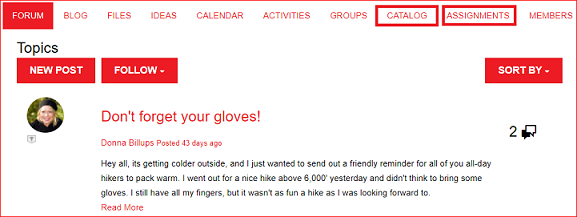

# Novità di AEM 6.4 Communities {#what-s-new-in-aem-communities}

AEM Communities offre un framework alle aziende per collaborare tra partner, clienti e dipendenti. Offre funzionalità social alla struttura dei siti web e aiuta le aziende a coinvolgere e a fornire conoscenze ai propri stakeholder, per migliorare il valore del marchio nel loro modo.

AEM 6.4 Communities introduce funzionalità per migliorare le esperienze degli utenti della community e semplificare le attività quotidiane di amministratori, moderatori e manager della community.

Ulteriori informazioni per introduzione rapida a nuove funzioni e miglioramenti. Inoltre, consulta le note sulla versione di AEM 6.4 Communities . Per AEM la documentazione di 6.4 Communities, visita [AEM Guida utente di 6.4 Communities](home.md).

## Gestione di sottocommunity o gruppi di community {#managing-sub-communities-or-community-groups}

AEM Communities consente agli amministratori della community di creare gruppi e sottogruppi all’interno del sito community, utilizzando modelli predefiniti nell’ambiente di authoring. Questi gruppi fungono da sottocomunità, che possono ereditare molte configurazioni, come i temi e lo stile dal sito padre. Tuttavia, questi gruppi possono differire dal sito padre, ad esempio con un set diverso di moderatori di gruppo o possono variare a livello di sicurezza. Questi gruppi funzionano come mini-community indipendenti e completamente sviluppate, ulteriormente potenziate dai seguenti miglioramenti.

### Creare gruppi con più impostazioni internazionali in un singolo passaggio {#create-multi-locale-groups-in-single-step}

Come parte di un sito della community, è possibile creare gruppi multilingue in un’unica operazione. **[!UICONTROL Il campo]** Supplementare Available Community Group Language in  **[!UICONTROL Community Group]** Templatepage, disponibile durante la creazione di un  [nuovo ](groups.md) gruppo di community all&#39;interno di un sito community, rende possibile questa operazione.

Per creare tali gruppi, gli utenti possono semplicemente accedere a Raccolta di gruppi del sito community desiderato dalla console Sites . Crea un gruppo e specifica le lingue desiderate nel campo **[!UICONTROL Ulteriori lingue disponibili per i gruppi della community]** della pagina **[!UICONTROL Modello per gruppi della community]**.

### Elimina i gruppi della community dalla console dei gruppi {#delete-community-groups-from-groups-console}

AEM 6.4 Communities fornisce l&#39;icona Elimina gruppo sui gruppi community esistenti, nella raccolta Gruppi community nella console Sites della community. Questo consente di [eliminare i gruppi](groups.md#deleting-the-group) con un solo clic, insieme all&#39;eliminazione di tutti gli elementi associati (come contenuti e appartenenze utente) al gruppo.

### Creare e assegnare risorse di abilitazione all&#39;interno di gruppi {#create-and-assign-enablement-resources-within-groups}

Ora è possibile creare, gestire e pubblicare contenuti di apprendimento per un set specifico di membri della community interessati. A causa della disponibilità di funzioni di catalogo e assegnazione per i gruppi della community (e non solo per l’intero sito della community), i responsabili dell’abilitazione possono [assegnare risorse di abilitazione](resource.md) e percorsi di apprendimento anche a un piccolo gruppo di persone.

## Moderazione del contenuto generato dall&#39;utente {#moderating-user-generated-content}

AEM 6.4 Communities offre pochi miglioramenti alla moderazione, che sono fondamentali per facilitare la vita quotidiana dei moderatori della comunità.

### Rilevamento automatico dello spam {#automatic-spam-detection}

Il nuovo motore di rilevamento dello spam consente di filtrare i contenuti generati dagli utenti indesiderati e non richiesti sui siti o sui gruppi della community. Quando abilitata, questa funzionalità può contrassegnare un contenuto generato dall’utente come Spam o Not Spam in base a un set predefinito di parole spam. I moderatori possono agire ulteriormente sul contenuto per negarlo o consentirne la visualizzazione nell’istanza di pubblicazione. Queste azioni di moderazione possono essere eseguite in linea o tramite la console di moderazione di gruppo.

[Il ](moderate-ugc.md#spam-detection) rilevatore di spam individua e contrassegna con precisione del 90% un dato contenuto generato dall’utente. Tuttavia, questa funzionalità non è abilitata per impostazione predefinita. Per abilitarlo, gli amministratori della community devono navigare su configMgr sul sistema/console e aggiungere il processo Spam.

### Nuovi filtri (con risposta/senza risposta) per QnA {#new-answered-unanswered-filters-for-qna}

AEM 6.4 aggiunge due [nuovi filtri](moderation.md#filter-rail), denominati Risposte e non Risposte per le domande QnA, alla console di moderazione collettiva. Questi filtri sono disponibili in Stato nella barra dei filtri.

Quando si seleziona lo stato Risposta, tutte le domande risposte sono visibili al moderatore nell’area contenuto. Se invece è selezionato solo lo stato Non risposto, il moderatore visualizzerà tutti i contenuti (per tutti i tipi di contenuto) ad eccezione delle domande a cui è stato risposto, perché la proprietà responsabile della domanda a cui è stata data risposta non esiste nel caso di domande a cui non è stata data risposta e altri contenuti quali argomento del forum, articolo di blog o commenti.

### Filtri di moderazione segnalibro {#bookmark-moderation-filters}

AEM Communities offre la possibilità di aggiungere ai segnalibri i filtri di moderazione predefiniti](moderation.md#filter-rail) nella console di moderazione [. Questi segnalibri salvati possono essere rivisitati in un secondo momento e condivisi con altri utenti.

Gli utenti devono semplicemente selezionare i filtri desiderati dalla barra Filtro nella console di moderazione, per visualizzare l’UGC filtrato e contrassegnare i filtri sui propri browser. Questi filtri vengono aggiunti alla fine della stringa URL e possono quindi essere condivisi, riutilizzati e rivisitati in un secondo momento.

## Gestione di siti della community {#managing-community-sites}

AEM 6.4 Communities offre miglioramenti alla gestione dei siti, che assicurano che numerosi siti community in lingue diverse vengano facilmente creati, gestiti ed eliminati dagli amministratori di sito.

### Creare siti community locali multipli in un unico passaggio {#create-multi-locale-community-sites-in-one-step}

AEM Communities consente di creare [siti di community multilingue](create-site.md) in un&#39;unica operazione. Questo è possibile a causa della disponibilità di più lingue tra cui selezionare nel campo **[!UICONTROL Lingua base sito della community]** nella pagina **[!UICONTROL Modello sito]**, durante la creazione di un nuovo sito community dalla console Sites.

Gli utenti possono selezionare le cartelle di configurazione, il branding e molte altre configurazioni contemporaneamente per tutti questi siti.

### Elimina siti community dalla console Sites {#delete-community-sites-from-sites-console}

AEM 6.4 Communities fornisce l’icona Elimina sito sui siti della community esistenti, nella console Siti della community . Questo consente di [eliminare il sito](create-site.md) e gli elementi associati con un solo clic.

## Gestione di UGC e profili utente {#managing-ugc-and-user-profiles}

Mantenendo la protezione dei dati utente al centro dell&#39;esperienza delle community, AEM Communities espone [API predefinite](user-ugc-management-service.md) e [servlet di esempio](https://github.com/Adobe-Marketing-Cloud/aem-communities-ugc-migration/tree/main/bundles/communities-ugc-management-servlet). Queste API consentono di gestire in blocco i contenuti generati dagli utenti (eliminazione in blocco ed esportazione in blocco) ed eliminare i profili utente e sono fondamentali per gestire le richieste di conformità RGPD nell’UE.

## Modifiche apportate {#what-s-changed}

* La verifica Captcha, durante la creazione di un nuovo sito della community, non è più disponibile come impostazione predefinita in AEM 6.4 Communities. Tuttavia, il sito Communities può essere personalizzato per includere [componente Google reCAPTCHA](https://helpx.adobe.com/experience-manager/using/aem_recaptcha.html) per una maggiore sicurezza.
* L&#39;opzione per caricare un CSS personalizzato è stata rimossa dal tema dei siti e dei gruppi della community.
* Le icone Solo contenuto e Ricerca sono state aggiunte nella barra Filtro nell’interfaccia utente per la moderazione di gruppo.
* Il filtro Percorso contenuto è stato aggiunto nella barra Filtro nell’interfaccia utente per la moderazione di gruppo.
* L’opzione Passa alla modalità di massa e Esci dalla modalità di massa è stata rimossa dall’interfaccia utente di Moderazione di gruppo. Per accedere alla modalità a selezione multipla, fai clic sull&#39;icona Seleziona ( ) su un post, che compare quando passi il mouse su di esso (desktop) o premi e tieni premuto un dito sul post (mobile).
