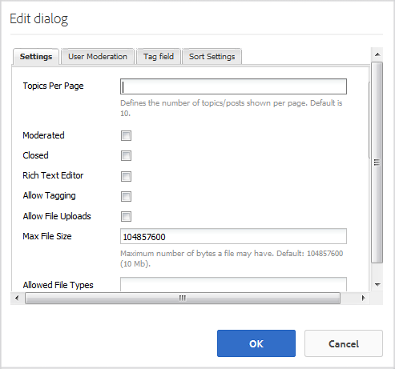

# Funzionalità forum D e R {#q-a-forum-feature}

## Introduzione {#introduction}

La funzione di forum QnA (domande e risposte) offre ai membri della community un&#39;area in cui porre e rispondere alle domande:

* Creare nuove domande
* Immagini in linea (con supporto per trascinamento)
* Visualizzare e rispondere alle domande
* Ricerca di una domanda
* Aiutare a moderare il contenuto QnA
* Identificare le risposte migliori
* Spostare le domande QnA da una pagina all&#39;altra

Questa sezione della documentazione descrive

* Aggiunta della funzione forum QnA a un sito AEM
* Impostazioni di configurazione per il `QnA`componente

## Aggiunta di un forum D e R a una pagina {#adding-a-q-a-forum-to-a-page}

Per aggiungere un `QnA` componente a una pagina in modalità di creazione, usate il browser Componenti per individuarlo `Communities / QnA` e trascinarlo nella posizione desiderata su una pagina in cui dovrebbe comparire il forum QnA.

Per le informazioni necessarie, visita [Community Components Basics](basics.md).

Quando sono incluse le librerie [lato client](qna-essentials.md#essentials-for-client-side) richieste, verrà visualizzato il `QnA` componente:

### Configurazione di QnA {#configuring-qna}

Selezionate il `QnA` componente inserito a cui accedere e selezionate l’ `Configure` icona che apre la finestra di dialogo di modifica.

 

#### scheda Impostazioni {#settings-tab}

Nella scheda **[!UICONTROL Impostazioni]** , specificate le impostazioni per gli argomenti (domande) e le risposte (risposte):

* **[!UICONTROL Argomenti per pagina]** Definisce il numero di domande/post mostrati per pagina. Il valore predefinito è 10.

* **[!UICONTROL Moderato]** Se selezionato, la pubblicazione di argomenti e commenti deve essere approvata prima che vengano visualizzati in un sito di pubblicazione. Il valore predefinito è deselezionato.

* **[!UICONTROL Chiuso]** Se selezionato, il forum è chiuso a nuove domande e commenti. Il valore predefinito è deselezionato.

* **[!UICONTROL Editor]** Rich Text Se questa opzione è selezionata, è possibile immettere commenti e argomenti con la marcatura. Il valore predefinito è deselezionato.

* **[!UICONTROL Consenti tag]** Se questa opzione è selezionata, consentire ai membri di aggiungere etichette di tag al proprio post (consultate la scheda Campo **** tag). Il valore predefinito è deselezionato.

* **[!UICONTROL Consenti caricamenti]** file Se questa opzione è selezionata, consenti l’aggiunta di allegati alla domanda o al commento. Il valore predefinito è deselezionato.

* **[!UICONTROL Dimensione]** massima file pertinente solo se `Allow File Uploads` è selezionata. Questo campo limita la dimensione (in byte) di un file caricato. Il valore predefinito è 104857600 (10 Mb).

* **[!UICONTROL Tipi]** di file consentiti Pertinenti solo se `Allow File Uploads` è selezionata. Un elenco separato da virgole di estensioni di file con il separatore &quot;punto&quot;. Ad esempio: .jpg, .jpeg, .png, .doc, .docx, .pdf. Se vengono specificati dei tipi di file, non sarà possibile caricarli. Il valore predefinito non è specificato, pertanto tutti i tipi di file sono consentiti.

* **[!UICONTROL Dimensione]** massima file immagine pertinente solo se l&#39;opzione Consenti caricamenti file è selezionata. Numero massimo di byte di cui può disporre un file immagine caricato. Il valore predefinito è 2097152 (2 Mb).

* **[!UICONTROL Consenti]** se questa opzione è selezionata, includete la seguente funzione per i post del forum, che consente ai membri di ricevere [notifiche](notifications.md) sui nuovi post. Il valore predefinito è deselezionato.

* **[!UICONTROL Consenti blocco]** Se questa opzione è selezionata, gli argomenti del forum possono essere bloccati in cima all’elenco di argomenti. Il valore predefinito è deselezionato.

* **[!UICONTROL Consenti iscrizioni]** e-mail Se questa opzione è selezionata, consente ai membri di ricevere notifiche sui nuovi post tramite e-mail ([iscrizione](subscriptions.md)). Richiede `Allow Following` di essere selezionato e configurato [l’](email.md)e-mail. Il valore predefinito è deselezionato.

* **[!UICONTROL Consenti risposte]** Se questa opzione è selezionata, consenti risposte ai commenti inviati alla domanda. Il valore predefinito è deselezionato.

* **[!UICONTROL Consenti agli utenti di eliminare commenti e argomenti]** Se questa opzione è selezionata, consente ai membri di eliminare i commenti e le domande che hanno pubblicato. Il valore predefinito è deselezionato.

* **[!UICONTROL Consenti votazione]** Se questa opzione è selezionata, includete la funzione di votazione con una domanda. Il valore predefinito è deselezionato.

* **[!UICONTROL Sposta la risposta selezionata in alto]** Se questa opzione è selezionata, la prima risposta visualizzata è una risposta selezionata. Il valore predefinito è selezionato.

* **[!UICONTROL Visualizza Badge]** Se questa opzione è selezionata, visualizza [i simboli](implementing-scoring.md) guadagnati e assegnati con il post di blog di un membro. Il valore predefinito è deselezionato.

* **[!UICONTROL Consenti contenuti]** contenuti contenuti contenuti [contenuti se questa opzione è selezionata, l’idea può essere identificata come contenuto](featured.md)disponibile. Il valore predefinito è deselezionato.

#### Scheda Moderazione utente {#user-moderation-tab}

Nella scheda Moderazione **** utente, specificate in che modo vengono gestiti gli argomenti (domande) e le risposte (contenuto generato dall’utente) pubblicati. Per ulteriori informazioni, consultate [Moderazione del contenuto](moderate-ugc.md)generato dall&#39;utente.

* **[!UICONTROL Rifiuta risposte]** Se questa opzione è attivata, ai moderatori di membri attendibili sarà consentito di negare le risposte pubblicate e impedire che la risposta venga visualizzata nel forum D e R pubblico. Il valore predefinito è deselezionato.

* **[!UICONTROL Chiudi/Riapri argomenti]** Se questa opzione è attivata, i moderatori di membri attendibili potrebbero chiudere una domanda (argomento) per apportare ulteriori modifiche e risposte e potrebbero anche riaprire una domanda. Il valore predefinito è deselezionato.

* **[!UICONTROL Sposta argomenti]** Se questa opzione è selezionata, consente ai moderatori lato pubblicazione di spostare le domande. Il valore predefinito è deselezionato.

* **[!UICONTROL Contrassegna post]** Se questa opzione è selezionata, consentire ai membri di contrassegnare le domande o le risposte di altri utenti in modo inappropriato. Il valore predefinito è deselezionato.

* **[!UICONTROL Elenco]** dei motivi del contrassegno Se questa opzione è selezionata, consente ai membri di scegliere, da un elenco a discesa, il motivo per cui contrassegnano una domanda o una risposta come non appropriata. Il valore predefinito è deselezionato.

* **[!UICONTROL Motivo]** contrassegno personalizzato Se questa opzione è selezionata, consentire ai membri di inserire il proprio motivo per cui la domanda o la risposta è contrassegnata come non appropriata. Il valore predefinito è deselezionato.

* **[!UICONTROL Soglia moderazione]** Immettere il numero di volte in cui i membri devono contrassegnare una domanda o una risposta prima che i moderatori ne vengano informati. Il valore predefinito è 1 (una volta).

* **[!UICONTROL Limite]** contrassegno Consente di specificare quante volte è necessario contrassegnare una domanda o una risposta prima di nasconderla dalla visualizzazione pubblica. Se è impostato su -1, la domanda o la risposta contrassegnata non viene mai nascosta dalla visualizzazione pubblica. In caso contrario, questo numero deve essere maggiore o uguale alla soglia di moderazione. Il valore predefinito è 5.

#### Scheda Campo tag {#tag-field-tab}

Nella scheda Campo **** tag, i tag che possono essere applicati, se consentiti nella scheda **[!UICONTROL Impostazioni]** , sono limitati in base agli spazi dei nomi selezionati.

* **[!UICONTROL Spazi dei nomi consentiti]** Rilevanti se `Allow Tagging` è selezionato nella scheda **Impostazioni** . I tag che possono essere applicati sono limitati a quelli all&#39;interno delle categorie dello spazio nomi selezionate. L&#39;elenco degli spazi dei nomi include &quot;Tag standard&quot; (lo spazio dei nomi predefinito) e &quot;Includi tutti i tag&quot;. Il valore predefinito non è selezionato, ovvero tutti gli spazi dei nomi sono consentiti.

* **[!UICONTROL Limite]** suggerimenti Consente di specificare il numero di tag da visualizzare come suggerimento al membro che invia il messaggio al forum. Un valore di `-1` significa nessun limite. Il valore predefinito è 0.

#### Scheda Impostazioni ordinamento {#sort-settings-tab}

Nella scheda **[!UICONTROL Impostazioni]** ordinamento, specificare in che modo i commenti inviati vengono ordinati quando vengono visualizzati.

* **[!UICONTROL Ordina per]** selezionare tutte le selezioni di ordinamento consentite: `Newest, Oldest, Last Updated, Most Viewed, Most Active, Most Followed and Most Liked`. Default is `Newest, Oldest, Last Updated`.

* **[!UICONTROL Imposta come Predefinito]** pull verso il basso per selezionare una delle opzioni di ordinamento selezionate da visualizzare come predefinita. Default is `Newest`.

* **[!UICONTROL Seleziona Opzioni ora per l&#39;ordinamento]** pull in basso di Analytics per selezionare una delle opzioni `All, Last 24 Hours, Last 7 Days, Last 30 Days`. Default is `All`.

## Esperienza dei visitatori del sito {#site-visitor-experience}

### Identificazione delle risposte {#identifying-answers}

Una risposta può essere contrassegnata come una risposta corretta o utile utilizzando il `Select Answer` pulsante. Una volta che una domanda è contrassegnata come Risposta, non è possibile selezionare un&#39;altra risposta fino a quando la prima non è stata deselezionata utilizzando il `Unmark Chosen Answer`pulsante.

Una volta selezionata come risposta valida, la selezione potrebbe essere annullata utilizzando il `Unmark Chosen Answer` pulsante.

Una volta che una risposta è selezionata come risposta valida, l&#39;indicazione che la domanda è stata `Answered`visualizzata accanto all&#39;argomento della domanda nella pagina QnA principale.

### Moderatori e amministratori {#moderators-and-administrators}

Quando l’utente che ha effettuato l’accesso dispone di privilegi di moderatore o amministratore, può eseguire le attività di moderazione consentite dalla configurazione del componente, indipendentemente da chi ha creato la domanda o la risposta.

Hanno anche la capacità di identificare le risposte.

### Membri {#members}

Quando il visitatore del sito ha effettuato l&#39;accesso, a seconda della configurazione, può

* Pubblica una nuova domanda
* Modificare o eliminare le domande create
* Possono anche contrassegnare altre domande o risposte
* Può identificare le risposte alle domande che hanno creato

### Anonimo {#anonymous}

I visitatori del sito che non hanno effettuato l&#39;accesso possono solo leggere le domande pubblicate e le risposte, tradurle se supportate, ma non aggiungere né una domanda né una risposta, né contrassegnare i post di altri utenti.

## Informazioni aggiuntive {#additional-information}

Ulteriori informazioni sono disponibili nella pagina [QnA Essentials](qna-essentials.md) per gli sviluppatori.

Per la moderazione degli argomenti e dei commenti pubblicati, consultate [Moderazione del contenuto](moderate-ugc.md)generato dall&#39;utente.

Per assegnare tag agli argomenti e ai commenti inviati, consultate [Assegnazione di tag ai contenuti](tag-ugc.md)generati dagli utenti.
