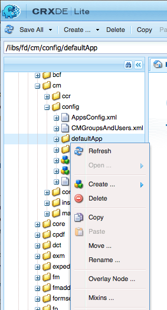
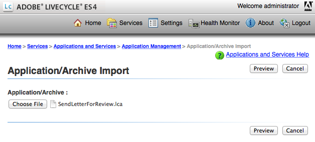

# Aggiungi azione/pulsante personalizzato nell’interfaccia utente Crea corrispondenza {#add-custom-action-button-in-create-correspondence-ui}

>[!CAUTION]
>
>AEM 6.4 ha raggiunto la fine del supporto esteso e questa documentazione non viene più aggiornata. Per maggiori dettagli, consulta la nostra [periodi di assistenza tecnica](https://helpx.adobe.com/it/support/programs/eol-matrix.html). Trova le versioni supportate [qui](https://experienceleague.adobe.com/docs/).

## Panoramica {#overview}

La soluzione Gestione della corrispondenza consente di aggiungere azioni personalizzate all’interfaccia utente Crea corrispondenza .

Lo scenario descritto in questo documento spiega come creare un pulsante nell’interfaccia utente Crea corrispondenza per condividere una lettera come PDF di revisione allegata a un messaggio e-mail.

### Prerequisiti {#prerequisites}

Per completare questo scenario, è necessario quanto segue:

* Conoscenza di CRX e JavaScript
* Server LiveCycle

## Scenario: Crea il pulsante nell’interfaccia utente Crea corrispondenza per inviare una lettera per la revisione {#scenario-create-the-button-in-the-create-correspondence-user-interface-to-send-a-letter-for-review}

L’aggiunta di un pulsante con un’azione (qui invia lettera per la revisione) all’interfaccia utente Crea corrispondenza include:

1. Aggiunta del pulsante all’interfaccia utente Crea corrispondenza
1. Aggiunta della gestione delle azioni al pulsante
1. Aggiunta del processo di LiveCycle per abilitare la gestione delle azioni

### Aggiungi il pulsante all’interfaccia utente Crea corrispondenza {#add-the-button-to-the-create-correspondence-user-interface}

1. Vai a `https://[server]:[port]/[ContextPath]/crx/de` e accedi come amministratore.
1. Nella cartella delle app, crea una cartella denominata `defaultApp` con percorso/struttura simile alla cartella defaultApp (che si trova nella cartella di configurazione). Per creare la cartella, effettua le seguenti operazioni:

   * Fai clic con il pulsante destro del mouse sul pulsante **[!UICONTROL defaultApp]** nel seguente percorso e seleziona **[!UICONTROL Nodo di sovrapposizione]**:

      /libs/fd/cm/config/defaultApp/

      

   * Assicurati che la finestra di dialogo Sovrapponi nodo abbia i seguenti valori:

      **[!UICONTROL Percorso:]** /libs/fd/cm/config/defaultApp/

      **[!UICONTROL Posizione sovrapposizione:]** /apps/

      **[!UICONTROL Tipi di nodo di corrispondenza:]** Selezionato

      

   * Fai clic su **[!UICONTROL OK]**.
   * Fai clic su **[!UICONTROL Salva tutto]**.

1. Crea una copia del file acmExtensionsConfig.xml (esiste sotto il ramo /libs) sotto il ramo /apps .

   * Vai a &quot;/libs/fd/cm/config/defaultApp/acmExtensionsConfig.xml&quot;

   * Fai clic con il pulsante destro del mouse sul file acmExtensionsConfig.xml e seleziona **[!UICONTROL Copia]**.

      

   * Fai clic con il pulsante destro del mouse sul pulsante **[!UICONTROL defaultApp]** in &quot;/apps/fd/cm/config/defaultApp/,&quot; e seleziona **[!UICONTROL Incolla]**.
   * Fai clic su **[!UICONTROL Salva tutto]**.

1. Fai doppio clic sulla copia di acmExtentionsConfig.xml appena creata nella cartella apps . Il file viene aperto per la modifica.
1. Individua il codice seguente:

   ```xml
   <?xml version="1.0" encoding="utf-8"?>
   <extensionsConfig>
       <modelExtensions>
           <modelExtension type="LetterInstance">
     <customAction name="Preview" label="loc.letterInstance.preview.label" tooltip="loc.letterInstance.preview.tooltip" styleName="previewButton"/>
               <customAction name="Submit" label="loc.letterInstance.submit.label" tooltip="loc.letterInstance.submit.tooltip" styleName="submitButton" permissionName="forms-users"/>
               <customAction name="SaveAsDraft" label="loc.letterInstance.saveAsDraft.label" tooltip="loc.letterInstance.saveAsDraft.tooltip" styleName="submitButton" permissionName="forms-users"/>
               <customAction name="Close" label="loc.letterInstance.close.label" tooltip="loc.letterInstance.close.tooltip" styleName="closeButton"/>
           </modelExtension>
       </modelExtensions>
   </extensionsConfig> 
   ```

1. Per inviare un messaggio e-mail, è possibile utilizzare il Forms Workflow LiveCycle. Aggiungi un tag customAction sotto il tag modelExtension in acmExtensionsConfig.xml come segue:

   ```xml
    <customAction name="Letter Review" label="Letter Review" tooltip="Letter Review" styleName="" permissionName="forms-users" actionHandler="CM.domain.CCRCustomActionHandler">
         <serviceName>Forms Workflow -> SendLetterForReview/SendLetterForReviewProcess</serviceName>
       </customAction>
   ```

   

   Il tag modelExtension dispone di un set di tag secondari customAction che configurano l’azione, le autorizzazioni e l’aspetto del pulsante di azione. Di seguito è riportato un elenco di tag di configurazione customAction:

   | **Nome** | **Descrizione** |
   |---|---|
   | name | Nome alfanumerico dell’azione da eseguire. Il valore di questo tag è obbligatorio, deve essere univoco (all&#39;interno del tag modelExtension ) e deve iniziare con un alfabeto. |
   | etichetta | Etichetta da visualizzare sul pulsante di azione |
   | tooltip | Testo della descrizione comando del pulsante, visualizzato quando l’utente passa il mouse sul pulsante. |
   | styleName | Nome dello stile personalizzato applicato al pulsante di azione. |
   | permissionName | L’azione corrispondente viene visualizzata solo se l’utente dispone dell’autorizzazione specificata da permissionName. Quando si specifica permissionName come `forms-users`, tutti gli utenti possono accedere a questa opzione. |
   | actionHandler | Nome completo della classe ActionHandler che viene chiamata quando l&#39;utente fa clic sul pulsante. |

   Oltre ai parametri di cui sopra, possono essere presenti configurazioni aggiuntive associate a un&#39;azione personalizzata. Queste configurazioni aggiuntive sono rese disponibili al gestore tramite l&#39;oggetto CustomAction.

   | **Nome** | **Descrizione** |
   |---|---|
   | serviceName | Se un oggetto customAction contiene un tag secondario con nome serviceName, fare clic sul pulsante o sul collegamento corrispondente per chiamare un processo con il nome rappresentato dal tag serviceName. Verificare che questo processo abbia la stessa firma del PostProcess Lettera. Aggiungi il prefisso &quot;Forms Workflow ->&quot; nel nome del servizio. |
   | Parametri contenenti il prefisso cm_ nel nome del tag | Se un&#39;azione personalizzata contiene tag secondari che iniziano con nome cm_, in fase di post (che si tratti di Processo post lettera o del processo speciale rappresentato dal tag serviceName) questi parametri sono disponibili nel codice XML di input sotto il tag rilevante con il prefisso cm_ rimosso. |
   | actionName | Ogni volta che un processo post è dovuto a un clic, l&#39;XML inviato contiene un tag speciale con il nome sotto il tag con il nome dell&#39;azione utente. |

1. Fai clic su **[!UICONTROL Salva tutto]**.

#### Crea una cartella locale con il file delle proprietà nel ramo /apps {#create-a-locale-folder-with-properties-file-in-the-apps-branch}

Il file ACMExtensionMessages.properties include etichette e messaggi di descrizione comando di vari campi nell&#39;interfaccia utente Crea corrispondenza. Affinché le azioni/i pulsanti personalizzati funzionino, crea una copia di questo file nel ramo /apps .

1. Fai clic con il pulsante destro del mouse sul pulsante **[!UICONTROL locale]** nel seguente percorso e seleziona **[!UICONTROL Nodo di sovrapposizione]**:

   /libs/fd/cm/config/defaultApp/locale

1. Assicurati che la finestra di dialogo Sovrapponi nodo abbia i seguenti valori:

   **[!UICONTROL Percorso:]** /libs/fd/cm/config/defaultApp/locale

   **[!UICONTROL Posizione sovrapposizione:]** /apps/

   **[!UICONTROL Tipi di nodo di corrispondenza:]** Selezionato

1. Fai clic su **[!UICONTROL OK]**.
1. Fai clic su **[!UICONTROL Salva tutto]**.
1. Fai clic con il pulsante destro del mouse sul file seguente e seleziona **[!UICONTROL Copia]**:

   `/libs/fd/cm/config/defaultApp/locale/ACMExtensionsMessages.properties`

1. Fai clic con il pulsante destro del mouse sul pulsante **[!UICONTROL locale]** nel seguente percorso e seleziona **[!UICONTROL Incolla]**:

   `/apps/fd/cm/config/defaultApp/locale/`

   Il file ACMExtensionMessages.properties viene copiato nella cartella locale.

1. Per localizzare le etichette dell&#39;azione/pulsante personalizzato appena aggiunto, crea il file ACMExtensionMessages.properties per le impostazioni internazionali pertinenti in `/apps/fd/cm/config/defaultApp/locale/`.

   Ad esempio, per localizzare l&#39;azione/pulsante personalizzato creato in questo articolo, crea un file denominato ACMExtensionMessages_fr.properties con la voce seguente:

   `loc.letterInstance.letterreview.label=Revue De Lettre`

   Allo stesso modo, in questo file è possibile aggiungere più proprietà, ad esempio per la descrizione comando e lo stile.

1. Fai clic su **[!UICONTROL Salva tutto]**.

#### Riavvia il bundle Adobe Asset Composer Building Block {#restart-the-adobe-asset-composer-building-block-bundle}

Dopo aver apportato ogni modifica lato server, riavvia il bundle Adobe Asset Composer Building Block. In questo scenario, i file acmExtensionsConfig.xml e ACMExtensionMessages.properties sul lato server vengono modificati e quindi il bundle Adobe Asset Composer Building Block richiede un riavvio.

>[!NOTE]
>
>Potrebbe essere necessario cancellare la cache del browser.

1. Passa a `https://[host]:[port]/system/console/bundles`. Se necessario, accedi come Amministratore.

1. Individua il bundle Adobe Asset Composer Building Block . Riavvia il bundle: fare clic su Interrompi e quindi su Avvia.

   

Dopo aver riavviato il bundle Adobe Asset Composer Building Block, il pulsante personalizzato viene visualizzato nell’interfaccia utente Crea corrispondenza. Puoi aprire una lettera nell’interfaccia utente Crea corrispondenza per visualizzare l’anteprima del pulsante personalizzato.

### Aggiungi la gestione delle azioni al pulsante {#add-action-handling-to-the-button}

L’interfaccia utente Crea corrispondenza per impostazione predefinita ha implementato ActionHandler nel file cm.domain.js nella posizione seguente:

/libs/fd/cm/ccr/gui/components/admin/clientlibs/ccr/js/cm.domain.js

Per la gestione delle azioni personalizzata, crea una sovrapposizione del file cm.domain.js nel ramo /apps di CRX.

La gestione dell’azione o del pulsante quando si fa clic su action/button include la logica per:

* L’azione appena aggiunta diventa visibile/invisibile: eseguito ignorando la funzione actionVisible() .
* Abilitazione/disabilitazione della nuova azione aggiunta: eseguito ignorando la funzione actionEnabled() .
* Gestione effettiva dell&#39;azione quando l&#39;utente fa clic sul pulsante: eseguito ignorando l&#39;implementazione della funzione handleAction() .

1. Passa a `https://[server]:[port]/[ContextPath]/crx/de`. Se necessario, accedi come Amministratore.

1. Nella cartella delle app, crea una cartella denominata `js` nel ramo /apps di CRX con struttura simile alla seguente cartella:

   `/libs/fd/cm/ccr/gui/components/admin/clientlibs/ccrui/js`

   Per creare la cartella, effettua le seguenti operazioni:

   1. Fai clic con il pulsante destro del mouse sul pulsante **[!UICONTROL js]** nel seguente percorso e seleziona **[!UICONTROL Nodo di sovrapposizione]**:

      `/libs/fd/cm/ccr/gui/components/admin/clientlibs/ccrui/js`

   1. Assicurati che la finestra di dialogo Sovrapponi nodo abbia i seguenti valori:

      **[!UICONTROL Percorso:]** /libs/fd/cm/ccr/gui/components/admin/clientlibs/ccrui/js

      **[!UICONTROL Posizione sovrapposizione:]** /apps/

      **[!UICONTROL Tipi di nodo di corrispondenza:]** Selezionato

   1. Fai clic su **[!UICONTROL OK]**.
   1. Fai clic su **[!UICONTROL Salva tutto]**.

1. Nella cartella js , crea un file denominato ccrcustomization.js con il codice per la gestione dell’azione del pulsante seguendo i passaggi seguenti:

   1. Fai clic con il pulsante destro del mouse sul pulsante **[!UICONTROL js]** nel seguente percorso e seleziona **[!UICONTROL Crea > Crea file]**:

      `/apps/fd/cm/ccr/gui/components/admin/clientlibs/ccrui/js`

      Denomina il file come ccrcustomization.js.

   1. Fai doppio clic sul file ccrcustomization.js per aprirlo in CRX.
   1. Nel file , incolla il codice seguente e fai clic su **[!UICONTROL Salva tutto]**:

      ```
      /* for adding and handling custom actions in Extensible Toolbar.
        * One instance of handler will be created for each action.
        * CM.domain.CCRCustomActionHandler is actionHandler class.
        */
      var CCRCustomActionHandler;
          CCRCustomActionHandler = CM.domain.CCRCustomActionHandler = new Class({
              className: 'CCRCustomActionHandler',
              extend: CCRDefaultActionHandler,
              construct : function(action,model){
              }
          });
          /**
           * Called when user user click an action
           * @param extraParams additional arguments that may be passed to handler (For future use)
           */
          CCRCustomActionHandler.prototype.handleAction = function(extraParams){
              if (this.action.name == CCRCustomActionHandler.SEND_FOR_REVIEW) {
                  var sendForReview = function(){
                      var serviceName = this.action.actionConfig["serviceName"];
                      var inputParams = {};
                      inputParams["dataXML"] = this.model.iccData.data;
                      inputParams["letterId"] = this.letterVO.id;
                      inputParams["letterName"] = this.letterVO.name;
                      inputParams["mailId"] = $('#email').val();
                      /*function to invoke the LivecyleService */
                      ServiceDelegate.callJSONService(this,"lc.icc.renderlib.serviceInvoker.json","invokeProcess",[serviceName,inputParams],this.onProcessInvokeComplete,this.onProcessInvokeFail);
                      $('#ccraction').modal("hide");
                  }
                  if($('#ccraction').length == 0){
                      /*For first click adding popup & setting letterName.*/
                      $("body").append(popUp);
                      $("input[id*='letterName']").val(this.letterVO.name);   
                      $(document).on('click',"#submitLetter",$.proxy( sendForReview, this ));
                  }
                  $('#ccraction').modal("show");
              }
          };
          /**
           * Should the action be enabled in toolbar
           * @param extraParams additional arguements that may be passed to handler (For future use)
           * @return flag indicating whether the action should be enabled
           */
         CCRCustomActionHandler.prototype.actionEnabled = function(extraParams){
                  /*can be customized as per user requirement*/
                  return true;
          };
          /**
           * Should the action be visible in toolbar
           * @param extraParams additional arguments that may be passed to handler (For future use)
           * @return flag indicating whether the action should be enabled
           */
          CCRCustomActionHandler.prototype.actionVisible = function(extraParams){
              /*Check can be enabled for Non-Preview Mode.*/
              return true;
          };
          /*SuccessHandler*/
          CCRCustomActionHandler.prototype.onProcessInvokeComplete = function(response) {
              ErrorHandler.showSuccess("Letter Sent for Review");
          };
          /*FaultHandler*/
          CCRCustomActionHandler.prototype.onProcessInvokeFail = function(event) {
              ErrorHandler.showError(event.message);
          };
          CCRCustomActionHandler.SEND_FOR_REVIEW  = "Letter Review";
      /*For PopUp*/
          var popUp = '<div class="modal fade" id="ccraction" tabindex="-1" role="dialog" aria-hidden="true">'+
          '<div class="modal-dialog modal-sm">'+
              '<div class="modal-content">' +
                  '<div class="modal-header">'+
                      '<button type="button" class="close" data-dismiss="modal" aria-label="Close"><span aria-hidden="true">&times;</span></button>'+
                      '<h4 class="modal-title"> Send Review </h4>'+
                  '</div>'+
                  '<div class="modal-body">'+
                      '<form>'+
                          '<div class="form-group">'+
                              '<label class="control-label">Email Id</label>'+
                              '<input type="text" class="form-control" id="email">'+
                          '</div>'+
                          '<div class="form-group">'+
                              '<label  class="control-label">Letter Name</label>'+
                              '<input id="letterName" type="text" class="form-control" readonly>'+
                          '</div>'+
                          '<div class="form-group">'+
                              '<input id="letterData" type="text" class="form-control hide" readonly>'+
                          '</div>'+
                      '</form>'+
                  '</div>'+
                  '<div class="modal-footer">'+
                     '<button type="button" class="btn btn-default" data-dismiss="modal"> Cancel </button>'+
                     '<button type="button" class="btn btn-primary" id="submitLetter"> Submit </button>'+
                  '</div>'+
              '</div>'+
          '</div>'+
      '</div>';
      ```

### Aggiungi il processo di LiveCycle per abilitare l&#39;azione <span class="acrolinxCursorMarker"></span>movimentazione {#add-the-livecycle-process-to-enable-action-span-class-acrolinxcursormarker-span-handling}

In questo scenario, abilita i seguenti componenti, che fanno parte del file components.zip allegato:

* JAR componente DSC (`DSCSample.jar`)
* Invia lettera per il processo di revisione LCA (`SendLetterForReview.lca`)

Scarica e decomprimi il file `components.zip` file da ottenere `DSCSample.jar` e `SendLetterForReview.lca` file. Utilizzare questi file come specificato nelle procedure seguenti.

[Ottieni file](assets/components.zip)

#### Configurare il server di LiveCycle per eseguire il processo LCA {#configure-the-livecycle-server-to-run-the-lca-process}

>[!NOTE]
>
>Questo passaggio è necessario solo se sei su una &quot;configurazione OSGI e l&#39;integrazione LC è necessaria per il tipo di personalizzazione che stai implementando.

Il processo LCA viene eseguito sul server di LiveCycle e richiede l&#39;indirizzo del server e le credenziali di accesso.

1. Vai a `https://[server]:[port]/system/console/configMgr` e accedi come amministratore.
1. Individua la configurazione dell’SDK client di Adobe LiveCycle e fai clic su **[!UICONTROL Modifica]** (icona di modifica). Viene visualizzato il pannello Configurazioni .

1. Immetti i seguenti dettagli e fai clic su **[!UICONTROL Salva]**:

   * **[!UICONTROL Url Server]**: URL del server LC il cui servizio Invia per revisione viene utilizzato dal codice del gestore azioni.
   * **[!UICONTROL Nome utente]**: Nome utente amministratore del server LC
   * **[!UICONTROL Password]**: Password del nome utente amministratore

   

#### Installa archivio LiveCycli (LCA) {#install-livecycle-archive-lca}

Il processo di LiveCycle richiesto che abilita il processo del servizio e-mail.

>[!NOTE]
>
>Per visualizzare l’attività di questo processo o per crearne uno simile, è necessario Workbench.

1. Accedi come amministratore a Livecycle Server adminui all&#39;indirizzo `https:/[lc server]/:[lc port]/adminui`.

1. Passa a **[!UICONTROL Home > Servizi > Applicazioni e servizi > Gestione applicazioni]**.

1. Se l&#39;applicazione SendLetterForReview è già presente, salta i passaggi rimanenti di questa procedura, altrimenti continua con i passaggi successivi.

   

1. Fai clic su **[!UICONTROL Importa]**.

1. Fai clic su **[!UICONTROL Scegli file]** e seleziona **[!UICONTROL SendLetterForReview.lca]**.

   

1. Fai clic su **[!UICONTROL Anteprima]**.

1. Seleziona **[!UICONTROL Distribuire le risorse in fase di runtime al termine dell’importazione]**.

1. Fai clic su **[!UICONTROL Importa]**.

#### Aggiunta di ServiceName all&#39;elenco dei servizi Inseriti nell&#39;elenco Consentiti {#adding-servicename-to-the-allowlisted-service-list}

Indicare nel server AEM i servizi di LiveCycle a cui si desidera accedere al server AEM.

1. Accedi come amministratore a `https:/[host]/:[port]/system/console/configMgr`.

1. Individua e fai clic su **[!UICONTROL Configurazione Adobe LiveCycle Client SDK]**. Viene visualizzato il pannello Configurazione dell’SDK client di Adobe LiveCycle.
1. Nell’elenco Nome servizio, fai clic sull’icona + e aggiungi un serviceName **[!UICONTROL SendLetterForReview/SendLetterForReviewProcess]**.

1. Fai clic su **[!UICONTROL Salva]**.

#### Configurare il servizio e-mail {#configure-the-email-service}

In questo scenario, affinché Gestione Corrispondenza possa inviare un’e-mail, configura il servizio e-mail nel server di LiveCycle.

1. Accedi con le credenziali di amministratore a Livecycle Server adminui all&#39;indirizzo `https:/[lc server]:[lc port]/adminui`.

1. Passa a **[!UICONTROL Home > Servizi > Applicazioni e servizi > Gestione dei servizi]**.

1. Individua e fai clic su **[!UICONTROL EmailService]**.

1. In **[!UICONTROL Host SMTP]**, configura il servizio e-mail.

1. Fai clic su **[!UICONTROL Salva]**.

#### Configurare il servizio DSC {#configure-the-dsc-service}

Per utilizzare l’API di gestione della corrispondenza, scarica la `DSCSample.jar` (allegato al presente documento come parte di `components.zip`) e caricarla sul server di LiveCycle. Dopo la `DSCSample.jar` viene caricato sul server di LiveCycle, il server AEM utilizza il `DSCSample.jar` per accedere all’API renderLetter.

Per ulteriori informazioni, consulta [Collegamento di AEM Forms con il LiveCycle Adobe](/help/forms/using/aem-livecycle-connector.md).

1. Aggiorna l&#39;URL del server AEM in cmsa.properties in `DSCSample.jar`, che si trova nel seguente percorso:

   DSCSample.jar\com\adobe\livecycle\cmsa.properties

1. Fornisci i seguenti parametri nel file di configurazione:

   * **crx.serverUrl**=https:/[host]/:[porta]/[percorso del contesto]/[URL AEM]
   * **crx.username**= nome utente AEM
   * **crx.password**= password AEM
   * **crx.appRoot**=/content/apps/cm

   >[!NOTE]
   >
   >Ogni volta che apporti modifiche sul lato server, riavvia il server.

   La `DSCSample.jar` utilizza il `renderLetter` API. Per ulteriori informazioni sull&#39;API renderLetter, consulta [Interfaccia LetterRenderService](https://helpx.adobe.com/aem-forms/6-2/javadocs/com/adobe/icc/ddg/api/LetterRenderService.html).

#### Importare DSC in AEM Forms su JEE {#import-dsc-to-livecyle}

`DSCSample.jar` utilizza il `renderLetter` API per eseguire il rendering della lettera come byte di PDF dai dati XML forniti come input. Per ulteriori informazioni su renderLetter e altre API, vedi [Servizio di rendering lettera](https://helpx.adobe.com/aem-forms/6-2/javadocs/com/adobe/icc/ddg/api/LetterRenderService.html).

1. Avvia Workbench ed effettua l&#39;accesso.
1. Seleziona **[!UICONTROL Finestra > Mostra viste > Componenti]**. La vista Componenti viene aggiunta a Workbench ES2.

1. Fai clic con il pulsante destro del mouse **[!UICONTROL Componenti]** e seleziona **[!UICONTROL Installazione componente]**.

1. Seleziona la `DSCSample.jar` tramite il browser file e fai clic su **[!UICONTROL Apri]**.
1. Fai clic con il pulsante destro del mouse **[!UICONTROL RenderWrapper]** e seleziona **[!UICONTROL Componente Start]**. Se il componente viene avviato, accanto al nome del componente viene visualizzata una freccia verde.

## Invia lettera di revisione {#send-letter-for-review}

Dopo aver configurato l’azione e il pulsante per l’invio della lettera per la revisione:

1. Cancella la cache del browser.

1. Nell’interfaccia utente Crea corrispondenza, fai clic su **[!UICONTROL Revisione della lettera]** e specifica l&#39;ID e-mail del revisore.

1. Fai clic su **[!UICONTROL Invia]**.


Il revisore riceve un&#39;e-mail dal sistema con la lettera come allegato PDF.
