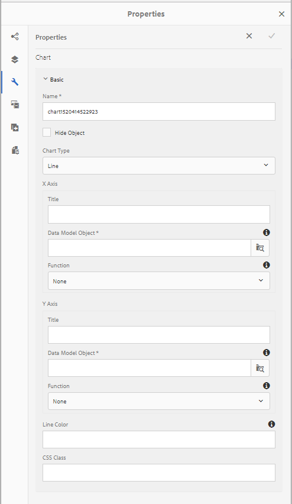
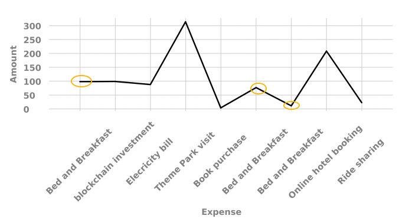
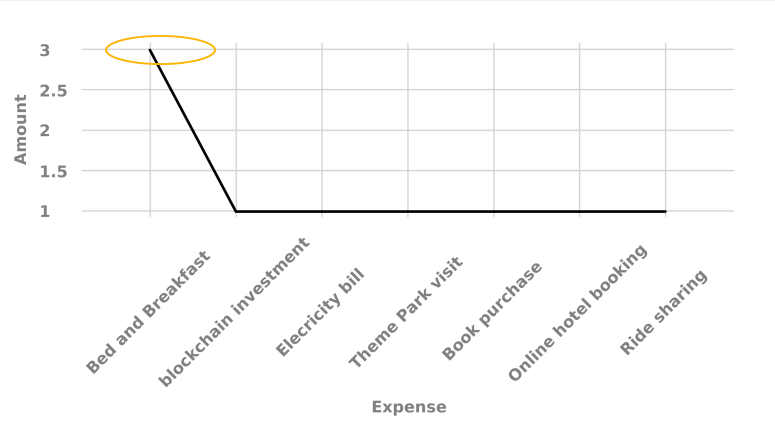

# Utilizzo dei grafici in Interactive Communications {#using-charts-in-interactive-communications}

Utilizzando i grafici in una comunicazione interattiva, è possibile condensare grandi quantità di informazioni in un formato visivo facile da analizzare e comprendere

Un grafico o un grafico è una rappresentazione visiva dei dati. Condensa grandi quantità di informazioni in formato visivo facile da capire, consentendo ai destinatari della comunicazione interattiva di visualizzare, interpretare e analizzare meglio i dati complessi.

Durante la creazione di una comunicazione interattiva, è possibile aggiungere grafici per rappresentare visivamente dati bidimensionali dal modello dati del modulo di comunicazione interattiva. Il componente Grafico consente di aggiungere e configurare i seguenti tipi di grafici:

* Torta
* Colonna
* Anello
* Barra (solo canale Web)
* Linea
* Linea e punto
* Punto
* Area

## Aggiungere e configurare il grafico in una comunicazione interattiva {#add-and-configure-chart-in-an-interactive-communication}

Completa i seguenti passaggi per aggiungere un grafico a una comunicazione interattiva:

1. Dalla barra laterale Componenti di AEM, trascina e rilascia il componente Grafico in uno dei canali Web o di stampa seguenti di una comunicazione interattiva:

   * Canale di stampa: Area di destinazione e campo immagine
   * Canale Web: Area Pannello e Target
   Il componente Grafico eliminato crea un segnaposto per un grafico.

1. Toccate il componente grafico nell’editor delle comunicazioni interattive e, dalla barra degli strumenti dei componenti, selezionate **[!UICONTROL Configura (]** configure_icon ).

   Viene visualizzata la barra laterale Proprietà con le proprietà Base del grafico.

   
   **** Figura: Proprietà *di base di un grafico a linee nel canale di stampa*

   
   **** Figura: Proprietà *di base di un grafico a linee nel canale Web*

1. Configurare le proprietà di base del grafico per il canale di stampa e il canale Web. A parte le proprietà comuni, esistono proprietà specifiche per la stampa e il canale Web e il tipo di grafico.

   * **[!UICONTROL Nome]**: Nome dell&#39;oggetto grafico. Il nome del grafico specificato qui non viene visualizzato nell&#39;output del grafico, ma viene utilizzato nelle regole per fare riferimento al grafico.
   * **[!UICONTROL Tipo]** grafico: Specifica il tipo di grafico: Torta, Colonna, Anello, Linea, Linea e Punto, Punto o Area.
   * **[!UICONTROL Nascondi oggetto]**:Selezionare per nascondere il grafico nell&#39;output finale.
   * Specificate quanto segue per l’asse **** x e l’asse **** y:

      * **[!UICONTROL Titolo]**: Specificate i titoli degli assi X e Y da visualizzare nella comunicazione interattiva.
      * **[!UICONTROL Oggetto del modello dati *]**: Sfogliare e selezionare gli oggetti modello dati per l&#39;asse X e Y del grafico dal modello dati modulo specificato durante la creazione della comunicazione interattiva. Scegliere due proprietà di tipo raccolta/array dello stesso oggetto modello dati padre che abbiano un significato in relazione l&#39;una all&#39;altra per eseguire il grafico sull&#39;asse X e Y di un grafico.
      * **[!UICONTROL Funzione]**: Per utilizzare le funzioni statistiche per calcolare i valori sull&#39;asse, selezionare la funzione per l&#39;asse X/Y. Per ulteriori informazioni sulle funzioni, vedere [Uso delle funzioni nel grafico](#usefunction) e nell&#39; [esempio 2: Applicazione delle funzioni somma e media in un grafico](#applicationsumfrequency)a linee.
   >[!NOTE]
   >
   >Per il canale di stampa, sull&#39;asse X, l&#39;oggetto del modello dati associato deve essere di tipo Numero, Stringa o Data. Sull&#39;asse Y l&#39;oggetto del modello dati associato deve essere di tipo Number. Si consiglia di utilizzare la legenda sul lato destro del canale di stampa.

   Per ulteriori informazioni sulle proprietà del grafico, vedere Proprietà [di base nei grafici](#basicpropertiescharts).

1. (Solo canale di stampa) Nelle Impostazioni agente, specificare se l&#39;agente deve utilizzare questo grafico. Se **[!UICONTROL è obbligatorio che l&#39;opzione Agente utilizzi questo grafico]** non sia selezionata, l&#39;agente può toccare l&#39;icona occhio per il grafico nella scheda Contenuto dell&#39;interfaccia utente dell&#39;agente per mostrare o nascondere il grafico.

   

1. Nella barra laterale Proprietà, toccate .

   Anteprima per visualizzare l’aspetto e i dati del grafico. Se necessario, tornare per riconfigurare le proprietà del grafico.

1. Tornate a apportare altre modifiche nella comunicazione interattiva.

## Esempio 1: Output grafico in stampa e Web {#chartoutputprintweb}

Nella scheda Base, è possibile definire il tipo di grafico, le proprietà del modello dati del modulo di origine che contengono dati, le etichette da tracciare sull&#39;asse x e sull&#39;asse y del grafico ed eventualmente la funzione statistica per calcolare i valori per il grafico.

Comprendiamo in dettaglio le informazioni minime richieste nelle proprietà di base, con l&#39;aiuto di un rendiconto della carta di credito generato tramite una comunicazione interattiva. Tenere presente che si desidera generare un grafico per rappresentare l&#39;importo di spese diverse nell&#39;istruzione. È possibile utilizzare diversi tipi di grafici per la stampa e l&#39;output Web della comunicazione interattiva.

A tal fine, è necessario specificare:

* **[!UICONTROL Tipo]** grafico - in questo esempio, Colonna per il canale di stampa e Ciambella per il canale Web
* **[!UICONTROL Oggetti]** modello dati come origine per l&#39;asse X e Y del grafico - in questo esempio, Importo transazione per l&#39;asse X e Nome spesa per l&#39;asse Y
* **[!UICONTROL Titolo]** per gli assi X e Y (solo per il tipo di colonna nel canale di stampa in questo esempio) - in questo esempio, Importo ($) per l&#39;asse X e Spese per l&#39;asse Y.
* **[!UICONTROL Direzione]** etichetta (per il tipo di colonna grafico nel canale di stampa solo in questo esempio) - in questo esempio `Tilt Left`

* **[!UICONTROL Descrizione]** da visualizzare al passaggio del mouse su una spesa (solo canale Web) - in questo esempio `${x}: $ ${y}`, che viene visualizzata come Etichetta [spesa: $ Amount] (Esempio: Visita del parco tematico: $ 315)

 Grafico a colonne nell’output di stampa di una comunicazione **interattiva** Figura: Grafico a *colonne nell&#39;output di stampa di una comunicazione interattiva*

******A. Asse Y - Incremento recuperato dalla proprietà del modello dati del modulo e dalla proprietà Titolo impostata su Importo ($)** B. Direzione etichetta dell&#39;asse X impostata su Inclinazione a sinistra **C.** Asse X - Descrizione spesa recuperata dalla proprietà del modello dati modulo e proprietà Titolo impostata su Spesa

 Grafico ad anello nell&#39;output Web di una comunicazione **interattiva** Figura: Grafico *ad anello nell&#39;output Web di una comunicazione interattiva*

******A. La proprietà Raggio interno della ciambella è impostata su** B. Mostra proprietà legenda è selezionata e la proprietà Posizione legenda è impostata su Destra **C.** La descrizione comandi visualizza il dettaglio dell&#39;elemento al passaggio del mouse. La descrizione comandi è impostata su ${x}: $ ${y}

## Esempio 2: Applicazione delle funzioni Somma e Frequenza in un grafico a linee {#applicationsumfrequency}

Applicando le funzioni in un grafico, è possibile stampare dati non forniti direttamente dal modello dati del modulo. In questo esempio, utilizziamo un esempio di rendiconto sulla carta di credito per comprendere in che modo le funzioni Somma e Frequenza possono essere applicate al grafico.

 Grafico a linee senza funzione con tre transazioni **** Figura &quot;Bed and Breakfast&quot;: Grafico a *linee senza funzione con tre transazioni &quot;Bed and Breakfast&quot;*

### Sum, funzione {#sum-function}

È possibile applicare la funzione sum per aggiungere valori di più istanze della stessa proprietà di dati e visualizzarla una sola volta. Ad esempio, nel grafico seguente, la funzione Somma viene applicata sull&#39;asse Y per sommare l&#39;importo delle tre transazioni Bed and Breakfast ($99,45, $78 e $12) e mostrare una sola transazione ($189,45).

La funzione Somma può rendere il grafico più utile quando si desidera raccogliere e visualizzare la somma per molte istanze della stessa proprietà data.


### Funzione di frequenza {#frequency-function}

La funzione Frequenza restituisce il numero di valori sull&#39;asse X o Y per un dato valore sull&#39;altro asse. Con l&#39;applicazione della funzione Frequenza sull&#39;asse y (Amount/TransAmount), il grafico mostra che sono state rilevate tre occorrenze di transazioni Bed and Breakfast e una occorrenza dei restanti tipi di transazioni.



## Proprietà di base dei grafici {#basicpropertiescharts}

Nella scheda Base è possibile configurare le seguenti proprietà:

**Nome** Un identificatore per l&#39;elemento grafico. Il nome non è visibile sul grafico, ma è utile per fare riferimento all&#39;elemento di altri componenti, script ed espressioni SOM.

**Titolo (solo canale di stampa)** Specifica il titolo del grafico.

**Tipo** di grafico Specifica il tipo di grafico da generare. Le opzioni disponibili sono Torta, Colonna, Anello, Barra (solo canale Web), Linea, Linea e Punto, Punto e Area. Per ulteriori informazioni, vedere Esempio 1: Output grafico in stampa e Web.

**Asse X > Titolo** Specifica il titolo dell&#39;asse x.

**** Asse X > &amp;amp oggetto modello dati;ast; Specificare il nome dell&#39;elemento di raccolta dati del modello di modulo da tracciare sull&#39;asse x.

**Asse X > Funzione** Specifica la funzione statistica/personalizzata da utilizzare per calcolare i valori sull&#39;asse x. Per ulteriori informazioni sulle funzioni, vedere Uso delle funzioni nel grafico e Esempio 2: Applicazione delle funzioni somma e media in un grafico a linee.

**Asse X > Direzione** etichetta Direzione dell&#39;etichetta sul grafico nel canale di stampa. Se si sceglie la direzione dell&#39;etichetta come Rotazione personalizzata, viene visualizzato il campo Angolo di rotazione personalizzato (gradi). Nel campo Angolo di rotazione personalizzato (gradi), potete scegliere l’angolo di rotazione in passaggi di 15 gradi.

**Asse Y > Titolo** Specifica il titolo dell’asse y.

**** Asse Y > &amp;amp oggetto modello dati;ast; Specifica l&#39;elemento della raccolta dati del modulo da tracciare sull&#39;asse y. Nel canale Stampa, l&#39;oggetto del modello dati per l&#39;asse Y deve essere di tipo Numero.

**Asse Y > Funzione** Specifica la funzione statistica/personalizzata da utilizzare per calcolare i valori sull&#39;asse y. Per ulteriori informazioni sulle funzioni, vedere Uso delle funzioni nel grafico e Esempio 2: Applicazione delle funzioni somma e media in un grafico a linee.

**Mostra legenda** Mostra una legenda per il grafico a torta o a torta quando è attivato.

**Posizione** legenda Specifica la posizione della legenda rispetto al grafico. Le opzioni disponibili sono Destra, Sinistra, In alto e In basso.

**Altezza (solo canale di stampa)** Altezza del grafico, in pixel.

**Larghezza (solo canale di stampa)** Larghezza del grafico, in pixel.

>[!NOTE]
>
>Potete controllare la larghezza del grafico nel canale Web utilizzando il livello di stile o applicando un tema.

**Descrizione (solo per il canale Web)** Specifica il formato in cui la descrizione viene visualizzata al passaggio del mouse su un punto dati del grafico nel canale Web. Il valore predefinito è \${x}(\${y}). A seconda del tipo di grafico, quando si posiziona il mouse su un punto, una barra o una sezione del grafico, le variabili \${x} e \${y} vengono sostituite dinamicamente con i valori corrispondenti sull&#39;asse x e sull&#39;asse y e visualizzate nella descrizione comandi.

Per disattivare la descrizione comandi, lasciare vuoto il campo Descrizione comandi. Questa opzione non è applicabile ai grafici a linee e a superfici. Ad esempio, vedere [Esempio 1: Output grafico in stampa e Web](#chartoutputprintweb).

**Classe CSS (solo canale Web)** Specificate il nome di una classe CSS nel campo classe CSS per applicare lo stile personalizzato al grafico.

**Interruzione di pagina obbligatoria prima (solo canale di stampa)** Selezionare questa opzione per aggiungere un&#39;interruzione di pagina obbligatoria prima del grafico e posizionare il grafico sopra una nuova pagina.

**Interruzione di pagina obbligatoria dopo (solo canale di stampa)** Selezionare questa opzione per aggiungere un&#39;interruzione di pagina obbligatoria dopo il grafico e posizionare il contenuto che segue il grafico sopra una nuova pagina.

**Rientro (solo canale di stampa)** Consente di specificare il rientro del grafico a sinistra della pagina.

**Configurazioni** specifiche per i grafici Oltre alle configurazioni comuni, sono disponibili le seguenti configurazioni specifiche per i grafici:

* **Raggio** interno: disponibile per i grafici ad anello per specificare il raggio (in pixel) del cerchio interno nel grafico.
* **Colore** linea: disponibile per i grafici Linea, Linea e Punto e Area per specificare il valore esadecimale del colore della linea nel grafico.
* **Colore** punto: disponibile per i grafici Punto e Linea e Punto per specificare il valore esadecimale del colore per i punti del grafico.

* **Colore** area: disponibile per i grafici ad area per specificare il valore esadecimale del colore per l&#39;area sotto la linea del grafico.

## Usa funzioni nel grafico {#usefunction}

È possibile configurare un grafico in modo da utilizzare le funzioni statistiche per calcolare i valori dai dati di origine per il grafico. Applicando le funzioni in un grafico, è possibile stampare dati non forniti direttamente dal modello dati del modulo.

Mentre il componente Grafico include alcune funzioni integrate, è possibile scrivere le proprie funzioni e renderle disponibili per l&#39;utilizzo nella configurazione grafico del canale Web.


>[!NOTE]
>
>È possibile utilizzare le funzioni per calcolare i valori dell&#39;asse X o dell&#39;asse Y in un grafico.

### Funzioni predefinite {#default-functions}

Per impostazione predefinita, con il componente Grafico sono disponibili le seguenti funzioni:

**Media (media)** Restituisce la media dei valori sull&#39;asse X o Y per un dato valore sull&#39;altro asse.

**Somma** Restituisce la somma di tutti i valori sull&#39;asse X o Y per un valore specificato sull&#39;altro asse.

**Massimo** Restituisce il massimo dei valori sull&#39;asse X o Y per un valore specificato sull&#39;altro asse.

**Frequenza** Restituisce il numero di valori sull&#39;asse X o Y per un valore specificato sull&#39;altro asse.

**Intervallo** Restituisce la differenza tra il massimo e il minimo dei valori sull&#39;asse X o Y per un dato valore sull&#39;altro asse.

**Mediano** Restituisce il valore che separa i valori più alti e i valori più bassi a metà dell&#39;asse X o Y per un valore specificato sull&#39;altro asse.

**Minimo** Restituisce il minimo dei valori sull&#39;asse X o Y per un valore specificato sull&#39;altro asse.

**Modalità** Restituisce il valore con la maggior parte delle occorrenze sull&#39;asse X o Y per un valore specificato sull&#39;altro asse

### Funzioni personalizzate nel canale web {#custom-functions-in-web-channel}

Oltre a utilizzare le funzioni predefinite nei grafici, è possibile scrivere funzioni personalizzate in JavaScript™ e renderle disponibili nell&#39;elenco delle funzioni del componente Grafico per il canale Web.

Una funzione utilizza una matrice o più valori e un nome di categoria come input e restituisce un valore. Ad esempio:

```
Multiply(valueArray, category) {
 var val = 1;
 _.each(valueArray, function(value) {
 val = val * value;
 });
 return val;
}
```

Dopo aver scritto una funzione personalizzata, effettuate le seguenti operazioni per renderla disponibile per la configurazione del grafico:

1. Aggiungere la funzione personalizzata nella libreria client associata alla comunicazione interattiva pertinente. Per ulteriori informazioni, vedere [Configurazione dell&#39;azione](/help/forms/using/configuring-submit-actions.md) Invia e [Utilizzo delle librerie](/help/sites-developing/clientlibs.md)lato client.

1. Per visualizzare la funzione personalizzata nel menu a discesa Funzione, in CRXDe Lite create un `nt:unstructured` nodo nella cartella delle app con le seguenti proprietà:

   * Aggiungi proprietà `guideComponentType` con valore `fd/af/reducer`. (mandatory)
   * Aggiungete proprietà `value` a un nome completo della funzione JavaScript™ personalizzata. (obbligatorio) e impostarne il valore sul nome della funzione personalizzata, ad esempio Moltiplica.
   * Aggiungere una proprietà `jcr:description` con il valore che si desidera visualizzare come nome della funzione personalizzata visualizzata nell&#39;elenco a discesa Funzione. Ad esempio, **Moltiplica**.
   * Aggiungi proprietà `qtip` con valore che sarà una breve descrizione della funzione personalizzata. Viene visualizzata come una descrizione quando si passa il puntatore sul nome della funzione nell&#39;elenco a discesa **Funzione** .

1. Fate clic su **Salva tutto** per salvare la configurazione.

La funzione è ora disponibile per l&#39;utilizzo nel grafico.