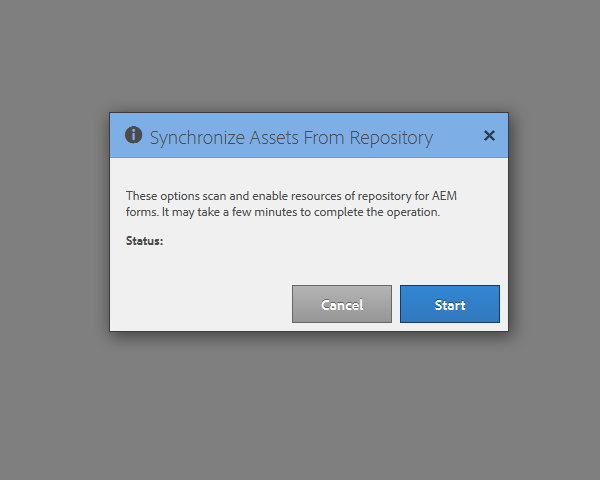

# Configurazione dell’utilità di pianificazione della sincronizzazione {#configuring-the-synchronization-scheduler}

Per impostazione predefinita, la pianificazione della sincronizzazione viene eseguita dopo ogni 3 minuti per sincronizzare tutte le risorse modificate e aggiornate nell’archivio tramite LiveCycle Workbench 11. Le applicazioni contenenti moduli e risorse sono visibili nell’interfaccia utente di AEM Forms al termine del processo di sincronizzazione.

## Modifica dell&#39;intervallo di pianificazione della sincronizzazione {#change-interval-of-the-synchronization-scheduler}

Esegui i seguenti passaggi per modificare l&#39;intervallo della pianificazione della sincronizzazione:

1. Accedi a AEM Configuration Manager. L&#39;URL di Configuration Manager è `https://[Server]:[Port]/lc/system/console/configMgr`

1. Individua e apri il bundle **FormsManagerConfiguration** .

1. Specifica un nuovo valore per l&#39;opzione **Frequenza pianificazione sincronizzazione**.

   L&#39;unità della frequenza è in minuti. Ad esempio, per configurare la pianificazione da eseguire ogni 60 minuti, specifica 60.

## Sincronizzazione delle risorse {#synchronizing-assets}

Puoi utilizzare l’opzione **Sincronizza risorse da archivio** per sincronizzare manualmente le risorse. Per sincronizzare manualmente le risorse, effettua le seguenti operazioni:

1. Accedi ad AEM Forms. L’URL predefinito è `https://[Server]:[Port]/lc/aem/forms/`.

   

   **Figura:** *Interfaccia utente di AEM Forms*

1. Fai clic sull&#39;icona  nella barra degli strumenti. Se non disponi di risorse all’ultimo percorso configurato, la finestra di dialogo viene visualizzata come mostrato di seguito. Fare clic su **Start** per avviare la sincronizzazione.

   

   **Figura: finestra di dialogo** *Sincronizzazione*

## Errore di sincronizzazione della risoluzione dei problemi {#troubleshooting-synchronization-error}

È possibile creare nuove applicazioni nella finestra di progettazione del flusso di lavoro (Workbench LiveCycle).

Se l&#39;applicazione appena creata e una cartella in /content/dam/formsanddocuments hanno lo stesso nome, esiste già a livello principale un errore &quot;*Una risorsa con lo stesso nome di questa applicazione.*&quot; è registrato.

Per risolvere il conflitto, rinomina l’applicazione e sincronizza manualmente le risorse.

**Figura:** *conflitti nella finestra di dialogo di sincronizzazione delle risorse*
