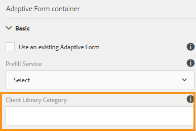

# Configurazione dell&#39;azione di invio {#configuring-the-submit-action}

## Introduzione all&#39;invio di azioni {#introduction-to-submit-actions}

Un&#39;azione di invio viene attivata quando l&#39;utente fa clic sul pulsante Invia di un modulo adattivo. È possibile configurare l&#39;azione di invio sul modulo adattivo. I moduli adattivi forniscono alcune delle azioni di invio previste. È possibile copiare ed estendere le azioni di invio predefinite per creare una propria azione di invio. Tuttavia, in base alle esigenze dell&#39;utente, è possibile scrivere e registrare una propria azione di invio per elaborare i dati nel modulo inviato.

Quando un modulo viene precompilato o inviato, i dati inviati vengono instradati attraverso AEM per il massaggio dei dati nei formati intermedi. I dati non vengono salvati in un&#39;istanza AEM, tranne nel caso in cui il modulo adattivo utilizzi  Adobe Sign, verifica, bozza o invio del portale dei moduli o AEM Flussi di lavoro

È possibile configurare un&#39;azione di invio nella sezione **[!UICONTROL Invio]** delle proprietà Contenitore modulo adattivo, nella barra laterale.

**azione Invia, figura:** *Configura azione invio*

Le azioni di invio predefinite disponibili con i moduli adattivi sono:

* Invia a endpoint REST
* Invia e-mail
* Invia PDF tramite e-mail
* Richiamo di un Forms Workflow
* Invia usando il modello dati modulo
* Azione di invio Forms Portal
* Richiama un flusso di lavoro AEM

>[!NOTE]
>
>L&#39;azione Invia PDF tramite e-mail è applicabile solo ai moduli adattivi che utilizzano il modello XFA come modello di modulo.

>[!NOTE]
>
>Assicurarsi che la [AEM_Installation_Directory]\crx-quickstart\temp\datamanager\ASM folder exists. La directory è necessaria per memorizzare temporaneamente gli allegati. Se la directory non esiste, createla.

>[!CAUTION]
>
>Se si [precompila](/help/forms/using/prepopulate-adaptive-form-fields.md) un modello di modulo, un modello di dati o un modulo adattivo basato su schema con un reclamo di dati XML o JSON a uno schema (schema XML, schema JSON, modello di modulo o modello di dati di modulo) che non contiene i tag &lt;afData>, &lt;afBoundData> e &lt;/afUnboundData>, i dati dei campi non associati (campi non associati) sono campi modulo adattivi senza la proprietà [bindref](/help/forms/using/prepopulate-adaptive-form-fields.md) del modulo adattivo.

È possibile scrivere un&#39;azione di invio personalizzata per i moduli adattivi per soddisfare le esigenze d&#39;uso. Per ulteriori informazioni, vedere [Scrittura di un&#39;azione di invio personalizzata per i moduli adattivi](/help/forms/using/custom-submit-action-form.md).

## Invia all&#39;endpoint REST {#submit-to-rest-endpoint}

L&#39;opzione di invio **[!UICONTROL Invia all&#39;endpoint REST]** passa i dati compilati nel modulo a una pagina di conferma configurata come parte della richiesta di GET HTTP. Potete aggiungere il nome dei campi da richiedere. Il formato della richiesta è:

`{fieldName}={request parameter name}`

Come mostrato nell&#39;immagine seguente, `param1` e `param2` vengono passati come parametri con valori copiati dai campi **[!UICONTROL textbox]** e **[!UICONTROL numericbox]** per l&#39;azione successiva.

Potete inoltre **[!UICONTROL Abilitare la richiesta di POST]** e fornire un URL per inviare la richiesta. Per inviare i dati al server AEM che ospita il modulo, utilizzare un percorso relativo corrispondente al percorso principale del server di AEM. Ad esempio, /content/forms/af/SampleForm.html. Per inviare dati a qualsiasi altro server, utilizzare il percorso assoluto.

Configurazione dell&#39;azione di invio dell&#39;endpoint rimanente

>[!NOTE]
Per trasmettere i campi come parametri in un URL REST, tutti i campi devono avere nomi di elementi diversi, anche se i campi sono posizionati in pannelli diversi.

### Invia i dati inviati a una risorsa o a un punto finale di riposo esterno  {#post-submitted-data-to-a-resource-or-external-rest-end-point-nbsp}

Utilizzare l&#39;azione **[!UICONTROL Invia a endpoint REST]** per inviare i dati inviati a un URL rimanente. L&#39;URL può essere di un server interno (il server su cui viene eseguito il rendering del modulo) o di un server esterno.

Per inviare i dati a un server interno, fornire il percorso della risorsa. I dati vengono inviati nel percorso della risorsa. Ad esempio, /content/restEndPoint. Per tali richieste di post, vengono utilizzate le informazioni di autenticazione della richiesta di invio.

Per inviare dati a un server esterno, immetti un URL. Il formato dell&#39;URL è https:// host:port/path_to_rest_end_point. Accertatevi di configurare il percorso per gestire la richiesta di POST in modo anonimo.

Nell&#39;esempio precedente, le informazioni immesse dall&#39;utente in `textbox` vengono acquisite utilizzando il parametro `param1`. La sintassi per il post dei dati acquisiti con `param1` è la seguente:

`String data=request.getParameter("param1");`

Analogamente, i membri utilizzati per inviare dati e allegati XML sono `dataXml` e `attachments`.

Ad esempio, è possibile utilizzare questi due parametri nello script per analizzare i dati in un punto finale rimanente. È possibile utilizzare la sintassi seguente per memorizzare e analizzare i dati:

`String data=request.getParameter("dataXml");`\
`String att=request.getParameter("attachments");`

In questo esempio, `data` memorizza i dati XML e `att` memorizza i dati degli allegati.

## Invia e-mail {#send-email}

L&#39;azione di invio **[!UICONTROL Invia e-mail]** invia un messaggio e-mail a uno o più destinatari dopo l&#39;invio corretto del modulo. L&#39;e-mail generata può contenere dati del modulo in un formato predefinito.

>[!NOTE]
Tutti i campi modulo devono avere nomi di elementi diversi, anche se si trovano in pannelli diversi), per l’inclusione dei dati del modulo in un messaggio e-mail.

## Invia PDF tramite e-mail {#send-pdf-via-email}

L&#39;azione di invio **[!UICONTROL Invia PDF tramite e-mail]** invia un messaggio e-mail contenente un PDF contenente dati del modulo a uno o più destinatari dopo l&#39;invio corretto del modulo.

**Nota:** *questa azione di invio è disponibile per i moduli adattivi basati su XFA e per i moduli di adattamento basati su XSD con modello Documento di record.*

## Richiamo di un flusso di lavoro moduli {#invoke-a-forms-workflow}

L&#39;opzione **[!UICONTROL Invia a flusso di lavoro Forms]** invia un file xml di dati ed eventuali allegati a un LiveCycle di Adobe  esistente o  AEM Forms su JEE.

Per informazioni su come configurare l&#39;azione di invio del flusso di lavoro Invia ai moduli, vedere [Invio ed elaborazione dei dati del modulo mediante i flussi di lavoro dei moduli](/help/forms/using/submit-form-data-livecycle-process.md).

## Invia usando il modello dati modulo {#submit-using-form-data-model}

L&#39;azione di invio **[!UICONTROL Invia utilizzando il modello dati del modulo]** scrive i dati del modulo adattivo inviati per l&#39;oggetto modello dati specificato in un modello dati del modulo alla relativa origine dati. Durante la configurazione dell&#39;azione di invio, è possibile scegliere un oggetto modello dati di cui si desidera riscrivere i dati inviati nell&#39;origine dati.

È inoltre possibile inviare all&#39;origine dati un allegato del modulo utilizzando un modello dati del modulo e un documento record (DoR).

Per informazioni sul modello di dati del modulo, vedere [ Integrazione dei dati AEM Forms](/help/forms/using/data-integration.md).

## Azione di invio Forms Portal {#forms-portal-submit-action}

L&#39;opzione **[!UICONTROL Forms Portal Submit Action]** rende i dati del modulo disponibili tramite un  portale AEM Forms.

Per ulteriori informazioni su Forms Portal e per l&#39;invio di azioni, vedere [Componente Bozze e invii](/help/forms/using/draft-submission-component.md).

## Richiama un flusso di lavoro AEM {#invoke-an-aem-workflow}

L&#39;azione di invio **[!UICONTROL Richiama un flusso di lavoro AEM]** consente di associare un modulo adattivo a un flusso di lavoro AEM. Quando un modulo viene inviato, il flusso di lavoro associato viene avviato automaticamente sul nodo di elaborazione. Inoltre, posiziona il file di dati, gli allegati e il documento di registrazione, se applicabile, nel percorso di payload del flusso di lavoro.

Prima di utilizzare l&#39;azione di invio **[!UICONTROL Richiama un flusso di lavoro AEM]**, [configurare le impostazioni AEM DS](/help/forms/using/configuring-the-processing-server-url-.md). Per informazioni sulla creazione di un flusso di lavoro AEM, vedere [Flussi di lavoro incentrati sui moduli in OSGi](/help/forms/using/aem-forms-workflow.md).

## Ripristino lato server nel modulo adattivo {#server-side-revalidation-in-adaptive-form}

In genere, in qualsiasi sistema di acquisizione dei dati online, gli sviluppatori inseriscono alcune convalide JavaScript sul lato client per applicare alcune regole aziendali. Tuttavia, nei browser più recenti, gli utenti finali hanno modo di bypassare tali convalide e di effettuare manualmente gli invii utilizzando varie tecniche, come ad esempio Web Browser DevTools Console. Tali tecniche sono valide anche per i moduli adattivi. Gli sviluppatori di moduli possono creare diversi logici di convalida, ma tecnicamente gli utenti finali possono ignorare tali logici di convalida e inviare al server dati non validi. Dati non validi potrebbero interrompere le regole aziendali applicate dall&#39;autore di un modulo.

La funzione di ripristino lato server consente inoltre di eseguire le convalide fornite da un autore di moduli adattivi durante la progettazione di un modulo adattivo sul server. Impedisce qualsiasi compromesso nell&#39;invio di dati e nelle violazioni delle regole aziendali rappresentate in termini di convalida dei moduli.

### Cosa convalidare sul server? {#what-to-validate-on-server-br}

Tutte le convalide dei campi (OOTB) di un modulo adattivo eseguite nuovamente sul server sono:

* Obbligatorio
* Convalida dell&#39;immagine
* Espressione di convalida

### Abilitazione della convalida lato server {#enabling-server-side-validation-br}

Utilizzare la funzione **Revoca sul server** in Contenitore modulo adattivo nella barra laterale per attivare o disattivare la convalida lato server per il modulo corrente.

**convalida lato serverFigura:** *Abilitazione della convalida lato server*

Se l&#39;utente finale bypassa tali convalide e invia i moduli, il server esegue di nuovo la convalida. Se la convalida ha esito negativo alla fine del server, la transazione di invio viene arrestata. All&#39;utente finale viene nuovamente presentato il modulo originale. I dati acquisiti e inviati vengono presentati all&#39;utente come un errore.

### Supporto delle funzioni personalizzate nelle espressioni di convalida {#supporting-custom-functions-in-validation-expressions-br}

A volte, nel caso di **complesse regole di convalida**, lo script di convalida esatto risiede in funzioni personalizzate e l&#39;autore chiama queste funzioni personalizzate dall&#39;espressione di convalida del campo. Per rendere la libreria di funzioni personalizzate nota e disponibile durante l&#39;esecuzione di convalide sul lato server, l&#39;autore del modulo può configurare il nome AEM libreria client nella scheda **[!UICONTROL Base]** delle proprietà Contenitore di moduli adattivi, come illustrato di seguito.

**espressioni di convalidaFigura:** *Supporto delle funzioni personalizzate nelle espressioni di convalida*

L&#39;autore può configurare la libreria JavaScript personalizzata per ciascun modulo adattivo. Nella libreria, mantenere solo le funzioni riutilizzabili, che dipendono dalle librerie di terze parti jquery e underscore.js.

## Gestione degli errori nell&#39;azione di invio {#error-handling-on-submit-action}

Come parte delle AEM linee guida sulla protezione e l&#39;indurimento, configurate pagine di errore personalizzate come 404.jsp e 500.jsp. Questi gestori vengono chiamati quando si invia un modulo 404 o 500 errori. I gestori vengono chiamati anche quando questi codici di errore vengono attivati sul nodo Pubblica.

Per ulteriori informazioni, vedere [Personalizzazione delle pagine mostrate dal gestore errori](/help/sites-developing/customizing-errorhandler-pages.md).
