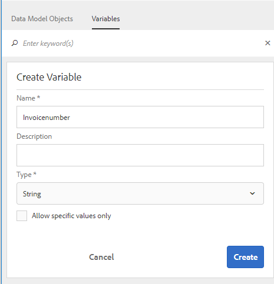
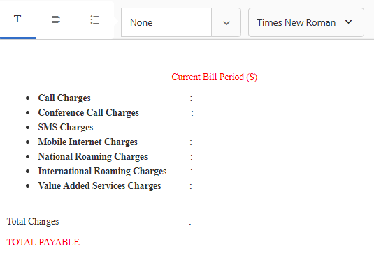

# Esercitazione: Creazione di frammenti di documento {#tutorial-create-document-fragments}

>[!CAUTION]
>
>AEM 6.4 ha raggiunto la fine del supporto esteso e questa documentazione non viene più aggiornata. Per maggiori dettagli, consulta la nostra [periodi di assistenza tecnica](https://helpx.adobe.com/it/support/programs/eol-matrix.html). Trova le versioni supportate [qui](https://experienceleague.adobe.com/docs/).

Creazione di frammenti di documento per la comunicazione interattiva

Questa esercitazione è un passaggio nel [Creare la prima comunicazione interattiva](/help/forms/using/create-your-first-interactive-communication.md) serie. Si consiglia di seguire la serie in sequenza cronologica per comprendere, eseguire e illustrare il caso d’uso completo dell’esercitazione.

I frammenti di documento sono componenti riutilizzabili di una corrispondenza utilizzati per comporre una comunicazione interattiva. I frammenti di documento sono di tipo:

* Testo : per risorsa di testo si intende un contenuto costituito da uno o più paragrafi di testo. Un paragrafo può essere statico o dinamico.
* Elenco : elenco è un gruppo di frammenti di documento, inclusi testo, elenchi, condizioni e immagini.
* Condizione : le condizioni ti consentono di definire quale contenuto viene incluso nella comunicazione interattiva in base ai dati ricevuti dal modello dati del modulo.

Questa esercitazione descrive i passaggi necessari per creare più frammenti di documento di testo in base all&#39;anatomia fornita in [Pianificare la comunicazione interattiva](/help/forms/using/planning-interactive-communications.md) sezione . Al termine di questa esercitazione, potrai:

* Creazione di frammenti di documento
* Creare variabili
* Creare e applicare regole

Di seguito è riportato l’elenco dei frammenti di documento creati in questa esercitazione:

* [Dettagli fattura](/help/forms/using/create-document-fragments.md#step-create-bill-details-text-document-fragment)
* [Dettagli cliente](/help/forms/using/create-document-fragments.md#step-create-customer-details-text-document-fragment)
* [Riepilogo fatture](/help/forms/using/create-document-fragments.md#step-create-bill-summary-text-document-fragment)
* [Sommario degli oneri](/help/forms/using/create-document-fragments.md#step-create-summary-of-charges-text-document-fragment)

Ogni frammento di documento include campi con testo statico, dati ricevuti dal modello dati del modulo e dati immessi tramite l’interfaccia utente dell’agente. Tutti questi campi sono stati rappresentati nella [Pianificare la comunicazione interattiva](/help/forms/using/planning-interactive-communications.md) sezione .

Durante la creazione di frammenti di documento in questa esercitazione, vengono create variabili per i campi che ricevono dati tramite l’interfaccia utente dell’agente.

Utilizzo **FDM_Create_First_IC**, come descritto nel [Crea modello dati modulo](create-form-data-model-tutorial.md) come modello dati modulo per creare frammenti di documento in questa esercitazione.

## Passaggio 1: Crea frammento di documento di testo Dettagli fatturazione {#step-create-bill-details-text-document-fragment}

Il frammento di documento Dettagli fatturazione include i campi seguenti:

| Campo | Sorgente dati |
|---|---|
| Numero fattura | Interfaccia utente agente |
| Periodo fatturazione | Interfaccia utente agente |
| Data fatturazione | Interfaccia utente agente |
| Il tuo piano | Modello dati modulo |

Esegui i seguenti passaggi per creare variabili per i campi con l’interfaccia utente agente come origine dati, creare testo statico e utilizzare elementi modello dati modulo nel frammento di documento:

1. Seleziona **[!UICONTROL Forms]** > **[!UICONTROL Frammenti documento]**.

1. Seleziona **Crea** > **Testo**.
1. Specifica le seguenti informazioni:

   1. Invio **bill_details_first_ic** come nome nel **Titolo** campo . Il titolo viene compilato automaticamente nel **Nome** campo .
   1. Seleziona **Modello dati modulo** dal **Modello dati** sezione .
   1. Seleziona **FDM_Create_First_IC** come modello dati del modulo e tocca **Seleziona**.
   1. Tocca **Successivo**.

1. Seleziona la **Variabili** nel riquadro a sinistra e tocca **Crea**.
1. In **Crea variabile** sezione:

   1. Invio **Numero fattura** come nome della variabile.
   1. Seleziona **Stringa** come tipo.
   1. Tocca **Crea**.

   

   Ripeti i passaggi 4 e 5 per creare le seguenti variabili:

   * Periodo di fatturazione: Tipo di stringa
   * Data fatturazione: Tipo di data

   

1. Crea il testo statico per i campi seguenti utilizzando il riquadro di destra:

   * Numero fattura
   * Periodo fatturazione
   * Data fatturazione
   * Il tuo piano

   

1. Posiziona il cursore accanto al **Numero fattura** e fai doppio clic sul campo **NumeroFattura** dalla variabile **Variabili** nel riquadro a sinistra.
1. Posiziona il cursore accanto al **Periodo fatturazione** e fai doppio clic sul campo **Periodo di fatturazione** variabile.
1. Posiziona il cursore accanto al **Data fatturazione** e fai doppio clic sul campo **Data fatturazione** variabile.
1. Seleziona la **Oggetti del modello dati** nel riquadro a sinistra.
1. Posiziona il cursore accanto al **Il tuo piano** e fai doppio clic sul campo **cliente** > **piano clienti** proprietà.

   

1. Fai clic su **Salva** per creare il frammento di documento di testo Dettagli fatturazione.

## Passaggio 2: Crea frammento di documento con i dettagli del cliente {#step-create-customer-details-text-document-fragment}

Il frammento di documento Dettagli cliente include i campi seguenti:

| Campo | Sorgente dati |
|---|---|
| Nome cliente | Modello dati modulo |
| Indirizzo | Modello dati modulo |
| Luogo di fornitura | Interfaccia utente agente |
| Codice di stato | Interfaccia utente agente |
| Numero cellulare | Modello dati modulo |
| Numero di contatto alternativo | Modello dati modulo |
| Numero di relazione | Modello dati modulo |
| Numero di connessioni | Interfaccia utente agente |

Esegui i seguenti passaggi per creare variabili per i campi con l’interfaccia utente agente come origine dati, creare testo statico e utilizzare elementi modello dati modulo nel frammento di documento:

1. Seleziona **[!UICONTROL Forms]** > **[!UICONTROL Frammenti documento]**.
1. Seleziona **Crea** > **Testo**.
1. Specifica le seguenti informazioni:

   1. Invio **customer_details_first_ic** come nome nel **Titolo** campo . Il titolo viene compilato automaticamente nel **Nome** campo .
   1. Seleziona **Modello dati modulo** dal **Modello dati** sezione .
   1. Seleziona **FDM_Create_First_IC** come modello dati del modulo e tocca **Seleziona**.
   1. Tocca **Successivo**.

1. Seleziona la **Variabili** nel riquadro a sinistra e tocca **Crea**.
1. In **Crea variabile** sezione:

   1. Invio **Placesupply** come nome della variabile.
   1. Seleziona **Stringa** come tipo.
   1. Tocca **Crea**.

   Ripeti i passaggi 4 e 5 per creare le seguenti variabili:

   * Codice di stato: Tipo di numero
   * Connessioni numeriche: Tipo di numero

1. Seleziona la **Oggetti del modello dati** , posizionare il cursore nel riquadro di destra e fare doppio clic sul pulsante **cliente** > **name** proprietà.
1. Premi Invio per spostare il cursore sulla riga successiva e fai doppio clic sul pulsante **cliente** > **indirizzo** proprietà.
1. Crea il testo statico per i campi seguenti utilizzando il riquadro di destra:

   * Numero cellulare
   * Numero di contatto alternativo
   * Luogo di fornitura
   * Numero di relazione
   * Codice di stato
   * Numero di connessioni

   

1. Posiziona il cursore accanto al **Numero cellulare** e fai doppio clic sul campo **cliente** > **mobilenum** proprietà.
1. Posiziona il cursore accanto al **Numero di contatto alternativo** e fai doppio clic sul campo **cliente** > **alternatemobilenumber** proprietà.
1. Posiziona il cursore accanto al **Numero di relazione** e fai doppio clic sul campo **cliente** > **numero di relazione** proprietà.
1. Seleziona la **Variabili** posizionare il cursore accanto alla scheda **Luogo di fornitura** e fai doppio clic sul campo **Placesupply** variabile.
1. Posiziona il cursore accanto al **Codice di stato** e fai doppio clic sul campo **Codice di stato** variabile.
1. Posiziona il cursore accanto al **Numero di connessioni** e fai doppio clic sul campo **Numberconnessioni** variabile.

   

1. Fai clic su **Salva** per creare il frammento di documento di testo Dettagli cliente.

## Passaggio 3: Crea frammento di documento di testo Sintetico distinta {#step-create-bill-summary-text-document-fragment}

Il frammento di documento Sintetico distinta include i campi seguenti:

| Campo | Sorgente dati |
|---|---|
| Saldo precedente | Interfaccia utente agente |
| Pagamenti | Interfaccia utente agente |
| Regolazioni | Interfaccia utente agente |
| Addebita il periodo di fatturazione corrente | Modello dati modulo |
| Importo dovuto | Interfaccia utente agente |
| Data di scadenza | Interfaccia utente agente |

Esegui i seguenti passaggi per creare variabili per i campi con l’interfaccia utente agente come origine dati, creare testo statico e utilizzare elementi modello dati modulo nel frammento di documento:

1. Seleziona **[!UICONTROL Forms]** > **[!UICONTROL Frammenti documento]**.
1. Seleziona **Crea** > **Testo**.
1. Specifica le seguenti informazioni:

   1. Invio **bill_summary_first_ic** come nome nel **Titolo** campo . Il titolo viene compilato automaticamente nel **Nome** campo .
   1. Seleziona **Modello dati modulo** dal **Modello dati** sezione .
   1. Seleziona **FDM_Create_First_IC** come modello dati del modulo e tocca **Seleziona**.
   1. Tocca **Successivo**.

1. Seleziona la **Variabili** nel riquadro a sinistra e tocca **Crea**.
1. In **Crea variabile** sezione:

   1. Invio **Saldo precedente** come nome della variabile.
   1. Seleziona **Numero** come tipo.
   1. Tocca **Crea**.

   Ripeti i passaggi 4 e 5 per creare le seguenti variabili:

   * Pagamenti: Tipo di numero
   * Adeguamenti: Tipo di numero
   * Alpinita: Tipo di numero
   * Data di scadenza: Tipo di data

1. Crea il testo statico per i campi seguenti utilizzando il riquadro di destra:

   * Saldo precedente
   * Pagamenti
   * Regolazioni
   * Addebita il periodo di fatturazione corrente
   * Importo dovuto
   * Data di scadenza
   * Le spese di pagamento in ritardo dopo la data di scadenza sono $ 20

   

1. Posiziona il cursore accanto al **Saldo precedente** e fai doppio clic sul campo **Saldo precedente** variabile.
1. Posiziona il cursore accanto al **Pagamenti** e fai doppio clic sul campo **Pagamenti** variabile.
1. Posiziona il cursore accanto al **Regolazioni** e fai doppio clic sul campo **Regolazioni** variabile.
1. Posiziona il cursore accanto al **Importo dovuto** e fai doppio clic sul campo **Amontabile** variabile.
1. Posiziona il cursore accanto al **Data di scadenza** e fai doppio clic sul campo **Duedato** variabile.
1. Seleziona la **Oggetti del modello dati** posizionare il cursore accanto alla scheda **Addebita il periodo di fatturazione corrente** nel riquadro di destra e fai doppio clic sul pulsante **fatture** > **oneri** proprietà.

   

1. Fai clic su **Salva** per creare il frammento di documento di testo Dettagli cliente.

## Passaggio 4: Crea un riepilogo del frammento di documento di testo di addebito {#step-create-summary-of-charges-text-document-fragment}

Il frammento di documento Riepilogo delle spese include i campi seguenti:

| Campo | Sorgente dati |
|---|---|
| Spese di chiamata | Modello dati modulo |
| Tariffe di chiamata della conferenza | Modello dati modulo |
| Tariffe SMS | Modello dati modulo |
| Tariffe Internet per dispositivi mobili | Modello dati modulo |
| Tariffe di roaming nazionali | Modello dati modulo |
| Diritti internazionali di roaming | Modello dati modulo |
| Spese per servizi a valore aggiunto | Modello dati modulo |
| Oneri totali | Modello dati modulo |
| TOTALE PAGABILE | Modello dati modulo |

Per creare testo statico e utilizzare gli elementi del modello dati modulo nel frammento di documento, eseguire i seguenti passaggi:

1. Seleziona **[!UICONTROL Forms]** > **[!UICONTROL Frammenti documento]**.
1. Seleziona **Crea** > **Testo**.
1. Specifica le seguenti informazioni:

   1. Invio **summary_charge_first_ic** come nome nel **Titolo** campo . Il titolo viene compilato automaticamente nel campo Nome .
   1. Seleziona **Modello dati modulo** dal **Modello dati** sezione .
   1. Seleziona **FDM_Create_First_IC** come modello dati del modulo e tocca **Seleziona**.
   1. Tocca **Successivo**.

1. Crea il testo statico per i campi seguenti utilizzando il riquadro di destra:

   * Spese di chiamata
   * Tariffe di chiamata della conferenza
   * Tariffe SMS
   * Tariffe Internet per dispositivi mobili
   * Tariffe di roaming nazionali
   * Diritti internazionali di roaming
   * Spese per servizi a valore aggiunto
   * Oneri totali
   * TOTALE PAGABILE

   

1. Seleziona la **Oggetti del modello dati** scheda .
1. Posiziona il cursore accanto al **Spese di chiamata** e fai doppio clic sul campo **fatture** > **chiamate** proprietà.
1. Posiziona il cursore accanto al **Tariffe di chiamata della conferenza** e fai doppio clic sul campo **fatture** > **spese accessorie** proprietà.
1. Posiziona il cursore accanto al **Tariffe SMS** e fai doppio clic sul campo **fatture** > **scharges** proprietà.
1. Posiziona il cursore accanto al **Tariffe Internet per dispositivi mobili** e fai doppio clic sul campo **fatture** > **internetcharge** proprietà.
1. Posiziona il cursore accanto al **Tariffe di roaming nazionali** e fai doppio clic sul campo **fatture** > **roamingnational** proprietà.
1. Posiziona il cursore accanto al **Diritti internazionali di roaming** e fai doppio clic sul campo **fatture** > **roamingnl** proprietà.
1. Posiziona il cursore accanto al **Spese per servizi a valore aggiunto** e fai doppio clic sul campo **fatture** > **vas** proprietà.
1. Posiziona il cursore accanto al **Oneri totali** e fai doppio clic sul campo **fatture** > **oneri** proprietà.
1. Posiziona il cursore accanto al **TOTALE PAGABILE** e fai doppio clic sul campo **fatture** > **oneri** proprietà.

   

1. Seleziona il testo nella **Spese per servizi a valore aggiunto** riga e tocco **Crea regola** per creare una condizione in base alla quale la riga viene visualizzata nella comunicazione interattiva:
1. Sulla **Crea regola** finestra a comparsa:

   1. Seleziona **Modelli di dati e variabili** e poi **fatture** > **chiamate**.
   1. Seleziona **è minore di** come operatore.
   1. Seleziona **Numero** e immetti il valore come **60**.

   In base a questa condizione, la riga Spese per servizi aggiunti valore viene visualizzata solo se il valore del campo Addebiti chiamate è inferiore a 60.

   

1. Fai clic su **Salva** per creare il frammento di documento di testo Riepilogo degli addebiti.
