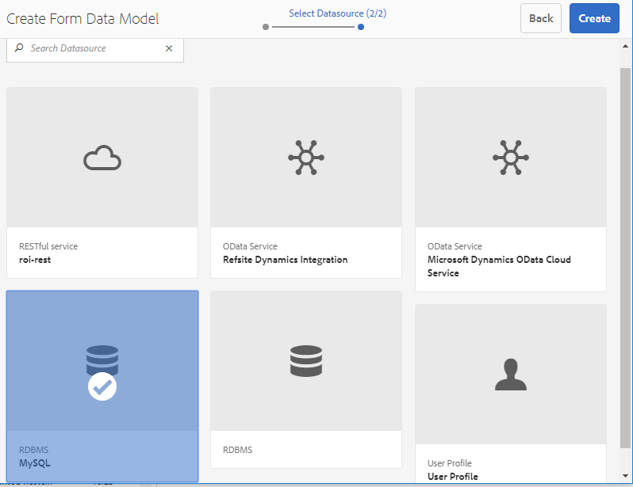
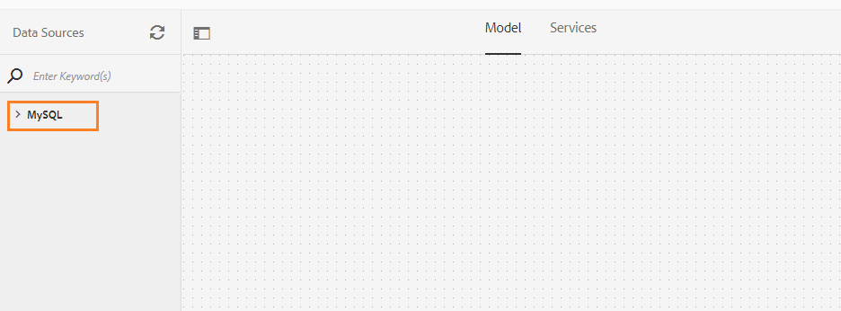
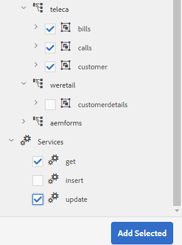
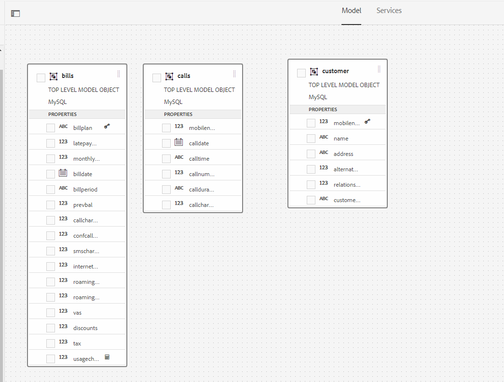
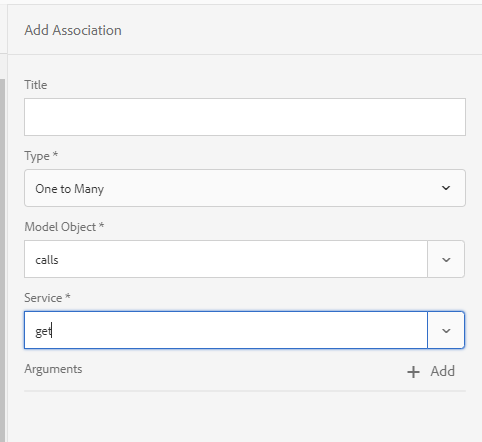
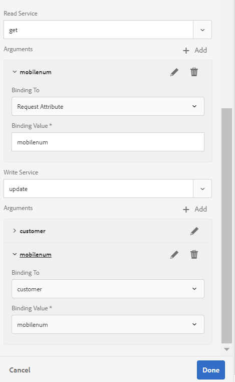
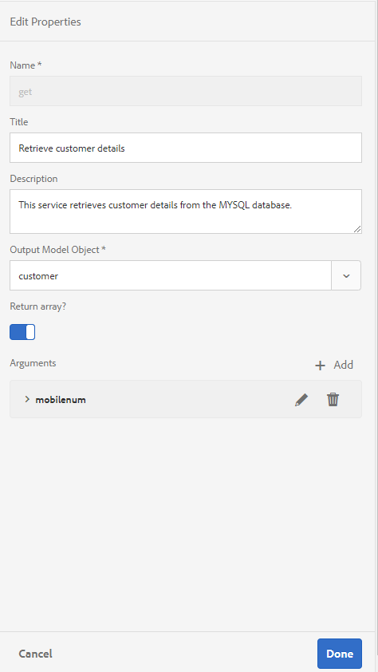
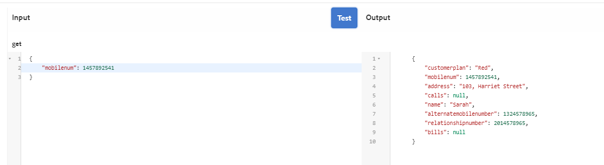
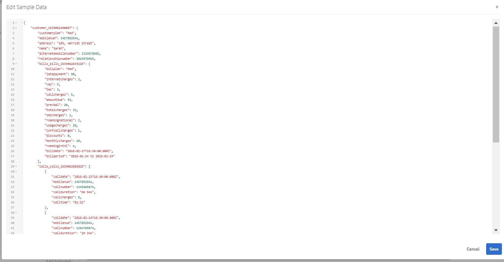

# Esercitazione: Crea modello dati modulo {#tutorial-create-form-data-model}

Creare un modello dati modulo per la comunicazione interattiva


Questa esercitazione è un passaggio della serie [Crea la tua prima comunicazione interattiva](/help/forms/using/create-your-first-interactive-communication.md). Si consiglia di seguire le serie in sequenza cronologica per comprendere, eseguire e dimostrare l&#39;uso completo dell&#39;esercitazione.

## Informazioni sull&#39;esercitazione {#about-the-tutorial}

 modulo di integrazione dei dati AEM Forms consente di creare un modello di dati del modulo da origini dati back-end diverse, come AEM profilo utente, servizi Web RESTful, servizi Web basati su SOAP, servizi OData e database relazionali. È possibile configurare oggetti e servizi del modello dati in un modello dati del modulo e associarlo a un modulo adattivo. I campi modulo adattivi sono associati alle proprietà dell&#39;oggetto modello dati. I servizi consentono di precompilare il modulo adattivo e di riscrivere i dati del modulo inviato all&#39;oggetto modello dati.

Per ulteriori informazioni sull&#39;integrazione dei dati del modulo e sul modello di dati del modulo, vedere [ AEM Forms Data Integration](data-integration.md).

Questa esercitazione illustra i passaggi necessari per preparare, creare, configurare e associare un modello dati del modulo a una comunicazione interattiva. Al termine di questa esercitazione, potrete:

* [Configurare il database](#step-set-up-the-database)
* [Configurare il database MySQL come origine dati](#step-configure-mysql-database-as-data-source)
* [Crea modello dati modulo](#step-create-form-data-model)
* [Configurare il modello dati del modulo](#step-configure-form-data-model)
* [Verifica modello dati modulo](#step-test-form-data-model-and-services)

Il modello dati del modulo è simile al seguente:


**A.** Origini dati  **B.** Schemi origine dati  **C.Servizi** disponibili  **D.** Oggetti modello dati  **E.** Servizi configurati

## Prerequisiti {#prerequisites}

Prima di iniziare, accertatevi di disporre dei seguenti elementi:

* Database MySQL con dati di esempio come indicato nella sezione [Configurare il database](#step-set-up-the-database).
* Pacchetto OSGi per il driver JDBC MySQL come spiegato in [Bundling the JDBC Database Driver](https://helpx.adobe.com/experience-manager/6-3/sites-developing/jdbc.html#bundling-the-jdbc-database-driver)

## Passaggio 1: Configurare il database {#step-set-up-the-database}

Un database è essenziale per creare una comunicazione interattiva. Questa esercitazione utilizza un database per visualizzare il modello dati del modulo e le funzionalità di persistenza delle comunicazioni interattive. Configurate un database contenente tabelle cliente, fatture e chiamate.\
L&#39;immagine seguente illustra i dati di esempio per la tabella cliente:


Utilizzare la seguente istruzione DDL per creare la tabella **customer** nel database.

```sql
CREATE TABLE `customer` (
   `mobilenum` int(11) NOT NULL,
   `name` varchar(45) NOT NULL,
   `address` varchar(45) NOT NULL,
   `alternatemobilenumber` int(11) DEFAULT NULL,
   `relationshipnumber` int(11) DEFAULT NULL,
   `customerplan` varchar(45) DEFAULT NULL,
   PRIMARY KEY (`mobilenum`),
   UNIQUE KEY `mobilenum_UNIQUE` (`mobilenum`)
 ) ENGINE=InnoDB DEFAULT CHARSET=utf8
```

Utilizzare la seguente istruzione DDL per creare la tabella **bollette** nel database.

```sql
CREATE TABLE `bills` (
   `billplan` varchar(45) NOT NULL,
   `latepayment` decimal(4,2) NOT NULL,
   `monthlycharges` decimal(4,2) NOT NULL,
   `billdate` date NOT NULL,
   `billperiod` varchar(45) NOT NULL,
   `prevbal` decimal(4,2) NOT NULL,
   `callcharges` decimal(4,2) NOT NULL,
   `confcallcharges` decimal(4,2) NOT NULL,
   `smscharges` decimal(4,2) NOT NULL,
   `internetcharges` decimal(4,2) NOT NULL,
   `roamingnational` decimal(4,2) NOT NULL,
   `roamingintnl` decimal(4,2) NOT NULL,
   `vas` decimal(4,2) NOT NULL,
   `discounts` decimal(4,2) NOT NULL,
   `tax` decimal(4,2) NOT NULL,
   PRIMARY KEY (`billplan`)
 ) ENGINE=InnoDB DEFAULT CHARSET=utf8
```

Utilizzate la seguente istruzione DDL per creare la tabella **call** nel database.

```sql
CREATE TABLE `calls` (
   `mobilenum` int(11) DEFAULT NULL,
   `calldate` date DEFAULT NULL,
   `calltime` varchar(45) DEFAULT NULL,
   `callnumber` int(11) DEFAULT NULL,
   `callduration` varchar(45) DEFAULT NULL,
   `callcharges` decimal(4,2) DEFAULT NULL,
   `calltype` varchar(45) DEFAULT NULL
 ) ENGINE=InnoDB DEFAULT CHARSET=utf8
```

La tabella **call** include i dettagli delle chiamate, come la data di chiamata, l&#39;ora di chiamata, il numero di chiamata, la durata delle chiamate e le spese di chiamata. La tabella **customer** è collegata alla tabella delle chiamate utilizzando il campo Numero mobile (mobilenum). Per ogni numero di cellulare elencato nella tabella **customer**, nella tabella **call** sono presenti più record. Ad esempio, è possibile recuperare i dettagli della chiamata per il numero di telefono cellulare **1457892541** facendo riferimento alla tabella **call**.

La tabella **bollette** include i dettagli della fattura, ad esempio data di fatturazione, periodo di fatturazione, spese mensili e spese di chiamata. La tabella **customer** è collegata alla tabella **bill** utilizzando il campo Piano fatturazione. Nella tabella **customer** è presente un piano associato a ciascun cliente. La tabella **bollette** include i dettagli dei prezzi per tutti i piani esistenti. Ad esempio, è possibile recuperare i dettagli del piano per **Sarah** dalla tabella **customer** e utilizzare tali dettagli per recuperare i dettagli dei prezzi dalla tabella **bill**.

## Passaggio 2: Configurare il database MySQL come origine dati {#step-configure-mysql-database-as-data-source}

È possibile configurare diversi tipi di origini dati per creare un modello dati del modulo. Per questa esercitazione, configurerete il database MySQL configurato e compilato con i dati di esempio. Per informazioni su altre origini dati supportate e su come configurarle, vedere [ AEM Forms Data Integration](data-integration.md).

Per configurare il database MySQL, effettuate le seguenti operazioni:

1. Installare il driver JDBC per il database MySQL come bundle OSGi:

   1. Accedete a  Istanza di AEM Forms Author come amministratore e andate AEM bundle della console Web. L&#39;URL predefinito è [http://localhost:4502/system/console/bundles](http://localhost:4502/system/console/bundles).
   1. Toccate **Installa/Aggiorna**. Viene visualizzata una finestra di dialogo **Carica/Installa pacchetti**.
   1. Toccate **Scegli file** per sfogliare e selezionare il bundle OSGi del driver MySQL JDBC. Selezionare **Start Bundle** e **Refresh Packages**, quindi toccare **Install** o **Update**. Assicurarsi che il driver JDBC di  Oracle Corporation per MySQL sia attivo. Il driver è installato.

1. Configurare il database MySQL come origine dati:

   1. Passate AEM console Web all&#39;indirizzo [http://localhost:4502/system/console/configMgr](http://localhost:4502/system/console/configMgr).
   1. Individuare la configurazione di **Apache Sling Connection DataSource** in pool. Toccate per aprire la configurazione in modalità di modifica.
   1. Nella finestra di dialogo di configurazione, specificate i seguenti dettagli:

      * **Nome origine dati:** è possibile specificare qualsiasi nome. Ad esempio, specificare **MySQL**.
      * **Nome** proprietà del servizio DataSource: Specificare il nome della proprietà del servizio contenente il nome DataSource. Viene specificato durante la registrazione dell&#39;istanza dell&#39;origine dati come servizio OSGi. Ad esempio, **datasource.name**.
      * **Classe** driver JDBC: Specificate il nome della classe Java del driver JDBC. Per il database MySQL, specificare **com.mysql.jdbc.Driver**.
      * **URI** connessione JDBC: Specificate l&#39;URL di connessione del database. Per il database MySQL in esecuzione sulla porta 3306 e sullo schema teleca, l&#39;URL è: `jdbc:mysql://[server]:3306/teleca?autoReconnect=true&useUnicode=true&characterEncoding=utf-8`
      * **Nome utente:** Nome utente del database. È necessario per consentire al driver JDBC di stabilire una connessione con il database.
      * **Password:** password del database. È necessario per consentire al driver JDBC di stabilire una connessione con il database.
      * **Prova in prestito:** attiva l’opzione  **Test su** prestito.
      * **Test su restituzione:** abilita il  **test sulla** restituzione.
      * **Query di convalida:** specificate una query SQL SELECT per convalidare le connessioni dal pool. La query deve restituire almeno una riga. Ad esempio, **selezionare &amp;ast; da customer**.
      * **Isolamento** transazione: Impostare il valore su  **READ_COMMTED**.

   Lasciare altre proprietà con valori [predefiniti](https://tomcat.apache.org/tomcat-7.0-doc/jdbc-pool.html) e toccare **Save**.

   Viene creata una configurazione simile a quella riportata di seguito.

   

## Passaggio 3: Crea modello dati modulo {#step-create-form-data-model}

 AEM Forms fornisce un&#39;interfaccia utente intuitiva per [creare una modalità dati del modulo](data-integration.md)l da origini dati configurate. È possibile utilizzare più origini dati in un modello dati del modulo. Per l&#39;utilizzo in questa esercitazione, verrà utilizzato MySQL come origine dati.

Per creare un modello dati modulo, effettuare le seguenti operazioni:

1. Nell&#39;istanza di AEM autore, passare a **Forms** > **Integrazioni dati**.
1. Toccate **Crea** > **Modello dati modulo**.
1. Nella procedura guidata Crea modello dati modulo, specificare un **nome** per il modello dati del modulo. Ad esempio, **FDM_Create_First_IC**. Toccare **Next**.
1. Nella schermata dell&#39;origine dati selezionata sono elencate tutte le origini dati configurate. Selezionare l&#39;origine dati **MySQL** e toccare **Crea**.

   

1. Fare clic su **Fine**. Viene creato il modello di dati del modulo **FDM_Create_First_IC**.

## Passaggio 4: Configurare il modello dati del modulo {#step-configure-form-data-model}

La configurazione del modello dati del modulo include:

* [aggiunta di oggetti modello dati e servizi](#add-data-model-objects-and-services)
* [creazione di proprietà figlio calcolate per l&#39;oggetto modello dati](#create-computed-child-properties-for-data-model-object)
* [aggiunta di associazioni tra gli oggetti del modello dati](#add-associations-between-data-model-objects)
* [modifica delle proprietà dell&#39;oggetto modello dati](#edit-data-model-object-properties)
* [configurazione dei servizi per gli oggetti del modello dati](#configure-services)

### Aggiunta di oggetti e servizi del modello dati {#add-data-model-objects-and-services}

1. Nell&#39;istanza di AEM autore, andate a **Forms** > **Integrazioni dati**. L&#39;URL predefinito è [http://localhost:4502/aem/forms.html/content/dam/formsanddocuments-fdm](http://localhost:4502/aem/forms.html/content/dam/formsanddocuments-fdm).
1. Il modello di dati del modulo **FDM_Create_First_IC** creato in precedenza è elencato di seguito. Selezionatela e toccate **Modifica**.

   L&#39;origine dati selezionata **MySQL** viene visualizzata nel riquadro **Origini dati**.

   

1. Espandere la struttura dell&#39;origine dati **MySQL**. Selezionare i seguenti oggetti modello dati e servizi dallo schema **teleca**:

   * **Oggetti** del modello dati:

      * bollette
      * call
      * cliente
   * **Servizi:**

      * get
      * aggiorna

   Toccare **Aggiungi selezionato** per aggiungere gli oggetti e i servizi del modello dati selezionati al modello dati del modulo.

   

   Le fatture, le chiamate e gli oggetti modello dati cliente sono visualizzati nel riquadro a destra nella scheda **Modello**. I servizi get e update sono visualizzati nella scheda **Services**.

   

### Creare proprietà figlio calcolate per l&#39;oggetto modello dati {#create-computed-child-properties-for-data-model-object}

Una proprietà calcolata è quella il cui valore viene calcolato in base a una regola o un&#39;espressione. Utilizzando una regola, è possibile impostare il valore di una proprietà calcolata su una stringa letterale, un numero, il risultato di un&#39;espressione matematica o il valore di un&#39;altra proprietà nel modello dati del modulo.

In base al caso di utilizzo, creare la proprietà calcolata secondaria **usagecharge** nell&#39;oggetto modello dati **bill** utilizzando la seguente espressione matematica:

* tariffe di utilizzo = tariffe di chiamata + tariffe di chiamata conferenza + tariffe SMS + tariffe Internet mobili + roaming nazionale + roaming internazionale + VAS (tutte queste proprietà esistono nell&#39;oggetto modello dati fatture)

   Per ulteriori informazioni sulla proprietà calcolata secondaria **usagecharge**, vedere [Pianificare la comunicazione interattiva](/help/forms/using/planning-interactive-communications.md).

Per creare proprietà figlio calcolate per l&#39;oggetto modello dati fatture, eseguire i passaggi seguenti:

1. Selezionare la casella di controllo nella parte superiore dell&#39;oggetto modello dati **bollette** per selezionarlo e toccare **Crea proprietà figlia**.
1. Nel riquadro **Crea proprietà figlio**:

   1. Immettere **usagecharge** come nome della proprietà figlio.
   1. Abilitare **Computed**.
   1. Selezionare **Mobile** come tipo e toccare **Fine** per aggiungere la proprietà figlio all&#39;oggetto modello dati **bill**.

   

1. Toccate **Modifica regola** per aprire l&#39;Editor regole.
1. Toccate **Crea**. Viene visualizzata la finestra della regola **Imposta valore**.
1. Dal menu a discesa Seleziona opzione, selezionare **Espressione matematica**.

   

1. Nell&#39;espressione matematica, selezionare rispettivamente **callcharge** e **concallcharge** come primo e secondo oggetto. Selezionare **plus** come operatore. Toccate all&#39;interno dell&#39;espressione matematica e toccate **Estendi espressione** per aggiungere **smscharges**, **internetcharge**, **roaming nazionale**, **roaming** e **vas&lt;a 11/> oggetti all&#39;espressione.**

   L&#39;immagine seguente rappresenta l&#39;espressione matematica nell&#39;editor di regole:

   

1. Toccate **Chiudi**. La regola viene creata nell&#39;Editor regole.
1. Toccate **Chiudi** per chiudere la finestra Editor regole.

### Aggiungere associazioni tra gli oggetti del modello di dati {#add-associations-between-data-model-objects}

Una volta definiti gli oggetti del modello dati, è possibile creare associazioni tra di essi. L&#39;associazione può essere uno a uno o uno a molti. Ad esempio, possono essere associati più dipendenti a un dipendente. Viene definita associazione uno-molti e rappresentata da 1:n sulla linea che collega gli oggetti del modello dati associati. Tuttavia, se un&#39;associazione restituisce un nome univoco del dipendente per un dato ID dipendente, viene definita associazione uno-a-uno.

Quando si aggiungono oggetti del modello dati associati in un&#39;origine dati a un modello dati del modulo, le relative associazioni vengono mantenute e visualizzate come collegate dalle linee freccia.

In base al caso di utilizzo, creare le seguenti associazioni tra gli oggetti del modello dati:

| Association | Oggetti del modello dati |
|---|---|
| 1:n | cliente:chiamate (più chiamate possono essere associate a un cliente in una fattura mensile) |
| 1:1 | cliente:fatture (una fattura è associata a un cliente per un mese specifico) |

Per creare associazioni tra gli oggetti del modello dati, procedere come segue:

1. Selezionare la casella di controllo nella parte superiore dell&#39;oggetto modello dati **customer** per selezionarlo e toccare **Add Association**. Viene visualizzato il riquadro delle proprietà **Aggiungi associazione**.
1. Nel riquadro **Aggiungi associazione**:

   * Specificate un titolo per l&#39;associazione. È un campo facoltativo.
   * Selezionare **Uno a Molti** dall&#39;elenco a discesa **Tipo**.
   * Selezionare **chiamate** dall&#39;elenco a discesa **Oggetto modello**.
   * Selezionare **get** dall&#39;elenco a discesa **Service**.
   * Toccate **Aggiungi** per collegare l&#39;oggetto del modello dati **customer** a **call** utilizzando una proprietà. In base al caso d&#39;uso, l&#39;oggetto modello dati delle chiamate deve essere collegato alla proprietà numero mobile nell&#39;oggetto modello dati cliente. Viene visualizzata la finestra di dialogo **Aggiungi argomento**.

   

1. Nella finestra di dialogo **Aggiungi argomento**:

   * Selezionare **mobilenum** dall&#39;elenco a discesa **Name**. La proprietà mobile number è una proprietà comune disponibile nel cliente e chiama gli oggetti del modello dati. Di conseguenza, viene utilizzato per creare un&#39;associazione tra gli oggetti del modello dati cliente e chiama quelli del modello dati.

      Per ciascun numero mobile disponibile nell&#39;oggetto modello dati cliente, nella tabella delle chiamate sono disponibili più record di chiamate.

   * Specificate un titolo e una descrizione facoltativi per l’argomento.
   * Selezionare **customer** dall&#39;elenco a discesa **Binding a**.
   * Selezionare **mobilenum** dall&#39;elenco a discesa **Valore di binding**.
   * Toccate **Aggiungi**.

   

   La proprietà mobilenum viene visualizzata nella sezione **Argomenti**.

   

1. Toccate **Fine** per creare un&#39;associazione 1:n tra gli oggetti del modello dati cliente e chiama.

   Dopo aver creato un&#39;associazione tra gli oggetti modello dati cliente e chiama, creare un&#39;associazione 1:1 tra gli oggetti modello dati cliente e distinta.

1. Selezionare la casella di controllo nella parte superiore dell&#39;oggetto modello dati **customer** per selezionarlo e toccare **Add Association**. Viene visualizzato il riquadro delle proprietà **Aggiungi associazione**.
1. Nel riquadro **Aggiungi associazione**:

   * Specificate un titolo per l&#39;associazione. È un campo facoltativo.
   * Selezionare **Uno a Uno** dall&#39;elenco a discesa **Tipo**.
   * Selezionare **bollette** dall&#39;elenco a discesa **Oggetto modello**.
   * Selezionare **get** dall&#39;elenco a discesa **Service**. La proprietà **billplan**, che è la chiave primaria per la tabella delle fatture, è già disponibile nella sezione **Argomenti**.

      Gli oggetti delle distinte e del modello dati cliente sono collegati utilizzando rispettivamente le proprietà del piano fatturabile (fatture) e del piano cliente (cliente). Creare un binding tra queste proprietà per recuperare i dettagli del piano per qualsiasi cliente disponibile nel database MySQL.

   * Selezionare **customer** dall&#39;elenco a discesa **Binding a**.
   * Selezionare **customerplan** dall&#39;elenco a discesa **Valore di binding**.
   * Toccate **Fine** per creare un binding tra le proprietà del piano pubblicitario e del piano cliente.

   

   Nell&#39;immagine seguente sono illustrate le associazioni tra gli oggetti del modello dati e le proprietà utilizzate per creare associazioni tra di essi:

   

### Modifica proprietà oggetto modello dati {#edit-data-model-object-properties}

Dopo aver creato associazioni tra il cliente e altri oggetti del modello dati, modificare le proprietà del cliente per definire la proprietà in base alla quale i dati vengono recuperati dall&#39;oggetto del modello dati. In base al caso di utilizzo, il numero mobile viene utilizzato come proprietà per recuperare i dati dall&#39;oggetto modello dati cliente.

1. Selezionare la casella di controllo nella parte superiore dell&#39;oggetto modello dati **customer** per selezionarlo e toccare **Edit Properties**. Viene visualizzato il riquadro **Modifica proprietà**.
1. Specificare **customer** come oggetto modello di livello superiore **a3/>.**
1. Selezionare **get** dall&#39;elenco a discesa **Leggi servizio**.
1. Nella sezione **Argomenti**:

   * Selezionare **Richiedi attributo** dall&#39;elenco a discesa **Binding a**.
   * Specificare **mobilenum** come valore di binding.

1. Selezionare **update** dall&#39;elenco a discesa **Write** Service.
1. Nella sezione **Argomenti**:

   * Per la proprietà **mobilenum**, selezionare **customer** dall&#39;elenco a discesa **Binding a**.
   * Selezionare **mobilenum** dall&#39;elenco a discesa **Valore di binding**.

1. Toccate **Fine** per salvare le proprietà.

   

1. Selezionare la casella di controllo nella parte superiore dell&#39;oggetto modello dati **call** per selezionarlo e toccare **Edit Properties**. Viene visualizzato il riquadro **Modifica proprietà**.
1. Disabilitare l&#39;oggetto modello di livello principale **oggetto modello di livello principale** per **chiamate**.
1. Toccate **Chiudi**.

   Ripetere i passaggi da 8 a 10 per configurare le proprietà per l&#39;oggetto modello dati **bollette**.

### Configurare i servizi {#configure-services}

1. Fare clic sulla scheda **Servizi**.
1. Selezionare il servizio **get** e toccare **Edit Properties**. Viene visualizzato il riquadro **Modifica proprietà**.
1. Nel riquadro **Modifica proprietà**:

   * Inserite un titolo e una descrizione facoltativi.
   * Selezionare **customer** dall&#39;elenco a discesa **Output Model Object**.
   * Toccate **Fine** per salvare le proprietà.

   

1. Selezionare il servizio **update** e toccare **Edit Properties**. Viene visualizzato il riquadro **Modifica proprietà**.
1. Nel riquadro **Modifica proprietà**:

   * Inserite un titolo e una descrizione facoltativi.
   * Selezionare **customer** dall&#39;elenco a discesa **Input Model Object**.
   * Toccate **Chiudi**.
   * Toccare **Salva** per salvare il modello dati del modulo.

   

## Passaggio 5: Test del modello dati e dei servizi del modulo {#step-test-form-data-model-and-services}

È possibile verificare l&#39;oggetto del modello dati e i servizi per verificare che il modello dati del modulo sia configurato correttamente.

Per eseguire il test, effettuate le seguenti operazioni:

1. Fare clic sulla scheda **Modello**, selezionare l&#39;oggetto modello dati **customer** e toccare **Oggetto modello di prova**.
1. Nella finestra **Prova modello dati modulo**, selezionare **Leggi oggetto modello** dall&#39;elenco a discesa **Seleziona modello/servizio**.
1. Nella sezione **Input**, specificare un valore per la proprietà **mobilenum** presente nel database MySQL configurato e toccare **Test**.

   I dettagli del cliente associati alla proprietà mobilenum specificata vengono recuperati e visualizzati nella sezione Output come illustrato di seguito. Chiudete la finestra di dialogo.

   

1. Fare clic sulla scheda **Servizi**.
1. Selezionare il servizio **get** e toccare **Test Service.**
1. Nella sezione **Input**, specificare un valore per la proprietà **mobilenum** presente nel database MySQL configurato e toccare **Test**.

   I dettagli del cliente associati alla proprietà mobilenum specificata vengono recuperati e visualizzati nella sezione Output come illustrato di seguito. Chiudete la finestra di dialogo.

   

### Modificare e salvare i dati di esempio {#edit-and-save-sample-data}

L&#39;editor dei modelli di dati modulo consente di generare dati di esempio per tutte le proprietà degli oggetti del modello di dati, incluse le proprietà calcolate, in un modello di dati del modulo. Si tratta di un insieme di valori casuali conformi al tipo di dati configurato per ciascuna proprietà. È inoltre possibile modificare e salvare i dati, che vengono conservati anche se si rigenerano i dati di esempio.

Per generare, modificare e salvare dati di esempio, effettuate le seguenti operazioni:

1. Nella pagina del modello dati del modulo, toccare **Modifica dati di esempio**. Genera e visualizza i dati di esempio nella finestra Modifica dati di esempio.

   

1. Nella finestra **Edit Sample Data** (Modifica dati campione), modificare i dati, come necessario, quindi toccare **Save**. Chiudi la finestra.

