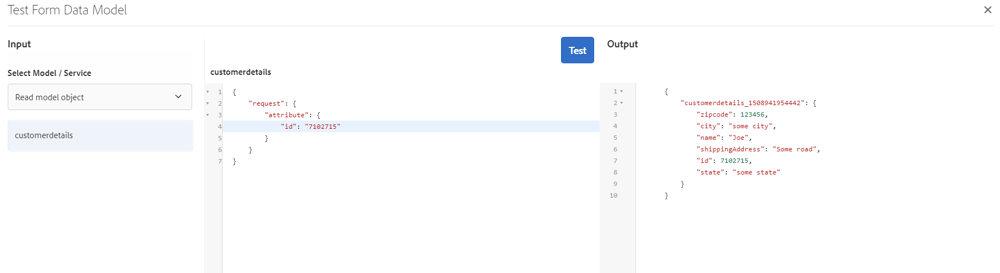

# Esercitazione: Crea modello dati modulo {#tutorial-create-form-data-model}

Questa esercitazione è un passaggio della serie [Crea il tuo primo modulo adattivo](/help/forms/using/create-your-first-adaptive-form.md) . Si consiglia di seguire la serie in sequenza cronologica per comprendere, eseguire e illustrare il caso d’uso completo dell’esercitazione.

## Informazioni sull&#39;esercitazione {#about-the-tutorial}

Il modulo di integrazione dei dati di AEM Forms consente di creare un modello di dati del modulo da diverse origini di dati di backend, come AEM profilo utente, servizi web RESTful, servizi web basati su SOAP, servizi OData e database relazionali. È possibile configurare oggetti modello dati e servizi in un modello dati modulo e associarlo a un modulo adattivo. I campi modulo adattivo sono associati alle proprietà dell’oggetto modello dati. I servizi consentono di precompilare il modulo adattivo e di riscrivere i dati del modulo inviato all’oggetto modello dati.

Per ulteriori informazioni sull&#39;integrazione dei dati del modulo e sul modello di dati del modulo, vedere [Integrazione dei dati di AEM Forms](/help/forms/using/data-integration.md).

Questa esercitazione descrive i passaggi necessari per preparare, creare, configurare e associare un modello di dati modulo a un modulo adattivo. Al termine di questa esercitazione, potrai:

* [Configurare il database MySQL come origine dati](#config-database)
* [Crea modello dati modulo utilizzando database MySQL](#create-fdm)
* [Configurare il modello dati del modulo](#config-fdm)
* [Test del modello dati del modulo](#test-fdm)

Il modello dati del modulo avrà un aspetto simile al seguente:

**A.** Origini dati configurate  **B.** Schemi origine dati  **C.** Servizi disponibili  **D.** Oggetti modello dati  **E.** Servizi configurati

## Prerequisiti {#prerequisites}

Prima di iniziare, assicurati di disporre dei seguenti elementi:

* Database MySQL con dati di esempio come indicato nella sezione Prerequisiti di [Crea il tuo primo modulo adattivo](/help/forms/using/create-your-first-adaptive-form.md)
* Bundle OSGi per il driver JDBC MySQL come spiegato in [Bundling del driver di database JDBC](/help/sites-developing/jdbc.md#bundling-the-jdbc-database-driver)
* Modulo adattivo come spiegato nella prima esercitazione [Creare un modulo adattivo](/help/forms/using/create-adaptive-form.md)

## Passaggio 1: Configura il database MySQL come origine dati {#config-database}

È possibile configurare diversi tipi di origini dati per creare un modello dati del modulo. Per questa esercitazione, configureremo il database MySQL configurato e popolato con dati di esempio. Per informazioni su altre origini dati supportate e su come configurarle, consulta [Integrazione dei dati di AEM Forms](/help/forms/using/data-integration.md).

Per configurare il database MySQL eseguire le operazioni seguenti:

1. Installa il driver JDBC per il database MySQL come bundle OSGi:

   1. Accedi all’istanza di authoring di AEM Forms come amministratore e vai AEM bundle della console web. L&#39;URL predefinito è [http://localhost:4502/system/console/bundles](http://localhost:4502/system/console/bundles).

   1. Tocca **Installa/Aggiorna**. Viene visualizzata una finestra di dialogo **Carica/Installa bundle**.

   1. Tocca **Scegli file** per sfogliare e selezionare il bundle OSGi del driver JDBC MySQL. Seleziona **Avvia bundle** e **Aggiorna pacchetti** e tocca **Installa o aggiorna**. Verificare che il driver JDBC di Oracle Corporation per MySQL sia attivo. Il driver è installato.

1. Configura il database MySQL come origine dati:

   1. Vai AEM console Web all&#39;indirizzo [http://localhost:4502/system/console/configMgr](http://localhost:4502/system/console/configMgr).
   1. Individua la configurazione **Apache Sling Connection Pooled DataSource**. Tocca per aprire la configurazione in modalità di modifica.
   1. Nella finestra di dialogo di configurazione, specifica i seguenti dettagli:

      * **Nome origine dati:** puoi specificare qualsiasi nome. Ad esempio, specificare **WeRetailMySQL**.
      * **Nome** della proprietà del servizio DataSource: Specifica il nome della proprietà del servizio contenente il nome DataSource. Viene specificato durante la registrazione dell&#39;istanza dell&#39;origine dati come servizio OSGi. Ad esempio, **datasource.name**.
      * **Classe** del driver JDBC: Specifica il nome della classe Java del driver JDBC. Per il database MySQL, specificare **com.mysql.jdbc.Driver**.
      * **URI** di connessione JDBC: Specifica l&#39;URL di connessione del database. Per il database MySQL in esecuzione sulla porta 3306 e lo schema weretail, l&#39;URL è: `jdbc:mysql://[server]:3306/weretail?autoReconnect=true&useUnicode=true&characterEncoding=utf-8`
      * **Nome utente:** nome utente del database. È necessario per abilitare il driver JDBC per stabilire una connessione con il database.
      * **Password:** password del database. È necessario per abilitare il driver JDBC per stabilire una connessione con il database.
      * **Test su prestito:** abilita l&#39;opzione  **Test su** prestito.
      * **Test on Return:** abilita il  **test on** Return.
      * **Query di convalida:** specifica una query SQL SELECT per convalidare le connessioni dal pool. La query deve restituire almeno una riga. Ad esempio, **seleziona &amp;ast; da customerdetails**.
      * **Isolamento** transazione: Imposta il valore su  **READ_COMMTED**.

      Lascia le altre proprietà con i valori predefiniti [e tocca **Salva**.](https://tomcat.apache.org/tomcat-7.0-doc/jdbc-pool.html)
   Viene creata una configurazione simile a quella riportata di seguito.

   

## Passaggio 2: Crea modello dati modulo {#create-fdm}

AEM Forms fornisce un&#39;interfaccia utente intuitiva per [creare un modello di dati del modulo](data-integration.md) dalle origini dati configurate. È possibile utilizzare più origini dati in un modello dati modulo. Per il nostro caso di utilizzo, utilizzeremo l&#39;origine dati MySQL configurata.

Per creare un modello dati modulo, procedere come segue:

1. Nell&#39;istanza AEM autore, passa a **Forms** > **Integrazione dei dati** s.
1. Tocca **Crea** > **Modello dati modulo**.
1. Nella finestra di dialogo Crea modello dati modulo, specificare un **nome** per il modello dati del modulo. Ad esempio, **customer-shipping-billing-details**. Tocca **Avanti**.
1. Nella schermata Seleziona origine dati sono elencate tutte le origini dati configurate. Seleziona l&#39;origine dati **WeRetailMySQL** e tocca **Crea**.

   

Viene creato il modello di dati del modulo **customer-shipping-billing-details** .

## Passaggio 3: Configura il modello dati del modulo {#config-fdm}

La configurazione del modello dati del modulo comporta:

* aggiunta di oggetti e servizi del modello dati
* configurazione dei servizi di lettura e scrittura per gli oggetti del modello dati

Per configurare il modello dati del modulo, effettuare le seguenti operazioni:

1. Nell&#39;istanza AEM autore, passa a **Forms > Integrazioni dati**. L&#39;URL predefinito è [http://localhost:4502/aem/forms.html/content/dam/formsanddocuments-fdm](http://localhost:4502/aem/forms.html/content/dam/formsanddocuments-fdm).
1. Il modello di dati del modulo **customer-shipping-billing-details** creato in precedenza è elencato qui. Aprirlo in modalità di modifica.

   L&#39;origine dati selezionata **WeRetailMySQL** è configurata nel modello dati del modulo.

   

1. Espandere la struttura di origine dati WeRailMySQL. Seleziona i seguenti oggetti e servizi del modello dati dallo schema **weretail** > **customerdetails** al modello dati del modulo:

   * **Oggetti** del modello dati:

      * id
      * name
      * shippingAddress
      * città
      * stadio
      * zipcode
   * **Servizi:**

      * get
      * aggiorna

   Tocca **Aggiungi selezionati** per aggiungere oggetti e servizi del modello dati selezionati al modello dati del modulo.

   

   >[!NOTE]
   >
   >I servizi get, update e insert predefiniti per le origini dati JDBC vengono forniti con il modello dati del modulo .

1. Configurare i servizi di lettura e scrittura per l&#39;oggetto modello dati.

   1. Seleziona l&#39;oggetto modello dati **customerdetails** e tocca **Modifica proprietà**.
   1. Seleziona **get** dal menu a discesa Read Service . L’argomento **id**, che è la chiave primaria nell’oggetto modello dati dettagli cliente, viene aggiunto automaticamente. Tocca  e configura l’argomento come segue.

      

   1. Allo stesso modo, seleziona **update** come servizio di scrittura. L&#39;oggetto **customerdetails** viene aggiunto automaticamente come argomento. L’argomento viene configurato come segue.

      

      Aggiungi e configura l’argomento **id** come segue.

      

   1. Tocca **Fine** per salvare le proprietà dell&#39;oggetto modello dati. Quindi, tocca **Salva** per salvare il modello dati del modulo.

      I servizi **get** e **update** vengono aggiunti come servizi predefiniti per l&#39;oggetto modello dati.

      

1. Vai alla scheda **Servizi** e configura i servizi **get** e **update** .

   1. Seleziona il servizio **get** e tocca **Modifica proprietà**. Viene visualizzata la finestra di dialogo delle proprietà.
   1. Nella finestra di dialogo Modifica proprietà , specifica quanto segue:

      * **Titolo**: Specifica il titolo del servizio. Ad esempio: Recupera indirizzo di spedizione.
      * **Descrizione**: Specifica la descrizione contenente il funzionamento dettagliato del servizio. Esempio:

         Questo servizio recupera l&#39;indirizzo di spedizione e altri dettagli del cliente dal database MySQL

      * **Oggetto** modello di output: Selezionare lo schema contenente i dati del cliente. Esempio:

         schema di dettaglio del cliente
      * **Matrice** di ritorno: Disattiva l&#39;opzione  **Return** Array (Rendi).
      * **Argomenti**: Seleziona l&#39;argomento denominato  **ID**.

      Toccate **Chiudi**. Il servizio per recuperare i dettagli del cliente dal database MySQL è configurato.

      

   1. Seleziona il servizio **update** e tocca **Modifica proprietà**. Viene visualizzata la finestra di dialogo delle proprietà.

   1. Nella finestra di dialogo Modifica proprietà , specifica quanto segue:

      * **Titolo**: Specifica il titolo del servizio. Ad esempio, Aggiorna indirizzo di spedizione.

      * **Descrizione**: Specifica la descrizione contenente il funzionamento dettagliato del servizio. Esempio:

         Questo servizio aggiorna l&#39;indirizzo di spedizione e i campi correlati nel database MySQL

      * **Oggetto** modello di input: Selezionare lo schema contenente i dati del cliente. Esempio:

         schema di dettaglio del cliente

      * **Tipo** di output: Selezionare  **BOOLEAN**.
      * **Argomenti**: Seleziona l&#39;argomento denominato  **** IDe  **i dettagli cliente**.

      Toccate **Chiudi**. Il servizio **update** per aggiornare i dettagli del cliente nel database MySQL è configurato.

      

L’oggetto del modello dati e i servizi inclusi nel modello dati del modulo sono configurati. È ora possibile verificare il modello dati del modulo.

## Passaggio 4: Modello dati del modulo di prova {#test-fdm}

È possibile verificare l’oggetto e i servizi del modello dati per verificare che il modello dati del modulo sia configurato correttamente.

Per eseguire il test, procedi come segue:

1. Vai alla scheda **Modello**, seleziona l&#39;oggetto modello dati **customerdetails** e tocca **Oggetto modello di test**.
1. Nella finestra **Test Model / Service**, selezionare **Read model object** dal menu a discesa **Select Model / Service**.
1. Nella sezione **customerdetails**, specifica un valore per l&#39;argomento **id** presente nel database MySQL configurato e tocca **Test**.

   I dettagli del cliente associati all’ID specificato vengono recuperati e visualizzati nella sezione **Output** come mostrato di seguito.

   

1. Analogamente, è possibile verificare l&#39;oggetto e i servizi del modello Write.

   Nell’esempio seguente, il servizio di aggiornamento aggiorna correttamente i dettagli dell’indirizzo per l’id 7102715 nel database.

   

   Ora, se esegui nuovamente il test del servizio modello letto per l’id 7107215, recupererà e visualizzerà i dettagli aggiornati del cliente come mostrato di seguito.

   

