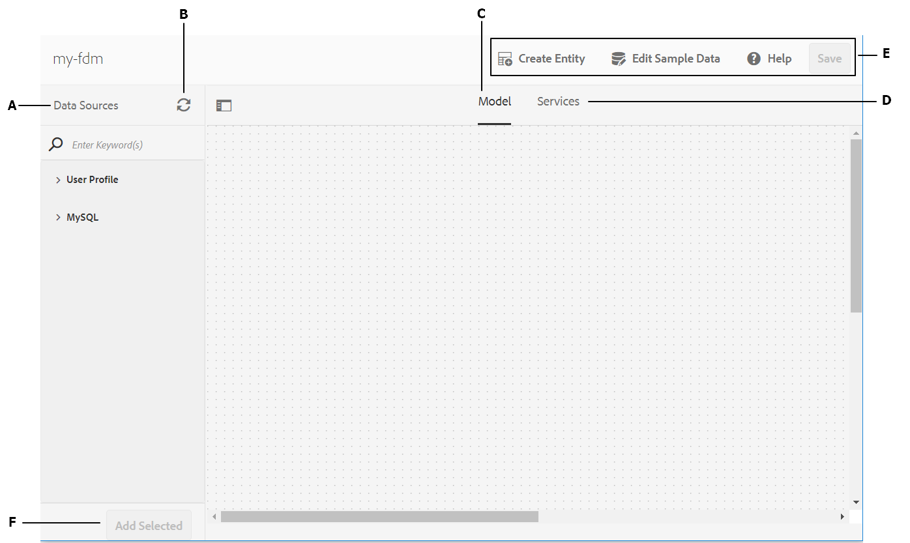

# Crea modello dati modulo {#create-form-data-model}

>[!CAUTION]
>
>AEM 6.4 ha raggiunto la fine del supporto esteso e questa documentazione non viene più aggiornata. Per maggiori dettagli, consulta la nostra [periodi di assistenza tecnica](https://helpx.adobe.com/it/support/programs/eol-matrix.html). Trova le versioni supportate [qui](https://experienceleague.adobe.com/docs/).

Scopri come creare modelli di dati modulo con o senza origini dati configurate.

L’integrazione dei dati di AEM Forms fornisce un’interfaccia utente intuitiva per creare e utilizzare modelli di dati dei moduli. Un modello di dati modulo si basa su origini dati per lo scambio di dati; tuttavia, è possibile creare un modello dati modulo con o senza un’origine dati. Esistono due approcci per creare un modello dati da a seconda che siano state configurate origini dati:

* **Utilizzo di origini dati preconfigurate**: Se hai configurato origini dati come descritto in [Configurare origini dati](/help/forms/using/configure-data-sources.md), è possibile selezionarli durante la creazione di un modello dati del modulo. Porta tutti gli oggetti, le proprietà e i servizi del modello dati dalle origini dati selezionate disponibili per l’uso nel modello dati del modulo.

* **Senza origini dati**: Se non sono state configurate origini dati per il modello dati del modulo, è comunque possibile crearlo senza origini dati. È possibile utilizzare il modello dati del modulo per creare moduli adattivi e comunicazioni interattive e testarli utilizzando dati di esempio. Quando sono disponibili origini dati, è possibile eseguire un binding del modello dati del modulo con origini dati, che si rifletteranno automaticamente nei moduli adattivi e nelle comunicazioni interattive associate.

>[!NOTE]
>
>Devi essere membro di entrambi **fdm-author** e **form-user** gruppi per poter creare e utilizzare il modello dati del modulo. Contatta il tuo amministratore AEM per diventare membro dei gruppi.

## Crea modello dati modulo {#data-sources}

Verificare di aver configurato le origini dati che si desidera utilizzare nel modello dati del modulo come descritto in [Configurare origini dati](/help/forms/using/configure-data-sources.md). Per creare un modello dati modulo basato su origini dati configurate, procedere come segue:

1. In AEM’istanza di authoring, passa a **[!UICONTROL Forms > Integrazioni dati]**.
1. Tocca **[!UICONTROL Crea > Modello dati modulo]**.
1. Nella finestra di dialogo Crea modello dati modulo :

   * Specificare un nome per il modello dati del modulo.
   * (**Facoltativo**) Specifica titolo, descrizione e tag per il modello dati del modulo.
   * (**Facoltativo e applicabile solo se le origini dati sono configurate**) Tocca l’icona di spunta accanto a **[!UICONTROL Configurazione origine dati]** e seleziona il nodo di configurazione in cui risiedono i servizi cloud per le origini dati che desideri utilizzare. Limita l’elenco delle origini dati disponibili per la selezione nella pagina successiva a quelle disponibili nel nodo di configurazione selezionato. Tuttavia, qualsiasi database JDBC e origini dati AEM profilo utente sono elencate per impostazione predefinita. Se non selezioni un nodo di configurazione, vengono elencate le origini dati da tutti i nodi di configurazione.

   Tocca **[!UICONTROL Successivo]**.

1. (**Applicabile solo se le origini dati sono configurate**) **[!UICONTROL Seleziona origine dati]** in questa schermata sono elencate le eventuali origini dati disponibili. Selezionare le origini dati da utilizzare nel modello dati del modulo.
1. Tocca **[!UICONTROL Crea]** e nella finestra di dialogo di conferma, tocca **[!UICONTROL Apri]** per aprire l’editor del modello dati del modulo.

Esaminiamo i diversi componenti dell’interfaccia utente dell’editor dei modelli di dati per moduli.

**A. Origini dati** Elenca le origini dati in un modello dati modulo. Espandere un’origine dati per visualizzare gli oggetti e i servizi del modello dati corrispondente.

**B. Aggiornare le definizioni delle origini dati** Recupera eventuali modifiche nelle definizioni delle origini dati da origini dati configurate e le aggiorna nella scheda Origini dati dell’editor del modello dati del modulo.

**C. Modello** Area contenuto in cui vengono visualizzati gli oggetti del modello dati aggiunti.

**D. Servizi** Area contenuto in cui vengono visualizzate operazioni o servizi di origine dati aggiunti.

**E. Barra degli strumenti** Strumenti per l’utilizzo del modello dati del modulo. La barra degli strumenti mostra più opzioni a seconda dell’oggetto selezionato nel modello dati del modulo.

**F. Aggiungi selezionati** Aggiunge oggetti e servizi del modello dati selezionati al modello dati del modulo.

Per ulteriori informazioni sull’editor del modello dati del modulo e su come utilizzarlo per modificare e configurare il modello dati del modulo, consulta [Utilizzare il modello dati del modulo](/help/forms/using/work-with-form-data-model.md).

## Aggiorna origini dati {#update}

Per aggiungere o aggiornare origini dati a un modello dati modulo esistente, procedere come segue.

1. Vai a **[!UICONTROL Forms > Integrazioni dati]**, selezionare il modello dati del modulo in cui si desidera aggiungere o aggiornare le origini dati e toccare **[!UICONTROL Proprietà]**.
1. Nelle proprietà del modello dati del modulo, passare alla **[!UICONTROL Aggiorna origine]** scheda .

   Nella scheda Aggiorna origine :

   * Tocca l’icona Sfoglia in **[!UICONTROL Configurazione in base al contesto]** e selezionare un nodo di configurazione in cui risiede la configurazione cloud per l&#39;origine dati che si desidera aggiungere. Se non selezioni un nodo, le configurazioni cloud risiedono solo nel `global` quando tocchi , vengono elencati i nodi **[!UICONTROL Aggiungi origini]**.
   * Per aggiungere una nuova origine dati, tocca **[!UICONTROL Aggiungi origini]** e selezionare le origini dati da aggiungere al modello dati del modulo. Tutte le origini dati configurate in `global` e viene visualizzato l&#39;eventuale nodo di configurazione selezionato.
   * Per sostituire un’origine dati esistente con un’altra origine dati dello stesso tipo, tocca **[!UICONTROL Modifica]** per l’origine dati e seleziona dall’elenco delle origini dati disponibili.
   * Per eliminare un’origine dati esistente, tocca **[!UICONTROL Elimina]** per l’origine dati. L’icona Elimina è disabilitata se un oggetto modello dati nell’origine dati viene aggiunto nel modello dati del modulo.

   

1. Tocca **[!UICONTROL Salva e chiudi]** per salvare gli aggiornamenti.

>[!NOTE]
>
>Dopo aver aggiunto nuove origini dati o aggiornato le origini dati esistenti in un modello dati del modulo, assicurarsi di aggiornare i riferimenti di binding, se appropriato, nei moduli adattivi e nelle comunicazioni interattive che utilizzano il modello dati del modulo aggiornato.

## Passaggi successivi {#next-steps}

Ora è disponibile un modello dati modulo con origini dati aggiunte. È quindi possibile modificare il modello dati del modulo per aggiungere e configurare oggetti e servizi del modello dati, aggiungere associazioni tra oggetti modello dati, modificare proprietà, aggiungere oggetti e proprietà del modello dati personalizzato, generare dati di esempio e così via.

Per ulteriori informazioni, consulta [Utilizzare il modello dati del modulo](/help/forms/using/work-with-form-data-model.md).
