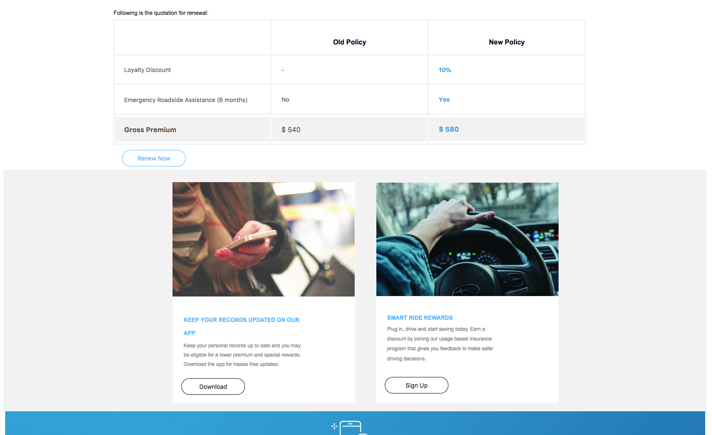

# NON PUBBLICARE Creare il primo documento adattivo {#do-not-publish-create-your-first-adaptive-document}

## Caso d’uso {#use-case}

We Finance è un&#39;organizzazione leader nel settore dei servizi finanziari che offre soluzioni finanziarie complete e personalizzate per soddisfare le esigenze di diversi profili cliente.

Una delle polizze di assicurazione auto dei clienti è in scadenza e le viene inviato un promemoria, interattivo e comprensivo di PDF, con l&#39;offerta di rinnovo. La comunicazione include anche altre informazioni, come premi fedeltà e offerte di sconti.

Il portale viene eseguito su Adobe AEM. L&#39;output del canale di benvenuto per il Web e la stampa viene creato utilizzando le funzionalità multicanale del documento adattivo.

Alla fine dell&#39;esercitazione sarà disponibile un documento adattivo simile al seguente:
[ ad-1 ](https://blogs.adobe.com/contentcorner/files/2017/07/PAF_Mobile.pdf) ad-1 [ ad-2 ](https://blogs.adobe.com/contentcorner/files/2017/07/PAF_Desktop.pdf)La prima esercitazione per documenti adattivi è suddivisa in categorie. Ogni passaggio è un articolo completo in sé.

<table> 
 <tbody>
  <tr>
   <th>Imparerà</th> 
   <th>
    <ul> 
     <li>Creazione di un modello dati di modulo e documento adattivo.</li> 
     <li>Creazione di modelli e temi per documenti adattivi.</li> 
     <li>Utilizzo dell'editor di regole per creare regole aziendali.  </li> 
     <li>Pubblicazione di un documento adattivo.   </li> 
    </ul> </th> 
  </tr>
  <tr>
   <td>Prerequisito</td> 
   <td>
    <ul> 
     <li>Imposta l’istanza di creazione AEM. </li> 
     <li>Installare il componente aggiuntivo per AEM Forms. Per informazioni dettagliate, consultate <a href="/help/forms/using/installing-configuring-aem-forms-osgi.md" target="_blank">Installare e configurare AEM Forms</a>.</li> 
     <li>Ottenete il driver del database JDBC (file JAR) dal provider del database. Gli esempi nell'esercitazione si basano sul database MySQL e utilizzano il driver di database MySQL JDBC di Oracle. </li> 
     <li>Configurate un database contenente i dati del cliente. Un database è essenziale per creare un documento adattivo. Questa esercitazione utilizza un database per visualizzare il modello dati del modulo e le funzionalità di persistenza di AEM Forms. </li> 
     <li>Crea/importa e abilita <a href="/help/forms/using/web-channel-print-channel.md">Modelli per la stampa e il canale</a>Web.</li> 
     <li>Assicurarsi di disporre dei frammenti di <a href="/help/forms/using/document-fragments.md">documento basati su FDM</a>.</li> 
    </ul> </td> 
  </tr>
 </tbody>
</table>

## Step 1: Create Form Data Model {#step-create-form-data-model}

Un modello dati del modulo consente di collegare un documento adattivo a origini dati diverse. Ad esempio, profilo utente AEM, servizi Web RESTful, servizi Web basati su SOAP, servizi OData e database relazionali. Un modello dati Modulo è uno schema di rappresentazione dati unificato di entità e servizi aziendali disponibili nelle origini dati connesse. È possibile utilizzare il modello dati del modulo con un documento adattivo per recuperare dati da origini dati connesse. Per ulteriori informazioni sul modello di dati del modulo, consultate Integrazione [dei dati in](/help/forms/using/data-integration.md)AEM Forms.

Obiettivi:

* Configurare l&#39;istanza di database (Microsoft Dynamics) come origine dati
* Creare il modello dati del modulo utilizzando Microsoft Dynamics come origine dati
* Aggiunta di oggetti del modello dati al modello dati del modulo
* Configurare i servizi di lettura e scrittura per il modello dati del modulo
* Verifica del modello dati del modulo e dei servizi configurati con i dati di prova

## Passaggio 2: Creare un documento adattivo {#step-create-an-adaptive-document}

Le comunicazioni con i clienti centralizzano e gestiscono la creazione, l&#39;assemblaggio e la consegna di corrispondenze sicure, personalizzate e interattive quali corrispondenza aziendale, lettere, documenti, dichiarazioni, note sui benefit, prospetto di gestione patrimoniale, e-mail di marketing, fatture e kit di benvenuto.

Utilizzando documenti adattivi, potete creare comunicazioni con i clienti di natura coinvolgente, reattiva, dinamica e adattiva. AEM Forms fornisce un editor WYSIWYG con trascinamento per creare documenti adattivi.

<!--`For more information about adaptive documents, see [Introduction to authoring adaptive documents](/forms/using/introduction-ad-authoring.md).`-->

Obiettivi:

* Creare output di stampa e Web di un documento adattivo basato sul modello dati del modulo.
* Campi di layout di un modulo adattivo per visualizzare informazioni al cliente
* Creare regole per recuperare e visualizzare informazioni dal modello dati del modulo al documento adattivo.

<!---->

## Passaggio 3: Applicare regole ai campi dei documenti adattivi (solo per il canale Web) {#step-apply-rules-to-adaptive-document-fields-web-channel-only}

Il documento adattivo fornisce un editor per la scrittura di regole sugli oggetti documento adattivi. Queste regole definiscono le azioni da attivare sugli oggetti del documento in base alle condizioni e alle azioni dell&#39;utente sul documento. Garantisce la precisione e velocizza l’esperienza utente nella versione Web del documento adattivo. Per ulteriori informazioni sull&#39;editor di regole e regole per documenti adattivi, vedere Editor [di](/help/forms/using/rule-editor.md)regole.

Obiettivi:

* Creazione e applicazione di regole ai campi canale Web del documento adattivo
* Utilizzare le regole per attivare i servizi del modello dati documento nel canale Web

## Passaggio 4: Stile del documento adattivo (solo per il canale Web) {#step-style-the-adaptive-document-web-channel-only}

I documenti adattivi forniscono un editor per la creazione di temi per i documenti adattivi e lo stile in linea. Un tema contiene dettagli di stile per componenti e pannelli e potete riutilizzare un tema sui canali Web di diversi documenti. Gli stili includono proprietà quali i colori di sfondo, i colori dello stato, la trasparenza, l’allineamento e le dimensioni. Quando si applica il tema al documento, lo stile specificato si riflette sui componenti corrispondenti del documento. For more information, see [Themes](/help/forms/using/themes.md).

Obiettivi:

* Creare un tema per il canale Web del documento adattivo
* Applicare un tema al canale Web del documento adattivo
* Convalida dell’aspetto del canale Web del documento adattivo su dispositivi mobili e desktop

## Passaggio 5: Pubblicare il documento adattivo {#step-publish-the-adaptive-document}

Dopo aver creato il documento adattivo, è necessario pubblicarlo per renderlo disponibile nell’istanza di pubblicazione, dove gli agenti possono utilizzare il documento adattivo per creare le istanze di comunicazione basate su di esso.

Per pubblicare il documento adattivo, gli autori del documento devono disporre delle autorizzazioni necessarie.
