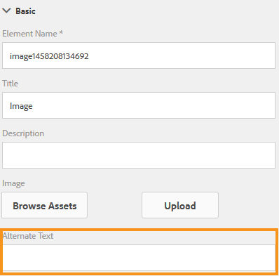

# Creazione di moduli adattivi accessibili {#creating-accessible-adaptive-forms}

## Introduzione {#introduction}

Un modulo accessibile è un modulo utilizzabile da tutti, inclusi gli utenti con esigenze particolari. Adobe Experience Manager (AEM) include una serie di funzioni e funzionalità che migliorano l’usabilità dei moduli adattivi per gli utenti con capacità diverse. La soluzione aiuta anche gli autori dei moduli nella creazione di moduli adattivi accessibili.

La creazione dell’accessibilità nei moduli adattivi non solo consente al pubblico di accedere al contenuto nel modo più ampio possibile, ma è anche un requisito per la fornitura di documenti in aree geografiche in cui viene richiesto di rispettare gli standard di accessibilità. Aiuto per gli sviluppatori di moduli per conformarsi agli standard di accessibilità.

Durante la creazione di un modulo adattivo, l’autore deve considerare i seguenti punti per creare un modulo adattivo accessibile:

* Fornire etichette appropriate per i controlli del modulo
* Fornire equivalenti testuali per le immagini
* Fornire un contrasto di colore sufficiente
* Verificare che i controlli modulo siano accessibili da tastiera

## Fornire etichette appropriate per i controlli del modulo {#provide-proper-labels-for-form-controls}

L’etichetta o il titolo di un componente identifica ciò che rappresenta il componente modulo. Ad esempio, il testo &quot;Nome&quot; indica agli utenti che devono immettere il proprio nome in un campo di testo. Per essere accessibile agli assistenti vocali, l’etichetta è associata a un componente modulo a livello di programmazione. In alternativa, il controllo modulo è configurato con ulteriori informazioni di accesso facilitato.

L’etichetta percepita dagli assistenti vocali non deve necessariamente corrispondere alla didascalia visiva. In alcuni casi, potrebbe essere utile specificare in modo più specifico lo scopo del controllo. Per ciascun oggetto campo di un modulo, le opzioni di accessibilità possono essere utilizzate per specificare gli annunci dell’assistente vocale relativi all’identificazione del campo modulo specifico.

Per utilizzare l’opzione Accessibilità, attenersi alla seguente procedura:

1. Seleziona un componente e tocca .
1. Fai clic su **Accessibilità** nella barra laterale per scegliere l&#39;opzione di accessibilità desiderata.

### Opzioni di accessibilità nei componenti modulo {#accessibility-options-in-form-components}

**Gli autori di** moduli di testo personalizzati forniscono il contenuto dell’opzione di accesso facilitato Campo di testo personalizzato. La tecnologia per l’accessibilità, ad esempio gli assistenti vocali, utilizza questo testo personalizzato. L’utilizzo dell’impostazione Titolo è l’opzione migliore nella maggior parte degli scenari. È consigliabile creare un testo personalizzato del Reader di schermate solo quando si utilizza il Titolo o se non è possibile utilizzare una breve descrizione.

**Breve** descrizionePer la maggior parte dei componenti, la breve descrizione viene visualizzata in fase di runtime quando l’utente passa il puntatore sul componente. È possibile impostare questa opzione nel campo breve descrizione, sotto l&#39;opzione di contenuto della guida.

**** TitoloUtilizza questa opzione per consentire ad AEM Forms di utilizzare l’etichetta visiva associata al campo modulo come testo per l’assistente vocale.

**** NomeÈ possibile specificare un valore nel campo Nome della scheda Binding. Il nome non può contenere spazi.

**** Se si seleziona Nessuno, l’oggetto modulo non avrà un nome nel modulo pubblicato. Nessuna impostazione consigliata per i controlli modulo.

>[!NOTE]
>
>I pulsanti di scelta e le caselle di controllo possono avere solo due opzioni di accessibilità, ovvero Testo personalizzato e Titolo.

>[!NOTE]
>
>Per i moduli adattivi basati su XFA, l’opzione di accessibilità viene ereditata dalle opzioni di accessibilità impostate in XDP. Le descrizioni comandi da XDP sono mappate su Descrizione breve e Didascalia sono mappate su Titolo. Le altre opzioni funzionano così com&#39;è.

## Fornire equivalenti testuali per le immagini {#provide-text-equivalents-for-images}

Le immagini possono aiutare a migliorare la comprensione per alcuni utenti. Tuttavia, per gli utenti che utilizzano assistenti vocali, le immagini riducono l’accessibilità del modulo. Se scegli di utilizzare le immagini, fornisci descrizioni testuali per tutte le immagini.

Assicurarsi che il testo descriva l’oggetto e il relativo scopo nel modulo. Questo testo alternativo viene letto da un assistente vocale quando incontra un’immagine. Un’immagine deve sempre avere un testo alternativo specificato.

Seleziona un componente immagine e tocca . Nella barra laterale, in Proprietà, specifica il testo alternativo per un’immagine.

## Fornire un contrasto di colore sufficiente {#provide-sufficient-color-contrast}

Il design per l’accessibilità prevede la considerazione di ulteriori linee guida per l’utilizzo del colore. Gli autori dei moduli possono utilizzare i colori per migliorare l’aspetto dei moduli, evidenziando vari componenti. Tuttavia, un uso improprio del colore può rendere un modulo difficile o impossibile da leggere da persone con capacità diverse.

Gli utenti con problemi di vista si affidano a un contrasto elevato tra il testo e lo sfondo per la lettura dei contenuti digitali. Senza un contrasto sufficiente, per alcuni utenti è difficile leggere un modulo, se non impossibile.

Si consiglia di utilizzare i colori predefiniti del font e dello sfondo, ovvero il contenuto in colore nero su sfondo bianco. Se modificate i colori predefiniti, scegliete un colore di primo piano scuro su un colore di sfondo chiaro o viceversa.

Per ulteriori informazioni sulla modifica del contrasto del colore e del tema per i moduli adattivi, consulta [Creazione di temi personalizzati per i moduli adattivi.](/help/forms/using/creating-custom-adaptive-form-themes.md)

## Verificare che i controlli modulo siano accessibili da tastiera {#ensure-that-form-controls-are-keyboard-accessible}

È possibile compilare completamente un modulo accessibile utilizzando solo la tastiera o un dispositivo di input equivalente. Gli utenti a mobilità ridotta o con problemi di vista possono non avere altra scelta se non utilizzare la tastiera e molti utenti che possono utilizzare un mouse, preferiscono l&#39;input da tastiera. Consentendo l’uso dei vari metodi di immissione, non solo è possibile creare moduli con accesso facilitato, ma è anche possibile creare moduli più adatti alle preferenze di tutti gli utenti.

In AEM Forms sono disponibili le seguenti scelte rapide da tastiera.

| Azione | Scelta rapida da tastiera |
|---|---|
| Spostare il cursore in avanti all’interno di un modulo | Scheda |
| Spostare il cursore all’indietro all’interno di un modulo | Maiusc+Tab |
| Passa al pannello successivo | Alt+Freccia destra |
| Passa al pannello precedente | Alt+Freccia sinistra |
| Reimpostare i dati compilati in un modulo | Alt+R |
| Inviare un modulo | Alt+S | configuring-watched-folder-endpoints.md |