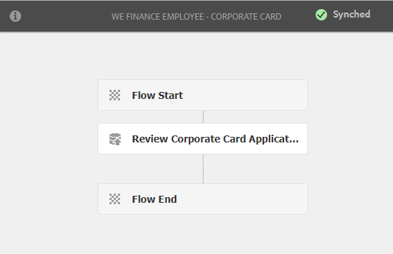

# Procedura dettagliata sul sito di riferimento self-service dei dipendenti {#employee-self-service-reference-site-walkthrough}

>[!CAUTION]
>
>AEM 6.4 ha raggiunto la fine del supporto esteso e questa documentazione non viene più aggiornata. Per maggiori dettagli, consulta la nostra [periodi di assistenza tecnica](https://helpx.adobe.com/it/support/programs/eol-matrix.html). Trova le versioni supportate [qui](https://experienceleague.adobe.com/docs/).

## Prerequisito {#prerequisite}

Imposta i siti di riferimento come descritto in [Configurare e configurare i siti di riferimento di AEM Forms](/help/forms/using/setup-reference-sites.md).

## Panoramica {#overview}

I sistemi self-service dei dipendenti, generalmente ospitati sulla Intranet aziendale, consentono ai dipendenti di accedere a una serie di informazioni e servizi che possono utilizzare dalle proprie scrivanie. Consente ai dipendenti di eseguire azioni quali l&#39;accesso alle informazioni sul proprio lavoro, la richiesta di congedo e l&#39;invio di note spese. D&#39;altra parte, aiuta le aziende a migliorare l&#39;efficienza dei processi e a ridurre i costi mantenendo al tempo stesso i dipendenti informati e coinvolti.

Il sito di riferimento self-service dei dipendenti mostra come utilizzare AEM Forms per implementare il sistema di self-service dei dipendenti nella tua organizzazione.

>[!NOTE]
>
>I casi di utilizzo self-service dei dipendenti sono disponibili sia nei siti di riferimento We.Finance che We.Gov. Gli esempi, le immagini e le descrizioni utilizzati nelle procedure dettagliate utilizzano il sito di riferimento We.Finance. Tuttavia, puoi eseguire questi casi d’uso e rivedere gli artefatti utilizzando anche We.Gov. A questo scopo, devi sostituire **finanza** con **gov** negli URL menzionati.

## Procedura dettagliata sul questionario sul conflitto di interessi {#conflict-of-interest-questionnaire-walkthrough}

Le organizzazioni di tanto in tanto chiedono ai loro dipendenti di inviare il questionario sul Conflitto di interessi identificano le attività esterne o le relazioni personali dei loro dipendenti che possono potenzialmente entrare in conflitto con la loro organizzazione.

Il reparto Conformità dell&#39;organizzazione di Sarah ha chiesto ai dipendenti di inviare il questionario sul conflitto di interessi.

### Sarah presenta il questionario sul conflitto di interessi {#sarah-submits-the-conflict-of-interest-questionnaire}

Sarah accede al portale della sua organizzazione, accede e fa clic su Dipendente per accedere al dashboard del dipendente. Trova il questionario sul conflitto di interessi sul dashboard del dipendente e fa clic su **[!UICONTROL Applica]**.

**Figura:** *Portale dell&#39;organizzazione*

**Figura:** *Dashboard dipendente*

Sarah naviga nel modulo utilizzando il pulsante Successivo e legge le sezioni Introduzione e Definizione . Risponde alle domande nella sezione Domande. Infine firma e invia il questionario.

Il portale aziendale e il questionario sono reattivi e facili da usare per i dispositivi mobili. Il seguente flusso di lavoro mostra come Sarah passa attraverso e invia il questionario sul suo dispositivo mobile.

**Come funziona**

Il portale dell&#39;organizzazione e il dashboard del dipendente sono pagine AEM Sites. Il dashboard elenca diverse opzioni self-service come il questionario sui conflitti di interessi. Il pulsante Applica è collegato a un modulo adattivo.

Il modulo adattivo utilizza regole per mostrare e nascondere le informazioni in base alla risposta fornita nella scheda Domande. Inoltre, il modulo utilizza il componente Scribble per firmare nella scheda Dichiarazione. Rivedi il modulo adattivo in `https://[authorHost]:[authorPort]/editor.html/content/forms/af/we-finance/employee/self-service/conflict-of-interest.html`.

**Vedi di persona**

Vai a `https://[publishHost]:[publishPort]/content/we-finance/global/en/self-service-forms.html` e accedi utilizzando `srose/srose` come nome utente/password per Sarah. Fai clic su **[!UICONTROL Dipendente]** per accedere al dashboard, quindi fai clic su **[!UICONTROL Applica]** sul questionario sul conflitto di interessi. Rivedi e invia il questionario.

### Gloria esamina e approva la presentazione del questionario sul conflitto di interessi {#gloria-reviews-and-approves-the-conflict-of-interest-questionnaire-submission}

Il questionario sul conflitto di interessi presentato da Sarah è assegnato a Gloria Rios per la revisione. Gloria lavora come Compliance Officer nell&#39;organizzazione. Gloria accede alla sua casella in entrata AEM e rivede le attività assegnate a lei. Approva il questionario presentato da Sarah e completa il compito.

**Figura:** *Posta in arrivo di Gloria*

**Figura:** *Apri attività*

**Come funziona**

L&#39;azione di invio nel questionario sul conflitto di interessi attiva un flusso di lavoro che crea un&#39;attività nella casella in entrata di Gloria per l&#39;approvazione. Rivedi il Forms Workflow all&#39;indirizzo `https://[authorHost]:[authorPort]/editor.html/conf/global/settings/workflow/models/we-finance/employee/self-service/we-finance-employee-conflict-of-interest.html`

**Vedi di persona**

Vai a `https://[publishHost]:[publishPort]/content/we-finance/global/en/login.html?resource=/aem/inbox.html` e accedi utilizzando `grios/password` come nome utente/password per Gloria Rios. Apri l’attività creata per il questionario sul conflitto di interessi e approvala.

## Procedura dettagliata sull&#39;applicazione di carte aziendali {#corporate-card-application-walkthrough}

Sarah viaggia molto per affari e richiede una carta di credito aziendale per pagare le sue bollette in movimento. Richiede una tessera aziendale attraverso il portale dei dipendenti della sua organizzazione.

### Sarah presenta l&#39;applicazione della carta d&#39;identità {#sarah-submits-the-corporate-card-application}

Sarah accede al portale della sua organizzazione, accede e clicca **[!UICONTROL Dipendente]** per accedere al dashboard del dipendente. Trova l&#39;applicazione di carta d&#39;identità sul dashboard del dipendente e clicca **[!UICONTROL Applica]**.

**Figura:** *Portale dell&#39;organizzazione*

**Figura:** *Dashboard dipendente*

Lei clicca **[!UICONTROL Applica]** sull&#39;applicazione della carta d&#39;identità. Viene visualizzata un&#39;applicazione a pagina singola. Riempie tutti i dettagli e i clic **[!UICONTROL Applica]** per presentare la domanda.

**Come funziona**

Il portale dell&#39;organizzazione e il dashboard del dipendente sono pagine AEM Sites. Il dashboard elenca diverse opzioni self-service, come l&#39;applicazione scheda aziendale. Il pulsante Applica nell’applicazione è collegato a un modulo adattivo.

Il modulo adattivo per l&#39;applicazione di schede aziendali è un modulo adattivo semplice, a una pagina e dinamico. Utilizza componenti modulo adattivo di base quali testo, telefono, casella numerica e passo numerico. Rivedi il modulo adattivo all’indirizzo:\
`https://[authorHost]:[authorPort]/editor.html/content/forms/af/we-finance/employee/self-service/corporate-card.html`.

**Vedi di persona**

Vai a `https://[publishHost]:[publishPort]/content/we-finance/global/en/self-service-forms.html` e accedi utilizzando `srose/srose` come nome utente/password per Sarah. Fai clic su **[!UICONTROL Dipendente]** per accedere al dashboard, quindi fai clic su **[!UICONTROL Applica]** sull&#39;applicazione di carta d&#39;identità. Compila i dettagli e invia la domanda.

### Gloria esamina e approva l&#39;applicazione della carta aziendale {#gloria-reviews-and-approves-the-corporate-card-application}

La richiesta di carta d&#39;identità presentata da Sarah è assegnata a Gloria Rios per la revisione. Gloria accede alla sua casella in entrata AEM e rivede le attività assegnate a lei. Approva la richiesta presentata da Sarah e completa il compito.

**Figura:** *Posta in arrivo di Gloria*

**Figura:** *Apri attività*

**Come funziona**

Il flusso di lavoro di invio nell&#39;applicazione Corporate Card attiva un flusso di lavoro Forms che crea un&#39;attività nella casella in entrata di Gloria per l&#39;approvazione. Rivedi il Forms Workflow all&#39;indirizzo `https://[authorHost]:[authorPort]/editor.html/conf/global/settings/workflow/models/we-finance/employee/self-service/we-finance-employee-corporate-card.html`

**Vedi di persona**

Vai a `https://[publishHost]:[publishPort]/content/we-finance/global/en/login.html?resource=/aem/inbox.html` e accedi utilizzando `grios/password` come nome utente/password per Gloria Rios. Apri l&#39;attività creata per l&#39;applicazione carta di credito aziendale e approvala.

## Procedura dettagliata per l&#39;invio della nota spese {#expense-report-submission-walkthrough}

Dato che Sarah spende durante i viaggi d&#39;affari, deve presentare una nota spese per l&#39;approvazione. L&#39;opzione self-service nella sua organizzazione le consente di inviare la nota spese online.

### Sarah invia l&#39;applicazione nota spese {#sarah-submits-the-expense-report-application}

Sarah accede al portale della sua organizzazione, accede e clicca **[!UICONTROL Dipendente]** per accedere al dashboard del dipendente. Trova l&#39;applicazione nota spese sul dashboard del dipendente e fa clic su **[!UICONTROL Applica]**.

**Figura:** *Portale dell&#39;organizzazione*

**Figura:** *Dashboard dipendente*

Lei clicca **[!UICONTROL Applica]** nell&#39;applicazione nota spese. Viene aperto un modulo di applicazione, composto da due schede: Nome rapporto e Dettagli rapporto. La **+** nella scheda Dettagli rapporto è possibile aggiungere più spese in un rapporto.

Il portale dell&#39;organizzazione e le applicazioni sono reattive e compatibili con i dispositivi mobili. Il seguente flusso di lavoro mostra come Sarah passa attraverso e invia la nota spese sul suo dispositivo mobile.

**Come funziona**

Il portale dell&#39;organizzazione e il dashboard del dipendente sono pagine AEM Sites. Nel dashboard sono elencate diverse opzioni self-service, ad esempio l&#39;applicazione nota spese. Il pulsante Applica è collegato a un modulo adattivo.

Le schede Nome rapporto e Dettagli rapporto nel modulo adattivo sono componenti pannello. Il pannello Dettagli rapporto contiene il pannello Spese. Si tratta di un pannello ripetibile che consente di aggiungere più spese nel rapporto. Rivedi il modulo adattivo e le relative configurazioni in `https://[authorHost]:[authorPort]/editor.html/content/forms/af/we-finance/employee/expense-report.html`.

**Vedi di persona**

Vai a `https://[publishHost]:[publishPort]/content/we-finance/global/en/self-service-forms.html` e accedi utilizzando `srose/srose` come nome utente/password per Sarah. Fai clic su **[!UICONTROL Dipendente]** per accedere al dashboard, quindi fai clic su **[!UICONTROL Applica]** sull&#39;applicazione nota spese. Compila i dettagli e invia la domanda.

### Gloria esamina e approva la nota spese {#gloria-reviews-and-approves-the-expense-report}

La nota spese inviata da Sarah è assegnata a Gloria Rios per la revisione. Gloria accede alla sua casella in entrata AEM e rivede le attività assegnate a lei. Approva la richiesta presentata da Sarah e completa il compito.

**Figura:** *Posta in arrivo di Gloria*

**Figura:** *Apri attività*

**Come funziona**

Il flusso di lavoro di invio nell&#39;applicazione nota spese attiva un flusso di lavoro Forms che crea un&#39;attività nella casella in entrata di Gloria per l&#39;approvazione. Rivedi il Forms Workflow all&#39;indirizzo `https://[authorHost]:[authorPort]/editor.html/conf/global/settings/workflow/models/we-finance/employee/self-service/we-finance-employee-expense-report-workflow.html`

**Vedi di persona**

Vai a `https://[publishHost]:[publishPort]/content/we-finance/global/en/login.html?resource=/aem/inbox.html` e accedi utilizzando `grios/password` come nome utente/password per Gloria Rios. Aprire l&#39;attività creata per l&#39;applicazione nota spese e approvarla.

## Procedura dettagliata per uscire dall&#39;applicazione {#leave-application-walkthrough}

Sarah sta pianificando una vacanza in famiglia il mese prossimo e vuole fare domanda per un congedo di una settimana dal lavoro.

### Sarah invia la domanda di congedo {#sarah-submits-the-leave-application}

Sarah accede al portale della sua organizzazione, accede e clicca **[!UICONTROL Dipendente]** per accedere al dashboard del dipendente. Trova lasciare l&#39;applicazione sul dashboard del dipendente e clicca **[!UICONTROL Applica]**.

**Figura:** *Portale dell&#39;organizzazione*

**Figura:** *Dashboard dipendente*

Viene aperta l’applicazione di congedo con il nome di Sarah e l’ID dipendente precompilato nel modulo. Mostra anche l&#39;equilibrio e la storia del suo congedo. Compila i dettagli del congedo e presenta la domanda di approvazione.

Il portale dell&#39;organizzazione e le applicazioni sono reattive e compatibili con i dispositivi mobili. Il seguente flusso di lavoro mostra come Sarah passa all’applicazione e la invia sul suo dispositivo mobile.

**Come funziona**

Il portale dell&#39;organizzazione e il dashboard del dipendente sono pagine AEM Sites. Nel dashboard sono elencate diverse opzioni self-service, ad esempio l&#39;applicazione leave. Il pulsante Applica è collegato a un modulo adattivo.

Il modulo adattivo per l&#39;applicazione di congedo si basa sul modello dati del modulo di congedo dipendente. Nella sezione Saldo di uscita la tabella dei saldi di uscita viene compilata utilizzando la variabile `getLeavesOf` Servizio Modello dati modulo . I campi Data di inizio e Data di fine utilizzano regole per verificare che i valori di data siano uguali o successivi alla data corrente. La durata dell&#39;uscita viene calcolata utilizzando la variabile `calcBusinessDays` funzione .

È possibile esaminare il modulo adattivo e il modello dati modulo nelle seguenti posizioni:

`https://[authorHost]:[authorPort]/editor.html/content/forms/af/we-finance/employee/self-service/leave-application.html`

`https://[authorHost]:[authorPort]/aem/fdm/editor.html/content/dam/formsanddocuments-fdm/db`

**Vedi di persona**

Vai a `https://[publishHost]:[publishPort]/content/we-finance/global/en/self-service-forms.html` e accedi utilizzando `srose/srose` come nome utente/password per Sarah. Fai clic su **[!UICONTROL Dipendente]** per accedere al dashboard, quindi fai clic su **[!UICONTROL Applica]** su Lascia applicazione. Compila i dettagli e invia la domanda.

### Gloria esamina e approva la domanda di congedo {#gloria-reviews-and-approves-the-leave-application}

La domanda di congedo presentata da Sarah è assegnata a Gloria Rios per la revisione. Gloria accede alla sua casella in entrata AEM e rivede le attività assegnate a lei. Approva la richiesta presentata da Sarah e completa il compito.

**Figura:** *Posta in arrivo di Gloria*

**Figura:** *Apri attività*

**Come funziona**

Il flusso di lavoro di invio nell’applicazione Leave attiva attiva un flusso di lavoro Forms che crea un’attività nella casella in entrata di Gloria per l’approvazione. Rivedi il Forms Workflow all&#39;indirizzo `https://[authorHost]:[authorPort]/editor.html/conf/global/settings/workflow/models/we-finance/employee/self-service/we-finance-employee-leave-application.html`

**Vedi di persona**

Vai a `https://[publishHost]:[publishPort]/content/we-finance/global/en/login.html?resource=/aem/inbox.html` e accedi utilizzando `grios/password` come nome utente/password per Gloria Rios. Apri l&#39;attività creata per uscire dall&#39;applicazione e approvarla.
