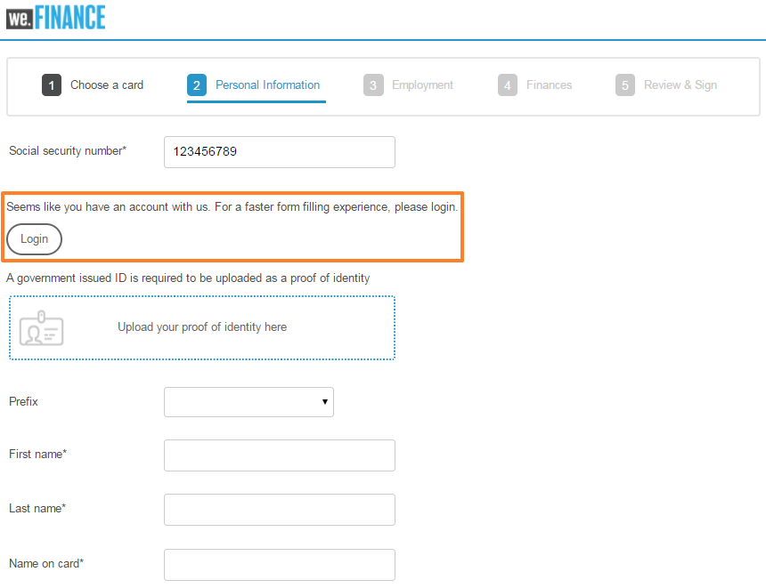
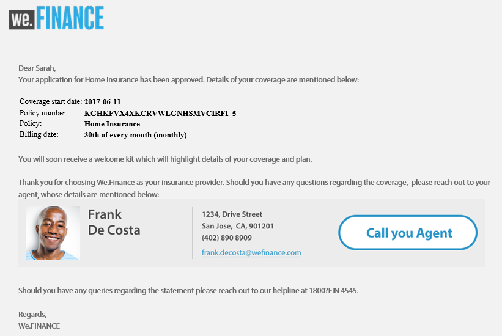

# Procedura dettagliata sul sito di riferimento We.Finance {#we-finance-reference-site-walkthrough}

## Prerequisiti {#pre-requisites}

Imposta i siti di riferimento come descritto in [Configurare e configurare i siti di riferimento di AEM Forms](/help/forms/using/setup-reference-sites.md).

## Scenari del sito di riferimento di We.Finance {#we-finance-reference-site-scenarios}

We.Finance è un&#39;organizzazione leader nel settore dei servizi finanziari che offre soluzioni finanziarie complete e personalizzate per soddisfare le esigenze dei diversi profili dei clienti. Offrono carte di credito, mutui per la casa e servizi di assicurazione per la casa.

Il loro obiettivo è quello di raggiungere i clienti esistenti e potenziali sul loro dispositivo preferito, spiegare i vantaggi dei loro servizi e aiutarli ad iscriversi ai loro servizi. Inoltre, stanno cercando di promuovere più prodotti finanziari come le carte add-on che i clienti potrebbero trovare interessanti.

Continua a leggere per informazioni dettagliate sui casi di utilizzo di We.Finance e scopri in che modo AEM Forms aiuta le organizzazioni finanziarie a raggiungere i loro obiettivi. Sono trattate le seguenti procedure dettagliate:

* [Procedura dettagliata sull&#39;applicazione con carta di credito](#credit-card-application-walkthrough)
* [Procedura dettagliata sull&#39;applicazione di mutui ipotecari](#home-mortgage-application-walkthrough)
* [Home Procedura dettagliata sull’applicazione ipotecaria con Microsoft Dynamics](#home-mortgage-application-walkthrough-with-microsoft-dynamics)
* [Procedura dettagliata sulle applicazioni di assicurazione a domicilio](#home-insurance-application-walkthrough)
* [Procedura dettagliata sulla gestione della ricchezza](#wealthmanagementwalkthrough)
* [Procedura dettagliata sull&#39;applicazione di assicurazione automatica](#autoinsuranceapplicationwalkthrough)

## Procedura dettagliata sull&#39;applicazione con carta di credito {#credit-card-application-walkthrough}

Lo scenario relativo all&#39;applicazione della carta di credito We.Finance prevede i seguenti utenti tipo:

* Sarah Rose, cliente di We.Finance
* Gloria Rios, Responsabile della carta di credito e ipoteca, We.Finance

La seguente infografica mostra il flusso di lavoro dettagliato dell&#39;applicazione con carta di credito.

Diamo un’occhiata allo scenario del sito di riferimento in dettaglio per capire in che modo AEM Forms aiuta We.Finance a raggiungere i loro obiettivi.

### Sarah riceve una newsletter da We.Finance e richiede una carta di credito {#sarah-receives-a-newsletter-from-we-finance-and-applies-for-a-credit-card}

Sarah Rose è un cliente esistente di We.Finance. Riceve una newsletter da We.Finance sulle nuove carte di credito in offerta. Trova le offerte emozionanti e decide di richiedere una carta di credito. Fa clic sul pulsante Applica ora nella newsletter, che la porta all&#39;applicazione della carta di credito sul portale We.Finance.

#### Come funziona {#how-it-works}

La newsletter inviata a Sarah è un’implementazione personalizzata che attiva un’e-mail per l’ID e-mail specificato. Il pulsante Applica ora nell’e-mail è collegato all’applicazione della carta di credito, che è un modulo adattivo su un’istanza di pubblicazione.

#### Vedi di persona {#see-it-yourself}

Apri il seguente URL nell’istanza di pubblicazione per attivare un’e-mail di newsletter. Assicurati di sostituire `[emailID]` con un account e-mail valido per ricevere la newsletter. Apri la newsletter e fai clic su **[!UICONTROL Applica]** per passare all&#39;applicazione della carta di credito.

`https://[publishServer]:[publsihPort]/content/campaigns/we-finance/start.html?app=cc&email=[emailID]&givenName=Sarah&familyName=Rose`

### Sarah trova l&#39;offerta interessante e sceglie di applicare {#sarah-finds-the-offer-interesting-and-chooses-to-apply}

Sarah decide di richiedere la carta di credito e i rubinetti **[!UICONTROL Applica]** sul messaggio e-mail. Porta Sarah all&#39;applicazione della carta di credito sul portale We.Finance. Il modulo di applicazione è organizzato in sezioni utilizzando un layout a schede.

Sarah seleziona una carta di credito dalle opzioni disponibili e clicca **[!UICONTROL Continua]**.

Sulla pagina Informazioni personali, poiché Sarah fornisce il suo numero di previdenza sociale, riceve un prompt per accedere con le sue credenziali.

Sarah è un cliente esistente di We.Finance. Effettua l&#39;accesso con le credenziali del suo account We.Finance e i suoi dati personali vengono compilati automaticamente nel modulo. Sarah continua a compilare il modulo di candidatura ed è a questo punto che compare un promemoria per una riunione a cui deve partecipare. Lei clicca **[!UICONTROL Salva il mio progresso]** nel modulo di domanda. Salva tutte le informazioni che Sarah ha compilato finora e viene visualizzata una finestra di dialogo per confermare se desidera ricevere un&#39;e-mail con un collegamento alla sua bozza di applicazione da completare in un secondo momento.

Sarah clicca **[!UICONTROL Invia posta]**. Riceve un&#39;e-mail con un link per riprendere la sua domanda di carta di credito.

<!--Theses sections used to be an accordion until converted to straight Markdown. When accordions are enabled, revert-->

### Sarah accede all&#39;applicazione della carta di credito dal suo dispositivo mobile {#a-sarah-access}

Se Sarah accede all&#39;applicazione della carta di credito dal suo dispositivo mobile, l&#39;applicazione reattiva si apre in una visualizzazione ottimizzata per i dispositivi mobili. In questa visualizzazione, il modulo dell’applicazione viene riprodotto come una sezione alla volta. Permette a Sarah di visualizzare e fornire le informazioni in modo progressivo mentre naviga nell&#39;applicazione.

### Come funziona {#a-how-it-works}

La **[!UICONTROL Applica]** pulsante indirizza Sarah all&#39;applicazione della carta di credito. L’applicazione è un modulo adattivo, che puoi esaminare nelle istanze di authoring in `https://[host]:[Port]/editor.html/content/forms/af/we-finance/cc-app.html`.

Alcune delle funzioni chiave che è possibile esaminare nel modulo adattivo sono:

* Si basa su uno schema XSD.
* Viene generato utilizzando il tema A di finanza We per lo stile e il modello We.Finance per il layout. Inoltre, utilizza Layout senza titoli del pannello nel layout dell’intestazione del modulo per la navigazione mobile. Quando viene aperto da un dispositivo mobile, viene visualizzato un layout progressivo per dispositivi mobili. Puoi rivedere il modello in `https://[host]:[Port]/libs/wcm/core/content/sites/templates.html/conf/we-finance` e il tema `https://[host]:[Port]/editor.html/content/dam/formsanddocuments-themes/we-finance/we-finance-theme-a/jcr:content`.
* Include regole del modulo adattivo per richiamare i servizi Form Data Model per precompilare i dettagli utente dell’utente connesso. Inoltre richiama i servizi per precompilare le informazioni in base al numero di previdenza sociale o all’indirizzo e-mail fornito nel modulo. È possibile esaminare i modelli di dati dei moduli e i relativi servizi in `https://[host]:[Port]/aem/forms.html/content/dam/formsanddocuments-fdm`.
* Utilizza vari componenti per moduli adattivi per acquisire gli input e adattarli alle risposte degli utenti. Utilizza anche componenti come E-mail che supportano i tipi di input di HTML5.
* Utilizza il componente Passaggio firma per visualizzare il modulo completato e consente la firma elettronica sul modulo.
* Il pulsante Save my progress genera un ID univoco per l’utente e salva l’applicazione parzialmente compilata come bozza in un nodo AEM archivio. Inoltre, visualizza una finestra di dialogo che richiede l’autorizzazione per inviare un’e-mail con un collegamento al nodo contenente la bozza dell’applicazione. Il pulsante Invia messaggio nella finestra di dialogo di conferma attiva un’e-mail con un collegamento al nodo contenente la bozza.
* Utilizza l’azione di invio Richiama AEM flusso di lavoro per attivare il flusso di lavoro di approvazione della carta di credito. È possibile esaminare il flusso di lavoro utilizzato in questo modulo in `https://[host]:[Port]/editor.html/conf/global/settings/workflow/models/we-finance-credit-card-workflow.html`

Per comprendere lo schema, i componenti, le regole, i modelli di dati dei moduli, il flusso di lavoro dei moduli e l’azione di invio utilizzata per creare il modulo, è consigliabile rivedere il modulo.

Per ulteriori informazioni sulle funzioni utilizzate nel modulo adattivo per l&#39;applicazione con carta di credito, consulta anche la seguente documentazione:

* [Introduzione alla creazione di moduli adattivi](/help/forms/using/introduction-forms-authoring.md)
* [Creazione di moduli adattivi tramite schema XML](/help/forms/using/adaptive-form-xml-schema-form-model.md)
* [Editor regola](/help/forms/using/rule-editor.md)
* [Temi](/help/forms/using/themes.md)
* [Integrazione dei dati](/help/forms/using/data-integration.md)
* [Utilizzo di Acrobat Sign nei moduli adattivi](/help/forms/using/working-with-adobe-sign.md)
* [Flusso di lavoro incentrato su Forms su OSGi](/help/forms/using/aem-forms-workflow.md)

### Vedi di persona {#a-see-it-yourself}

Quando hai effettuato l&#39;accesso come Sarah Rose, fai clic sul pulsante **[!UICONTROL Applica]** sull&#39;applicazione della carta di credito. Compila alcuni dettagli, esplora vari componenti di moduli adattivi e fai clic su **[!UICONTROL Salva il mio progresso]** per ricevere un’e-mail con un **[!UICONTROL Riprendi]** pulsante che collega alla bozza dell&#39;applicazione. Assicurati di specificare l’ID e-mail nel modulo dell’applicazione per ricevere l’e-mail.

Rivedi il tema We.Finance disponibile all&#39;indirizzo:

`https://<host>:<AuthorPort>/editor.html/content/dam/formsanddocuments-themes/we-Finance/we-Finance-Theme-A/jcr:content`

È possibile esaminare il modello We.Finance in:

`https://<host>:<AuthorPort>/editor.html/conf/we-finance/settings/wcm/templates/we-finance-template/structure.html`

### Sarah riprende e invia la domanda {#sarah-resumes-and-submits-the-application}

Sarah ritorna più tardi e trova un&#39;e-mail da We.Finance. Fa clic sul pulsante **[!UICONTROL Riprendi]** pulsante nell&#39;email che la porta alla sua bozza della domanda di carta di credito. Le informazioni che ha compilato prima vengono prepopolate. Compila il modulo di domanda rimanente, firma l&#39;applicazione e lo invia.

In alternativa, può accedere alla sua bozza di applicazione in **[!UICONTROL My Forms]** nella home page di We.Finance.

#### Come funziona {#how-it-works-1}

Il pulsante Riprendi nell&#39;e-mail reindirizzerà Sarah al nodo contenente la sua bozza di applicazione.

#### Vedi di persona {#see-it-yourself-1}

È necessario aver ricevuto un&#39;e-mail con un collegamento alla bozza dell&#39;applicazione sull&#39;ID e-mail specificato durante la compilazione del modulo dell&#39;applicazione. Procedere, compilare le sezioni rimanenti dell&#39;applicazione e inviarle.

### We.Finance riceve e approva l&#39;applicazione {#approving-the-application}

We.Finance riceve la richiesta di carta di credito inviata da Sarah. Un compito è assegnato a Gloria Rios. Rivede l&#39;attività nella sua casella in entrata AEM e la approva.

#### Come funziona {#how-it-works-2}

Quando Sarah compila e invia l&#39;applicazione della carta di credito, viene attivato un Forms Workflow e viene creato un task nella casella in entrata AEM di Gloria.

AEM Forms su OSGi fornisce flussi di lavoro incentrati sui moduli che consentono di creare flussi di lavoro adattivi basati su moduli. Questi flussi di lavoro possono essere utilizzati per la revisione e le approvazioni, per i flussi dei processi aziendali, per avviare document services, per l’integrazione con il flusso di lavoro della firma Acrobat Sign e così via. Per ulteriori informazioni, consulta [Flusso di lavoro incentrato su Forms su OSGi](/help/forms/using/aem-forms-workflow.md).

L&#39;immagine seguente rappresenta il flusso di lavoro AEM che elabora l&#39;applicazione con carta di credito e genera un output PDF dell&#39;applicazione.

#### Vedi di persona {#see-it-yourself-2}

È possibile accedere AEM casella in entrata per il sito we.finance all&#39;indirizzo https://&lt;*hostname*>:&lt;*PublishPort*>/content/we-finance/global/en.html. Sulla pagina, tocca **[!UICONTROL Accesso]**, seleziona **[!UICONTROL Accedi come rappresentante]** accedere alla casella in entrata AEM utilizzando `grios/password` come nome utente/password per Gloria Rios e approva l&#39;applicazione della carta di credito. Per informazioni sull’utilizzo della casella in entrata AEM per le attività del flusso di lavoro incentrate sui moduli, vedere [Gestione di applicazioni e attività Forms nella casella in entrata AEM](/help/forms/using/manage-applications-inbox.md).

Quando approvi l&#39;applicazione, Sarah riceve un&#39;e-mail con il kit di benvenuto.

### Sarah riceve il kit di benvenuto e richiede una scheda aggiuntiva {#sarah-receives-the-welcome-kit-and-applies-for-an-add-on-card}

Quando l&#39;applicazione della carta di credito di Sarah viene approvata, riceve un&#39;e-mail con un collegamento al kit di benvenuto. Apre il kit di benvenuto, che include i dettagli del suo conto con carta di credito. Il kit di benvenuto presenta anche offerte promozionali personalizzate per Sarah. Mentre scorre verso il basso, il kit di benvenuto contiene un modulo incorporato da richiedere per una scheda aggiuntiva. Sarah ha riempito rapidamente i dettagli richiesti dall&#39;interno del kit di benvenuto e si applica per la scheda aggiuntiva. Viene visualizzata una finestra di dialogo di conferma per l’applicazione della scheda aggiuntiva.

Il kit di benvenuto è personalizzato per Sarah e mostra informazioni rilevanti per lei. Le offre un&#39;opzione per scaricare una versione PDF del kit di benvenuto.

Il kit di benvenuto include un altro modulo di richiesta che Sarah può compilare e inviare per richiedere una scheda aggiuntiva dall&#39;interno del kit di benvenuto senza visitare il portale We.Finance.

#### Come funziona {#how-it-works-3}

Il kit di benvenuto è una comunicazione interattiva inclusa nella `cq-we-finance-content-pkg.zip` pacchetto. Le schede interattive nella versione desktop per mostrare i vantaggi della carta di credito nel kit di benvenuto sono un layout personalizzato creato utilizzando il layout della scheda predefinito di un frammento di documento.

L&#39;applicazione per schede aggiuntive è un modulo adattivo incorporato nel kit di benvenuto per la comunicazione interattiva.

#### Vedi di persona {#see-it-yourself-3}

Fai clic sul pulsante **[!UICONTROL Riprendi]** nell’e-mail ricevuta nel passaggio precedente. Apre la bozza di applicazione. Compila tutti i dettagli e invia la domanda. Riceverai quindi un kit di benvenuto. Rivedi il kit di benvenuto.

Puoi anche visualizzare il kit di benvenuto al seguente URL:

https://&lt;*host*>:&lt;*porta*>/content/aemforms-refsite/doclink.html?document=/content/forms/af/we-finance/credit-card/creditcardwelcomekit&amp;customerId=197&amp;channel=web

Puoi accedervi nelle istanze di authoring e pubblicazione.

### Sarah riceve il rendiconto della carta di credito {#sarah-receives-a-credit-card-statement}

Mentre Sarah inizia a utilizzare la carta di credito, riceve un&#39;altra e-mail da We.Finance che include il suo estratto conto sulla carta di credito. Le immagini seguenti mostrano l&#39;e-mail con un collegamento all&#39;estratto conto della carta di credito su dispositivi mobili.

Sarah fa clic su Visualizza rendiconto nell&#39;e-mail per visualizzare il rendiconto della carta di credito. L&#39;istruzione è una comunicazione interattiva. Sono disponibili versioni Web e Print (PDF). L’istruzione si integra con Forms Data Model per recuperare dal database i dati specifici del cliente. La dichiarazione interattiva costituisce vari elementi:

* Riepilogo delle istruzioni
* Rapporto spese dettagliato
* Analisi delle spese grafiche
* Opzione per effettuare un pagamento per l&#39;importo dovuto dall&#39;interno del rendiconto
* Scarica la ricevuta di pagamento

Sarah non deve andare al portale o cercare tramite le e-mail la versione PDF del rendiconto della carta di credito per l’archiviazione offline. Fai clic sull’istruzione Download per scaricare una versione PDF dell’istruzione.

L’istruzione dettagliata viene illustrata in una tabella reattiva. L&#39;istruzione fornisce inoltre la possibilità di pagare una parte o l&#39;intero importo dovuto dall&#39;interno dell&#39;istruzione.

Sarah pianifica il pagamento dall&#39;interno del rendiconto. Sarah può anche utilizzare l&#39;opzione Flexi Pay per dividere il pagamento in parti uguali.

#### Come funziona {#how-it-works-4}

Il rendiconto della carta di credito è una comunicazione interattiva. La tabella delle spese dettagliate nel rendiconto è una tabella reattiva. L&#39;immagine per l&#39;analisi delle spese è un componente grafico, legge la tabella delle spese e genera il grafico a torta.

#### Vedi di persona {#see-it-yourself-4}

È possibile esaminare il rendiconto della carta di credito interattiva al seguente URL:

https://&lt;*hostname*>:&lt;*porta*>/content/aemforms-refsite/doclink.html?document=/content/forms/af/we-finance/credit-card/credit-card-statement&amp;customerId=197&amp;channel=web

Puoi accedervi nelle istanze di authoring e pubblicazione.

Il rendiconto della carta di credito visualizza le offerte promozionali verso la fine del rendiconto. Puoi integrare Adobe Target con AEM Forms Interactive Communication per distribuire offerte mirate promozionali basate su segmenti di clienti specifici. Per configurare la comunicazione interattiva per l’utilizzo di Adobe Target per offerte personalizzate e mirate, consulta [creare esperienze mirate](/help/forms/using/experience-targeting-forms.md).

### We.Finance analizza le prestazioni dell&#39;applicazione della carta di credito {#we-finance-analyzes-the-performance-of-the-credit-card-application}

We.Finance, di tanto in tanto, esamina le prestazioni della loro applicazione con carta di credito per verificare eventuali problemi che i clienti potrebbero affrontare. Essi utilizzano questa analisi per prendere decisioni informate sui cambiamenti richiesti nell&#39;applicazione della carta di credito per migliorare l&#39;esperienza utente, ridurre il tasso di abbandono dei moduli e quindi migliorare la conversione. Sfruttano l’integrazione di AEM Forms con Adobe Analytics per la loro analisi. L&#39;immagine seguente mostra il loro dashboard di analisi.

Per ulteriori informazioni su come interpretare il dashboard di analytics, vedi [Visualizzazione e comprensione dei rapporti di AEM Forms Analytics](/help/forms/using/view-understand-aem-forms-analytics-reports.md).

#### Come funziona {#how-it-works-5}

Le metriche delle prestazioni per il modulo di richiesta della carta di credito vengono tracciate utilizzando Adobe Analytics. Per ulteriori informazioni sulla configurazione di Adobe Analytics e sulla visualizzazione dei rapporti, vedi [Configurazione di analytics per moduli e documenti](/help/forms/using/configure-analytics-forms-documents.md).

#### Vedi di persona {#see-it-yourself-br}

Per visualizzare ed esplorare il rapporto di analisi, forniamo i dati iniziali per l&#39;applicazione con carta di credito nel sito di riferimento. Prima di utilizzare i dati di seed, consulta [Configurare Analytics](/help/forms/using/setup-reference-sites.md#configureanalytics). Esegui i seguenti passaggi nell’istanza di authoring per visualizzare il rapporto con i dati di seed:

1. Vai a **[!UICONTROL Forms e documenti]** Interfaccia utente all’indirizzo https://&lt;*hostname*>:&lt;*AuthorPort*>/aem/forms.html/content/dam/formsanddocuments .

1. Fai clic per aprire **[!UICONTROL We.Finance]** Cartella.
1. Seleziona **[!UICONTROL Domanda di carta di credito]** modulo adattivo, quindi nella barra degli strumenti fare clic su **[!UICONTROL Abilitare Analytics]**.

1. Seleziona nuovamente il modulo adattivo e fai clic su **[!UICONTROL Rapporto di Analytics]** nella barra degli strumenti per generare il rapporto. Viene visualizzato inizialmente un rapporto vuoto.

Per generare un rapporto di analisi con dati di seed:

1. Nel browser degli indirizzi di CRXDE lite, digita: `/apps/we-finance/demo-artifacts/analyticsTestData/Credit card Analytics Test Data`
1. I dati del test vengono selezionati nella struttura della directory laterale sinistra.
1. Fai doppio clic sul file selezionato per aprirne il contenuto nel pannello laterale destro.
1. Copia tutto il contenuto nel file di dati di seed.
1. In CRXDE, passa a: `/content/dam/formsanddocuments/we-finance/cc-app/jcr:content/analyticsdatanode/lastsevendays`
1. In **[!UICONTROL analyticsdata]** campo sotto **[!UICONTROL Proprietà]**, incolla il contenuto copiato del file di dati di seed.

1. Seleziona **Domanda di carta di credito** modulo adattivo e fai clic su **[!UICONTROL Rapporto di Analytics]** nella barra degli strumenti per generare il rapporto con i dati seed.

**Test A/B dell&#39;applicazione della carta di credito**

Oltre ad analizzare le prestazioni dell’applicazione con carta di credito e a migliorarla costantemente, We.Finance sfrutta l’integrazione di AEM Forms con Target per creare test A/B. Permette loro di fornire diverse esperienze del modulo di richiesta della carta di credito e di identificare l&#39;esperienza che causa un tasso di conversione migliore in termini di completamento e invio del modulo.

Per configurare Target nel server AEM Forms, vedi [Configurazione e integrazione di Target in AEM Forms](/help/forms/using/ab-testing-adaptive-forms.md#set%20up%20and%20integrate%20target%20in%20aem%20forms).

Esegui i seguenti passaggi per verificare la creazione di un test A/B per il modulo di richiesta della carta di credito We.Finance:

1. Vai a **[!UICONTROL Forms e documenti]** all’indirizzo https://&lt;*hostname*>:&lt;*AuthorPort*>/aem/forms.html/content/dam/formsanddocuments .

1. Fai clic per aprire **[!UICONTROL We.Finance]** cartella.
1. Seleziona **[!UICONTROL Domanda di carta di credito]** modulo adattivo.
1. Fai clic su **[!UICONTROL Altro]** nella barra degli strumenti e seleziona **[!UICONTROL Configurare il test A/B]**. Viene visualizzata la pagina Configura test A/B .

1. Specifica un **[!UICONTROL Nome attività]**.
1. Dall’elenco a discesa Pubblico , seleziona un pubblico a cui desideri indirizzare diverse esperienze del modulo. Ad esempio: **Visitatori che utilizzano Chrome**.
1. In **[!UICONTROL Distribuzione delle esperienze]** nei campi per le esperienze A e B, specifica la distribuzione, in percentuale, per determinare la distribuzione delle esperienze tra il pubblico totale. Ad esempio, se specifichi rispettivamente 40, 60 per le esperienze A e B, l’esperienza A verrà servita al 40% del pubblico e il restante 60% vedrà l’esperienza B.
1. Fai clic su **Configura**. Viene visualizzata una finestra di dialogo per confermare la creazione del test A/B.
1. Fai clic su **Fine**.
1. Seleziona la **Domanda di carta di credito** modulo e fai clic su **Modifica**. Consente di aprire una delle esperienze. Fai clic su **Esperienza B**. Il modulo viene aperto in modalità di modifica.

1. Modifica il modulo come desiderato per creare un’esperienza diversa da quella predefinita A.
1. Passa all’interfaccia utente Forms e Documenti, seleziona il modulo, fai clic su **Altro**, quindi seleziona **Avvia test A/B**.

1. Ora apri il modulo in chrome browser diverse volte utilizzando il seguente url:

   `https://[hostname]:[port]/content/dam/formsanddocuments/we-finance/cc-app/jcr:content?wcmmode=disabled`

   >[!NOTE]
   >
   >Rimuovi il cookie con il nome **mbox** dalla persistenza dei cookie del browser prima di aprire il modulo la prossima volta. Vedrai l’esperienza A e B del modulo a caso.

1. Seleziona il modulo e fai clic su **Altro** e fai clic su **Rapporto sui test A/B**. Non troverai molti dati nel rapporto perché hai appena iniziato il test. Forniamo ora alcuni dati di seed per vedere come si presenta il rapporto Test A/B.

1. Apri CRXDE Lite ed esegui il backup del seguente file: /libs/fd/fmaddon/gui/components/admin/targetreport/clientlibs/targetreport/js/targetreport.js
1. Sostituire la definizione di funzione `onReportLoadSuccess` nel file di cui sopra con la definizione della funzione nel file seguente: /apps/we-finance/demo-artifacts/targetreport.js

   **Nota:** Queste modifiche sono solo a scopo dimostrativo. Assicurati di ripristinare il contenuto del file dopo aver completato questa procedura.

1. Aggiorna il rapporto generato e vedrai qualcosa di simile al seguente. Rivedi il dashboard di reporting.

Per terminare il test A/B, fai clic su **Test A/B finale** sul dashboard di reporting. Al momento, una finestra di dialogo richiede di dichiarare un’esperienza. Scegli un vincitore e conferma di terminare il test A/B.

Se scegli l’esperienza A come vincitore, il test A/B verrà messo al termine e, in futuro, solo l’esperienza A verrà servita a tutti i tipi di pubblico, inclusi quelli su Chrome.

## Procedura dettagliata sull&#39;applicazione di mutui ipotecari {#home-mortgage-application-walkthrough}

Lo scenario di mutuo per la casa We.Finance prevede i seguenti utenti tipo:

* Sarah Rose, cliente di We.Finance
* Gloria Rios, Responsabile della carta di credito e ipoteca, We.Finance
* John Doe, rappresentante dell&#39;Assistenza clienti, We.Finance

La seguente infografica mostra il flusso di lavoro dettagliato di un&#39;applicazione di mutuo per la casa.

Esaminiamo ora in dettaglio i passaggi nello scenario del sito di riferimento per vedere in che modo AEM Forms aiuta We.Finance a raggiungere i loro obiettivi.

### Sarah visita il sito web We.Finance e si applica per la casa ipotecaria {#sarah-visits-we-finance-website-and-applies-for-home-mortgage}

Sarah Rose sta pianificando di comprare una casa e di cercare un mutuo per la casa. È un cliente We.Finance e quindi visita il portale We.Finance per esplorare le offerte di mutui per la casa. Va alla sezione Prestiti e trova una calcolatrice ipotecaria sul portale. Riempie i dettagli e clicca su Calcola la mia ipoteca, che restituisce un piano di mutuo.

 
**Figura:** *Calcolatore ipotecario*

**Figura:** *Risultato del calcolatore del mutuo*

#### Come funziona {#how-it-works-6}

Il calcolatore del mutuo per la casa nella pagina Prestiti è un modulo adattivo incorporato nella pagina AEM Sites. È possibile esaminare la pagina Prestiti in modalità di modifica in `https://[authorHost]:[authorPort]/editor.html/content/we-finance/global/en/loan-landing-page.html`.

Il calcolatore ipotecario incorporato, che è un modulo adattivo, utilizza regole per calcolare l&#39;importo dell&#39;IME in base ai dettagli del prestito forniti nei campi del calcolatore. È possibile esaminare il modulo adattivo in `https://[authorHost]:[authorPort]/editor.html/content/forms/af/we-finance/hm-calc.html`.

#### Vedi di persona {#see-it-yourself-5}

Vai al portale We.Finance all&#39;indirizzo `https://<publishHost>:<publishPort>/content/we-finance/global/en.html` e fai clic su **[!UICONTROL Crediti]**. Fornire i dettagli nel calcolatore ipotecario e vedere i risultati.

### Sarah trova l&#39;offerta interessante e sceglie di applicare {#sarah-finds-the-offer-interesting-and-chooses-to-apply-1}

Sarah sceglie di richiedere il mutuo per la casa e i clic **[!UICONTROL Applica]** sui risultati del calcolatore ipotecario di casa. Apre l&#39;applicazione per il mutuo per la casa.

Se Sarah accede all&#39;applicazione mutuo di casa dal suo dispositivo mobile, il modulo di applicazione si apre in una visualizzazione ottimizzata per la visualizzazione su un dispositivo mobile. In questa visualizzazione, il modulo dell’applicazione esegue il rendering di una sezione alla volta. Permette a Sarah di visualizzare e fornire le informazioni in modo progressivo mentre naviga nel modulo di candidatura.

Le immagini seguenti mostrano il flusso di lavoro mentre Sarah passa attraverso l&#39;applicazione mutuo di casa sul suo dispositivo mobile.

Se Sarah clicca **Applica** dal suo desktop, il modulo di richiesta del mutuo si apre come segue. Le informazioni fornite da Sarah nel calcolatore ipotecario sono precompilate nel modulo di richiesta. Sarah compila i dettagli e i clic rimanenti **Continua**.

Sulla base delle informazioni che Sarah ha compilato nel calcolatore del mutuo, le vengono presentati alcuni piani di mutuo. Sceglie il piano che soddisfa le sue esigenze e continua a riempire la domanda. Infine firma e presenta la domanda.

L&#39;applicazione inviata va a We.Finance per l&#39;approvazione.

#### Come funziona {#how-it-works-7}

La **Applica** pulsante indirizza Sarah all&#39;applicazione del mutuo di casa. L’applicazione è un modulo adattivo, che puoi esaminare nelle istanze di authoring in `https://[host]:[Port]/editor.html/content/forms/af/we-finance/hm-app.html`.

Alcune delle funzioni chiave che è possibile esaminare nel modulo adattivo sono:

* Si basa su uno schema XSD, `homeMortgageApplication.xsd`.
* Viene creato utilizzando il tema B di finanza di We per lo stile e il modello We.Finance per il layout. Inoltre, utilizza Layout senza titoli del pannello nel layout dell’intestazione del modulo per la navigazione mobile. Quando viene aperto da un dispositivo mobile, viene visualizzato un layout progressivo per dispositivi mobili. Puoi rivedere il modello e il tema utilizzati nel modulo adattivo nelle seguenti posizioni nell’istanza di authoring AEM:

   * `https://[host]:[Port]/libs/wcm/core/content/sites/templates.html/conf/we-finance`
   * `https://[host]:[Port]/editor.html/content/dam/formsanddocuments-themes/we-finance/we-finance-theme-b/jcr:content`

* La prima scheda, Guida introduttiva, nell&#39;applicazione è un calcolatore mutui dinamico che visualizza le opzioni in base alla selezione dell&#39;utente. Ad esempio, i campi e i valori sono diversi per le opzioni Acquisto e Rifinanzia. Questa funzionalità viene eseguita utilizzando le regole di visualizzazione. Inoltre, quando si fa clic su Continua e si inizializza la scheda Piani, viene richiamato un servizio Web configurato in un modello dati modulo per recuperare e visualizzare i piani ipotecari. Puoi controllare i modelli di dati dei moduli e i servizi configurati all’indirizzo `https://[host]:[Port]/aem/forms.html/content/dam/formsanddocuments-fdm`.
* Utilizza vari componenti per moduli adattivi per acquisire gli input e adattarli alle risposte degli utenti. Utilizza anche componenti come E-mail che supportano i tipi di input di HTML5.
* Utilizza il componente Passaggio firma per visualizzare il modulo completato e consente la firma elettronica sul modulo.
* Utilizza l&#39;azione di invio Richiama AEM flusso di lavoro per attivare il flusso di lavoro di AEM del mutuo iniziale We Finance. È possibile esaminare il flusso di lavoro utilizzato in questo modulo in `https://[host]:[Port]/editor.html/conf/global/settings/workflow/models/we-finance-home-mortgage-workflow.html`

Per comprendere lo schema, i componenti, le regole, i modelli di dati dei moduli, il flusso di lavoro dei moduli e l’azione di invio utilizzata per creare il modulo, è consigliabile rivedere il modulo.

Per ulteriori informazioni sulle funzioni utilizzate nel modulo adattivo dell&#39;applicazione mutuo per la casa, vedere anche la seguente documentazione:

* [Introduzione alla creazione di moduli adattivi](/help/forms/using/introduction-forms-authoring.md)
* [Creazione di moduli adattivi tramite schema XML](/help/forms/using/adaptive-form-xml-schema-form-model.md)
* [Editor regola](/help/forms/using/rule-editor.md)
* [Temi](/help/forms/using/themes.md)
* [Integrazione dei dati](/help/forms/using/data-integration.md)
* [Utilizzo di Acrobat Sign nei moduli adattivi](/help/forms/using/working-with-adobe-sign.md)
* [Flusso di lavoro incentrato su Forms su OSGi](/help/forms/using/aem-forms-workflow.md)

#### Vedi di persona {#see-it-yourself-6}

Vai a `https://[server]:[port]/content/we-finance/global/en/all-forms.html` e fai clic su **Applica** pulsante su Home Ipoteca Applicazione. Compila i dettagli nella scheda Guida introduttiva, prova diverse opzioni e invia l&#39;applicazione.

Assicurati di specificare un ID e-mail valido nell’applicazione per ricevere un messaggio di conferma nella casella in entrata.

### L&#39;applicazione viene ricevuta da We.Finance {#approving_the_application-1}

We.Finance riceve la richiesta di mutuo presentata da Sarah. Il compito di approvare o rifiutare l&#39;applicazione è assegnato a Gloria Rios. Rivede l&#39;applicazione e rileva che manca l&#39;ID governativo di Sarah.

Gloria apre il compito e clicca su Bisogno di maggiori informazioni e commenta l&#39;ID governativo mancante.

L&#39;attività viene ora assegnata a John Doe, un rappresentante dell&#39;assistenza clienti con We.Finance. Apre il compito e rivede il commento di Gloria. Contatta Sarah e le chiede di spedire una copia del suo documento d&#39;identità. Dopo aver ricevuto una copia dell&#39;ID di Sarah, lo allega all&#39;attività e invia la domanda di rivalutazione.

Il compito viene riassegnato a Gloria. Controlla l&#39;ID allegato e approva l&#39;applicazione.

#### Come funziona {#how-it-works-8}

Quando Sarah riempie e invia l&#39;applicazione del mutuo di casa, un Forms Workflow si attiva e viene creato un compito nella casella in entrata AEM di Gloria. Mentre Gloria esamina l&#39;applicazione e richiede ulteriori informazioni, il compito è assegnato a John Doe. Quando John Doe allega l&#39;ID e riinvia l&#39;applicazione, viene assegnato a Gloria. Questo è definito nel flusso di lavoro AEM associato all&#39;applicazione del mutuo.

AEM Forms su OSGi fornisce flussi di lavoro incentrati sui moduli che consentono di creare flussi di lavoro adattivi basati su moduli. Questi flussi di lavoro possono essere utilizzati per la revisione e le approvazioni, per i flussi dei processi aziendali, per avviare document services, per l’integrazione con il flusso di lavoro della firma Acrobat Sign e così via. Per ulteriori informazioni, consulta [Flusso di lavoro incentrato su Forms su OSGi](/help/forms/using/aem-forms-workflow.md).

Nell&#39;immagine seguente viene illustrato il flusso di lavoro AEM associato all&#39;applicazione mutuo.

#### Vedi di persona {#see-it-yourself-7}

Puoi accedere alla casella in entrata AEM all’indirizzo https://&lt;***hostname***>:&lt;***AuthorPort***>/content/we-finance/global/en/login.html?resource=/aem/inbox.html. Accedi alla casella in entrata AEM utilizzando `grios/password` come nome utente/password per Gloria Rios e `jdoe/jdoe` per John Doe esplorare il flusso di lavoro dell&#39;applicazione di mutui per la casa.

Per informazioni sull’utilizzo della casella in entrata AEM per le attività del flusso di lavoro incentrate sui moduli, vedere [Gestione di applicazioni e attività Forms nella casella in entrata AEM](/help/forms/using/manage-applications-inbox.md).

### Sarah riceve il kit di benvenuto {#sarah-receives-the-welcome-kit}

Quando l&#39;applicazione del mutuo di Sarah viene approvata, riceve un&#39;e-mail con un collegamento al kit di benvenuto. Apre il kit di benvenuto, che include un carosello che mostra offerte promozionali personalizzate per Sarah.

Il kit di benvenuto è personalizzato per Sarah e mostra informazioni rilevanti per lei. Le offre un&#39;opzione per scaricare una versione PDF del kit di benvenuto. Il pulsante freccia in basso consente a Sarah di scorrere verso il basso e navigare attraverso altre sezioni del kit di benvenuto.

#### Come funziona {#how-it-works-9}

Il kit di benvenuto è una comunicazione interattiva inclusa nella `cq-we-finance-content-pkg.zip` pacchetto. Le offerte promozionali nel kit di benvenuto sono servite dal server Adobe Target. Le offerte sono personalizzate e mirate per segmenti di clienti specifici. Il kit di benvenuto recupera le offerte da un server Adobe Target preconfigurato per un segmento di pubblico di clienti donne.

Le schede interattive nella versione desktop del kit di benvenuto utilizzano un layout personalizzato creato utilizzando il layout scheda predefinito di un frammento di documento.

#### Vedi di persona {#see-it-yourself-8}

Se hai fornito il tuo ID e-mail durante la compilazione dell&#39;applicazione del mutuo, dovresti aver ricevuto un&#39;e-mail contenente il collegamento al kit di benvenuto. Controlla la tua casella in entrata e controlla il kit di benvenuto.

Puoi visualizzarlo nell’istanza di pubblicazione AEM al seguente URL:

`https://[host]:[port]/content/forms/af/we-finance/mortgage-loan-welcome-kit.html`

### Sarah riceve un rendiconto finanziario {#sarah-receives-an-account-statement}

Quando Sarah si avvale del prestito e inizia a pagare le rate, riceve un&#39;altra e-mail da We.Finance che include il suo rendiconto mensile.

Sarah fa clic su Visualizza rendiconto nell&#39;e-mail per visualizzare l&#39;estratto conto ipotecario. La dichiarazione interattiva costituisce vari elementi:

* Riepilogo delle istruzioni
* Dettagli dichiarazione

L&#39;immagine seguente mostra una parte diversa dell&#39;istruzione account su Desktop.

L&#39;istruzione dettagliata viene illustrata in una tabella reattiva e fornisce un&#39;opzione per pagare una parte o l&#39;intero importo dovuto dall&#39;interno dell&#39;istruzione.

#### Come funziona {#how-it-works-10}

La dichiarazione ipotecaria è una comunicazione interattiva. Viene generato utilizzando il processo di batch JSON. La tabella delle spese dettagliate nel rendiconto è una tabella reattiva.

#### Vedi di persona {#see-it-yourself-9}

È possibile esaminare l&#39;estratto conto mutui interattivi al seguente URL:

https://&lt;*hostname*>:&lt;*porta*>/content/forms/af/we-finance/mortgage-account-statement.html?wcmmode=disabled

Puoi accedervi nelle istanze di authoring e pubblicazione.

### We.Finance analizza le prestazioni dell&#39;applicazione ipotecaria {#we-finance-analyzes-the-performance-of-the-mortgage-application}

We.Finance, di tanto in tanto, esamina le prestazioni della loro applicazione ipotecaria per verificare eventuali problemi che i clienti potrebbero affrontare. Essi utilizzano questa analisi per prendere decisioni informate sui cambiamenti richiesti nell&#39;applicazione del mutuo per migliorare l&#39;esperienza utente, ridurre il tasso di abbandono dei moduli, e quindi migliorare la conversione. Sfruttano l’integrazione di AEM Forms con Adobe Analytics per la loro analisi. L&#39;immagine seguente mostra il loro dashboard di analisi.

Per ulteriori informazioni su come interpretare il dashboard di analytics, vedi [Visualizzazione e comprensione dei rapporti di AEM Forms Analytics](/help/forms/using/view-understand-aem-forms-analytics-reports.md).

#### Come funziona {#how-it-works-11}

Le metriche delle prestazioni per il modulo di applicazione mutui vengono tracciate utilizzando Adobe Analytics. Per ulteriori informazioni sulla configurazione di Adobe Analytics e sulla visualizzazione dei rapporti, vedi [Configurazione di analytics per moduli e documenti](/help/forms/using/configure-analytics-forms-documents.md).

#### Vedi di persona {#see-it-yourself-br-1}

Per visualizzare ed esplorare il rapporto di analisi, forniamo i dati seed per l’applicazione del mutuo nel sito di riferimento. Prima di utilizzare i dati di seed, consulta [Configurare Analytics](/help/forms/using/setup-reference-sites.md#configureanalytics). Esegui i seguenti passaggi nell’istanza di authoring per visualizzare il rapporto con i dati di seed:

1. Vai a **Forms e documenti** Interfaccia utente all’indirizzo https://&lt;*hostname*>:&lt;*AuthorPort*>/aem/forms.html/content/dam/formsanddocuments .

1. Fai clic per aprire **finanza** Cartella.
1. Seleziona **[!UICONTROL Domanda di mutuo per la casa]** modulo adattivo, quindi nella barra degli strumenti fare clic su **[!UICONTROL Abilitare Analytics]**.

1. Selezionare nuovamente il modulo e fare clic su **[!UICONTROL Rapporto di Analytics]** nella barra degli strumenti per generare il rapporto. Viene visualizzato inizialmente un rapporto vuoto.

Per generare un rapporto di analisi con dati di seed:

1. Nel browser degli indirizzi di CRXDE lite, digita quanto segue: `/apps/we-finance/demo-artifacts/analyticsTestData/HomeMortgageAnalyticsTestData`
1. I dati del test vengono selezionati nella struttura della directory laterale sinistra.
1. Fai doppio clic sul file selezionato per aprirne il contenuto nel pannello laterale destro.
1. Copia tutto il contenuto nel file di dati di seed.
1. In CRXDE, passa a: `/content/dam/formsanddocuments/we-finance/hm-app/jcr:content/analyticsdatanode/lastsevendays`
1. Nel campo analyticsdata in Proprietà, incolla il contenuto copiato del file di dati di seed.
1. Ora genera di nuovo il rapporto di analisi per il modulo di richiesta di ipoteche domestiche. Il rapporto verrà visualizzato con i dati iniziali.

**Test A/B dell&#39;applicazione ipotecaria**

Oltre ad analizzare le prestazioni dell’applicazione ipotecaria e a migliorarla costantemente, We.Finance sfrutta l’integrazione di AEM Forms con Target per creare test A/B. Permette loro di distribuire diverse esperienze del modulo di applicazione e di identificare l’esperienza che causa un tasso di conversione migliore in termini di completamento e invio del modulo.

Per configurare Target nel server AEM Forms, vedi [Configurazione e integrazione di Target in AEM Forms](/help/forms/using/ab-testing-adaptive-forms.md#set%20up%20and%20integrate%20target%20in%20aem%20forms).

Esegui i seguenti passaggi nell’istanza di authoring per verificare la creazione di un test A/B per il modulo di applicazione per i mutui We.Finance:

1. Vai a **Forms e documenti** all’indirizzo https://&lt;*hostname*>:&lt;*AuthorPort*>/aem/forms.html/content/dam/formsanddocuments .

1. Fai clic per aprire **We.Finance** cartella.
1. Seleziona **Domanda di mutuo per la casa** modulo adattivo.
1. Fai clic su **Altro** nella barra degli strumenti e seleziona **Configurare il test A/B**. Viene visualizzata la pagina Configura test A/B .

1. Specifica un **Nome attività**.
1. Dall’elenco a discesa Pubblico , seleziona un pubblico a cui desideri indirizzare diverse esperienze del modulo. Ad esempio: **Visitatori che utilizzano Chrome**.
1. In **Distribuzione delle esperienze** nei campi per le esperienze A e B, specifica la distribuzione, in percentuale, per determinare la distribuzione delle esperienze tra il pubblico totale. Ad esempio, se specifichi rispettivamente 40, 60 per le esperienze A e B, l’esperienza A verrà servita al 40% del pubblico e il restante 60% vedrà l’esperienza B.
1. Fai clic su **Configura**. Viene visualizzata una finestra di dialogo per confermare la creazione del test A/B.
1. Fai clic su **Fine**.
1. Seleziona la **Domanda di mutuo per la casa** modulo adattivo e fai clic su **Modifica**. Consente di aprire una delle esperienze. Fai clic su **Esperienza B**. Il modulo viene aperto in modalità di modifica.

1. Modifica il modulo come desiderato per creare un’esperienza diversa da quella predefinita A.
1. Passa all’interfaccia utente Forms e Documenti, seleziona il modulo, fai clic su **Altro**, quindi seleziona **Avvia test A/B**.

1. Ora apri il modulo in chrome browser diverse volte utilizzando il seguente url:

   `https://[hostname]:[port]/content/dam/formsanddocuments/we-finance/hm-app/jcr:content?wcmmode=disabled`

   >[!NOTE]
   >
   >Rimuovi il cookie con il nome **mbox** dalla persistenza dei cookie del browser prima di aprire il modulo la prossima volta. Vedrai l’esperienza A e B del modulo a caso.

1. Seleziona il modulo e fai clic su **Altro** e fai clic su **Rapporto sui test A/B**. Non troverai molti dati nel rapporto perché hai appena iniziato il test. Forniamo ora alcuni dati di seed per vedere come si presenta il rapporto Test A/B.

1. Apri CRXDE Lite ed esegui il backup del seguente file: /libs/fd/fmaddon/gui/components/admin/targetreport/clientlibs/targetreport/js/targetreport.js
1. Sostituire la definizione della `onReportLoadSuccess` nel file di cui sopra con la definizione della funzione nel file seguente: /apps/we-finance/demo-artifacts/targetreport.js

   >[!NOTE]
   >
   >Queste modifiche sono solo a scopo dimostrativo. Assicurati di ripristinare il contenuto del file dopo aver completato questa procedura.

1. Aggiorna il rapporto generato e vedrai qualcosa di simile al seguente. Rivedi il dashboard di reporting.

Per terminare il test A/B, fai clic su **Test A/B finale** sul dashboard di reporting. Al momento, una finestra di dialogo richiede di dichiarare un’esperienza. Scegli un vincitore e conferma di terminare il test A/B.

Se scegli l’esperienza A come vincitore, il test A/B verrà messo al termine e, in futuro, solo l’esperienza A verrà servita a tutti i tipi di pubblico, inclusi quelli su Chrome.

## Home Procedura dettagliata sull’applicazione ipotecaria con Microsoft Dynamics {#home-mortgage-application-walkthrough-with-microsoft-dynamics}

Lo scenario di mutuo da casa We.Finance con Microsoft Dynamics prevede i seguenti utenti tipo:

* Sarah Rose, cliente di We.Finance
* Amministratore dell’istanza di Microsoft Dynamics di We.Finance

La procedura dettagliata dell’applicazione Home Mutui con Microsoft Dynamics illustra come un cliente We.Finance può utilizzare il sito per richiedere un mutuo per la casa quando il sito di riferimento utilizza Microsoft Dynamics per l’integrazione dei dati. La procedura dettagliata termina con i dati compilati dall’utente ricevuto da Microsoft Dynamics. Prima di procedere con questo scenario, è necessario completare il [Configurazione di Microsoft Dynamics 365 per il flusso di lavoro mutui per la casa del sito di riferimento We.Finance](/help/forms/using/ms-dynamics-configuration-home-mortgage.md).

### Sarah visita il sito web We.Finance e si applica per la casa ipotecaria {#sarah-visits-we-finance-website-and-applies-for-home-mortgage-1}

Sarah Rose sta pianificando di comprare una casa e di cercare un mutuo per la casa. È un cliente We.Finance e quindi visita il portale We.Finance per esplorare le offerte di mutui per la casa. Va alla sezione Prestiti e trova una calcolatrice ipotecaria sul portale. Riempie i dettagli e clicca su Calcola la mia ipoteca, che restituisce un piano di mutuo.

 
**Figura:** *Calcolatore ipotecario*

**Figura:** *Risultato del calcolatore del mutuo*

#### Come funziona {#how-it-works-12}

Il calcolatore del mutuo per la casa nella pagina Prestiti è un modulo adattivo incorporato nella pagina AEM Sites. È possibile esaminare la pagina Prestiti in modalità di modifica in `https://[authorHost]:[authorPort]/editor.html/content/we-finance/global/en/loan-landing-page.html`.

Il calcolatore ipotecario incorporato, che è un modulo adattivo, utilizza regole per calcolare l&#39;importo dell&#39;IME in base ai dettagli del prestito forniti nei campi del calcolatore. È possibile esaminare il modulo adattivo in `https://[authorHost]:[authorPort]/editor.html/content/forms/af/we-finance/ms-dynamics/home-mortgage-calculator.html`.

#### Vedi di persona {#see-it-yourself-10}

Vai al portale We.Finance all&#39;indirizzo `https://<publishHost>:<publishPort>/content/we-finance/global/en.html` e fai clic su **[!UICONTROL Crediti]**. Fornire i dettagli nel calcolatore ipotecario e vedere i risultati.

### Sarah trova l&#39;offerta interessante e sceglie di applicare {#sarah-finds-the-offer-interesting-and-chooses-to-apply-2}

Sarah sceglie di richiedere il mutuo per la casa e i clic **[!UICONTROL Applica]** sui risultati del calcolatore ipotecario di casa. Apre l&#39;applicazione per il mutuo per la casa.

Se Sarah accede all&#39;applicazione mutuo di casa dal suo dispositivo mobile, il modulo di applicazione si apre in una visualizzazione ottimizzata per la visualizzazione su un dispositivo mobile. In questa visualizzazione, il modulo dell’applicazione esegue il rendering di una sezione alla volta. Permette a Sarah di visualizzare e fornire le informazioni in modo progressivo mentre naviga nel modulo di candidatura.

Le immagini seguenti mostrano il flusso di lavoro mentre Sarah passa attraverso l&#39;applicazione mutuo di casa sul suo dispositivo mobile.

Se Sarah clicca **Applica** dal suo desktop, il modulo di richiesta del mutuo si apre come segue. Le informazioni fornite da Sarah nel calcolatore ipotecario sono precompilate nel modulo di richiesta. Sarah compila i dettagli e i clic rimanenti **Continua**.

Sulla base delle informazioni che Sarah ha compilato nel calcolatore del mutuo, le vengono presentati alcuni piani di mutuo. Sceglie il piano che soddisfa le sue esigenze e continua a riempire la domanda. Infine firma e presenta la domanda.

L&#39;applicazione inviata va a We.Finance per l&#39;approvazione.

#### Come funziona {#how-it-works-13}

La **Applica** pulsante indirizza Sarah all&#39;applicazione del mutuo di casa. L’applicazione è un modulo adattivo, che puoi esaminare nelle istanze di authoring in `https://[host]:[Port]/editor.html/content/forms/af/we-finance/ms-dynamics/application-for-home-mortgage.html`.

Alcune delle funzioni chiave che è possibile esaminare nel modulo adattivo sono:

* Si basa su uno schema XSD, `homeMortgageApplication.xsd`.
* Viene creato utilizzando il tema B di finanza di We per lo stile e il modello We.Finance per il layout. Inoltre, utilizza Layout senza titoli del pannello nel layout dell’intestazione del modulo per la navigazione mobile. Quando viene aperto da un dispositivo mobile, viene visualizzato un layout progressivo per dispositivi mobili. Puoi rivedere il modello e il tema utilizzati nel modulo adattivo nelle seguenti posizioni nell’istanza di authoring AEM:

   * `https://[host]:[Port]/libs/wcm/core/content/sites/templates.html/conf/we-finance`
   * `https://[host]:[Port]/editor.html/content/dam/formsanddocuments-themes/we-finance/we-finance-theme-b/jcr:content`

* La prima scheda, Guida introduttiva, nell&#39;applicazione è un calcolatore mutui dinamico che visualizza le opzioni in base alla selezione dell&#39;utente. Ad esempio, i campi e i valori sono diversi per le opzioni Acquisto e Rifinanzia. Questa funzionalità viene eseguita utilizzando le regole di visualizzazione. Inoltre, quando si fa clic su Continua e si inizializza la scheda Piani, viene richiamato un servizio Web configurato in un modello dati modulo per recuperare e visualizzare i piani ipotecari. Puoi controllare i modelli di dati dei moduli e i servizi configurati all’indirizzo `https://[host]:[Port]/aem/forms.html/content/dam/formsanddocuments-fdm`.
* Utilizza vari componenti per moduli adattivi per acquisire gli input e adattarli alle risposte degli utenti. Utilizza anche componenti come E-mail che supportano i tipi di input di HTML5.
* Utilizza il componente Passaggio firma per visualizzare il modulo completato e consente la firma elettronica sul modulo.

Per comprendere lo schema, i componenti, le regole, i modelli di dati dei moduli, il flusso di lavoro dei moduli e l’azione di invio utilizzata per creare il modulo, è consigliabile rivedere il modulo.

### L’amministratore visualizza i dati inviati nell’istanza di Microsoft Dynamics {#the-administrator-views-the-submitted-data-in-the-microsoft-dynamics-instance}

We.Finance riceve l&#39;applicazione mutuo inviata da Sarah sull&#39;istanza Microsoft Dynamics. L’amministratore tocca la voce nella colonna lead per passare al record lead creato per Sarah Rose.

## Procedura dettagliata sulle applicazioni di assicurazione a domicilio {#home-insurance-application-walkthrough}

Lo scenario dell&#39;assicurazione iniziale We.Finance coinvolge i seguenti utenti:

* Sarah Rose, cliente di We.Finance
* Gloria Rios, Responsabile della carta di credito e ipoteca, We.Finance
* Frank De Costa, Agente Assicurativo, We.Finance

La seguente infografica mostra il flusso di lavoro dettagliato di uno scenario di applicazione di assicurazione della casa.

Esaminiamo ora in dettaglio i passaggi nello scenario del sito di riferimento per vedere in che modo AEM Forms aiuta We.Finance a raggiungere i loro obiettivi.

### Sarah riceve una newsletter da We.Finance e si applica all&#39;assicurazione per la casa {#sarah-receives-a-newsletter-from-we-finance-and-applies-for-home-insurance}

Sarah Rose è un cliente ipotecario di casa di We.Finance e alla ricerca di un buon affare per l&#39;assicurazione di casa. Visita il portale We.Finance ed esplora i piani di assicurazione della casa. We.Finance l&#39;ha identificata come cliente esistente e le invia una newsletter mirata tramite e-mail. La newsletter contiene offerte di assicurazione casa.

#### Come funziona {#how-it-works-14}

La newsletter inviata a Sarah è un’implementazione personalizzata che attiva un’e-mail per l’ID e-mail specificato. Il pulsante Applica ora nella newsletter è collegato all’applicazione di assicurazione sulla casa, che è un modulo adattivo su un’istanza di pubblicazione.

#### Vedi di persona {#see-it-yourself-11}

Apri il seguente URL per attivare un’e-mail di newsletter. Assicurati di sostituire `[emailID]` con un account e-mail valido per ricevere la newsletter. Apri la newsletter e fai clic su **[!UICONTROL Applica]** andare all&#39;applicazione di assicurazione della casa.

`https://[authorServer]:[authorPort]/content/campaigns/we-finance/start.html?app=ins&email=[emailID]&givenName=Sarah&familyName=Rose`

### Sarah trova interessante l&#39;offerta di assicurazione della casa e sceglie di applicare {#sarah-finds-the-home-insurance-offer-interesting-and-chooses-to-apply}

A Sarah piace il piano di assicurazione sulla casa nella newsletter e decide di farne richiesta. Fa clic su Applica ora sulla newsletter, che apre l&#39;applicazione di assicurazione casa sul portale We.Finance. Il modulo di applicazione è organizzato in sezioni utilizzando un layout a schede.

Sulla pagina Informazioni personali, poiché Sarah fornisce il suo numero di previdenza sociale, riceve un prompt per accedere con le sue credenziali.

Sarah è un cliente esistente di We.Finance. Effettua l&#39;accesso con le credenziali del suo account We.Finance e i suoi dati personali vengono compilati automaticamente nel modulo. Continua a compilare e inviare la domanda.

Se Sarah inviasse l&#39;applicazione su un dispositivo mobile, passerebbe attraverso i seguenti schermi.

#### Come funziona {#how-it-works-15}

La **Applica** pulsante sulla newsletter indirizza Sarah all&#39;applicazione di assicurazione sulla casa sul portale We.Finance. L’applicazione è un modulo adattivo, che puoi esaminare nell’istanza di authoring in `https://[host]:[Port]/editor.html/content/forms/af/we-finance/insurance/application-for-insurance.html`.

Alcune delle funzioni chiave che è possibile esaminare nel modulo adattivo sono:

* Si basa su uno schema XSD, `insurance.xsd`.
* Viene generato utilizzando il tema Assicurazione per lo stile e utilizza Layout senza titoli del pannello nel layout dell’intestazione del modulo per la navigazione mobile. Quando viene aperto da un dispositivo mobile, viene visualizzato un layout progressivo per dispositivi mobili. Puoi rivedere il modello in `https://[host]:[Port]/libs/wcm/core/content/sites/templates.html/conf/we-finance` e il tema `https://[host]:[Port]/editor.html/content/dam/formsanddocuments-themes/we-finance/insurance/jcr:content`.

* Include regole del modulo adattivo per richiamare i servizi Form Data Model per precompilare i dettagli utente dell’utente connesso. Inoltre richiama i servizi per precompilare le informazioni in base al numero di previdenza sociale o all’indirizzo e-mail fornito nel modulo. È possibile esaminare i modelli di dati dei moduli e i relativi servizi in `https://[host]:[Port]/aem/forms.html/content/dam/formsanddocuments-fdm`.
* Utilizza vari componenti per moduli adattivi per acquisire gli input e adattarli alle risposte degli utenti. Utilizza anche componenti come E-mail che supportano i tipi di input di HTML5.
* Il pulsante Save my progress genera un ID univoco per l’utente e salva l’applicazione parzialmente compilata come bozza in un nodo AEM archivio. Inoltre, visualizza una finestra di dialogo che richiede l’autorizzazione per inviare un’e-mail con un collegamento al nodo contenente la bozza dell’applicazione. Il pulsante Invia messaggio nella finestra di dialogo di conferma attiva un’e-mail con un collegamento al nodo contenente la bozza.
* Utilizza l&#39;azione di invio Invoke AEM Workflow per attivare il flusso di lavoro di approvazione dell&#39;assicurazione della casa. È possibile esaminare il flusso di lavoro utilizzato in questo modulo in `https://[host]:[Port]/editor.html/conf/global/settings/workflow/models/we-finance-insurance-workflow.html`

Per comprendere lo schema, i componenti, le regole, i modelli di dati dei moduli, il flusso di lavoro dei moduli e l’azione di invio utilizzata per creare il modulo, è consigliabile rivedere il modulo.

Per ulteriori informazioni sulle funzioni utilizzate nel modulo adattivo dell&#39;applicazione di assicurazione della casa, consulta anche la seguente documentazione:

* [Introduzione alla creazione di moduli adattivi](/help/forms/using/introduction-forms-authoring.md)
* [Creazione di moduli adattivi tramite schema XML](/help/forms/using/adaptive-form-xml-schema-form-model.md)
* [Editor regola](/help/forms/using/rule-editor.md)
* [Temi](/help/forms/using/themes.md)
* [Integrazione dei dati](/help/forms/using/data-integration.md)
* [Utilizzo di Acrobat Sign nei moduli adattivi](/help/forms/using/working-with-adobe-sign.md)
* [Flusso di lavoro incentrato su Forms su OSGi](/help/forms/using/aem-forms-workflow.md)

#### Vedi di persona {#see-it-yourself-12}

Fai clic su **Applica** sulla newsletter che avreste ricevuto tramite e-mail. In alternativa, vai a `https://[publishHost]:[publishPort]/content/we-finance/global/en/all-forms.html` e fai clic su **[!UICONTROL Applica]** sulla domanda di assicurazione. Specifica `123456789` nel campo relativo al numero di previdenza sociale. Quando richiesto, effettua l&#39;accesso utilizzando `srose/srose` come nome utente/password.

Compila i dettagli, esplora vari componenti del modulo adattivo e invia l’applicazione. È possibile esaminare il modulo adattivo in `https://[authorHost]:[authorPort]/editor.html/content/forms/af/we-finance/insurance/application-for-insurance.html`.

### We.Finance approva l&#39;applicazione e viene firmato un contratto {#we-finance-approves-the-application-and-a-contract-is-signed}

We.Finance riceve l&#39;applicazione di assicurazione casa presentata da Sarah. Un compito è assegnato a Gloria Rios. Rivede l&#39;applicazione nella sua casella in entrata AEM e la approva.

Mentre Gloria approva l&#39;applicazione di assicurazione casa di Sarah, viene creato un compito nella casella in entrata AEM di Frank De Costa. Frank rivede il compito. Prepara un contratto di polizza di assicurazione per conto di Sarah, allega il contratto alla sua domanda e lo invia a Sarah per la firma del contratto. Il contratto, visualizzato di seguito nell&#39;interfaccia utente dell&#39;agente, è la versione Stampa della comunicazione interattiva.

Sarah riceve un&#39;e-mail con un link al contratto di polizza di assicurazione sulla casa per la firma. Sarah rivede e firma il contratto.

#### Come funziona {#how-it-works-16}

Quando Sarah invia l&#39;applicazione di assicurazione casa, un Forms Workflow si attiva e viene creato un compito nella casella in entrata AEM Gloria. Mentre Gloria esamina la domanda e la approva, il compito è assegnato a Frank De Costa. Il flusso di attività da un utente a un altro è definito nel flusso di lavoro AEM associato all&#39;applicazione di assicurazione. Per ulteriori informazioni sui flussi di lavoro, vedi [Flusso di lavoro incentrato su Forms su OSGi](/help/forms/using/aem-forms-workflow.md).

Nell&#39;immagine seguente viene illustrato il flusso di lavoro AEM associato all&#39;applicazione di assicurazione.

Frank utilizza la gestione della corrispondenza per preparare un contratto di polizza di assicurazione immobiliare. Scarica il PDF del contratto e lo allega all&#39;applicazione di Sarah e fa clic su Invia contratto. Il flusso di lavoro attiva una e-mail a Sarah con contratto di polizza di assicurazione sulla casa per la firma.

#### Vedi di persona {#see-it-yourself-13}

Effettua le seguenti operazioni:

1. Vai AEM Posta in arrivo, `https://[publishHost]:[publishPort]/content/we-finance/global/en/login.html?resource=/aem/inbox.html`e accedi con `grios/grios` come password utente per l&#39;utente personale di Gloria. Approva il compito per l&#39;applicazione di assicurazione sulla casa di Sarah.

1. Accedi quindi AEM casella in entrata con `fdcosta/password` come password utente per la persona di Frank. Visualizza l&#39;attività.
1. Ora, vai a `https://[authorHost]:[authorPort]/aem/forms.html/content/dam/formsanddocuments/we-finance/insurance` e visualizzare in anteprima il modello di lettera per HomeInsuranceWelcomeKit.
1. Specifica le informazioni nel pannello Dati. Fai clic su **[!UICONTROL Anteprima]** quindi scarica PDF nel file system locale. Assicurati che il file PDF sia salvato con il nome del file Contract.pdf.
1. Vai alla cartella Posta in arrivo AEM Frank, apri l&#39;attività, allega il PDF contratto scaricato e fai clic su **[!UICONTROL Invia contratto]**.
1. Apri l’e-mail con il contratto e firma il documento.

### Sarah riceve un kit di benvenuto {#sarah-receives-a-welcome-kit}

Mentre Sarah firma il contratto di assicurazione sulla casa, riceve un&#39;e-mail con i dettagli della polizza.

In breve, riceve un&#39;altra email da We.Finance con un kit di benvenuto per la sua polizza assicurativa. Dal kit di benvenuto, Sarah può accedere ai suoi documenti di policy e visualizzare le dichiarazioni.

#### Vedi di persona {#see-it-yourself-14}

Se hai specificato l’ID e-mail nell’applicazione, riceverai un’e-mail con un collegamento al kit di benvenuto. Fai clic su **[!UICONTROL Kit di benvenuto]** per aprire il kit di benvenuto.

## Procedura dettagliata sul prospetto di gestione patrimoniale {#wealth-management-prospectus-walkthrough}

Lo scenario di gestione patrimoniale We.Finance prevede la seguente persona:

* Sarah Rose, cliente di We.Finance

La procedura dettagliata di gestione patrimoniale dimostra come un cliente We.Finance può utilizzare il sito per scoprire un fondo comune, il Blue Chip Growth Fund. Il sito di riferimento utilizza una comunicazione interattiva per visualizzare informazioni sul fondo. Le informazioni sono disponibili nei formati web e PDF. La procedura dettagliata termina con l&#39;invio da parte del cliente della versione PDF delle informazioni al fratello.

L&#39;immagine seguente mostra il flusso di lavoro della procedura dettagliata di gestione patrimoniale:

### Sarah visita il sito web We.Finance e apre il prospetto Blue Chip Growth Fund {#sarah-visits-we-finance-website-and-opens-the-blue-chip-growth-fund-prospectus}

Sarah Rose sta pianificando di investire in un fondo comune. È un cliente esistente di We.Finance e quindi visita il portale We.Finance per esplorare i fondi comuni disponibili. Va alla sezione Gestione della ricchezza e apre la pagina We.Finance Blue Chip Growth Fund. La pagina contiene i link al prospetto che contengono dettagli sui prezzi attuali e storici, le prestazioni mensili, la diversificazione settoriale, le spese, le tasse, le tasse e ulteriori informazioni sui fondi.

#### Come funziona {#how-it-works-17}

Il prospetto del Blue Chip Growth Fund è una comunicazione interattiva. Utilizza testi, immagini, grafici e componenti di tabella (frammenti di documento) per visualizzare il riepilogo del prodotto, lo stile delle azioni, le prestazioni dei fondi, i dettagli dei fondi e altre informazioni correlate. Puoi rivedere la comunicazione interattiva in modalità di modifica all&#39;indirizzo https://[authorHost]:[ authorPort]/editor.html/content/forms/af/we-finance/wealth-management/wealth-management/channels/web.html

I grafici e le tabelle recuperano i dati da un modello dati del modulo. Il modello dati modulo si connette alle origini dati configurate, un database in questa procedura dettagliata, per recuperare informazioni specifiche per il fondo. È possibile esaminare il modello dati del modulo all’indirizzo https://[authorHost]:[authorPort]/aem/fdm/editor.html/content/dam/formsanddocuments-fdm/we-finance/wealth management

#### Vedi di persona  {#see-it-yourself-15}

Vai al portale We.Finance all&#39;indirizzo https://[publishHost]:[publishPort]/wefinance, toccare Gestione Ricchezza, espandere Fondi per Classe Attività, e toccare We.Finance Blue Chip Growth Fund. Viene aperto il prospetto del Fondo di crescita per chip blu We.Finance.

### Sarah esplora il prospetto del Blue Chip Growth Fund per conoscere il fondo {#sarah-explores-the-blue-chip-growth-fund-prospectus-to-learn-about-the-fund}

Sarah esplora le schede Panoramica, Prezzo e Prestazioni, Gestione dei Portfoli, Tariffe e Minimo, e Tasse e Pagamento del prospetto per imparare i prezzi attuali e storici, crescita storica, confronto con l&#39;indice S&amp;P 500, diversificazione settoriale, persone che gestiscono il fondo, e le spese relative al fondo. Le informazioni correlate vengono suddivise in schede diverse. Il prospetto è una comunicazione interattiva. Le comunicazioni interattive hanno un design reattivo. È possibile aprire la comunicazione interattiva su un dispositivo di qualsiasi dimensione dello schermo e la comunicazione interattiva rifonde il design in base al dispositivo sottostante.

#### Come funziona {#how-it-works-18}

La comunicazione interattiva Blue Chip Growth Fund utilizza pannelli padre e figlio per separare le informazioni correlate in sezioni diverse. Il pannello principale organizza tutti i pannelli secondari in schede.

Il layout della scheda principale è impostato su Tabs in alto per convertire tutti i pannelli secondari in schede. Puoi controllare i pannelli della comunicazione interattiva in modalità di modifica all&#39;indirizzo https://[authorHost]:[ authorPort]/editor.html/content/forms/af/we-finance/wealth-management/wealth-management/channels/web.html.

#### Vedi di persona  {#see-it-yourself-16}

Vai alla comunicazione interattiva del Blue Chip Growth Fund all&#39;indirizzo https://[publishHost]:[ publishPort]/content/forms/af/we-finance/wealth-management/wealth-management/channels/web.html?wcmmode=disabled. Esplora tutte le schede.

### Sarah visualizza ed invia una e-mail alla versione PDF della pagina Blue Chip Growth Fund {#sarah-views-and-emails-the-pdf-version-of-the-blue-chip-growth-fund-page}

Sarah viaggia in campagna il weekend. Ha intenzione di discutere il Fondo per la crescita dei chip blu con il suo fratello maggiore. Suo fratello maggiore lavora con una banca e la aiuta nelle decisioni relative alla finanza. Sarah scarica sul suo portatile una copia della versione PDF della pagina Blue Chip Growth Fund per la lettura offline. Invia anche una copia della versione di PDF al fratello.

#### Come funziona {#how-it-works-19}

Il prospetto del Blue Chip Growth Fund è una comunicazione interattiva. Ha un canale web e PDF. La comunicazione interattiva si integra con AEM flussi di lavoro per inviare la versione di PDF tramite un’e-mail. Puoi rivedere il modello di flusso di lavoro all’indirizzo https://[authorHost]:[ authorPort]/editor.html/conf/global/settings/workflow/models/wealthmanagement.html.

#### Vedi di persona  {#see-it-yourself-17}

Per scaricare la versione PDF, vai alla comunicazione interattiva Blue Chip Growth Fund https://[publishHost]:[ publishPort]/content/forms/af/we-finance/wealth-management/wealth-management/channels/web.html, tocca Scarica PDF.

Per inviare PDF via e-mail, vai alla comunicazione interattiva Blue Chip Growth Fund https://[publishHost]:[ publishPort]/content/forms/af/we-finance/wealth-management/wealth-management/channels/web.html, tocca EMAIL PDF. Specifica **Nome completo** e **Indirizzo e-mail**. Fai clic su **Invia e-mail**.

## Procedura dettagliata sull&#39;applicazione di assicurazione automatica {#auto-insurance-application-walkthrough}

Lo scenario dell&#39;applicazione di assicurazione auto We.Finance prevede la seguente persona:

* Sarah Rose, cliente di We.Finance
* Conrad Simms, Agente Assicurativo, We.Finance

Sarah Rose è un cliente esistente di We.Finance e ha acquistato una polizza di assicurazione auto. Ora è il momento dell’anno in cui rinnova la sua polizza assicurativa. Conrad Simms, Agente Assicurativo, We.Finance invia un promemoria a Sarah riguardo al rinnovo della sua polizza. L’e-mail di promemoria contiene un PDF contenente i dettagli del rinnovo dei criteri e un collegamento alla versione web della comunicazione interattiva. Le comunicazioni interattive hanno un design semplice e reattivo. Può aprire la comunicazione interattiva su qualsiasi dispositivo e la comunicazione interattiva si ripromette in base alle dimensioni dello schermo del dispositivo sottostante. La versione PDF della comunicazione interattiva, allegata all’e-mail, è utile per la lettura offline.

Sarah segue le istruzioni fornite nell&#39;e-mail e rinnova con successo il processo. L&#39;immagine seguente visualizza il flusso di lavoro della procedura dettagliata dell&#39;applicazione di assicurazione automatica:  

### Conrad invia una comunicazione per il rinnovo della polizza assicurativa da We.Finance {#conrad-sends-an-insurance-policy-renewal-communication-from-we-finance}

Conrad accede AEM&#39;istanza, apre il dashboard Assicurazione automatica specifica di Sarah **ID cliente** e clic **Rinnova criterio**. La **Interfaccia utente agente** si apre con i dettagli della politica di Sarah Rose già piena. Conrad indirizzo e-mail specificato di Sarah e clic **Invia**. Sarah riceve un&#39;e-mail con l&#39;oggetto **Rinnovo dell&#39;assicurazione automatica**.

#### Come funziona {#how-it-works-20}

La comunicazione sul rinnovo della polizza assicurativa è una comunicazione interattiva. Conrad Simms utilizza l&#39;interfaccia utente dell&#39;agente per inviare la comunicazione di rinnovo della polizza assicurativa a Sarah. La comunicazione include Stampa (PDF) e il collegamento al canale Web della comunicazione interattiva. La comunicazione interattiva utilizza AEM flusso di lavoro per inviare l’e-mail. Puoi vedere il flusso di lavoro all’indirizzo https://[authorHost]:[ authorPort]/editor.html/conf/global/settings/workflow/models/we-finance-auto-insurance-renewal.html

#### Vedi di persona  {#see-it-yourself-18}

Accedi a **Dashboard di assicurazione automatica di We.Finance** come Conrad Simms (csimms/password). L’URL è https://[publishhost]:[publishport]/content/we-finance/global/en/login.html?resource=/content/we-finance/ccdashboard.html. Specifica la **ID cliente**. L&#39;ID cliente di Sarah Rose è 90001. Fai clic su **Rinnova criterio**. La comunicazione interattiva si apre nell’interfaccia utente dell’agente. Nell’interfaccia utente dell’agente, immetti un indirizzo e-mail valido per inviare l’e-mail con il documento di criteri allegato e fai clic su **Invia**. Sullo schermo viene visualizzato un messaggio, Inviato avviato, quindi in pochi secondi viene visualizzato un altro messaggio, Inviato correttamente. Un’e-mail con l’oggetto **Rinnovo dell&#39;assicurazione automatica** e viene inviato all’indirizzo e-mail specificato. La politica offerta a Sarah Rose è una politica premium.

La procedura dettagliata sull&#39;assicurazione auto contiene anche un altro cliente, Alison Jones. L&#39;ID cliente di Alison Jones è 90002. Quando invii la comunicazione interattiva ad Alison Jones, viene inviata una policy standard. La differenza tra la politica standard e quella premium è la seguente:

* Il criterio premium ha un&#39;immagine banner e il criterio standard ha solo testo sotto il blocco indirizzo.
* La politica standard costa meno della politica dei premi.
* La politica di premio ha premio anti-furto e la politica standard ha premio di corsa intelligente

Entrambi i criteri utilizzano la stessa comunicazione interattiva. Le sezioni del criterio vengono modificate o nascoste in base alla condizione del tipo di criterio. Puoi accedere e rivedere la comunicazione interattiva di rinnovo dell&#39;assicurazione auto direttamente da `https://[authorHost]: [authorPort]/aem/formdetails.html/content/dam/formsanddocuments/we-finance/autoinsurance/auto-insurance-renewal`

**Utilizzo di Microsoft Dynamics come origine dati**

Il sito di riferimento fornisce inoltre una comunicazione interattiva che utilizza Microsoft Dynamics come origine dati per il modello dati del modulo. Esegui i seguenti passaggi per configurare la comunicazione interattiva per la procedura dettagliata di assicurazione automatica:

1. Accedi a https://[autore]:[porta]/crx/de come amministratore.
1. Apri `/apps/we-finance/components/ccrui/ccrui.jsp`file.
1. Imposta il valore di `FormFieldRequestParameter`a `/content/dam/formsanddocuments/we-finance/autoinsurance/auto-insurance-renewal-dynamics`
1. Tocca **Salva tutto**. Il sito di riferimento è configurato per utilizzare la comunicazione interattiva che utilizza MS Dynamics come origine dati.

Ora, accedi a **Dashboard di assicurazione automatica di We.Finance** come Conrad Simms (csimms/password). L’URL è https://[publishhost]:[publishport]/content/we-finance/global/en/login.html?resource=/content/we-finance/ccdashboard.html. Specifica la **ID cliente**. L&#39;ID cliente di Sarah Rose è 90001. Fai clic su **Rinnova criterio**. La comunicazione interattiva si apre nell’interfaccia utente dell’agente. Nell’interfaccia utente dell’agente, immetti un indirizzo e-mail valido per inviare l’e-mail con il documento di criteri allegato e fai clic su **Invia**. Sullo schermo viene visualizzato un messaggio, Inviato avviato, quindi in pochi secondi viene visualizzato un altro messaggio, Inviato correttamente. Un’e-mail con l’oggetto **Rinnovo dell&#39;assicurazione automatica** viene inviato all’indirizzo e-mail specificato.

>[!NOTE]
>
>Quando utilizzi la comunicazione interattiva che utilizza Microsoft Dynamics come origine dati, i collegamenti nelle e-mail inviate a Sarah puntano alla comunicazione interattiva che non utilizza Microsoft Dynamics. Per risolvere il problema, modifica manualmente i collegamenti nei modelli e-mail.

### Sarah riceve una comunicazione di rinnovo della polizza assicurativa da We.Finance e decide di rinnovare {#sarah-receives-an-insurance-policy-renewal-communication-from-we-finance-and-decides-to-renew}

Sarah riceve un&#39;e-mail con un allegato da We.Finance che le ricorda che la sua assicurazione auto sta per scadere. L&#39;allegato è la versione stampata dei dettagli di rinnovo della polizza di assicurazione auto.

Sarah clicca **Rinnova ora** ed è diretto alla versione web della sua lettera di assicurazione auto. In cima a questa lettera, Sarah trova un certo numero di giorni rimasti per la scadenza della sua politica. La pagina fornisce a Sarah una panoramica dei dettagli della sua polizza di assicurazione, come il numero della polizza, l&#39;importo dovuto e altre informazioni come le offerte di sconto e i premi fedeltà. Sarah di nuovo clicca **Rinnova ora** in fondo alla politica.

#### Come funziona  {#how-it-works-21}

Le uscite web e di stampa della lettera di assicurazione auto vengono create utilizzando le funzionalità multicanale delle comunicazioni interattive. La **Rinnova ora** Il pulsante nell&#39;e-mail è collegato all&#39;applicazione di rinnovo dell&#39;assicurazione automatica, che è una comunicazione interattiva su un&#39;istanza di pubblicazione.

#### Vedi di persona  {#see-it-yourself-19}

Devi aver ricevuto un&#39;e-mail con un PDF allegato. PDF è una versione stampata della tua lettera di assicurazione auto. Fai clic su **Rinnova ora** per accedere alla versione web del criterio. Controlla i tuoi dati personali e i dettagli della politica e fai clic su **Rinnova ora**. Viene visualizzato un modulo adattivo per il pagamento.

La **Rinnova ora** pulsante nell&#39;e-mail indirizza Sarah alla versione web del criterio. Puoi visitare il seguente URL:

https://[publishServer]:[publishPort]/content/document.html?schema=fdm&amp;documentId=/content/forms/af/we-finance/autoinsurance/auto-insurance-renewal/channels/web.html&amp;customerId=900001

Puoi controllare il riepilogo dettagliato del rinnovo dell&#39;assicurazione auto e fare clic su **Rinnova ora** nella parte inferiore della pagina.

### Sarah apre la pagina di pagamento ed effettua il pagamento e completa il processo {#sarah-opens-the-payment-page-and-makes-the-payment-and-completes-the-process}

Quando Sarah clicca **Rinnova ora** nella versione web della comunicazione interattiva viene visualizzata la pagina pagamenti. Sarah ricontrolla il suo numero di criteri e la data di scadenza con i suoi record. Sul lato destro della pagina, controlla il Riepilogo pagamenti del rinnovo con uno sconto del 10% sull&#39;importo totale. Sarah compila i suoi dettagli e clicca sulla carta di credito **Effettua il pagamento**.

#### Come funziona  {#how-it-works-22}

Il pulsante Rinnova ora indirizza Sarah alla pagina di pagamento. La pagina di pagamento è un modulo adattivo. Sarah compila i dettagli della carta di credito e fa clic **Invia**. Il pagamento con carta di credito viene elaborato e sullo schermo viene visualizzato un messaggio di ringraziamento configurato nel modulo adattivo.

#### Vedi di persona  {#see-it-yourself-20}

Fai clic su **Rinnova ora** per accedere alla pagina Pagamento. Inserisci le informazioni sulla carta di credito e fai clic su **Effettua Pagamenti.** Puoi raggiungere la pagina del pagamento nell’istanza di authoring all’indirizzo:

https://[authorServer]:[authorPort]/content/document.html?documentId=/content/forms/af/we-finance/credit-card/ccbillpayment.html&amp;schema=fdm&amp;customerId=90001

Il messaggio di ringraziamento viene visualizzato dopo aver fatto clic sul pulsante Crea pagamento .
