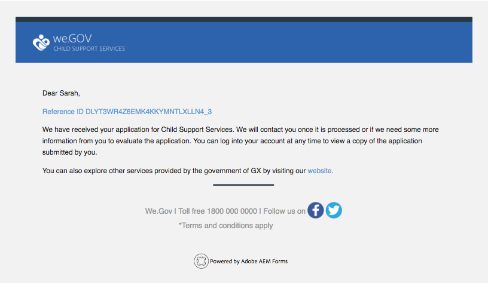

# Procedura dettagliata sul sito di riferimento We.Gov {#we-gov-reference-site-walkthrough}

## Pre-requisito {#pre-requisite}

Configurate il sito di riferimento We.Gov come descritto in [Impostazione e configurazione dei siti](/help/forms/using/setup-reference-sites.md)di riferimento di AEM Forms.

## Scenario di riferimento del sito {#reference-site-scenario}

We.Gov è un&#39;organizzazione governativa che permette ai genitori adottivi di iscriversi al sostegno dei figli se adottano un figlio. Il sito gestisce quanto segue:

* Ammissibilità del richiedente, del padre adottivo
* Dati personali e professionali del richiedente (se il richiedente è idoneo al sostegno per i bambini)
* Dati personali del bambino adottato

   Il richiedente può fornire dettagli su più di un figlio
* Dati del conto bancario del richiedente in cui il richiedente può ricevere prestazioni di sostegno per i figli
* Recupero della tassa di domanda
* Valutazione della domanda
* Approvazione della domanda
* Comunicazione automatizzata al richiedente

Una volta inoltrata la domanda e pagata la tassa, il richiedente riceve un’e-mail dall’organizzazione con conferma della domanda inoltrata.

L&#39;organizzazione We.Gov riceve l&#39;applicazione. L&#39;organizzazione ottiene la valutazione dell&#39;applicazione e approva le applicazioni autentiche.

Dopo l&#39;approvazione della domanda, il richiedente riceve un&#39;e-mail dal sito We.Gov. L&#39;opzione **Visualizza documento** nel messaggio e-mail collega un documento con i dettagli di iscrizione del richiedente.

L&#39;infografica seguente mostra il flusso di lavoro dettagliato dello scenario del sito di riferimento We.Gov.

Lo scenario coinvolge le seguenti persone:

* Sarah Rose, il genitore adottivo che richiede supporto per bambini
* Joe, il bambino adottato
* Gloria Rios, capo della divisione di approvazione, We.Gov
* Conard Simms, l&#39;agente di campo che si occupa della valutazione dell&#39;applicazione

## Sarah avvia il suo assegno di idoneità {#sarah-initiates-her-eligibility-check}

Un richiedente può verificare l’idoneità per richiedere prestazioni di assistenza per bambini. Il sito consente agli utenti di rispondere alle domande e consentire loro di determinare se la loro applicazione è idonea ai benefici. Sarah, una genitore adottiva, è una potenziale richiedente. Il modulo di idoneità fa parte dell’applicazione per i servizi di assistenza per i bambini del sito We.Gov. Per verificare la sua idoneità, Sarah fa clic su **[!UICONTROL Child Support]** sul sito Web di We.Gov. Nella pagina Assistenza figlio, Sarah fa clic su **[!UICONTROL Verifica idoneità]**.

In aggiunta all&#39;approccio di cui sopra, Sarah può fare clic su **[!UICONTROL Get Started]** nella home page. Sarah viene visualizzata la pagina Tutte le applicazioni, in cui può fare clic su Applica in **[!UICONTROL Application for Child Support Services]**. Sarah viene poi portata al controllo di idoneità.

Nella pagina Verifica idoneità per supporto figlio, Sarah riceve una serie di domande per determinare la propria idoneità per i benefici di assistenza ai bambini. Attraverso la serie di domande, le viene chiesto:

* Se è il genitore custodito del figlio
* Se lei e il bambino vivono nello stato di GX
* Il gruppo di età dell&#39;educazione dei bambini e dei bambini.

Sarah risponde a queste domande e la sua idoneità è convalidata. Le sue risposte determinano se ha diritto al sostegno per i bambini.

Sarah viene informata che ha diritto al sostegno per i bambini, e la tariffa per l&#39;iscrizione è di $ 25.

### Come funziona {#how-it-works}

L&#39;idoneità di Sarah viene convalidata tramite una barriera di idoneità creata utilizzando l&#39;editor di regole. L&#39;editor di regole consente di specificare le condizioni che vengono soddisfatte prima che un richiedente possa compilare il modulo di domanda. Quando Sarah, la ricorrente, soddisfa tutte le condizioni di ammissibilità, si iscrive nel modulo di domanda.

La verifica di idoneità fa parte del modulo adattivo per l&#39;applicazione di supporto figlio. La regola convalida l&#39;idoneità quando:

* Il richiedente è un genitore custodito
* Il richiedente e il bambino soggiornano nello stato di GX
* Il richiedente ha la cura principale giorno per giorno del bambino
* L&#39;età del bambino che riceve servizi di assistenza è sotto i 16 anni.

### Vedi te stesso {#see-it-yourself}

Nel browser, aprite `https://<hostname>:<PublishPort>/content/we-gov/en.html`. Nel sito We.Gov, fate clic su Supporto per bambini. Nella pagina Supporto figlio, fate clic su Verifica idoneità.

Per visualizzare le regole:

1. Aprire il modulo in modalità di modifica nell’istanza di creazione. URL: `https://<hostname>:<AuthorPort>/editor.html/content/forms/af/we-gov/child-support/css.html`.
1. Select a component and click .

   Viene visualizzato l&#39;Editor regole in cui sono elencate tutte le regole applicate al modulo.

1. Nel pannello a sinistra, fate clic su regole `passMsg` e `failMsg` per comprendere come funziona il controllo di idoneità.

## Sarah avvia la sua applicazione per il supporto dei bambini {#sarah-starts-her-application-for-child-support}

Sarah fa clic su **[!UICONTROL Avvia applicazione]** dopo essere stata informata della sua idoneità per il supporto dei bambini.\
Nella pagina Application For Child Support Services, Sarah fornisce i dettagli nelle sezioni seguenti:

* **[!UICONTROL Informazioni sul richiedente]**: Lascia che Sarah fornisca i suoi dettagli in questa sezione.

* **[!UICONTROL Informazioni]** figlio: Lascia che Sarah fornisca le informazioni del bambino, che è coperto dai servizi di supporto.

* **[!UICONTROL Pagamento]**: Lascia che Sarah fornisca i suoi dati bancari in cui We.Gov può depositare la compensazione mensile del supporto.

* **[!UICONTROL Pagamento]** della tariffa: Lascia che Sarah fornisca i dati della sua carta di credito per pagare la tassa di richiesta.

Per impostazione predefinita, Sarah viene portata alla sezione **[!UICONTROL Informazioni sui candidati]** .

In qualsiasi momento, Sarah può fare clic su **[!UICONTROL Torna più tardi]** e riprendere con la sua applicazione. Quando fa clic su **[!UICONTROL Torna più tardi]**, i suoi progressi vengono salvati come bozza, e ottiene un&#39;opzione per inviare via e-mail la bozza.

Quando fa clic su **[!UICONTROL Invia e-mail]**, riceve un messaggio e-mail contenente un collegamento alla bozza del modulo.

Il modulo di supporto figlio sul sito Web di We.Gov utilizza moduli adattivi. Può usare il collegamento nell’e-mail e compilare il modulo sul dispositivo mobile.

>[!NOTE]
>
>Il flusso di lavoro di ripresa da e-mail funziona solo con gli utenti connessi. Nello scenario del sito di riferimento, accertatevi che l’utente Sarah Rose sia aggiunto. Le credenziali di accesso di Sarah sono `srose/password`.

Sarah può fornire i dettagli in qualsiasi sezione, ma la tariffa per l&#39;applicazione è accettata solo dopo aver fornito le informazioni richieste in tutte le sezioni. Un&#39;applicazione è incompleta senza pagamento a pagamento e i campi contrassegnati con un asterisco sono obbligatori.

### <strong>Sarah fornisce le sue informazioni</strong>{#strong-sarah-provides-her-information-strong}

Dopo che Sarah fa clic su **[!UICONTROL Avvia domanda]**, viene portata alla sezione Informazioni sul candidato della pagina Application For Child Support Services (Servizi di assistenza per i bambini). In Informazioni sul candidato, Sarah naviga tra le schede e fornisce i suoi dati personali per la domanda. Fa clic su **[!UICONTROL Avanti]** per navigare tra le schede.

Nella sezione Informazioni sui candidati, le viene chiesto di fornire i dettagli nelle seguenti schede:

* **[!UICONTROL Informazioni di base]**

In Informazioni di base, Sarah fornisce la sua prova d&#39;identità e i suoi dati personali. Le informazioni personali di Sarah includono nome, ID e-mail e numero di previdenza sociale.

* **[!UICONTROL Relazione]**

   In Relazione, Sarah inserisce informazioni sul suo stato civile.

* **[!UICONTROL Informazioni aggiuntive]**

   In Ulteriori informazioni, Sarah immette un numero di identificazione, la data di nascita e l&#39;indirizzo e il numero di telefono correnti.

### Sarah fornisce informazioni sui bambini {#sarah-provides-child-information}

Dopo che Sarah ha fornito i suoi dati personali e ha fatto clic su **[!UICONTROL Next (Avanti]**), viene portata alla sezione Child Information (Informazioni sui bambini).

Nella sezione Informazioni figlio, fornisce i seguenti dettagli:

* Numero di figli da richiedere servizi di supporto per bambini
* Nome del bambino, numero di previdenza sociale, data di nascita e luogo di nascita

Se Sarah sceglie più di un bambino, le verranno abilitati moduli aggiuntivi con gli stessi dettagli da compilare.\
Sarah sceglie il suo figlio singolo, Joe, e gli fa il nome.

### Sarah fornisce informazioni sul pagamento {#sarah-provides-payment-information}

Dopo che Sarah fornisce informazioni sul figlio adottato (o sui figli) e fa clic su **[!UICONTROL Avanti]**, viene portata alla sezione Informazioni **[!UICONTROL sul]** pagamento.

Nella sezione Informazioni sul pagamento, l&#39;utente fornisce i dettagli del conto bancario in cui può ricevere i sussidi per l&#39;assistenza ai figli.\
Immette il suo numero di conto bancario di dieci cifre.

## Sarah paga la tariffa dell&#39;applicazione e firma il modulo {#sarah-pays-the-application-fee-and-signs-the-form}

Dopo che Sarah accetta i termini e le condizioni dell&#39;applicazione, paga la tassa di applicazione di $25. La tariffa per l&#39;applicazione è richiesta per l&#39;elaborazione della sua applicazione.\
Sarah immette i dati della sua carta di credito e fa clic su **[!UICONTROL Paga ora]**. Dopo aver pagato le tariffe, viene visualizzata una versione PDF dell&#39;applicazione con un campo firma.

Sarah può scegliere di digitare, utilizzare il disegno per la scrittura a mano, inserire un&#39;immagine della firma o utilizzare il touchscreen del suo cellulare per disegnare la firma. Sarah digita il suo nome e fa clic su Fare clic per firmare.

La sua domanda viene inviata al sito We.Gov.

### <strong>Sarah riceve un messaggio e-mail</strong> di conferma {#strong-sarah-receives-an-acknowledgement-email-strong}

Dopo che Sarah ha pagato la tariffa per la richiesta, riceve un messaggio di conferma dal sito We.Gov.\
We.Gov elabora l&#39;applicazione, e Sarah è informata che riceverà un compenso mensile dopo che la sua applicazione sarà stata approvata.

### Come funziona {#how-it-works-1}

L&#39;applicazione di supporto per elementi figlio utilizza una combinazione di layout di pannelli quali scheda superiore, procedura guidata e pannello a soffietto per creare l&#39;esperienza. Utilizza un modello di modulo denominato Modello figlio We.Gov.

Il richiedente può spostarsi tra le sezioni per compilare diversi componenti del modulo. Quando il richiedente compila il modulo, lo invia, accetta i termini e le condizioni e paga la tariffa, viene avviato un flusso di lavoro personalizzato. Il flusso di lavoro personalizzato invia un messaggio e-mail automatico al richiedente che conferma l’invio dell’applicazione. La domanda viene inoltrata all&#39;ufficio interessato per la verifica e l&#39;approvazione.

Il layout del modulo è specificato nel Tema del servizio di supporto figlio pubblico. Lo stile include lo stile del componente, lo sfondo della pagina, la formattazione dello stato di errore dei componenti e gli stili dei font.

Il controllo di idoneità utilizza le regole specificate nel modulo. Utilizza i controlli di validità specificati di seguito:

`SHOW passMsgWHEN (Does the child live in the state of GX? is equal to Yes) AND (Do you live in the state of GX? is equal to Yes) AND ( (Who has the main day-to-day care of the child? is equal to You) AND (Are you: is equal to The custodial parent) ) AND (Is the child you are applying for: is equal to Under 16 years) ELSE Hide`

`HIDE failMsg WHEN (Does the child lives in the state of GX? is equal to Yes) AND ( (Do you live in the state of GX? is equal to Yes) AND (Who has the main day-to-day care of the child? is equal to You) ) AND (Is the child you are applying for: is equal to Under 16 years) AND (Are you: is equal to The custodial parent) ELSE Show`

### Vedi te stesso {#see-it-yourself-1}

Nel browser, aprite `https://<hostname>:<PublishPort>/content/forms/af/we-gov/child-support/css.html` e compilate le informazioni richieste. Quando si invia l&#39;applicazione dopo aver compilato le informazioni richieste, pagato le tariffe e firmato il documento, si riceve l&#39;e-mail di conferma.

Vedete il Modello per bambini We.Gov qui: `https://<hostname>:<AuthorPort>/editor.html/conf/we-gov/settings/wcm/templates/we-gov-child-template/structure.html`

Vedi il tema qui: `https://<hostname>:<AuthorPort>/editor.html/content/dam/formsanddocuments-themes/we-gov/we-gov-theme-A/jcr:content`

Per visualizzare tutte le regole, eseguire le operazioni seguenti:

1. Aprire il modulo in modalità di creazione.

   URL: `https://<hostname>:<AuthorPort>/editor.html/content/forms/af/we-gov/child-support/css.html`

1. Selezionate un componente e toccate di modifica. Tutte le regole sono elencate nell&#39;editor delle regole, incluse quelle elencate sopra.

## Gloria riceve l&#39;applicazione {#gloria-receives-the-application}

Gloria, responsabile delle approvazioni di We.Gov, può visualizzare, approvare o rifiutare le richieste inviate. AEM Inbox consente di visualizzare tutte le applicazioni inviate in un&#39;unica posizione.

### Come funziona {#how-it-works-2}

Quando Sarah riempie e invia l&#39;applicazione di supporto per bambini, viene creato un PDF o un documento di registrazione dell&#39;applicazione e inviato alla inbox di Gloria Rios. Gloria può visualizzare la domanda inviata e accettarla o rifiutarla.

### Vedi te stesso {#see-it-yourself-2}

Apri pagina `https://<hostname***>:<PublishPort>/content/we-gov/en.html`. Sulla pagina, toccate **[!UICONTROL Accedi]**, selezionate la casella di controllo **[!UICONTROL Accesso come rappresentante]** , accedete alla inbox di AEM utilizzando grios/password come nome utente/password per Gloria Rios. Viene visualizzata l’applicazione di supporto figlio. Per informazioni sull’utilizzo di AEM Inbox per le attività relative ai flussi di lavoro incentrate sui moduli, consultate [Gestione delle applicazioni e delle attività dei moduli in AEM Inbox](/help/forms/using/manage-applications-inbox.md).

Gloria può visualizzare, approvare o rifiutare l’applicazione dal dashboard dell’applicazione.

### Come funziona {#how-it-works-3}

Gloria, responsabile delle approvazioni a We.Gov, apre la sua inbox AEM. Visualizza un&#39;attività di revisione nel suo elenco di compiti. Apre e visualizza l&#39;attività di revisione.

Vede un PDF del modulo compilato con i dettagli inseriti da Sarah insieme ai documenti caricati da Sarah.\
Gloria può approvare o respingere la domanda. Tuttavia, Gloria fa clic su **[!UICONTROL Valutazione richiesta]** per ottenere la valutazione della domanda.

L’applicazione di Sarah è un punto di partenza nel flusso di lavoro AEM. Viene avviato il flusso di lavoro AEM all’invio del modulo per l’applicazione di supporto figlio. Il flusso di lavoro AEM crea un’attività per Gloria, che viene visualizzata nella inbox di AEM. Quando Gloria richiede la valutazione in loco, viene creata una nuova attività per l&#39;agente di campo.

### Vedi te stesso {#see-it-yourself-3}

Se la configurazione è completa, il flusso di lavoro AEM inizia subito dopo l’invio del modulo. Accedete alla inbox utilizzando le credenziali di Gloria.

Accedete alla casella in entrata all&#39;indirizzo https://&lt;***hostname***>:&lt;***PublishPort***>/content/we-gov/en.html. Sulla pagina, tocca **[!UICONTROL Accedi]**, seleziona la casella di controllo **[!UICONTROL Accesso come rappresentante]** utilizza le credenziali predefinite di Gloria:

* Nome utente: grios
* Password:password

Nella inbox di AEM, l’applicazione di Sarah viene aggiunta come attività di revisione. Selezionate l&#39;attività e fate clic su **Valutazione richiesta** per passare al passaggio successivo.

### Conard ottiene l&#39;attività Valutazione {#conard-assessment-task}

Quando Gloria fa clic su **[!UICONTROL Valutazione richiesta]**, Conard riceve l’attività di revisione nella propria Casella in entrata AEM. L’attività rappresenta il passaggio successivo nel flusso di lavoro AEM definito nel modello di workflow. Vede il compito di revisione e lo apre.

Conard ottiene il compito di valutazione del candidato come mostrato di seguito.

La valutazione del supporto figlio è un modulo associato all&#39;attività. Riceve i dettagli di Sarah, insieme ai documenti di supporto (allegati nei dettagli del compito). Conard compila il modulo di valutazione nel campo su un dispositivo e lo invia per la rivalutazione.

Conard verifica tutti i dettagli forniti da Sarah e Sarah firma la valutazione. In AEM Forms è possibile prendere la posizione e la marca temporale e aggiungerli alla firma.

Con il comando **[!UICONTROL Invia per rivalutazione]**, il flusso di lavoro AEM invia la valutazione all’organizzazione We.Gov.

### Come funziona {#how-it-works-4}

Quando Gloria richiede una valutazione, viene avviato il passaggio successivo nel flusso di lavoro AEM e l’attività di valutazione viene aggiunta nella inbox di Conard. Conard è il personaggio del lavoratore sul campo.

Conard visita il posto di Sarah, verifica che le informazioni fornite da Sarah siano autentiche e compila il modulo di valutazione. Conard può accedere a un PDF dell&#39;intero modulo compilato da Sarah.

### Vedi te stesso {#see-it-yourself-4}

Aprite la inbox AEM sul tablet e utilizzate le credenziali di Conard per effettuare l&#39;accesso.

Le credenziali predefinite di Conard sono:

* Nome utente: csimms
* Password:password

Nella inbox è disponibile una nuova attività Richiesta di valutazione. Invia la valutazione completata e passa alla fase successiva.

### Gloria esamina la valutazione e approva la domanda {#gloria-reviews-the-assessment-and-approves-the-application}

Dopo che Conard ha presentato la valutazione, Gloria vede un compito di revisione nella sua inbox. Seleziona e apre **[!UICONTROL Review]**.

In Dettagli attività, Gloria vede Ultima azione eseguita come &quot;Invia per nuova valutazione&quot; (da Conard). Gloria vede che Conard Simms ha valutato l&#39;applicazione.

### Come funziona {#how-it-works-5}

Dopo che Conard ha presentato la valutazione, Gloria vede un compito di revisione nella sua inbox. Seleziona e apre Review. In Dettagli attività, Gloria vede il commento di valutazione fatto da Conard, che è &quot;Tutto trovato in ordine&quot;.

Gloria approva la domanda.

### Vedi te stesso {#see-it-yourself-5}

Aprite la inbox ed effettuate l&#39;accesso utilizzando le credenziali di Gloria. Nella inbox viene visualizzata una nuova attività denominata Review.

Aprire l&#39;attività per visualizzare lo stato dell&#39;ultima azione eseguita. In base alla valutazione, approva la domanda.

## Sarah riceve un&#39;e-mail di approvazione {#sarah-receives-an-approval-email}

Dopo che Gloria ha approvato l&#39;applicazione, Sarah riceve un&#39;e-mail da We.Gov che la sua applicazione è stata approvata.

Il pulsante **[!UICONTROL Visualizza documento]** nell’e-mail rimanda ai dettagli di iscrizione. Sarah fa clic su **[!UICONTROL Visualizza documento.]**

Il documento di iscrizione elenca dettagli quali l’ID di riferimento, l’ID figlio coperto, la data di inizio, il numero del conto bancario, la frequenza del pagamento e l’importo del pagamento.

Sarah può visualizzare i documenti caricati nella stessa pagina.

### Come funziona {#how-it-works-6}

Quando Gloria approva l&#39;applicazione, Sarah riceve un&#39;e-mail automatizzata con un collegamento al documento di iscrizione.

Il documento di iscrizione è una comunicazione interattiva e può essere visualizzato su qualsiasi dispositivo. Contiene i dettagli del servizio di assistenza per i bambini e le informazioni fornite da Sarah.

### Vedi te stesso {#see-it-yourself-6}

Controllate il client e-mail configurato per l’e-mail automatica con un collegamento al documento di iscrizione.

In alternativa, per visualizzare il documento nel browser, aprite: `https://<hostname>:<PublishPort>/content/aemforms-refsite/doclink.html?document=/content/forms/af/we-gov/child-support/enrollment-document&referenceId=[reference-id]&channel=web`

## We.Gov analizza le prestazioni dell&#39;applicazione {#we-gov-analyzes-the-performance-of-the-application}

We.Gov, di tanto in tanto, analizza le prestazioni dell&#39;applicazione di servizi di assistenza ai figli per verificare se i clienti potrebbero dover affrontare problemi. Utilizzano questa analisi per prendere decisioni informate sulle modifiche richieste nell&#39;applicazione dei servizi di assistenza per migliorare l&#39;esperienza dell&#39;utente, ridurre il tasso di abbandono dei moduli e quindi migliorare la conversione. Sfruttano l&#39;integrazione di AEM Forms con Adobe Analytics per la loro analisi. L&#39;immagine seguente mostra il dashboard di analisi.

### Come funziona {#how-it-works-7}

Le metriche delle prestazioni per il modulo dell&#39;applicazione dei servizi di supporto figlio vengono tracciate utilizzando Adobe Analytics. Per ulteriori informazioni sulla configurazione di Adobe Analytics e sulla visualizzazione dei rapporti, consultate [Configurazione dell&#39;analisi per moduli e documenti](/help/forms/using/configure-analytics-forms-documents.md).

### Vedi te stesso {#see-it-yourself-7}

Per visualizzare ed esaminare il rapporto di analisi, nel sito di riferimento vengono forniti i dati iniziali per l&#39;applicazione dei servizi di supporto figlio. Prima di utilizzare i dati iniziali, consulta [Configurare Analytics](/help/forms/using/setup-reference-sites.md#configureanalytics). Per visualizzare il rapporto con i dati iniziali, effettuate i seguenti passaggi nell’istanza di creazione:

1. Passate all&#39;interfaccia utente **[!UICONTROL Moduli e documenti]** all&#39;indirizzo https://&lt;*hostname*>:&lt;*AuthorPort*>/aem/forms.html/content/dam/formsanddocuments.

1. Fate clic per aprire la cartella **We.Gov** .
1. Selezionate il modulo adattivo **[!UICONTROL Application for Child Support Services]** , quindi fate clic su **[!UICONTROL Enable Analytics]** (Abilita analisi) nella barra degli strumenti.

1. Seleziona di nuovo il modulo e fai clic su Report **[!UICONTROL di]** Analytics nella barra degli strumenti per generare il rapporto. Inizialmente viene visualizzato un rapporto vuoto.

Per generare report di analisi con dati iniziali:

1. Nel browser dell&#39;indirizzo di CRXDE lite, digitare: **/apps/we-gov/demo-artifact/analyticsTestData/Child support service Analytics Test Data**
1. I dati iniziali vengono selezionati nella struttura di directory a sinistra.
1. Fate doppio clic sul file selezionato per aprirne il contenuto nel pannello a destra.
1. Copiate tutto il contenuto nel file di dati di prova.
1. In CRXDE, passa a: **/content/dam/formsanddocuments/we-gov/child-support/css/jcr:content/analyticsdatanode/lastsevendays**
1. Nel campo dei dati di analisi in Proprietà, incollare il contenuto copiato del file di dati di prova.
1. Ora generate di nuovo il report di analisi per **[!UICONTROL Application for Child Support Services]**. Puoi visualizzare i dati iniziali nel rapporto generato.

