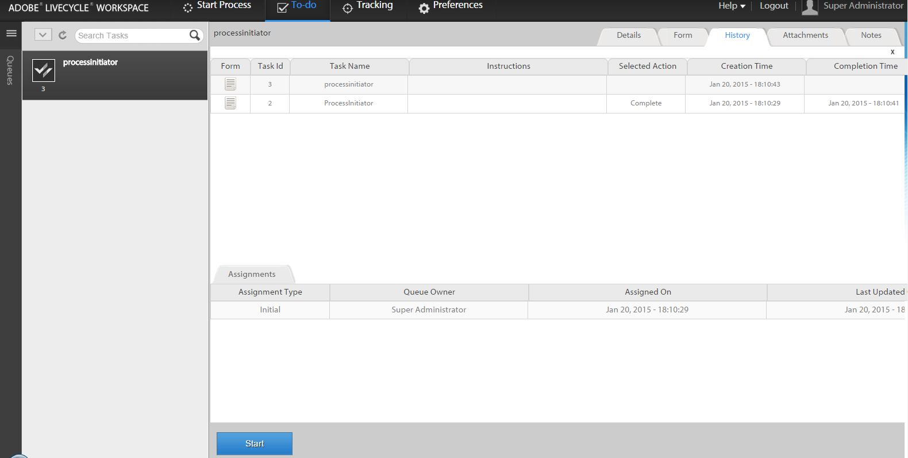

# Avvio di un nuovo processo con i dati del processo esistenti nell&#39;area di lavoro Moduli AEM {#initiating-a-new-process-with-existing-process-data-in-aem-forms-workspace}

È possibile avviare un nuovo processo utilizzando i dati di un processo esistente. La necessità di avviare un nuovo processo dai dati di processo esistenti si manifesta quando è necessario utilizzare frequentemente lo stesso modulo con pochi cambiamenti di contenuto, come quello dei moduli a pagamento. Questa funzione consente agli utenti di risparmiare tempo e fatica soprattutto quando il processo ha un modulo lungo da compilare.

Di seguito sono riportati i passaggi per avviare un nuovo processo dai dati di processo esistenti:-

1. Effettuare una delle seguenti operazioni:

   * In Tracciamento, fare clic sull’istanza di processo di cui si desidera utilizzare i dati. Nella visualizzazione Cronologia processi nel riquadro a destra, fare clic sulla riga corrispondente al punto iniziale.
   * In Tracciamento, selezionate un modello di ricerca per visualizzare un elenco di istanze del processo. Selezionare l&#39;istanza di cui si desidera utilizzare i dati.
   * Nella scheda **[!UICONTROL Da fare]** , selezionare l&#39;attività. Fare clic sulla scheda **[!UICONTROL Cronologia]** e selezionare l&#39;attività che ha avviato l&#39;istanza di processo.
    

1. Nella barra degli strumenti Azioni attività, fare clic su **[!UICONTROL Avvia]**. Viene visualizzato un modulo adattivo per la nuova istanza di processo con dati precompilati.

1. Aggiornare i dati in base alle esigenze, quindi fare clic su **[!UICONTROL Completa]** o su un pulsante appropriato sul modulo.

