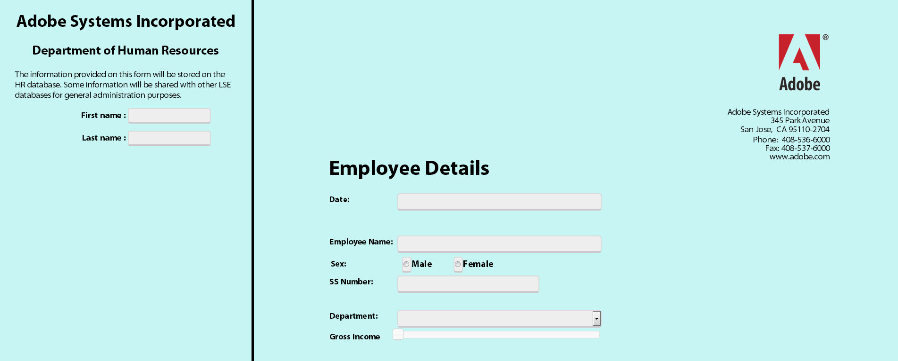

# Integrazione di Form Bridge con il portale personalizzato per i moduli HTML5 {#integrating-form-bridge-with-custom-portal-for-html-forms}

FormBridge è un&#39;API bridge per moduli HTML5 che consente di interagire con un modulo. Per il riferimento alle API FormBridge, consultare il riferimento alle API [FormBridge](/help/forms/using/form-bridge-apis.md).

È possibile utilizzare l&#39;API FormBridge per ottenere o impostare i valori dei campi modulo dalla pagina HTML e inviare il modulo. Ad esempio, potete utilizzare l&#39;API per creare un&#39;esperienza simile a quella della procedura guidata.

Un&#39;applicazione HTML esistente può sfruttare l&#39;API FormBridge per interagire con un modulo e incorporarlo nella pagina HTML. Per impostare il valore di un campo mediante l&#39;API Form Bridge è possibile utilizzare i passaggi seguenti.

## Integrazione di moduli HTML5 in una pagina Web {#integrating-html-forms-to-a-web-page}

1. **Scegliete un profilo o create un profilo**

   1. Nell&#39;interfaccia CRX DE, passare a: `https://[server]:[port]/crx/de`.
   1. Effettuate l&#39;accesso con le credenziali di amministratore.
   1. Create un profilo o scegliete un profilo esistente.

      Per informazioni dettagliate su come creare un profilo, consultate [Creazione di un nuovo profilo](/help/forms/using/custom-profile.md).

1. **Modificare il profilo HTML**

   Includere il runtime XFA, la libreria delle impostazioni internazionali XFA e lo snippet HTML del modulo XFA nel renderer del profilo, progettare la pagina Web e inserire il modulo nella pagina Web.

   Ad esempio, utilizzare il frammento di codice seguente per creare un&#39;app con due campi di input e un modulo per dimostrare l&#39;interazione tra il modulo e un&#39;app esterna.

   ```xml
   <%@ page session="false"
                  contentType="text/html; charset=utf-8"%><%
   %><%@ taglib prefix="cq" uri="https://www.day.com/taglibs/cq/1.0" %><%
   %><!DOCTYPE html>
   <html manifest="${param.offlineSpec}">
       <head>
          <cq:include script="formRuntime.jsp"/>
           <!-- Portal Scripts and Styles -->
          <cq:include script="portalheader.jsp"/> 
       </head>
       <body>
           <div id="leftdiv" >
               <div id="leftdivcontentarea">   
                   <!-- Portal Body -->
                 <cq:include script="portalbody.jsp"/>  
               </div>
           </div>
           <div id="rightdiv">
               <div id="formBody">
               <cq:include script="config.jsp"/>
               <!-- Form body -->
               <cq:include script="formBody.jsp"/>
               <!  --To assist in page transitions -- add navigation, based on scrolling -->
               <cq:include  script="../nav/scroll/nav_footer.jsp"/>
               <cq:include script="footer.jsp"/>
               </div>    
           </div>
       </body>
   </html>
   ```

   >[!NOTE]
   >
   >La **riga 9** contiene riferimenti JSP aggiuntivi per gli stili CSS e i file JavaScript per progettare la pagina.
   >
   >Il tag &lt;div id=&quot;rightdiv&quot;> alla **riga 18** contiene lo snippet HTML del modulo XFA.
   La pagina è formattata in due contenitori: **sinistra** e **destra**. Il contenitore destro ha il modulo. Il contenitore sinistro ha due campi di input e parte della pagina HTML esterna.
   La schermata seguente mostra la modalità di visualizzazione del modulo in un browser.

   

   Il lato sinistro fa parte della pagina **** HTML. Il lato destro che contiene i campi è il modulo **xfa**.

1. **Accesso ai campi modulo dalla pagina**

   Di seguito è riportato uno script di esempio che è possibile aggiungere per impostare i valori in un campo del modulo.

   Ad esempio, se si desidera impostare il **NomeDipendente** utilizzando i valori in Nome **campo e** Cognome **, chiamare la funzione** window.formBridge.setFieldValue **** .

   Analogamente, è possibile leggere il valore chiamando l&#39;API **window.formBridge.getFieldValue **API.

   ```
   $(function() {
               $(".input").blur(function() {
                   window.formBridge.setFieldValue(
                               'xfa.form.form1.#subform[0].EmployeeName',
                                $("#lname").val()+' '+$("#fname").val()
                              )
                   });
           });
   ```

