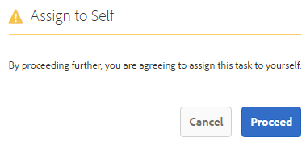
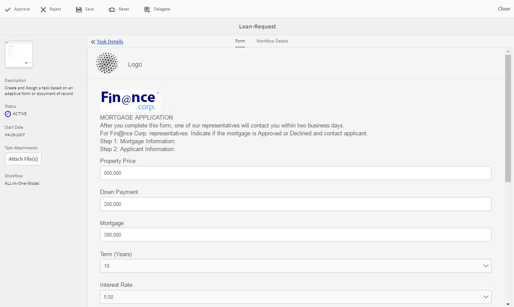

# Gestione di applicazioni e attività Forms in AEM Posta in arrivo {#manage-forms-applications-and-tasks-in-aem-inbox}

Uno dei molti modi per avviare o attivare un flusso di lavoro Forms è tramite le applicazioni in AEM Posta in arrivo. Per rendere disponibile un flusso di lavoro Forms come applicazione in Posta in arrivo, è necessario creare un’applicazione per il flusso di lavoro. Per ulteriori informazioni sull&#39;applicazione del flusso di lavoro e altri modi per avviare flussi di lavoro Forms, vedere [Avviare un flusso di lavoro Forms incentrato su OSGi](/help/forms/using/aem-forms-workflow.md#launch).

Inoltre, AEM Casella in entrata consolida le notifiche e le attività da vari componenti AEM, inclusi i flussi di lavoro Forms. Quando viene attivato un flusso di lavoro dei moduli contenente un passaggio dell&#39;attività Assegna, l&#39;applicazione associata viene elencata come un&#39;attività nella Casella in entrata dell&#39;assegnatario. Se l’assegnatario è un gruppo, l’attività viene visualizzata nella Casella in entrata di tutti i membri del gruppo fino a quando un singolo chiede o delega l’attività.

L&#39;interfaccia utente Inbox fornisce le viste elenco e calendario per visualizzare le attività. Potete anche configurare le impostazioni di visualizzazione. Potete filtrare le attività in base a vari parametri. Per ulteriori informazioni sulla visualizzazione e i filtri, vedere [Casella in entrata](/help/sites-authoring/inbox.md).

In sintesi, Inbox consente di creare una nuova applicazione e di gestire le attività assegnate.

>[!NOTE]
>
>È necessario essere un membro del gruppo Workflow-users per poter utilizzare AEM Inbox.

## Creare l&#39;applicazione {#create-application}

1. Vai a AEM Posta in arrivo in `https://[server]:[port]/aem/inbox`.
1. Nell&#39;interfaccia utente Inbox, toccare **[!UICONTROL Crea > Applicazione]**. Viene visualizzata la pagina Seleziona applicazione.
1. Selezionare un&#39;applicazione e fare clic su **[!UICONTROL Crea]**. Viene aperto il modulo adattivo associato all&#39;applicazione. Compila i moduli e tocca **[!UICONTROL Invia]**. Avvia il flusso di lavoro associato e crea un&#39;attività nella Casella in entrata dell&#39;assegnatario.

## Gestione attività {#manage-tasks}

Quando si attiva un flusso di lavoro Forms e si è assegnatari o membri del gruppo assegnatari, nella Casella in entrata viene visualizzata un’attività. È possibile visualizzare i dettagli dell&#39;attività ed eseguire le azioni disponibili sull&#39;attività dall&#39;interno di Casella in entrata.

### Attività di richiesta o delega {#claim-or-delegate-tasks}

Le attività assegnate a un gruppo vengono visualizzate nella casella in entrata di tutti i membri del gruppo. Qualsiasi membro del gruppo può reclamare tale attività o delegarla a un altro membro del gruppo. A questo scopo:

1. Toccate per selezionare la miniatura dell’attività. Le opzioni per aprire o delegare l’attività vengono visualizzate nella parte superiore.

   

1. Effettua una delle operazioni seguenti:

   * Per delegare l&#39;attività, toccare **[!UICONTROL Delega]**. Si Apre La Finestra Di Dialogo Delega Elemento. Selezionate un utente, aggiungete un commento (facoltativo) e toccate **[!UICONTROL OK]**.

   

   * Per richiedere l&#39;operazione, toccare **[!UICONTROL Apri]**. Viene visualizzata la finestra di dialogo Assegna a se stesso. Toccate **[!UICONTROL Procedi]** per eseguire l&#39;attività. L’attività richiesta viene visualizzata insieme all’utente come assegnatario nella Casella in entrata.

   

### Visualizzare i dettagli ed eseguire azioni sulle attività {#view-details-and-perform-actions-on-tasks}

Quando si apre un&#39;attività, è possibile visualizzare i dettagli dell&#39;attività ed eseguire le azioni disponibili. Le azioni disponibili per un&#39;attività sono definite nel passaggio Attività Assegna del flusso di lavoro Forms associato.

1. Toccate per selezionare la miniatura dell’attività. Le opzioni per aprire o delegare l&#39;attività selezionata vengono visualizzate nella parte superiore.
1. Toccate **[!UICONTROL Apri]** per visualizzare i dettagli dell&#39;attività e intervenire. Viene visualizzata la visualizzazione dettagliata delle attività. In questa visualizzazione è possibile visualizzare i dettagli dell&#39;attività e intervenire sull&#39;attività.

   >[!NOTE]
   >
   >Se un&#39;attività è assegnata a un gruppo, è necessario dichiararla in grado di aprirla in visualizzazione dettagliata.

La visualizzazione dettagliata delle attività comprende le seguenti sezioni:

* Dettagli attività
* Modulo
* Dettagli flusso di lavoro
* Azioni, barra degli strumenti

#### Dettagli attività {#task-details}

Nella sezione Dettagli attività sono visualizzate informazioni sull&#39;attività. Le informazioni visualizzate dipendono dalle impostazioni di configurazione del [Assegna passaggio attività](/help/sites-developing/workflows-step-ref.md) nel flusso di lavoro. Nell&#39;esempio riportato sopra vengono visualizzati la descrizione, lo stato, la data di inizio e il flusso di lavoro utilizzati per l&#39;attività. Consente inoltre di allegare un file all&#39;attività.

#### Modulo {#form}

La scheda Modulo nell&#39;area di contenuto principale visualizza il modulo inviato e gli eventuali allegati a livello di campo.

#### Dettagli flusso di lavoro {#workflow-details}

La scheda Dettagli flusso di lavoro nella parte superiore mostra l’avanzamento dell’attività nelle varie fasi del flusso di lavoro. Mostra le fasi completate, correnti e in sospeso per l&#39;attività. Le fasi di un flusso di lavoro sono definite in [Assegna fase attività](/help/sites-developing/workflows-step-ref.md) del flusso di lavoro associato.

Inoltre, nella scheda viene visualizzata la cronologia delle attività per ogni fase completata del flusso di lavoro. Toccate **[!UICONTROL Visualizza dettagli]** per un passaggio completato per conoscere i dettagli relativi a tale passaggio. Visualizza commenti, allegati a moduli e attività, stato, date di inizio e fine e così via.

#### Barra degli strumenti Azioni {#actions-toolbar}

La barra degli strumenti Azioni mostra tutte le opzioni disponibili per l’attività. Le azioni predefinite Salva, Reimposta e Delega sono azioni predefinite, mentre altre azioni disponibili sono configurate in [Assegna fase attività](/help/sites-developing/workflows-step-ref.md). Nell&#39;esempio precedente, Approva e Rifiuta sono configurati nel flusso di lavoro.

Quando si interviene sull&#39;attività, questa continua a essere implementata nel flusso di lavoro.

### Visualizza attività completate {#view-completed-tasks}

AEM Casella in entrata vengono visualizzate solo le attività attive. Le attività completate non vengono visualizzate nell&#39;elenco. Tuttavia, è possibile utilizzare i filtri Inbox per filtrare le attività in base a diversi parametri, quali tipo di attività, stato, date di inizio e fine e così via. Per visualizzare le attività completate:

1. In AEM Posta in arrivo, toccate  per aprire il selettore del filtro.
1. Toccare **[!UICONTROL Stato attività]** e selezionare **[!UICONTROL Completa]**. Vengono visualizzate tutte le attività completate.

   

1. Toccate per selezionare un&#39;attività e fate clic su **[!UICONTROL Apri]**.

Viene visualizzata l&#39;attività per visualizzare il documento o il modulo adattivo associato all&#39;attività. Per i moduli adattivi, vengono visualizzati il modulo adattivo di sola lettura o il documento di record PDF configurato nella scheda Modulo/Documento della [fase del flusso di lavoro Assegna attività](/help/sites-developing/workflows-step-ref.md).

Nella sezione dei dettagli dell&#39;attività sono visualizzate informazioni quali l&#39;azione eseguita, lo stato dell&#39;attività, la data di inizio e la data di fine.

La scheda **[!UICONTROL Dettagli flusso di lavoro]** mostra ogni passaggio del flusso di lavoro. Toccate **[!UICONTROL Visualizza dettagli]** per un passaggio per informazioni dettagliate.

