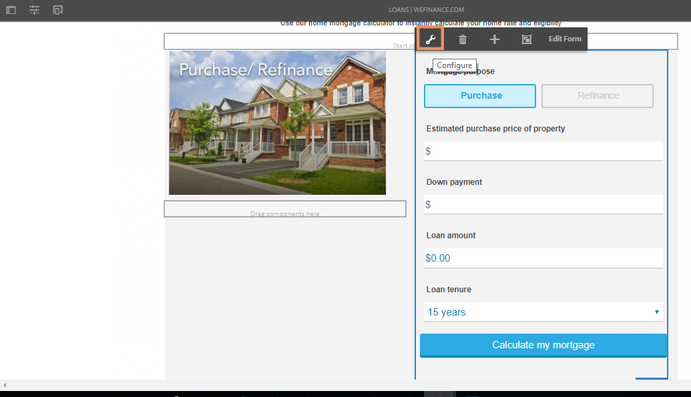

# Configurazione di Microsoft Dynamics 365 per il flusso di lavoro mutui per la casa del sito di riferimento We.Finance {#configure-microsoft-dynamics-for-the-home-mortgage-workflow-of-the-we-finance-reference-site}

>[!CAUTION]
>
>AEM 6.4 ha raggiunto la fine del supporto esteso e questa documentazione non viene più aggiornata. Per maggiori dettagli, consulta la nostra [periodi di assistenza tecnica](https://helpx.adobe.com/it/support/programs/eol-matrix.html). Trova le versioni supportate [qui](https://experienceleague.adobe.com/docs/).

Scopri come sfruttare i servizi Microsoft® Dynamics 365 tramite moduli adattivi per il flusso di lavoro mutui per la casa del sito di riferimento We.Finance

## Panoramica {#overview}

Microsoft® Dynamics 365 è un software di gestione delle relazioni con i clienti (CRM) e ERP (Enterprise Resource Planning) che fornisce soluzioni aziendali per la creazione e la gestione di account cliente, contatti, lead, opportunità e casi.

AEM Forms fornisce un servizio cloud per integrare Dynamics 365 con [Integrazione dei dati Forms](/help/forms/using/data-integration.md) modulo . Lo scenario [Home Procedura dettagliata sull’applicazione ipotecaria con Microsoft® Dynamics](/help/forms/using/finance-reference-site-walkthrough.md#home-mortgage-application-walkthrough-with-microsoft-dynamics) mostra in che modo un cliente utilizza il sito di riferimento We.Finance per richiedere un prestito quando il sito utilizza Microsoft® Dynamics per l’integrazione dei dati di Forms. Prima di poter utilizzare la procedura dettagliata relativa all’applicazione ipoteca Home con lo scenario Microsoft® Dynamics, è necessario configurare Microsoft® Dynamics 365 per l’utilizzo con il sito di riferimento We.Finance.

## Prerequisiti {#prerequisites}

Prima di iniziare a configurare e configurare Dynamics 365, assicurati di disporre di:

* [Configurare e configurare i siti di riferimento di AEM Forms](/help/forms/using/setup-reference-sites.md).

* AEM 6.3 Forms Service Pack 1 e successivi
* Account Microsoft® Dynamics 365
* Applicazione registrata per il servizio Dynamics 365 con Microsoft® Azure Active Directory
* ID client e segreto client per l’applicazione registrata

## Collega il calcolatore ipotecario della casa con la home page del sito {#link-the-home-mortgage-calculator-with-your-site-home-page}

1. Nell&#39;istanza dell&#39;autore, vai alla pagina seguente:

   https://[server sdserver]:[porta]/editor.html/content/we-finance/global/en/loan-landing-page.html

1. Scorri verso il basso fino al Calcolatore ipotecario principale.
1. Evidenzia il pannello della colonna di destra (calcolatore) e tocca per visualizzare il menu a comparsa. Nel menu a comparsa, tocca Configura. Viene visualizzata la finestra di dialogo Modifica contenitore AEM Forms.

   

1. Nella finestra di dialogo Modifica contenitore AEM Forms, sfoglia il percorso della risorsa e seleziona calcolatore ipotecario-casa nel seguente percorso e tocca **Conferma**:

   formsanddocuments/We.Finance/MS Dynamics/

   

1. Tocca **Fine**.
1. Pubblica la pagina modificata.

   >[!NOTE]
   >
   >Il binding dei campi del calcolatore con FDM è preconfigurato tramite il pacchetto del sito di riferimento We.Finance. Per visualizzare il binding, è possibile aprire il modulo in modalità di creazione e visualizzare i riferimenti di binding dei campi.

1. Per creare un&#39;entità personalizzata per l&#39;archiviazione del record del richiedente per l&#39;applicazione di mutuo per la casa, importa il pacchetto della soluzione AEMFormsFSIRefsite_1_0.zip nella tua istanza Microsoft® Dynamics:

   1. Scarica il pacchetto da:

      `https://[server]:[port]/content/aemforms-refsite-collaterals/we-finance/home-mortgage/ms-dynamics/AEMFormsFSIRefsite_1_0.zip`

   1. Importa il pacchetto della soluzione nell&#39;istanza Microsoft® Dynamics. Nella tua istanza di Microsoft® Dynamics, vai a **Impostazioni** > **Soluzioni** quindi tocca **Importa**.

1. Per impostare i dettagli di contatto utente utilizzati nel refsite, importa il pacchetto Sarah Rose Contact.CSV nella tua istanza Microsoft® Dynamics:

   1. Scarica il pacchetto da:

      `https://[server]:[port]/content/aemforms-refsite-collaterals/we-finance/home-mortgage/ms-dynamics/Sarah%20Rose%20Contact.csv`

   1. Importa il pacchetto nella tua istanza Microsoft® Dynamics. Nella tua istanza di Microsoft® Dynamics, vai a **Vendite** > **Contatti** quindi tocca **Importare dati**.
