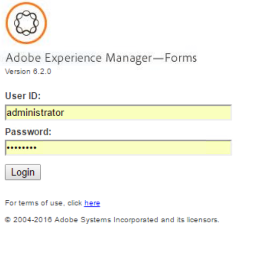

# Introduzione a Process Reporting {#introduction-to-process-reporting}

Process Reporting è uno strumento basato su browser che consente di creare e visualizzare rapporti sui processi e sulle attività di AEM Forms.

Process Reporting fornisce una serie di report out-of-the-box che consentono di filtrare, visualizzare informazioni sui processi in esecuzione lunghi, la durata del processo e il volume del flusso di lavoro.

Process Reporting fornisce inoltre un&#39;interfaccia per eseguire query ad hoc e integrare le visualizzazioni di report personalizzate nell&#39;interfaccia utente di Process Reporting.

Per l&#39;elenco dei browser supportati, consultate Piattaforme [supportate da](/help/forms/using/aem-forms-jee-supported-platforms.md)AEM Forms.

Process Reporting è basato su moduli che:

* Lettura dei dati del processo dal database AEM Forms
* Pubblicare i dati del processo in un archivio di Process Reporting incorporato
* Fornisce un&#39;interfaccia utente basata su browser per visualizzare i rapporti

## Funzionalità chiave {#key-capabilities}

### Report sempre attivi {#always-on-reporting}

Visualizza l&#39;elenco dei processi con esecuzione prolungata, dei grafici della durata del processo e delle query personalizzate utilizzando i filtri.

Process Reporting (Generazione di rapporti sui processi) offre anche la possibilità di esportare i dati del rapporto e della query in formato CSV.

### Report Adhoc {#adhoc-reports}

Utilizza i filtri per ottenere una visualizzazione specifica dei tuoi dati.

È possibile eseguire ricerche nei processi o nelle attività in base all&#39;ID, alla durata, alle date di inizio e di fine, all&#39;iniziatore del processo e così via.

Potete combinare più filtri per creare rapporti specifici.

Puoi quindi salvare i filtri per report da eseguire in una data o in un&#39;ora successive.

### Cronologia processo/attività {#process-task-history}

I server AEM Forms eseguono numerosi processi in parallelo. Questi processi continuano a passare da uno stato all’altro. Pubblicando periodicamente i dati di Forms nell&#39;archivio Process Reporting (Generazione di rapporti sui processi), Process Reporting conserva le informazioni sui processi di transizione in esecuzione in AEM Forms.

### Controllo accesso {#access-control-br}

Process Reporting fornisce l&#39;accesso basato sulle autorizzazioni all&#39;interfaccia utente.

Ciò significa che solo gli utenti con autorizzazioni di reporting hanno accesso all&#39;interfaccia utente di Process Reporting.

